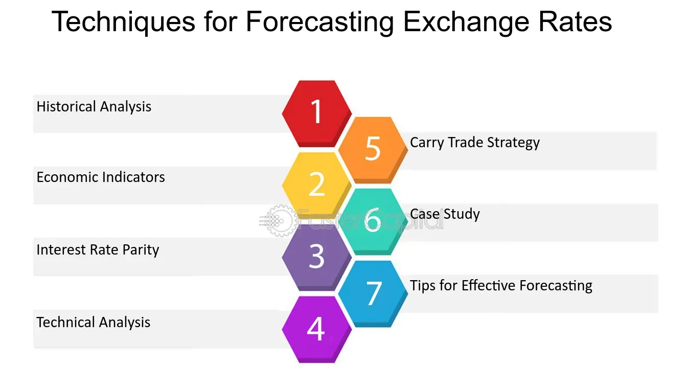

## Table of Contents

## What is exchange rate forecasting?

Exchange rate forecasting is about trying to guess what the value of one country's money will be compared to another country's money in the future. People, businesses, and governments do this because they need to plan for buying and selling things in different countries. If they can predict the exchange rate, they can make better decisions about when to buy or sell, and how much money they might make or lose.

There are different ways to forecast exchange rates. Some people use math and numbers, looking at past exchange rates and other economic information to make their guesses. Others might look at what's happening in the world, like political events or big news, because these can also affect exchange rates. No method is perfect, and it's hard to predict the future exactly, but trying to forecast helps people be more prepared for what might happen.

## Why are indicators important in exchange rate forecasting?

Indicators are important in exchange rate forecasting because they give us clues about what might happen to the value of money between countries. Think of indicators like signs on a road trip that tell you how far you are from your destination. In exchange rate forecasting, these signs help us understand the current state of an economy and predict where it might be headed. For example, if an indicator shows that a country's economy is doing well, it might mean that its money will become more valuable compared to others.

There are many different types of indicators, and they can be about things like how much a country is producing, how much people are spending, or even the interest rates set by a country's bank. Each of these can tell us something different about what might happen to exchange rates. By looking at these indicators, people who forecast exchange rates can make better guesses about the future. Even though no one can predict the future perfectly, using indicators helps make these guesses more informed and potentially more accurate.

## What are some common economic indicators used in exchange rate forecasting?

Economic indicators are important tools that help people guess what will happen to the value of money between countries. Some common indicators include things like Gross Domestic Product (GDP), which tells us how much a country is making in total. If a country's GDP is growing, it might mean their money will become more valuable. Another important indicator is inflation, which shows how much prices are going up. If prices are rising fast, it might make a country's money less valuable compared to others.

Other indicators that people look at are interest rates, which are set by a country's central bank. If interest rates go up, it can make a country's money more attractive to investors because they can earn more from saving or investing there. Unemployment rates are also watched closely because they show how many people are out of work. If lots of people are working, it's usually good for the economy and can make a country's money stronger. By keeping an eye on these indicators, people can make better guesses about what will happen to exchange rates in the future.

## How does the interest rate differential affect exchange rates?

The [interest rate](/wiki/interest-rate-trading-strategies) differential is the difference between the interest rates of two countries. This difference can have a big impact on exchange rates because it affects where people want to put their money. If one country has a higher interest rate than another, investors might move their money to that country to earn more interest. When lots of people do this, it increases the demand for that country's money, making its currency stronger compared to others.

For example, if the United States has higher interest rates than Japan, people might move their money from Japan to the United States to get a better return on their savings or investments. This increased demand for US dollars can make the dollar stronger against the Japanese yen. On the other hand, if Japan's interest rates go up and become higher than those in the United States, the opposite can happen, and the yen could become stronger. This is why central banks often watch interest rates closely and adjust them to influence their country's exchange rate.

## What role does the Purchasing Power Parity (PPP) play in forecasting exchange rates?

Purchasing Power Parity (PPP) is a theory that helps us guess what exchange rates might be in the future. It says that in the long run, the exchange rate between two countries should move towards the rate that would make the same basket of goods and services cost the same in both countries. For example, if a burger costs $5 in the US and ¥500 in Japan, the exchange rate should be around 100 yen to the dollar to make the burger's price the same in both places.

While PPP can be a useful guide, it doesn't always predict exchange rates perfectly because lots of other things can affect them in the short term. Things like interest rates, political events, and how much people want to invest in a country can make exchange rates move differently than what PPP suggests. Still, many people who try to forecast exchange rates look at PPP because it gives them a long-term view of where exchange rates might be headed.

## How can the Balance of Payments influence exchange rate predictions?

The Balance of Payments is like a big report that shows all the money coming in and going out of a country. It's divided into different parts, like how much a country is trading with others and how much money people are investing. When a country is exporting more than it's importing, it usually means more money is coming into the country, which can make its currency stronger. On the other hand, if a country is importing more than it's exporting, it might mean more money is leaving the country, which can make its currency weaker.

People who try to guess future exchange rates often look at the Balance of Payments because it gives them clues about what might happen next. If the report shows that a country is doing well in its trade and investment, it might mean its currency will get stronger in the future. But if the report shows the opposite, it could mean the currency might get weaker. Even though the Balance of Payments is just one part of the puzzle, it's an important piece that helps make better predictions about exchange rates.

## What is the impact of political stability on currency valuation?

Political stability can have a big impact on how much a country's money is worth. When a country is stable and its government works well, people feel safer about investing their money there. This means more people want to buy that country's currency, which can make it stronger. For example, if people think a country's government will stay the same and make good decisions, they might move their money there because they believe it's a safe place for their investments.

On the other hand, if a country has a lot of political problems, like protests or changes in government, it can scare people away from investing there. When people are worried about a country's future, they might sell its currency and move their money to a safer place. This can make the country's currency weaker. So, political stability is important because it affects how much people trust and want to hold a country's money.

## How do technical indicators like moving averages help in predicting exchange rates?

Technical indicators like moving averages are tools that help people guess what exchange rates might do next. A moving average is a line on a chart that shows the average price of a currency over a certain time, like the last 50 days or the last 200 days. By looking at where the current price is compared to these moving averages, people can see if the currency is going up or down. If the price is above the moving average, it might mean the currency is getting stronger. If it's below, it could mean the currency is getting weaker.

These indicators are useful because they help smooth out the ups and downs of daily price changes, making it easier to spot trends. For example, if a short-term moving average (like 50 days) crosses above a long-term moving average (like 200 days), it might be a sign that the currency is starting to get stronger. This is called a "golden cross" and can be a signal for people to buy that currency. On the other hand, if the short-term average crosses below the long-term average, it might be a sign that the currency is getting weaker, which is called a "death cross" and could be a signal to sell. While these indicators don't predict the future perfectly, they give people a way to make more informed guesses about what might happen next with exchange rates.

## Can sentiment indicators like the Commitment of Traders (COT) report be used for exchange rate forecasting?

Sentiment indicators like the Commitment of Traders (COT) report can indeed be used to help forecast exchange rates. The COT report is a weekly report put out by the U.S. Commodity Futures Trading Commission that shows what big investors are doing in the futures market. It tells us how many futures contracts traders are buying or selling for different currencies. By looking at this report, people can get an idea of what big investors think about a currency's future value. If lots of big investors are buying futures for a currency, it might mean they think that currency will get stronger.

While the COT report doesn't predict the future perfectly, it gives us a clue about the overall mood or sentiment towards a currency. If the report shows that more traders are betting on a currency to go up, it might encourage others to do the same, which could push the exchange rate in that direction. But if the report shows that traders are betting against a currency, it might make people think twice about investing in it, possibly leading to a weaker exchange rate. So, by watching the COT report, people can make more informed guesses about where exchange rates might be headed.

## What advanced statistical models are used in exchange rate forecasting?

Advanced statistical models are used to try and guess what will happen to exchange rates in the future. One common model is the Autoregressive Integrated Moving Average (ARIMA) model. This model looks at past exchange rates to find patterns and uses those patterns to predict what might happen next. Another model is the Vector Autoregression (VAR) model, which looks at how different economic factors, like interest rates and inflation, affect each other and the exchange rate. These models can be complicated, but they help people make more accurate guesses about future exchange rates by using lots of data and math.

Machine learning models are also becoming popular for exchange rate forecasting. These models can learn from lots of different types of data, not just past exchange rates, but also things like news articles and social media posts. For example, a machine learning model might use something called a Neural Network to find patterns that are too hard for simpler models to see. These models can be very good at predicting exchange rates, but they need a lot of data to work well and can be hard to understand because they're so complex. Even though no model can predict the future perfectly, using advanced statistical and machine learning models can help people make better guesses about what might happen to exchange rates.

## How do machine learning algorithms enhance the accuracy of exchange rate predictions?

Machine learning algorithms help make exchange rate predictions more accurate by learning from lots of different kinds of data. Instead of just looking at past exchange rates, these algorithms can also use information from news articles, social media, economic reports, and more. By finding patterns in all this data, machine learning can spot things that other models might miss. For example, a machine learning model might notice that certain words in news articles often come before changes in exchange rates. This helps the model make better guesses about what might happen next.

These algorithms get better over time because they learn from their mistakes. When a machine learning model makes a prediction and it turns out to be wrong, it can adjust how it looks at the data to make better guesses in the future. This ability to learn and improve makes machine learning very powerful for predicting exchange rates. However, these models can be hard to understand because they are so complex, and they need a lot of data to work well. Still, by using all this data and learning from it, machine learning can help people make more accurate predictions about where exchange rates might be headed.

## What are the challenges and limitations of using indicators for exchange rate forecasting?

Using indicators to forecast exchange rates can be tricky because they don't always tell the whole story. Sometimes, what the indicators suggest might not match what actually happens. This can happen because exchange rates are affected by many things, like big news events or sudden changes in the economy, which indicators might not catch right away. For example, even if an indicator like GDP shows a country is doing well, a political crisis could suddenly make its currency weaker. Also, indicators often look at the past, but exchange rates are about what will happen in the future, so there's always a chance that things will turn out differently than expected.

Another challenge is that different indicators can give different signals. For instance, one indicator might say a currency will get stronger, while another suggests it will get weaker. This can make it hard to know which one to trust. Plus, some indicators can be affected by how people feel about the economy, which can change quickly and be hard to predict. Even though indicators are useful, they are just one piece of the puzzle. People need to use them along with other information and their own judgment to make the best guesses about exchange rates.

## What are the Methods of Exchange Rate Forecasting?

Exchange rate forecasting encompasses several methodological approaches, each employing different techniques to predict currency movements effectively. Econometric models, [fundamental analysis](/wiki/fundamental-analysis), technical analysis, and [machine learning](/wiki/machine-learning) are some of the principal methods utilized by traders and analysts.

Econometric models play a fundamental role in exchange rate forecasting. Among these, Purchasing Power Parity (PPP) is a popular approach. PPP suggests that, in the long term, exchange rates should adjust to equalize the price of identical goods and services in different countries. The formula for PPP can be expressed as:

$$
E_{PPP} = \frac{P_1}{P_2}
$$

where $E_{PPP}$ is the PPP exchange rate, $P_1$ is the price of a good in currency one, and $P_2$ is the price of the same good in currency two.

Interest Rate Parity (IRP) is another econometric model, assuming that the difference between the interest rates of two countries is equal to the expected change in exchange rates between those countries' currencies. The IRP condition is represented as:

$$
\frac{1 + i_d}{1 + i_f} = \frac{F}{S}
$$

where $i_d$ and $i_f$ are the domestic and foreign interest rates, respectively. $F$ is the forward exchange rate, and $S$ is the spot exchange rate.

Vector Autoregression (VAR) models help in capturing the linear interdependencies among multiple time series data. VAR models are particularly useful in predicting future points in the series by employing historical data from several variables. Structural Models, on the other hand, provide a framework to understand the causal relationships among variables that influence exchange rates.

Fundamental analysis evaluates a country's economic indicators, such as GDP growth, inflation rates, and geopolitical stability, to ascertain potential currency trends. This method relies on the assumption that exchange rates are driven by macroeconomic fundamentals. For instance, a country with a rapidly growing economy and stable political environment is likely to experience an appreciation in its currency.

Technical analysis, contrasting with fundamental analysis, is grounded in the study of historical price movements and market trends. It involves the use of chart patterns, such as head and shoulders or candlestick formations, and technical indicators like moving averages and relative strength index (RSI) to forecast future exchange rate directions. Technical analysis presupposes that all relevant market information is already reflected in exchange rates, thereby focusing on price action itself.

Machine learning has recently emerged as a sophisticated method for exchange rate forecasting. Algorithms and models like Long Short-Term Memory (LSTM) networks and neural networks analyze large datasets to identify complex patterns in currency movements. By incorporating these advanced computational techniques, machine learning enhances predictive capabilities, although it requires significant computational power and high-quality data to achieve accurate forecasts.

In summary, methods of exchange rate forecasting are varied, each with unique strengths and limitations. The choice of method depends on the specific context, data availability, and the desired level of forecasting precision.

## References & Further Reading

- Bermingham, A., & D'Agostino, A. (2014). Forecasting exchange rates with model combinations explores methodologies for predicting currency fluctuations by merging multiple forecasting models to improve accuracy. This paper highlights the benefits of incorporating diverse model combinations to address the variability and unpredictability in exchange rates.

- Baillie, R. T., & Bollerslev, T. (1989). The message in daily exchange rates examines high-frequency exchange rate data and reveals systematic patterns and predictable elements, making it a critical study for those interested in understanding the microstructure of exchange rate movements.

- Lopez de Prado, M. (2018). Advances in Financial Machine Learning discusses cutting-edge machine learning techniques applied to financial markets, providing insights into how computational algorithms can enhance the precision of financial forecasts, including currency exchange rates.

- Hull, J. C. (2018). Options, Futures, and Other Derivatives provides a comprehensive overview of derivative instruments, exploring how these financial products are used in trading and risk management, including strategies involving currency futures and options to hedge exchange rate risk.

- Murphy, J. J. (1999). Technical Analysis of the Financial Markets: A Comprehensive Guide offers an extensive review of technical analysis principles and tools used to evaluate financial markets. This guide serves as a foundation for learners interested in using chart patterns and technical indicators for forecasting exchange rate trends, incorporating methodologies widely adopted by traders in the forex market.

