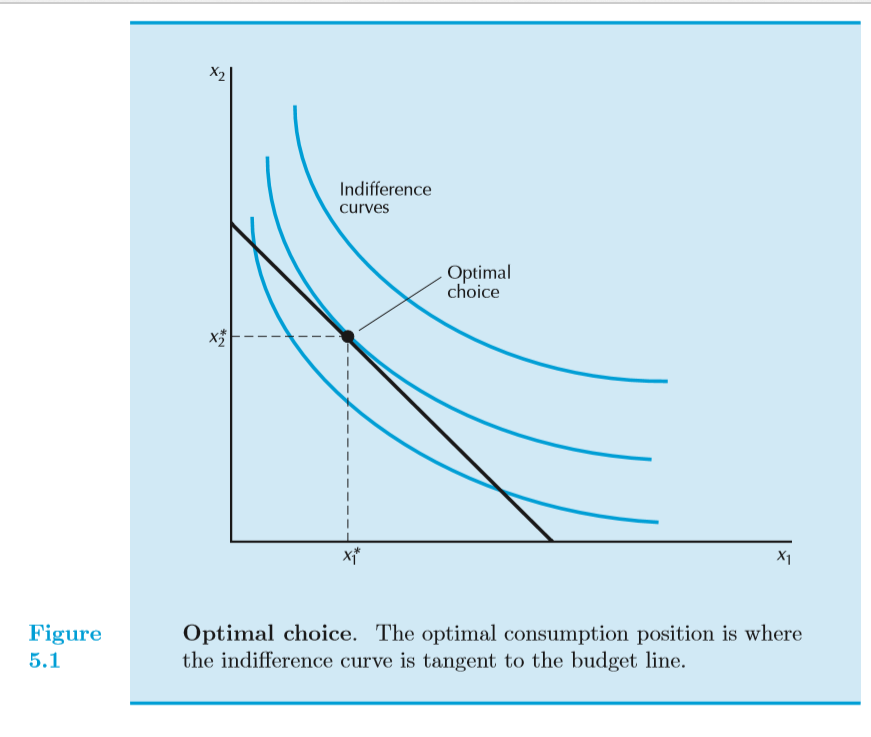

## Table of Contents

## What is an indifference curve in economics?

An indifference curve is a graph that shows different combinations of two goods that give a person the same level of happiness or satisfaction. Imagine you like apples and oranges. An indifference curve would show you all the different ways you could have apples and oranges that make you equally happy. For example, you might be just as happy with 3 apples and 2 oranges as you are with 2 apples and 3 oranges.

These curves are useful because they help economists understand how people make choices. They show that people are willing to trade one good for another as long as their overall happiness stays the same. If you move along the curve, you're trading apples for oranges or vice versa, but you're still just as happy at every point on the curve. This idea helps economists predict how changes in prices or income might affect what people choose to buy.

## How do indifference curves represent consumer preferences?

Indifference curves show what a person likes by drawing lines on a graph. Each line shows different mixes of two things, like apples and oranges, that make the person equally happy. If you look at one line, every point on it means the person feels the same about having that mix of apples and oranges. So, if you have 4 apples and 1 orange, and you're just as happy as with 2 apples and 3 oranges, those points would be on the same line.

These lines help us see how people make choices. If someone moves along the line, they're trading one thing for another but staying just as happy. For example, if you give up one apple, you might need more oranges to feel the same. This shows that people have their own ways of deciding what's worth it to them. By looking at these lines, we can understand what people prefer and how they might react if prices change or if they get more money.

## What are the key properties of indifference curves?

Indifference curves have some important features that help us understand how people make choices. One key property is that these curves slope downwards. This means that if you want more of one thing, you have to give up some of the other thing to stay just as happy. For example, if you get more apples, you need fewer oranges to feel the same level of happiness. This downward slope shows that people are willing to trade one good for another as long as their overall satisfaction stays the same.

Another important property is that indifference curves can't cross each other. If they did, it would mean that the same mix of goods could make you feel two different levels of happiness at the same time, which doesn't make sense. Each curve represents a different level of happiness, so they stay separate. Also, these curves are usually curved, not straight lines. This shape shows that the more you have of one good, the less you're willing to give up of the other good to get even more of the first one. This is called the diminishing marginal rate of substitution, and it means that as you get more of something, each extra bit becomes less valuable to you.

## How do indifference curves relate to the concept of utility?

Indifference curves are closely tied to the idea of utility, which is just a fancy word for happiness or satisfaction. Each indifference curve represents a different level of utility. When you look at a graph with these curves, each curve shows all the different ways you can mix two things, like apples and oranges, to feel the same level of happiness. So, if you're on one curve, you're happy with any mix of apples and oranges on that curve. If you move to a higher curve, it means you're happier because you have more of both things or a better mix that makes you feel better.

The shape and way these curves are spread out on the graph tell us a lot about how utility works. For example, the curves slope downwards because if you want more of one thing, you have to give up some of the other thing to stay at the same level of happiness. Also, the curves don't cross each other because that would mean the same mix of goods could make you feel two different levels of happiness at the same time, which doesn't make sense. The way the curves are curved shows that the more you have of one thing, the less you're willing to give up of the other thing to get even more of the first one. This idea is called the diminishing marginal rate of substitution and it's a big part of how utility works.

## What is the significance of the slope of an indifference curve?

The slope of an indifference curve tells us something important about how people make choices. It shows how much of one thing someone is willing to give up to get more of another thing while staying just as happy. Imagine you like apples and oranges. The slope of the indifference curve tells you how many oranges you'd be willing to trade for one more apple and still feel the same level of happiness. This is called the marginal rate of substitution. If the slope is steep, it means you're willing to give up a lot of oranges for just one more apple. If it's not so steep, you'd only give up a few oranges for that apple.

The slope also changes along the curve, which tells us something else about how people value things. As you move along the curve and get more apples, the slope usually gets flatter. This means that the more apples you have, the fewer oranges you're willing to give up for one more apple. This idea is called the diminishing marginal rate of substitution. It shows that the more you have of something, the less valuable each extra bit becomes to you. So, the slope of the indifference curve helps us understand how people make trade-offs and how their preferences change as they get more of one thing.

## How does the concept of marginal rate of substitution relate to indifference curves?

The marginal rate of substitution (MRS) is a key idea that goes hand-in-hand with indifference curves. It tells us how much of one thing someone is willing to give up to get a bit more of another thing, while still feeling the same level of happiness. On an indifference curve, the MRS is shown by the slope of the curve. If the curve is steep, it means you'd give up a lot of one thing, like oranges, to get just one more apple. If it's not so steep, you'd only give up a few oranges for that apple. So, the MRS helps us see how people make choices and trade-offs between different things.

The MRS also changes as you move along the indifference curve. This change shows something important about how people value things. As you get more of one thing, like apples, the slope of the curve usually gets flatter. This means you're willing to give up fewer oranges for each additional apple. This idea is called the diminishing marginal rate of substitution. It tells us that the more you have of something, the less valuable each extra bit becomes to you. So, by looking at the MRS and how it changes on an indifference curve, we can understand how people's preferences and choices shift as they get more of one thing.

## Can indifference curves intersect, and why or why not?

Indifference curves can't intersect. Imagine two lines on a graph where each line shows different mixes of apples and oranges that make you equally happy. If these lines crossed, it would mean that the same mix of apples and oranges could make you feel two different levels of happiness at the same time. That doesn't make sense because you can't be happy and happier with the exact same thing at the same time.

So, each indifference curve represents a different level of happiness. If one curve is higher on the graph, it means you're happier because you have more of both things or a better mix that makes you feel better. Since each curve shows a unique level of happiness, they can't cross each other. If they did, it would mess up the whole idea of what these curves are supposed to show about how people feel about different mixes of things.

## How are budget constraints used in conjunction with indifference curves?

Budget constraints and indifference curves work together to help us understand how people make choices. A budget constraint shows all the different mixes of two things, like apples and oranges, that you can afford with your money. It's like a line on a graph that says, "Here's what you can buy with what you have." An indifference curve, on the other hand, shows all the different mixes of apples and oranges that make you equally happy. When you put these two things together on a graph, you can see where your budget line touches your indifference curve. That point is special because it's the best mix of apples and oranges you can afford that also makes you the happiest.

This point where the budget line touches the indifference curve is called the optimal choice. It's where you get the most happiness out of what you can afford. If you look at the graph, you'll see that the budget line might touch several indifference curves, but it will only touch the highest one that you can reach with your money. This highest curve represents the most happiness you can get with your budget. By looking at where the budget line and the indifference curve meet, we can understand how people balance what they want with what they can afford.

## What is the role of indifference curves in determining consumer equilibrium?

Indifference curves help us figure out consumer equilibrium, which is the point where someone is as happy as they can be with what they can afford. Imagine you have a certain amount of money to spend on apples and oranges. Your budget line shows all the different mixes of apples and oranges you can buy with that money. An indifference curve shows all the different mixes of apples and oranges that make you equally happy. When you put these two things together on a graph, the point where your budget line touches the highest indifference curve you can reach is your consumer equilibrium. This is the best mix of apples and oranges you can afford that also makes you the happiest.

At this point of consumer equilibrium, the slope of the indifference curve (which is the marginal rate of substitution) is equal to the slope of the budget line (which is the price ratio of the two goods). This means that the rate at which you're willing to trade apples for oranges to stay happy is the same as the rate at which you have to trade them because of their prices. So, you can't get any happier by changing what you buy because any other mix of apples and oranges would either cost more than you can afford or make you less happy. That's why this point is called the equilibrium – it's where everything balances out perfectly for you.

## How do changes in income affect the position and shape of indifference curves?

Changes in income don't change the shape of indifference curves, but they do affect where they are on the graph. Imagine you like apples and oranges. If you get more money, you can buy more of both, so you'll be happier. This means you can reach higher indifference curves, which are further away from the starting point on the graph. These higher curves show you can have more apples and oranges or a better mix that makes you feel better. So, with more money, you move up to a higher curve, but the curves themselves stay the same shape.

If your income goes down, the opposite happens. You can't buy as much, so you have to settle for a lower indifference curve. This lower curve is closer to the starting point on the graph and shows you have less of both apples and oranges or a worse mix that makes you less happy. But again, the shape of the curves doesn't change; only where you can reach on the graph changes. So, changes in income move you up or down the set of indifference curves, but the curves themselves stay the same.

## What are the limitations and criticisms of using indifference curves in economic analysis?

Indifference curves are helpful for understanding how people make choices, but they have some problems. One big issue is that they assume people always know what they want and can easily compare different things. In real life, people might not always be sure about their preferences or might change their minds a lot. Also, indifference curves work best when you're looking at just two things, like apples and oranges. But in the real world, people have to choose between many different things, and it's hard to show all those choices on a simple graph.

Another criticism is that indifference curves don't take into account things like how much time it takes to buy things or how people feel about the future. For example, someone might be happy with a certain mix of apples and oranges today, but what if they need to save money for next month? Indifference curves don't show that. Plus, they assume that people always make choices that make them happier, but sometimes people make choices that don't seem to make sense, like buying things they don't really need. So, while indifference curves can help us understand some things about how people make choices, they don't tell the whole story.

## How can indifference curves be applied in more advanced economic models, such as those involving multiple goods or time preferences?

Indifference curves can be used in more advanced economic models that look at more than just two things. Instead of just apples and oranges, imagine you're choosing between apples, oranges, and bananas. To show this, economists use something called an indifference surface, which is like a 3D version of an indifference curve. This surface shows all the different mixes of apples, oranges, and bananas that make you equally happy. While it's harder to draw and understand than a simple 2D curve, it helps economists see how people make choices when they have more options. They can still use the idea of the marginal rate of substitution, but now it's about how much of one thing you'd give up for more of another while keeping the third thing the same.

When it comes to time preferences, indifference curves can also be helpful. Imagine you have to choose between getting something now or later. Economists use indifference curves to show how much you'd need to get later to be just as happy as getting something now. This is called intertemporal choice. For example, if you like apples, an indifference curve could show how many apples you'd need next month to be just as happy as getting one apple today. By looking at these curves, economists can understand how people value things over time and how they make decisions about saving or spending. While these models are more complicated, they still use the basic idea of indifference curves to help explain how people make choices.

## What is Understanding Consumer Theory?

Consumer theory is a fundamental aspect of microeconomics aimed at comprehending and predicting the decision-making processes of consumers. It is built around the concept of utility, which is a measure of satisfaction or benefit that a consumer derives from consuming goods and services. This theory assumes consumers act rationally, seeking to maximize their utility subject to certain constraints.

The basic principles of consumer theory include:

1. **Utility**: Utility represents a consumer's preference and can be understood as a numerical score assigned to the satisfaction obtained from various combinations of goods and services. There are two primary types of utility: ordinal, which ranks preferences, and cardinal, which quantifies the level of preference. Ordinal utility is often used in consumer theory as it requires less assumption about how utility is measured.

2. **Budget Constraints**: A core element of consumer theory is the budget constraint, representing the limits imposed on a consumer's choices by their income and the prices of goods and services. Mathematically, it is expressed as:
$$
   \sum_{i=1}^{n} p_i \cdot q_i \leq I

$$

   where $p_i$ is the price of good $i$, $q_i$ is the quantity of good $i$, and $I$ is the consumer's income. Consumers aim to maximize their utility within these constraints, leading to choices that reflect their true preferences.

Consumer theory is instrumental in predicting choices and preferences. By understanding how consumers maximize utility within their budget constraints, economists can predict how changes in prices, income, or other factors will alter consumer behavior. This ability to predict is essential for businesses and policymakers to anticipate demand and adjust supply or policy accordingly.

**Optimal Consumption Bundles** are combinations of goods and services that maximize a consumer's utility given their budget constraint. This concept reflects the point where the consumer's budget line is tangent to an indifference curve, representing the highest level of satisfaction attainable within their income limits. Mathematically, the optimal bundle can be found when the marginal rate of substitution (MRS), or the rate at which a consumer is willing to substitute one good for another, equals the ratio of their prices:
$$
   \frac{MU_x}{MU_y} = \frac{p_x}{p_y}

$$

where $MU_x$ and $MU_y$ are the marginal utilities of goods $x$ and $y$, and $p_x$ and $p_y$ are their prices.

Economists utilize consumer theory extensively to evaluate market demand and price sensitivity. By analyzing how changes in price affect the quantity demanded through consumer preference and utility functions, they can draw demand curves and estimate elasticity. This information is vital for determining pricing strategies, understanding consumer surplus, and evaluating economic welfare.

Overall, consumer theory offers critical insights into economic behaviors by emphasizing utility maximization under constraints, thus providing a framework for understanding the intricate choices of consumers and predicting market outcomes. Through its principles, economists are equipped to analyze and assess the myriad factors influencing consumer decisions and market dynamics.

## What are Indifference Curves and how do we explore them?

Indifference curves are a fundamental concept in microeconomics, providing a graphical representation of consumer preferences between different bundles of goods. They are essential for understanding consumer choices and behaviors, illustrating how individuals prioritize their satisfaction levels or utility from various combinations of products or services.

The primary characteristic of indifference curves is their downward slope, which reflects the trade-offs that consumers make between two goods. This negative slope is indicative of the principle of diminishing marginal utility, suggesting that as a consumer increases the quantity of one good, they will require a decreasing quantity of the other good to maintain the same level of overall satisfaction or utility. For instance, if a consumer considers two goods, $x$ and $y$, the trade-off between them can be represented as follows:

$$
\frac{\Delta y}{\Delta x} = -\frac{\text{MU}_x}{\text{MU}_y}
$$

Here, $\text{MU}_x$ and $\text{MU}_y$ denote the marginal utilities of goods $x$ and $y$, respectively.

Another noteworthy property of indifference curves is their convexity to the origin, a reflection of the consumer's willingness to substitute goods at varying rates, known as the diminishing marginal rate of substitution (MRS). The MRS defines the rate at which a consumer is willing to exchange one good for another while maintaining the same level of satisfaction. Mathematically, the MRS between two goods can be expressed as:

$$
\text{MRS}_{xy} = \frac{\text{MU}_x}{\text{MU}_y}
$$

Indifference curves are utilized to determine consumer equilibrium, the point at which a consumer maximizes their utility given budget constraints. The equilibrium is typically found at the tangency point of an indifference curve and the budget line, illustrating the combination of goods that gives the highest satisfaction without exceeding their budget. The tangency condition, which implies that the slope of the indifference curve equals the slope of the budget line, is given by:

$$
\frac{\text{MU}_x}{\text{MU}_y} = \frac{P_x}{P_y}
$$

where $P_x$ and $P_y$ represent the prices of goods $x$ and $y$.

In summary, indifference curves serve as a powerful tool in microeconomic analysis, allowing economists and researchers to visualize and quantify consumer preferences, understand how individuals make consumption choices, and analyze the implications of these choices on market dynamics and pricing strategies.

## References & Further Reading

[1]: Varian, H. R. (1992). "Microeconomic Analysis" (3rd ed.). W. W. Norton & Company.

[2]: Merton, R. C. (1973). "[Theory of Rational Option Pricing](https://www.jstor.org/stable/3003143)." The Bell Journal of Economics and Management Science, 4(1), 141-183.

[3]: Hull, J. C., & Basu, S. (2016). "Options, Futures, and Other Derivatives" (9th ed.). Pearson.

[4]: Sharpe, W. F. (1964). "[Capital Asset Prices: A Theory of Market Equilibrium under Conditions of Risk](https://onlinelibrary.wiley.com/doi/full/10.1111/j.1540-6261.1964.tb02865.x)." The Journal of Finance, 19(3), 425-442.

[5]: Tsay, R. S. (2010). "Analysis of Financial Time Series" (3rd ed.). Wiley.

[6]: Fabozzi, F. J., Focardi, S. M., & Kolm, P. N. (2010). "Quantitative Equity Investing: Techniques and Strategies." Wiley.

[7]: Markowitz, H. (1952). "[Portfolio Selection](https://onlinelibrary.wiley.com/doi/abs/10.1111/j.1540-6261.1952.tb01525.x)." The Journal of Finance, 7(1), 77-91. 

[8]: Aldridge, I. (2010). "High-Frequency Trading: A Practical Guide to Algorithmic Strategies and Trading Systems." Wiley.

[9]: Murphy, J. J. (1999). "Technical Analysis of the Financial Markets: A Comprehensive Guide to Trading Methods and Applications." New York Institute of Finance.

[10]: Grinold, R. C., & Kahn, R. N. (1995). "Active Portfolio Management: A Quantitative Approach for Producing Superior Returns and Controlling Risk." McGraw Hill.