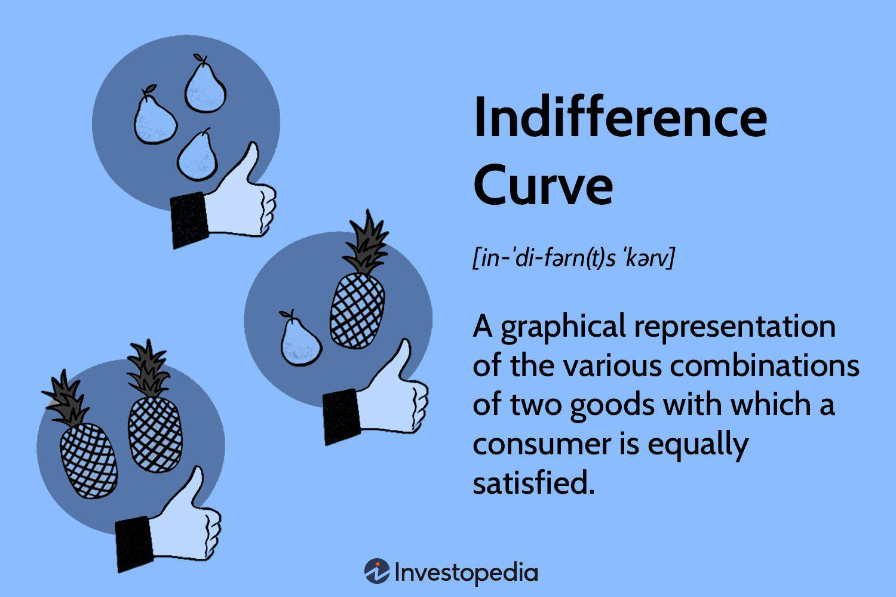

Consumer theory serves as a central pillar in understanding economic behaviors, providing insights into how individuals and households make decisions to allocate their limited resources among various goods and services. Fundamentally, this theory revolves around the notion of utility, which represents the satisfaction consumers derive from consumption. Central to consumer theory is the concept of budget constraints, which limit the combinations of goods and services that a consumer can afford, given their income and the prices of these goods.

A crucial graphical tool within consumer theory is the indifference curve, which represents combinations of different goods that provide the consumer with the same level of satisfaction or utility. Indifference curves are typically downward sloping and convex to the origin, reflecting the assumption of diminishing marginal rates of substitution (MRS). The MRS is a critical concept as it denotes the rate at which a consumer is willing to substitute one good for another while maintaining the same level of utility. The shape and position of these curves on a graph play a vital role in analyzing consumer preferences and determining the optimal consumption bundle.

In contrast to the traditional focus of consumer theory, the field of algorithmic trading has emerged as a pivotal technology in modern financial markets. Algorithmic trading involves the use of computer algorithms to automate trading strategies, executing orders based on pre-defined rules and market conditions. This approach offers significant advantages, such as increased speed, efficiency, and a reduction in human error, creating a highly competitive market environment.

The intersection of consumer theory and algorithmic trading lies in their shared focus on optimizing decisions. Just as consumer theory seeks to understand and predict consumer choices under constraints, algorithmic trading aims to generate optimal trading decisions by analyzing and responding to market data. Indifference curves, with their focus on consumer preferences and choices, can inform the development of sophisticated trading algorithms designed to optimize portfolio selection and risk management.

By integrating insights from consumer theory into algorithmic trading strategies, traders can enhance prediction models and optimize decision-making processes. As the financial markets continue to evolve, the influence of economic theories on trading strategies underscores the growing synergy between these two domains. This introduction sets the stage for a comprehensive exploration of how economic concepts can enhance the effectiveness and sophistication of algorithmic trading strategies, ultimately transforming financial technology and market dynamics.

## Table of Contents

## Understanding Consumer Theory

Consumer theory is a fundamental aspect of microeconomics aimed at comprehending and predicting the decision-making processes of consumers. It is built around the concept of utility, which is a measure of satisfaction or benefit that a consumer derives from consuming goods and services. This theory assumes consumers act rationally, seeking to maximize their utility subject to certain constraints.

The basic principles of consumer theory include:

1. **Utility**: Utility represents a consumer's preference and can be understood as a numerical score assigned to the satisfaction obtained from various combinations of goods and services. There are two primary types of utility: ordinal, which ranks preferences, and cardinal, which quantifies the level of preference. Ordinal utility is often used in consumer theory as it requires less assumption about how utility is measured.

2. **Budget Constraints**: A core element of consumer theory is the budget constraint, representing the limits imposed on a consumer's choices by their income and the prices of goods and services. Mathematically, it is expressed as:
$$
   \sum_{i=1}^{n} p_i \cdot q_i \leq I

$$

   where $p_i$ is the price of good $i$, $q_i$ is the quantity of good $i$, and $I$ is the consumer's income. Consumers aim to maximize their utility within these constraints, leading to choices that reflect their true preferences.

Consumer theory is instrumental in predicting choices and preferences. By understanding how consumers maximize utility within their budget constraints, economists can predict how changes in prices, income, or other factors will alter consumer behavior. This ability to predict is essential for businesses and policymakers to anticipate demand and adjust supply or policy accordingly.

**Optimal Consumption Bundles** are combinations of goods and services that maximize a consumer's utility given their budget constraint. This concept reflects the point where the consumer's budget line is tangent to an indifference curve, representing the highest level of satisfaction attainable within their income limits. Mathematically, the optimal bundle can be found when the marginal rate of substitution (MRS), or the rate at which a consumer is willing to substitute one good for another, equals the ratio of their prices:
$$
   \frac{MU_x}{MU_y} = \frac{p_x}{p_y}

$$

where $MU_x$ and $MU_y$ are the marginal utilities of goods $x$ and $y$, and $p_x$ and $p_y$ are their prices.

Economists utilize consumer theory extensively to evaluate market demand and price sensitivity. By analyzing how changes in price affect the quantity demanded through consumer preference and utility functions, they can draw demand curves and estimate elasticity. This information is vital for determining pricing strategies, understanding consumer surplus, and evaluating economic welfare.

Overall, consumer theory offers critical insights into economic behaviors by emphasizing utility maximization under constraints, thus providing a framework for understanding the intricate choices of consumers and predicting market outcomes. Through its principles, economists are equipped to analyze and assess the myriad factors influencing consumer decisions and market dynamics.

## Exploring Indifference Curves

Indifference curves are a fundamental concept in microeconomics, providing a graphical representation of consumer preferences between different bundles of goods. They are essential for understanding consumer choices and behaviors, illustrating how individuals prioritize their satisfaction levels or utility from various combinations of products or services.

The primary characteristic of indifference curves is their downward slope, which reflects the trade-offs that consumers make between two goods. This negative slope is indicative of the principle of diminishing marginal utility, suggesting that as a consumer increases the quantity of one good, they will require a decreasing quantity of the other good to maintain the same level of overall satisfaction or utility. For instance, if a consumer considers two goods, $x$ and $y$, the trade-off between them can be represented as follows:

$$
\frac{\Delta y}{\Delta x} = -\frac{\text{MU}_x}{\text{MU}_y}
$$

Here, $\text{MU}_x$ and $\text{MU}_y$ denote the marginal utilities of goods $x$ and $y$, respectively.

Another noteworthy property of indifference curves is their convexity to the origin, a reflection of the consumer's willingness to substitute goods at varying rates, known as the diminishing marginal rate of substitution (MRS). The MRS defines the rate at which a consumer is willing to exchange one good for another while maintaining the same level of satisfaction. Mathematically, the MRS between two goods can be expressed as:

$$
\text{MRS}_{xy} = \frac{\text{MU}_x}{\text{MU}_y}
$$

Indifference curves are utilized to determine consumer equilibrium, the point at which a consumer maximizes their utility given budget constraints. The equilibrium is typically found at the tangency point of an indifference curve and the budget line, illustrating the combination of goods that gives the highest satisfaction without exceeding their budget. The tangency condition, which implies that the slope of the indifference curve equals the slope of the budget line, is given by:

$$
\frac{\text{MU}_x}{\text{MU}_y} = \frac{P_x}{P_y}
$$

where $P_x$ and $P_y$ represent the prices of goods $x$ and $y$.

In summary, indifference curves serve as a powerful tool in microeconomic analysis, allowing economists and researchers to visualize and quantify consumer preferences, understand how individuals make consumption choices, and analyze the implications of these choices on market dynamics and pricing strategies.

## Algorithmic Trading: An Overview

Algorithmic trading, often referred to as algo trading, involves the use of complex computer algorithms to automate the process of trading financial instruments. At its core, [algorithmic trading](/wiki/algorithmic-trading) is designed to execute orders based on a predefined set of rules or conditions, utilizing data-driven models to make informed trading decisions. This method leverages the computational power and speed of modern computers to conduct trades, far surpassing human capabilities in terms of both efficiency and accuracy.

The key components of algorithmic trading include algorithms—sophisticated sets of instructions that govern trading actions—alongside robust data processing systems and connectivity to trading venues. These algorithms are constructed using various programming languages, frequently Python due to its extensive libraries and ease of use. They analyze multiple data streams simultaneously, including market prices, economic indicators, and historical data, to identify optimal trading opportunities.

Algorithmic trading is primarily used to automate the execution of trading strategies, thus minimizing latency and maximizing execution speed. By pre-programming trade instructions, the system can react instantly to market fluctuations, executing trades at moments when the market conditions match predefined criteria. This capability allows for a significant reduction in the response time compared to manual trading.

One of the primary benefits of algorithmic trading is the speed at which trades can be executed. High-frequency trading ([HFT](/wiki/high-frequency-trading-strategies)), a subset of algo trading, demonstrates the potential to conduct thousands of trades within fractions of a second. Additionally, algorithmic trading enhances efficiency by processing vast amounts of data and executing trades without the need for human intervention, thereby reducing the likelihood of errors that can arise from emotional or cognitive biases.

Furthermore, algo trading strategies often incorporate risk management features, allowing for the precise execution of orders with structured mechanisms to mitigate potential losses. Common strategies include [arbitrage](/wiki/arbitrage), where an asset is bought and sold simultaneously in different markets to profit from price discrepancies, and [trend following](/wiki/trend-following), which involves algorithms that identify and exploit market trends over specific time frames to capture profits.

To illustrate, arbitrage algorithms might monitor price movements across various exchanges, executing buy and sell orders when a profitable spread is detected. In contrast, trend-following algorithms analyze historical price data to identify upward or downward patterns, thus generating buy or sell signals based on the identified trend.

In summary, algorithmic trading represents a significant advancement in financial technology, offering increased speed, reliability, and efficiency. By automating the trading process, it mitigates human error and facilitates the implementation of sophisticated strategies, making it an indispensable tool in contemporary financial markets.

## Linking Economic Theories to Algorithmic Trading

The application of consumer theory to algorithmic trading involves integrating fundamental economic principles into the development of trading strategies. Consumer theory, particularly focused on utility maximization and budget constraints, can inform decision-making processes in financial markets by modeling trader preferences similarly to how consumer preferences are understood.

**Indifference Curves in Trading Decision Models**

Indifference curves, which represent combinations of goods or services that yield the same level of utility to a consumer, can be adapted for trading models to demonstrate how different asset combinations might yield equivalent levels of investor satisfaction. In trading, an analogous concept is the efficient frontier from Modern Portfolio Theory (MPT), which plots the set of optimal portfolios that provide the highest expected return for a defined level of risk. By applying the principles of consumer indifference curves, algorithmic trading systems can be optimized to determine the ideal asset allocation that balances risk and return in a manner consistent with investor preferences.

The properties of indifference curves, such as their downward slope and convex nature, help in understanding the trade-offs and substitution effects between different investment choices. The Marginal Rate of Substitution (MRS), which quantifies the rate at which one asset can be replaced with another while maintaining the same level of satisfaction, is particularly useful in crafting trading algorithms that need to adapt dynamically to changing market conditions and investor preferences.

**Improving Prediction Models with Consumer Preferences**

Incorporating insights from consumer preferences into prediction models can significantly enhance the accuracy and efficiency of trading algorithms. By understanding how consumers prioritize different economic factors and respond to market changes, algorithms can be fine-tuned to anticipate market trends more effectively. For instance, if a model can incorporate how macroeconomic indicators affect consumer behavior, it can better predict corresponding shifts in market sentiment, leading to more profitable trading strategies.

Consumer preferences can also help in risk management by identifying which market conditions might lead to heightened [volatility](/wiki/volatility-trading-strategies) or notable changes in asset correlations. This has direct implications for strategies focused on volatility forecasting or asset correlation trading.

**Real-world Examples of Economic Concepts in Algorithmic Trading**

Numerous real-world examples underscore the integration of economic theories into algorithmic trading. For instance, high-frequency trading (HFT) firms utilize principles of arbitrage, rooted in the efficient market hypothesis, to exploit price discrepancies between markets. Similarly, quant funds often apply econometric models that incorporate consumer confidence indices and spending patterns to forecast asset price movements.

A vivid example is the application of multi-[factor](/wiki/factor-investing) models in [quantitative trading](/wiki/quantitative-trading), where factors like interest rates, consumer spending, and employment data are integrated into trading strategies. These models are heavily based on economic theories that describe the relationship between economic variables and asset prices.

In summary, algorithmic trading benefits greatly from integrating economic theories, particularly consumer theory, into its strategies. By adopting concepts such as indifference curves and consumer preferences, trading algorithms can be designed to optimize decisions, improve prediction accuracy, and better align with market dynamics. As technology advances, the fusion of economic theory with [machine learning](/wiki/machine-learning) and [artificial intelligence](/wiki/ai-artificial-intelligence) will likely further revolutionize algorithmic trading, enabling more sophisticated and adaptive systems.

## The Future of Algorithmic Trading with Economic Insights

As algorithmic trading continues to evolve, integrating economic theories holds tremendous potential for advancements in this field. Economic theories offer valuable insights that can inform and refine algorithmic strategies, leading to more efficient and effective trading systems.

Emerging trends in algorithmic trading emphasize the growing complexity of consumer data analysis. With the proliferation of big data, traders have access to vast amounts of information on consumer behaviors and preferences. This data, when analyzed through the lens of economic theories, can uncover patterns and relationships previously unnoticed. Utilizing these insights enables traders to anticipate market movements with greater accuracy, tailoring strategies to align with shifting consumer demands.

Artificial intelligence (AI) and machine learning (ML) are playing increasingly significant roles in enhancing the application of economic theory in trading. These technologies enable the automation of complex model development, allowing for dynamic and adaptive strategies that can respond to real-time market conditions. AI and ML algorithms can process extensive datasets, identify trends, and predict market behavior by learning from historical data. By incorporating economic principles, such as utility maximization and budget constraints, these models can optimize trading decisions in a manner akin to consumer choices.

Despite the promising advancements, employing economic models in fully autonomous trading systems poses several challenges and ethical considerations. One primary challenge is ensuring the models' robustness and accuracy in unpredictable market scenarios. Economic theories, while insightful, rely on assumptions that might not hold under all conditions. Therefore, continuous evaluation and validation of models are crucial.

Ethical considerations also arise with the potential for these technologies to amplify market volatility and inequality. The reliance on complex models could lead to unintended consequences, such as reinforcing biases present in the data or contributing to unfair competitive advantages. Additionally, as trading systems become more autonomous, accountability becomes a pivotal concern. Clear regulatory frameworks and ethical guidelines are needed to manage these risks responsibly.

In summary, the future of algorithmic trading is poised for significant advancements through the integration of economic insights. Emerging trends highlight the importance of sophisticated data analysis, while AI and ML stand to enhance the practical application of economic theories in trading. Nonetheless, challenges and ethical considerations must be addressed to harness these developments responsibly and sustainably.

## Conclusion

The interplay between consumer theory, indifference curves, and algorithmic trading underscores a unique convergence of economic principles and modern financial practices. Consumer theory provides a foundational understanding of how individuals make choices based on their preferences and constraints, which is crucial for predicting market behaviors. Indifference curves offer a graphical representation of these preferences, depicting combinations of goods between which a consumer is indifferent. In the context of financial strategy, these economic insights prove invaluable. 

Algorithmic trading stands at the forefront of financial innovation, leveraging computer algorithms to execute trading strategies with remarkable speed and precision. By integrating economic theories into these algorithms, traders can enhance their strategies, improving decision-making processes and optimizing outcomes. Consumer theory aids in identifying optimal decision points, while indifference curves can inform the modeling of market dynamics and trader preferences.

Incorporating economic insights into trading strategies not only enhances performance but also transforms financial technology. The application of concepts such as utility maximization and budget constraints allows traders to develop more sophisticated algorithms capable of responding to changing market conditions. Moreover, economic frameworks provide the theoretical underpinning necessary for developing predictive models that are more aligned with actual human behavior.

As financial markets evolve, the integration of interdisciplinary approaches combining economics, finance, and technology becomes increasingly important. By continuing to explore these intersections, researchers and practitioners can unlock new opportunities for innovation and efficiency in trading systems. Encouraging further research in this area will likely lead to more robust, adaptive strategies, ultimately driving advances in the ever-evolving landscape of financial technology. The synergy between economic theory and algorithmic trading not only holds the promise of improved trading outcomes but also highlights the transformative potential of harnessing diverse academic disciplines to address complex market challenges.

## References & Further Reading

[1]: Varian, H. R. (1992). "Microeconomic Analysis" (3rd ed.). W. W. Norton & Company.

[2]: Merton, R. C. (1973). "[Theory of Rational Option Pricing](https://www.jstor.org/stable/3003143)." The Bell Journal of Economics and Management Science, 4(1), 141-183.

[3]: Hull, J. C., & Basu, S. (2016). "Options, Futures, and Other Derivatives" (9th ed.). Pearson.

[4]: Sharpe, W. F. (1964). "[Capital Asset Prices: A Theory of Market Equilibrium under Conditions of Risk](https://onlinelibrary.wiley.com/doi/full/10.1111/j.1540-6261.1964.tb02865.x)." The Journal of Finance, 19(3), 425-442.

[5]: Tsay, R. S. (2010). "Analysis of Financial Time Series" (3rd ed.). Wiley.

[6]: Fabozzi, F. J., Focardi, S. M., & Kolm, P. N. (2010). "Quantitative Equity Investing: Techniques and Strategies." Wiley.

[7]: Markowitz, H. (1952). "[Portfolio Selection](https://onlinelibrary.wiley.com/doi/abs/10.1111/j.1540-6261.1952.tb01525.x)." The Journal of Finance, 7(1), 77-91. 

[8]: Aldridge, I. (2010). "High-Frequency Trading: A Practical Guide to Algorithmic Strategies and Trading Systems." Wiley.

[9]: Murphy, J. J. (1999). "Technical Analysis of the Financial Markets: A Comprehensive Guide to Trading Methods and Applications." New York Institute of Finance.

[10]: Grinold, R. C., & Kahn, R. N. (1995). "Active Portfolio Management: A Quantitative Approach for Producing Superior Returns and Controlling Risk." McGraw Hill.