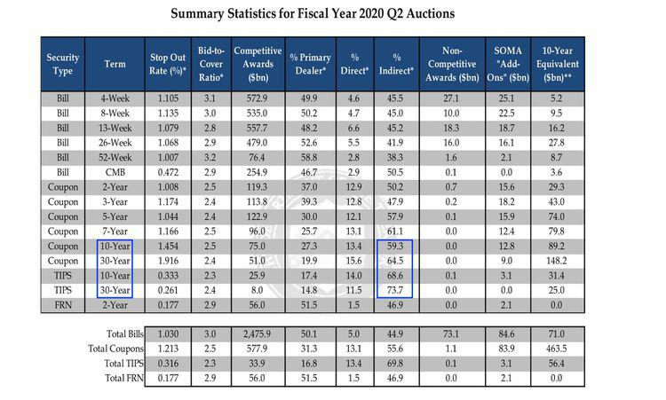

## Table of Contents

## What is an indirect bidder?

An indirect bidder is someone who wants to buy government securities, like Treasury bonds, but doesn't do it directly. Instead, they use a middleman, like a bank or a broker, to place their bids. This is common in big auctions where the government sells these securities to raise money.

These indirect bidders are often big investors, like foreign governments or large financial institutions. They use intermediaries because it's easier and sometimes they want to keep their involvement private. The term "indirect bidder" is important because it helps show how much demand there is from these big investors, which can affect the auction's results and the prices of the securities.

## How does an indirect bidder participate in auctions?

An indirect bidder participates in auctions by working with a middleman, like a bank or a broker. Instead of bidding directly, the indirect bidder tells their middleman what they want to buy and how much they are willing to pay. The middleman then places the bid on behalf of the indirect bidder. This way, the indirect bidder doesn't have to deal with the auction process themselves.

This method is useful for big investors, like foreign governments or large financial institutions, who might want to keep their involvement private or find it easier to use a middleman. The middleman handles all the details of the auction, making it simpler for the indirect bidder. The results of the auction, including what the indirect bidder bought, are then communicated back to them through their middleman.

## What is the role of indirect bidders in financial markets?

Indirect bidders play an important role in financial markets, especially when it comes to government securities like Treasury bonds. They are usually big investors like foreign governments or large financial institutions who don't bid directly in auctions. Instead, they use banks or brokers to place their bids for them. This helps them keep their involvement private and makes the process easier. Because indirect bidders are often big players, their participation can show how much demand there is for the securities, which can affect the auction's results and the prices of the securities.

The presence of indirect bidders can also influence the overall stability and [liquidity](/wiki/liquidity-risk-premium) of the financial markets. When many indirect bidders participate in an auction, it can signal strong demand and confidence in the market. This can lead to lower borrowing costs for the government because high demand can drive down the interest rates on the securities. On the other hand, if fewer indirect bidders participate, it might signal less confidence or demand, which could push interest rates up. So, indirect bidders are a key part of the financial system, helping to shape how much governments have to pay to borrow money and how stable the market is.

## Can you explain the difference between direct and indirect bidders?

Direct bidders are people or organizations that buy government securities, like Treasury bonds, by themselves. They go straight to the auction and place their own bids without using anyone else to help them. This is usually done by big banks or dealers who have the resources and know-how to handle the auction process directly.

Indirect bidders, on the other hand, don't go to the auction themselves. Instead, they use a middleman, like a bank or a broker, to place their bids for them. These indirect bidders are often big investors, such as foreign governments or large financial institutions, who want to keep their involvement private or find it easier to let someone else handle the bidding. The middleman takes care of everything and tells the indirect bidder what they got after the auction is over.

The main difference between the two is how they participate in the auction. Direct bidders do it themselves, while indirect bidders use a middleman. This difference can affect how much demand there is for the securities and can influence the auction's results and the prices of the securities.

## How do indirect bidders affect the outcome of Treasury auctions?

Indirect bidders are important for Treasury auctions because they show how much big investors want to buy the securities. These big investors, like foreign governments or large financial institutions, use banks or brokers to place their bids. When lots of indirect bidders join the auction, it means there is a lot of demand for the securities. This can make the auction go well for the government because more demand can lead to lower interest rates on the securities. The government likes this because it means they have to pay less to borrow money.

On the other hand, if fewer indirect bidders participate, it might mean there is less demand for the securities. This can make the auction harder for the government because less demand can lead to higher interest rates. The government would have to pay more to borrow money, which they don't like. So, the number of indirect bidders can really affect how much the government has to pay to borrow money and how well the auction goes.

## What are the advantages of bidding indirectly in financial auctions?

Bidding indirectly in financial auctions has several advantages. One big advantage is that it's easier for the bidder. Big investors like foreign governments or large financial institutions don't have to deal with the auction process themselves. They can just tell their bank or broker what they want to buy and how much they are willing to pay. The bank or broker does all the work, making it simpler for the investor.

Another advantage is privacy. When bidding indirectly, the investor's identity can stay hidden. This is important for big investors who might not want everyone to know they are buying government securities. By using a middleman, they can keep their involvement private, which can be good for their overall financial strategy.

## What types of investors typically act as indirect bidders?

Indirect bidders are usually big investors who don't want to deal with the auction process themselves. They include foreign governments who want to invest in another country's securities. These governments might use banks or brokers to place their bids because it's easier and they can keep their involvement private. Large financial institutions, like pension funds or insurance companies, also often bid indirectly. They have a lot of money to invest and using a middleman helps them manage their investments without having to handle the auction details themselves.

Another type of indirect bidder is central banks from other countries. They might want to buy securities to help manage their own country's money supply or to keep their currency stable. By bidding indirectly, they can do this without drawing too much attention to their actions. Overall, indirect bidders are big players who use intermediaries to make their investments easier and more private.

## How is the participation of indirect bidders reported and tracked?

The participation of indirect bidders in Treasury auctions is reported and tracked by the U.S. Department of the Treasury. After each auction, the Treasury releases a report that shows how many indirect bidders took part and how much they bought. This information is important because it helps everyone see how much big investors, like foreign governments or large financial institutions, want to buy the securities. The report usually comes out soon after the auction is over, so people can quickly see the results.

The data on indirect bidders is also used by financial analysts and investors to understand the demand for government securities. They look at the numbers to see if there is a lot of interest from big investors, which can affect the prices and interest rates of the securities. This information is shared in financial news and reports, helping people make better decisions about buying and selling securities. By keeping track of indirect bidders, the Treasury and the market can better understand the overall health and stability of the financial system.

## What impact do indirect bidders have on the pricing of securities?

Indirect bidders can have a big impact on how much securities cost. These bidders are usually big investors like foreign governments or large financial institutions. When a lot of them want to buy securities, it means there is a lot of demand. This can make the prices of the securities go up because everyone wants to buy them. On the other hand, if not many indirect bidders join the auction, it might mean there is less demand. This can make the prices go down because fewer people want to buy the securities.

The number of indirect bidders also affects the interest rates on the securities. When lots of indirect bidders participate, it shows strong demand, which can lead to lower interest rates. The government likes this because it means they have to pay less to borrow money. But if fewer indirect bidders join, it might show less demand, which can push interest rates up. This makes it more expensive for the government to borrow money. So, indirect bidders play a big role in deciding how much securities cost and how much the government has to pay to borrow money.

## How do changes in indirect bidding behavior signal market trends?

Changes in how indirect bidders act can tell us a lot about what's happening in the market. When more indirect bidders, like big investors from other countries or large financial groups, start buying more securities, it usually means they think the market is doing well. They might believe that the economy is strong or that the securities are a good investment. This can make other people feel more confident about the market too, because if big investors are buying, it might be a good sign.

On the other hand, if fewer indirect bidders are joining the auctions, it might mean they are worried about the market. They might think the economy is not doing so well or that the securities are not a good investment right now. This can make other people feel less confident about the market, because if big investors are not buying, it might be a sign that things are not going so well. So, watching how indirect bidders behave can help us understand where the market might be heading.

## What are the regulatory considerations for indirect bidders?

Indirect bidders have to follow rules set by the government and financial groups. These rules make sure that everyone plays fair and that the market stays stable. For example, indirect bidders need to use banks or brokers who are allowed to bid in auctions. These middlemen have to follow strict rules about how they handle bids and report them. Also, indirect bidders need to make sure they are not doing anything that could be seen as trying to control the market or trick other investors.

Another important rule is about transparency. While indirect bidders can keep their identity private, the total amount of their bids has to be reported after the auction. This helps everyone see how much big investors want to buy the securities. The government and financial groups watch these reports to make sure everything is fair and to understand how the market is doing. If indirect bidders do not follow these rules, they could face fines or other punishments.

## How can one analyze the performance and strategy of indirect bidders over time?

To analyze the performance and strategy of indirect bidders over time, you can look at the data from Treasury auctions. After each auction, the U.S. Department of the Treasury releases a report that shows how many indirect bidders took part and how much they bought. By looking at these reports over time, you can see if more or fewer indirect bidders are joining the auctions. If more indirect bidders are buying securities, it might mean they think the market is doing well. If fewer are buying, it could mean they are worried about the market. You can also see if the amount they are buying is going up or down, which can tell you about their confidence in the market.

Another way to analyze their strategy is to look at the interest rates on the securities they are buying. When indirect bidders buy a lot, it can push interest rates down because there is a lot of demand. If you see interest rates going down over time, it might mean indirect bidders are buying more and think the securities are a good investment. On the other hand, if interest rates are going up, it could mean indirect bidders are buying less, which might show they are less confident. By watching these trends, you can understand how indirect bidders are thinking about the market and what their strategy might be.

## References & Further Reading

[1]: ["Understanding Treasury Auctions: What We've Learned from the Past Decade"](https://www.thornburg.com/article/the-decline-of-us-treasuries-what-treasury-auctions-reveal/), Federal Reserve Board of Governors

[2]: Harris, L. (2003). ["Trading and Exchanges: Market Microstructure for Practitioners"](https://www.amazon.com/Trading-Exchanges-Market-Microstructure-Practitioners/dp/0195144708). Oxford University Press.

[3]: Parrino, R., & Harris, R.S. (1999). ["Takeovers, Management Replacement, and Post-Acquisition Operating Performance: Some Evidence from the 1980s."](https://onlinelibrary.wiley.com/doi/abs/10.1111/j.1745-6622.1999.tb00518.x) Journal of Financial Economics.

[4]: Vickrey, W. (1961). ["Counterspeculation, Auctions, and Competitive Sealed Tenders,"](https://www.cramton.umd.edu/market-design-papers/vickrey-counterspeculation-auctions-and-competitive-sealed-tenders.pdf) The Quarterly Journal of Economics.

[5]: Lopez de Prado, M. (2018). ["Advances in Financial Machine Learning"](https://www.amazon.com/Advances-Financial-Machine-Learning-Marcos/dp/1119482089). Wiley Finance.

[6]: Easley, D., & O'Hara, M. (1992). ["Time and the Process of Security Price Adjustment."](https://onlinelibrary.wiley.com/doi/abs/10.1111/j.1540-6261.1992.tb04402.x) Journal of Finance.