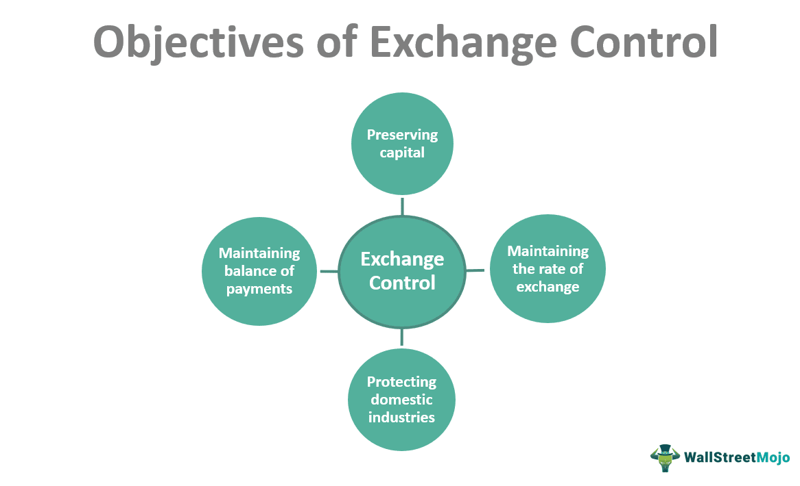

Exchange rates are pivotal in determining the relative value of currencies between nations, serving as a critical component in shaping global economic activities. They impact everything from consumer prices to the broader scope of international trade. Specifically, an exchange rate defines how much one currency is worth in terms of another, thus playing a vital role in a nation’s economic strategy and day-to-day financial transactions. By influencing import and export costs, exchange rates can affect the inflation rate and purchasing power, making them a focal point for economic policy and international business operations.

The significance of exchange rates extends beyond mere currency conversion; they are instrumental in maintaining economic stability. For instance, a stronger currency may reduce the cost of imported goods, leading to lower prices for consumers, while a weaker currency could boost export competitiveness but also raise the costs of imports, potentially contributing to inflationary pressures.



In modern foreign exchange (forex) markets, the rise of algorithmic trading has introduced a new dimension to how exchange rates are managed and leveraged. Algorithmic trading, often referred to as algo trading, involves using computer programs to automatically execute trades based on predefined criteria and mathematical models. This advancement has not only increased the speed and efficiency of transactions but also contributed to greater liquidity in the market. However, it also comes with challenges, such as the potential for rapid, automated trades to contribute to market volatility.

As we explore the effects of exchange rates on economies and currencies, we will also delve into the emerging role of such technological advancements in the forex markets. Understanding these dynamics is crucial for businesses, investors, and policymakers seeking to navigate the complexities of today’s global financial environment.

## Table of Contents

## Understanding Exchange Rates and Their Economic Impact

Exchange rates are a critical determinant of economic stability, affecting various aspects of an economy, including goods pricing, inflation, interest rates, and employment. These rates represent the value of one currency in terms of another and are subject to fluctuations driven by multiple factors such as interest rates, economic indicators, political stability, and market speculation.

The strength or weakness of a domestic currency has profound implications. A strong domestic currency typically results in cheaper imports, as the currency can purchase more foreign goods. This decrease in the cost of imported goods can contribute to lower inflation rates, benefiting consumers by reducing the prices of goods and services. For instance, if the currency of a country strengthens, domestic manufacturers may face competition from less expensive imported goods, which may pressure them to lower their prices or improve their quality. Additionally, reduced inflationary pressures could lead central banks to maintain or lower interest rates to stimulate economic growth.

Conversely, a weak domestic currency usually increases inflationary pressures. Imported goods and raw materials become more expensive, leading to higher production costs for businesses. As a result, companies may pass these costs onto consumers in the form of higher prices, contributing to an increase in the overall inflation rate. Central banks might respond to heightened inflation by increasing interest rates, which can slow economic growth and impact employment levels negatively.

For businesses and policymakers, understanding exchange rate dynamics is essential to make informed decisions. Businesses engaged in international trade or those reliant on imports and exports must anticipate currency fluctuations and devise strategies to mitigate associated risks. For instance, companies might utilize financial instruments such as forwards and options to hedge against foreign exchange risk, thereby stabilizing their cash flow against potential currency [volatility](/wiki/volatility-trading-strategies).

Policymakers must consider exchange rates when formulating economic policy. A careful balance is needed to manage the trade-offs between inflation control, economic growth, and external competitiveness. For example, a policy aimed at strengthening the domestic currency to reduce inflation might adversely affect export competitiveness by making locally produced goods more expensive abroad.

Understanding and predicting exchange rate movements also involves analyzing a variety of economic indicators. Factors such as [interest rate](/wiki/interest-rate-trading-strategies) differentials, economic growth prospects, and balance of payments positions play crucial roles in influencing exchange rates. In mathematical modeling, these can be represented using econometric models, where variables like interest rate $i$, inflation rate $\pi$, and GDP growth $g$ are utilized to predict future exchange rate trends. Here is a simple example using Python to simulate such a relationship:

```python
import numpy as np

# Example parameters
interest_rate_differential = 0.02  # 2%
inflation_rate_domestic = 0.03     # 3%
inflation_rate_foreign = 0.01      # 1%

# Simplified representation of exchange rate movement prediction
exchange_rate_change = interest_rate_differential - (inflation_rate_domestic - inflation_rate_foreign)

print("Predicted change in exchange rate: {:.2%}".format(exchange_rate_change))
```

In summary, exchange rates are a fundamental aspect of economic policy and business strategy, impacting inflation, pricing, interest rates, and employment. A thorough comprehension of these dynamics enables businesses and policymakers to navigate the complexities of international markets effectively.

## Currency Fluctuations and Their Effects

Currency fluctuations significantly influence international trade by impacting the pricing structure of imported and exported goods. These fluctuations determine the relative cost and competitiveness of products in global markets, subsequently affecting trade balances and economic health. When a country's currency strengthens, its exports become more expensive for foreign purchasers, potentially reducing demand, while imported goods become cheaper, encouraging domestic consumption of foreign products. Conversely, a depreciated currency can make exports more competitive but increase the cost of imports, potentially leading to inflationary pressures.

For consumers, currency volatility translates into variability in product prices, significantly affecting their purchasing power. This effect is contingent upon supply chain dependencies and import costs. For instance, an increase in currency value can lead to lower prices for imported goods, effectively increasing consumer purchasing power. Conversely, if the domestic currency depreciates, the resultant increase in import costs may be passed on to consumers as higher prices for goods, reducing their purchasing power.

Businesses engaged in international trade are directly exposed to the risks of currency fluctuations. These businesses often employ hedging strategies to mitigate risks associated with currency volatility. Hedging can involve the use of financial instruments such as futures, options, and swaps to lock in exchange rates or to create predictable cash flows. By doing so, businesses aim to manage the uncertainty associated with fluctuating currency values, ensuring more stable financial planning and operations.

### Example of a Hedging Strategy

To understand how hedging can be applied, consider a hypothetical scenario involving a U.S. company that expects to receive a payment of €1 million in three months. If the current exchange rate is $1.10/€ but the company fears a potential appreciation of the euro against the dollar, it might decide to hedge its foreign exchange risk.

#### Forward Contract Example in Python

```python
# Define current and expected exchange rates
current_exchange_rate = 1.10  # USD/EUR
expected_exchange_rate = 1.15  # USD/EUR

# Define amount in Euros
amount_euros = 1_000_000

# Calculate amount in USD without hedging
amount_usd_no_hedge = amount_euros * current_exchange_rate

# Calculate amount in USD with expected future rate without hedging
amount_usd_future_no_hedge = amount_euros * expected_exchange_rate

# Define forward contract rate (locked in at current rate)
forward_contract_rate = current_exchange_rate

# Calculate amount in USD with forward contract
amount_usd_hedge = amount_euros * forward_contract_rate

# Output results
print(f'Amount in USD without hedging (current rate): {amount_usd_no_hedge}')
print(f'Potential amount in USD without hedging (future rate): {amount_usd_future_no_hedge}')
print(f'Amount in USD with forward contract: {amount_usd_hedge}')
```

This example illustrates how a forward contract can be used to lock in an exchange rate, thereby protecting a business from unfavorable currency movements. By securing a forward contract at the current rate of \$1.10/€, the company effectively safeguards its revenue against the risk of euro appreciation and can predict its earnings in USD regardless of future exchange rate changes. This predictability is crucial for long-term financial planning and maintaining competitive margins in international markets.

In summary, exchange rate fluctuations are pivotal in shaping trade dynamics by altering the cost structure of international transactions. Both consumers and businesses must navigate these changes, employing strategies like hedging to manage risk and ensure economic stability.

## How Exchange Rates Affect Investment Portfolios

Exchange rate variations hold significant consequences for international investment portfolios. These fluctuations directly influence the valuation of foreign securities and assets, thus impacting overall investment returns. A key mechanism through which these effects manifest is currency appreciation and depreciation. 

When a domestic currency appreciates against a foreign currency, the value of foreign investments denominated in that currency translates to a lower return when measured in the stronger domestic currency. Conversely, if the domestic currency depreciates, the same foreign investments yield higher returns when converted back to the domestic currency. This relationship can be mathematically represented by the following formula:

$$
\text{Converted Return} = \left( \frac{\text{Foreign Investment Return} \times \text{Exchange Rate (end)}}{\text{Exchange Rate (begin)}} \right) - 1
$$

where "Exchange Rate (begin)" represents the rate at the start of the investment period, and "Exchange Rate (end)" is the rate at the time of conversion.

Investors engaged in international markets must attentively consider these [forex](/wiki/forex-system) risks when constructing their portfolios. Notably, significant currency volatility can lead to unexpected gains or losses, complicating investment outcomes. As a result, currency hedging strategies become essential tools for mitigating these risks.

Hedging allows investors to minimize the potential negative impacts of exchange rate movements on their foreign investments. Common hedging techniques include the use of forward contracts, options, and currency swaps. These instruments enable investors to lock in exchange rates for future transactions or to secure options on rate fluctuations, thereby stabilizing expected returns.

For example, an investor anticipating a depreciation of the foreign currency in which their assets are held might enter into a forward contract to sell that currency at a fixed rate in the future. This reduces the risk of substantial losses if the currency's value falls as expected. Such strategic measures underpin effective risk management in international investing, emphasizing the importance of understanding forex dynamics.

To further illustrate the impact, consider an investor holding European stocks valued in euros. If the euro weakens against the investor's domestic currency, the euro-denominated earnings from these stocks could diminish when converted back, despite the stocks potentially performing well in local terms. Offsetting this risk through hedging ensures that currency movements do not solely dictate the investor's returns.

In conclusion, exchange rate variations demand meticulous attention from international investors keen on preserving and enhancing the value of their portfolios. By employing effective hedging strategies, investors can navigate the complexities of forex risks, optimizing returns regardless of currency market fluctuations.

## The Role of Algorithmic Trading in Forex Markets

Algorithmic trading has transformed the forex market by significantly enhancing transaction speed and improving overall market efficiency. Unlike traditional trading practices, where human traders execute orders manually, algo trading utilizes computer algorithms to process vast amounts of real-time data. This advancement enables traders to capitalize on minute market movements, thereby providing [liquidity](/wiki/liquidity-risk-premium) to the market.

The primary advantage of [algorithmic trading](/wiki/algorithmic-trading) lies in its ability to execute orders at speeds impossible for human traders. Algorithms can identify trading opportunities, initiate trades, and [exit](/wiki/exit-strategy) positions swiftly, minimizing latency-induced inefficiencies. This rapid execution contributes to the tightening of bid-ask spreads, enhancing overall market liquidity.

Algorithmic trading employs diverse strategies, including statistical [arbitrage](/wiki/arbitrage), [trend following](/wiki/trend-following), and [market making](/wiki/market-making). These strategies often involve complex mathematical models to predict future price movements. For instance, a moving average crossover strategy might look like this in Python:

```python
def moving_average(prices, window):
    return sum(prices[-window:]) / window

def moving_average_crossover(prices, short_window, long_window):
    short_ma = moving_average(prices, short_window)
    long_ma = moving_average(prices, long_window)
    if short_ma > long_ma:
        return "Buy"
    elif short_ma < long_ma:
        return "Sell"
    else:
        return "Hold"
```

Despite its benefits, algorithmic trading is not without risks. One notable concern is the potential for flash crashes—sudden, severe market declines primarily driven by automated, high-frequency trades. Such events can arise when numerous algorithms react to the same market signals and execute trades simultaneously, causing a cascade effect on prices. This highlights the need for effective risk management and regulatory oversight in algo trading.

Furthermore, understanding the influence of algorithmic trading is crucial for investors as it affects market dynamics. Rapid changes in exchange rates driven by algorithmic transactions can impact hedging strategies and investment returns. Awareness of these factors allows investors to make more informed decisions and adapt their strategies to mitigate potential risks associated with technological trading advancements.

In summary, algorithmic trading has revolutionized the forex market by providing increased efficiency and liquidity, yet it also introduces new risks that necessitate careful consideration and management by participants in the market.

## Future Trends: Technological Advancements and Exchange Rates

Advancements in technology are transforming the landscape of exchange rate forecasting and trading strategies. As [machine learning](/wiki/machine-learning) and [artificial intelligence](/wiki/ai-artificial-intelligence) (AI) become more sophisticated, they offer significant capabilities in analyzing historical data and predicting future market trends. These technologies enhance the ability to interpret complex datasets, identify patterns, and generate forecasts with unprecedented accuracy. The incorporation of AI in trading strategies can lead to more informed decision-making, potentially improving financial outcomes for investors and traders.

Big data further complements AI by providing the vast volumes of information necessary for effective currency analysis. With data generated from various sources including financial markets, economic reports, and global news, big data analytics can provide traders with real-time insights into forex market dynamics. This wealth of information allows for more nuanced exchange rate predictions and more adaptable trading strategies.

Blockchain technology introduces an additional layer of potential by enhancing transparency and security in forex transactions. It has the capability to record and verify trades in a decentralized manner, minimizing the risk of fraud and errors. The use of smart contracts in blockchain networks can automate the execution of trades when predetermined conditions are met, enhancing efficiency and reducing transaction times. This technology can streamline processes across the forex market, potentially lowering costs and increasing market participation.

As technology evolves, its impact on the forex market is expected to continue growing. Emerging tech tools are likely to facilitate more seamless trades, optimize transaction flows, and expand access to forex trading for a broader range of participants. The integration of these technological advances will influence how currencies are managed and exchanged, potentially leading to a more interconnected and efficient global financial system.

Technological advancements will not only shape the methods by which currencies are traded but also redefine market structures and operational processes. These changes present opportunities for improved market performance but also pose challenges that necessitate careful management. Stakeholders in the forex market must remain agile and responsive to these developments, leveraging technology to enhance their strategies while mitigating associated risks.

## Conclusion

Exchange rates are integral to ensuring economic stability and profitability, impacting both individuals and nations. Their influence permeates various economic activities such as international trade, investment decisions, and monetary policy. Navigating the complexities of currency volatility necessitates a thorough understanding of economic indicators—such as inflation rates, interest rates, and balance of trade—as well as technological tools that analyze and predict market behavior. 

Algorithmic trading has emerged as a key player in Forex markets, offering increased efficiency and speed. However, this technology can also introduce risks, such as flash crashes, due to its rapid, automated trading nature. As both opportunities and challenges arise from technological advancements, stakeholders must be vigilant in leveraging these innovations while managing potential downsides.

Looking to the future, continued technological advancements, including artificial intelligence and big data, are expected to significantly shape currency trading and exchange rate forecasting. Meanwhile, blockchain technology may enhance transparency and efficiency in foreign exchange transactions. As these technologies evolve, they promise to transform the way currencies are traded and managed, further influencing economic landscapes globally. Operating within this dynamic environment will require ongoing adaptation and strategic foresight to harness these developments effectively.

## References & Further Reading

[1]: Bergstra, J., Bardenet, R., Bengio, Y., & Kégl, B. (2011). ["Algorithms for Hyper-Parameter Optimization."](https://papers.nips.cc/paper/4443-algorithms-for-hyper-parameter-optimization) Advances in Neural Information Processing Systems 24.

[2]: ["Advances in Financial Machine Learning"](https://www.amazon.com/Advances-Financial-Machine-Learning-Marcos/dp/1119482089) by Marcos Lopez de Prado

[3]: ["Evidence-Based Technical Analysis: Applying the Scientific Method and Statistical Inference to Trading Signals"](https://www.amazon.com/Evidence-Based-Technical-Analysis-Scientific-Statistical/dp/0470008741) by David Aronson

[4]: ["Machine Learning for Algorithmic Trading"](https://github.com/PacktPublishing/Machine-Learning-for-Algorithmic-Trading-Second-Edition) by Stefan Jansen

[5]: ["Quantitative Trading: How to Build Your Own Algorithmic Trading Business"](https://books.google.com/books/about/Quantitative_Trading.html?id=j70yEAAAQBAJ) by Ernest P. Chan

[6]: Engel, C. (1996). ["The Forward Discount Anomaly and the Risk Premium: A Survey of Recent Evidence."](https://www.nber.org/papers/w5312) National Bureau of Economic Research.

[7]: King, M. R. & Rime, D. (2010). ["The $4 Trillion Question: What Explains FX Growth Since the 2007 Crisis?"](https://papers.ssrn.com/sol3/papers.cfm?abstract_id=1727410) Bank for International Settlements.

[8]: Lyons, R. K. (2001). ["The Microstructure Approach to Exchange Rates."](https://direct.mit.edu/books/monograph/2004/The-Microstructure-Approach-to-Exchange-Rates) MIT Press.