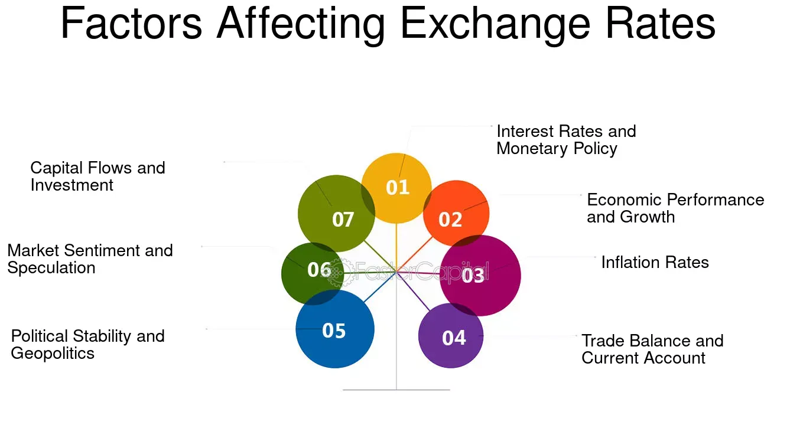

## Table of Contents

## What is an exchange rate?

An exchange rate is the value of one country's money compared to another country's money. For example, if you want to buy something from another country, you need to change your money into their money. The exchange rate tells you how much of your money you need to give to get one unit of their money.

Exchange rates change all the time because of many reasons. Things like how well a country's economy is doing, what people think about that country's money, and even big events like elections can make the exchange rate go up or down. If a country's economy is doing well, usually its money will be worth more compared to other countries' money.

## How do exchange rates affect the price of imports and exports?

Exchange rates play a big role in how much things cost when you buy them from other countries or sell them to other countries. If your country's money gets stronger compared to another country's money, it means you need less of your money to buy their products. This makes imports cheaper for you. For example, if the exchange rate changes so that one US dollar can buy more euros, then buying things from Europe becomes cheaper for people in the US.

On the other hand, if your country's money gets weaker, it takes more of your money to buy the same thing from another country. This makes imports more expensive. For example, if the US dollar can buy fewer euros, then buying European goods becomes more expensive for Americans. This change in price can make people buy less from that country because it costs more.

For exports, the opposite happens. If your country's money gets weaker, it means other countries can buy your products for less of their money. This can make your exports cheaper and more attractive to buyers in other countries. But if your country's money gets stronger, your exports become more expensive for other countries, and they might buy less from you.

## What are indirect effects of exchange rates?

Exchange rates can affect more than just the price of things we buy and sell. They can also change how much people want to travel to other countries. If a country's money gets weaker, it might be cheaper for people from that country to go on vacation abroad because their money goes further in other places. On the other hand, if a country's money gets stronger, it might be more expensive for people from other countries to visit, so fewer tourists might come.

Another indirect effect is on investments. If a country's money is expected to get stronger, people from other countries might want to invest in that country because they think they will make more money when they change it back to their own currency. But if a country's money is expected to get weaker, people might take their money out of that country to avoid losing money. This can affect the economy of the country because more or less money is coming in or going out.

These changes in travel and investment can lead to even bigger effects on jobs and the economy. If fewer tourists come to a country, businesses that rely on tourism might struggle, leading to fewer jobs. If less money is invested in a country, it might slow down growth and make it harder for businesses to start or expand. So, exchange rates can have a big impact on many parts of life, even if it's not always easy to see right away.

## How do exchange rates influence inflation?

Exchange rates can affect inflation, which is when prices go up over time. If a country's money gets weaker compared to other countries' money, it can make things from other countries more expensive. This is because you need more of your money to buy the same amount of their money. When imports get more expensive, it can push up the prices of things in your country, leading to more inflation. For example, if a country imports a lot of oil and its money gets weaker, the cost of oil goes up, which can make everything that uses oil more expensive too.

On the other hand, if a country's money gets stronger, it can help keep inflation down. When your money is worth more compared to other countries' money, imports become cheaper. This can help keep prices from going up too fast. But if a country relies a lot on exports, a stronger currency can make its products more expensive for other countries, which might lead to less demand and could affect the economy in other ways. So, exchange rates can have a big impact on inflation, depending on how much a country imports and exports.

## Can exchange rates impact a country's competitiveness in the global market?

Yes, exchange rates can impact a country's competitiveness in the global market. If a country's money gets weaker, it means other countries can buy its products for less of their money. This can make the country's exports cheaper and more attractive to buyers around the world. When a country's exports are cheaper, it can sell more and do better in the global market compared to countries with stronger money.

On the other hand, if a country's money gets stronger, its exports become more expensive for other countries. This can make it harder for the country to sell its products abroad because other countries might choose to buy from countries with cheaper products. A stronger currency can make a country less competitive in the global market, which can affect its economy and how well its businesses do.

## How do exchange rate fluctuations affect multinational corporations?

Exchange rate fluctuations can have a big impact on multinational corporations. These companies do business in many different countries, so they have to deal with different kinds of money all the time. When the exchange rates change, it can make their costs go up or down. For example, if a company in the US buys materials from Europe and the US dollar gets weaker, it will cost the company more to buy those materials. This can hurt their profits because they have to spend more money to get the same things.

On the other hand, if the US dollar gets stronger, it can help the company save money on those imports. But it can also make their products more expensive for people in other countries to buy. This can hurt their sales because fewer people might want to buy their products if they cost more. Multinational corporations often try to manage these risks by using financial tools like hedging, which can help protect them from big losses if the exchange rates change suddenly.

## What role do exchange rates play in foreign direct investment?

Exchange rates can affect how much foreign direct investment (FDI) a country gets. If a country's money is expected to get stronger, it might attract more FDI. This is because investors think they will make more money when they change it back to their own currency. For example, if someone from Japan wants to invest in the US and the US dollar is expected to get stronger, they might decide to invest more because they think they will get more yen back when they convert their dollars later.

On the other hand, if a country's money is expected to get weaker, it might scare away investors. They might worry about losing money when they change it back to their own currency. For example, if the US dollar is expected to get weaker, a Japanese investor might decide to invest less in the US because they think they will get fewer yen back when they convert their dollars. So, exchange rates can play a big role in deciding where and how much investors want to put their money into other countries.

## How do exchange rates affect the tourism industry?

Exchange rates can make a big difference for the tourism industry. If a country's money gets weaker, it becomes cheaper for people from other countries to visit. This can bring in more tourists because their money goes further. For example, if the US dollar gets weaker, it might be a good time for Europeans to visit the US because they can spend less of their euros to enjoy the same things. More tourists can help hotels, restaurants, and other businesses that rely on visitors.

On the other hand, if a country's money gets stronger, it can make it more expensive for people from other countries to visit. This might mean fewer tourists come, which can hurt businesses that depend on tourism. For example, if the US dollar gets stronger, it might be more expensive for Europeans to visit the US, so they might choose to go somewhere else instead. This can lead to fewer jobs and less money coming into the tourism industry in the country with the stronger currency.

## What is the relationship between exchange rates and interest rates?

Exchange rates and interest rates are closely linked. If a country raises its interest rates, it can make its money more attractive to people from other countries. This is because they can earn more money by putting their money in that country's banks or buying its bonds. When more people want to buy a country's money, it usually gets stronger compared to other countries' money. So, higher interest rates can lead to a stronger exchange rate.

On the other hand, if a country lowers its interest rates, it can make its money less attractive to people from other countries. They might move their money to other countries where they can earn more. This can make the country's money weaker compared to other countries' money. So, lower interest rates can lead to a weaker exchange rate. This relationship is important for countries to think about when they are deciding what to do with their interest rates.

## How do central banks use exchange rates as a tool for monetary policy?

Central banks can use exchange rates to help them control their country's money and economy. If a central bank wants to make its country's money stronger, it might raise interest rates. This makes it more attractive for people from other countries to buy their money because they can earn more interest. When more people want to buy the country's money, it gets stronger. This can help keep inflation down because it makes things from other countries cheaper.

On the other hand, if a central bank wants to make its country's money weaker, it might lower interest rates. This makes it less attractive for people from other countries to buy their money because they can earn less interest. When fewer people want to buy the country's money, it gets weaker. This can help make the country's exports cheaper and more competitive in the global market, which can help the economy grow. So, central banks can use exchange rates as a tool to reach their goals for the economy.

## What are the effects of exchange rate volatility on financial markets?

Exchange rate [volatility](/wiki/volatility-trading-strategies) can make financial markets go up and down a lot. When exchange rates change quickly and a lot, it can make people feel unsure about what will happen next. This uncertainty can make people sell their investments, which can cause stock prices to drop. It can also make it harder for companies to plan for the future because they don't know how much their costs will be. Banks and other financial institutions might also be more careful about lending money because they worry about losing money if the exchange rates keep changing.

On the other hand, some people in financial markets like exchange rate volatility because it can give them chances to make money. Traders who are good at guessing how exchange rates will move can buy and sell money to make a profit. But this kind of trading can also make the markets even more volatile. So, while some people can benefit from the ups and downs, exchange rate volatility can make financial markets less stable and more risky for everyone involved.

## How do exchange rates influence global supply chains and trade policies?

Exchange rates can change how much it costs to move things around the world. If a country's money gets weaker, it can make their stuff cheaper for other countries to buy. This can make more people want to buy from that country, which can help their businesses grow. But it can also make it more expensive for that country to buy things from other places. Companies that need to bring in parts or materials from other countries might have to pay more, which can make their products cost more too. So, exchange rates can make global supply chains more complicated because costs can change a lot.

Governments sometimes change their trade policies because of exchange rates. If a country's money is weak, the government might try to help by putting rules in place to make it easier for their businesses to sell things to other countries. They might also try to protect their own businesses by making it harder for other countries to sell things to them. On the other hand, if a country's money is strong, the government might not need to help as much, but they might still want to keep an eye on things to make sure their businesses can still compete. So, exchange rates can lead to changes in trade policies that affect how countries buy and sell things around the world.

## How do exchange rates affect investment portfolios?

Exchange rate variations hold significant consequences for international investment portfolios. These fluctuations directly influence the valuation of foreign securities and assets, thus impacting overall investment returns. A key mechanism through which these effects manifest is currency appreciation and depreciation. 

When a domestic currency appreciates against a foreign currency, the value of foreign investments denominated in that currency translates to a lower return when measured in the stronger domestic currency. Conversely, if the domestic currency depreciates, the same foreign investments yield higher returns when converted back to the domestic currency. This relationship can be mathematically represented by the following formula:

$$
\text{Converted Return} = \left( \frac{\text{Foreign Investment Return} \times \text{Exchange Rate (end)}}{\text{Exchange Rate (begin)}} \right) - 1
$$

where "Exchange Rate (begin)" represents the rate at the start of the investment period, and "Exchange Rate (end)" is the rate at the time of conversion.

Investors engaged in international markets must attentively consider these [forex](/wiki/forex-system) risks when constructing their portfolios. Notably, significant currency volatility can lead to unexpected gains or losses, complicating investment outcomes. As a result, currency hedging strategies become essential tools for mitigating these risks.

Hedging allows investors to minimize the potential negative impacts of exchange rate movements on their foreign investments. Common hedging techniques include the use of forward contracts, options, and currency swaps. These instruments enable investors to lock in exchange rates for future transactions or to secure options on rate fluctuations, thereby stabilizing expected returns.

For example, an investor anticipating a depreciation of the foreign currency in which their assets are held might enter into a forward contract to sell that currency at a fixed rate in the future. This reduces the risk of substantial losses if the currency's value falls as expected. Such strategic measures underpin effective risk management in international investing, emphasizing the importance of understanding forex dynamics.

To further illustrate the impact, consider an investor holding European stocks valued in euros. If the euro weakens against the investor's domestic currency, the euro-denominated earnings from these stocks could diminish when converted back, despite the stocks potentially performing well in local terms. Offsetting this risk through hedging ensures that currency movements do not solely dictate the investor's returns.

In conclusion, exchange rate variations demand meticulous attention from international investors keen on preserving and enhancing the value of their portfolios. By employing effective hedging strategies, investors can navigate the complexities of forex risks, optimizing returns regardless of currency market fluctuations.

## References & Further Reading

[1]: Bergstra, J., Bardenet, R., Bengio, Y., & Kégl, B. (2011). ["Algorithms for Hyper-Parameter Optimization."](https://papers.nips.cc/paper/4443-algorithms-for-hyper-parameter-optimization) Advances in Neural Information Processing Systems 24.

[2]: ["Advances in Financial Machine Learning"](https://www.amazon.com/Advances-Financial-Machine-Learning-Marcos/dp/1119482089) by Marcos Lopez de Prado

[3]: ["Evidence-Based Technical Analysis: Applying the Scientific Method and Statistical Inference to Trading Signals"](https://www.amazon.com/Evidence-Based-Technical-Analysis-Scientific-Statistical/dp/0470008741) by David Aronson

[4]: ["Machine Learning for Algorithmic Trading"](https://github.com/PacktPublishing/Machine-Learning-for-Algorithmic-Trading-Second-Edition) by Stefan Jansen

[5]: ["Quantitative Trading: How to Build Your Own Algorithmic Trading Business"](https://books.google.com/books/about/Quantitative_Trading.html?id=j70yEAAAQBAJ) by Ernest P. Chan

[6]: Engel, C. (1996). ["The Forward Discount Anomaly and the Risk Premium: A Survey of Recent Evidence."](https://www.nber.org/papers/w5312) National Bureau of Economic Research.

[7]: King, M. R. & Rime, D. (2010). ["The $4 Trillion Question: What Explains FX Growth Since the 2007 Crisis?"](https://papers.ssrn.com/sol3/papers.cfm?abstract_id=1727410) Bank for International Settlements.

[8]: Lyons, R. K. (2001). ["The Microstructure Approach to Exchange Rates."](https://direct.mit.edu/books/monograph/2004/The-Microstructure-Approach-to-Exchange-Rates) MIT Press.