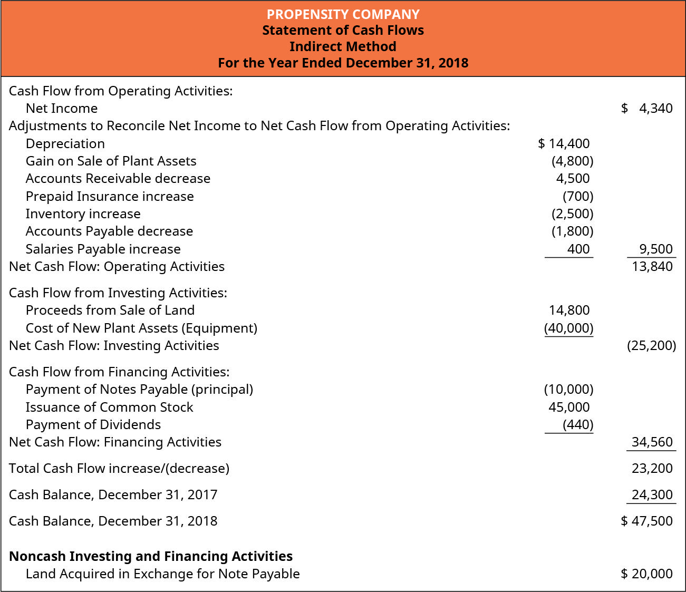

This article explores the intersection of financial reporting and algorithmic trading, focusing on the indirect method of preparing cash flow statements. The indirect method is a popular accounting approach used by businesses to convert net income into cash flow by adjusting for non-cash items and changes in balance sheet accounts. This method involves amendments for non-cash transactions such as depreciation and amortization, as well as alterations in working capital accounts like accounts receivable and payable. Understanding these cash flow statements is critical for investors and stakeholders who are attempting to gain insights into a company's liquidity and financial health. 

The significance of cash flow statements extends beyond traditional stakeholder analysis. Algorithmic trading, which utilizes computational algorithms to execute trading decisions, heavily relies on the precise financial metrics provided by these statements. A comprehensive understanding of cash flows can significantly enhance trading strategies by offering insights into market predictions. This is because cash flow statements prepared using the indirect method provide essential data, helping algorithms in predicting market movements and managing trading risks more effectively. 



Consequently, this article analyzes how the indirect method of financial reporting influences algorithmic trading, providing readers with an extensive perspective on both subjects. By examining the relationship between these financial statements and trading algorithms, we aim to highlight the value of integrating cash flow analytics into advanced trading strategies. This exposure equips readers with the knowledge to better comprehend and utilize financial data to optimize trading outcomes.

## Table of Contents

## Understanding the Indirect Method in Financial Reporting

The indirect method of cash flow statement preparation begins with net income and involves making adjustments for non-cash transactions, such as depreciation and amortization. These adjustments are necessary to reconcile net income, which is based on accrual accounting, to the cash provided by operating activities. Depreciation and amortization are added back to net income because, although they reduce reported net income, they do not involve any actual cash outflow.

Changes in working capital accounts, such as accounts receivable and accounts payable, are also adjusted to convert accrual figures into cash flow balances. For example, an increase in accounts receivable implies that sales have been made on credit, thus not resulting in immediate cash inflow, and therefore, it is subtracted from net income. Conversely, an increase in accounts payable indicates that expenses have been incurred without immediate cash outflow, warranting an addition to net income.

The indirect method simplifies cash flow statement preparation by leveraging existing accrual-based information from financial statements, thus providing a streamlined approach to cash flow reporting. This method links the cash flow statement to both the balance sheet and income statement, allowing financial statement users to trace changes in cash flow back to changes in these statements. This integration is particularly advantageous for larger firms with more complex financial structures.

Despite its less explicit breakdown of cash receipts and payments compared to the direct method, the indirect method is preferred for its ease of preparation and its ability to highlight reconciliations between net income and net cash provided by operating activities. This clarity is essential for stakeholders to evaluate a company's financial efficiency and [liquidity](/wiki/liquidity-risk-premium). Understanding these aspects can inform stakeholders about the company's operational cash flow generation and its capacity to meet short-term liabilities, thus providing insights into the company’s financial health.

## How Algorithmic Trading Utilizes Indirect Method Data

Algorithmic trading relies on computational algorithms to make trading decisions by analyzing vast amounts of financial data. A crucial element of this data are the financial health indicators derived from cash flow statements, especially those created using the indirect method. This method amalgamates net income with adjustments for non-cash transactions and changes in working capital accounts, such as accounts receivable and payable, to provide a comprehensive view of a company's cash flows.

The indirect method offers several advantages for [algorithmic trading](/wiki/algorithmic-trading). First, it links critical elements of financial performance with cash flow, which algorithms use to assess the liquidity and operational efficiency of a company. For instance, by parsing adjustments for depreciation, amortization, and fluctuations in working capital, algorithmic models can extract valuable insights into the company's financial health. These insights are pivotal for making predictions about future market movements and understanding potential risks.

Incorporating cash flow statement analysis into trading algorithms enhances their capacity to predict market trends and mitigate risk. Algorithms can incorporate variables such as cash generated from operating activities, investment cash flows, and financing cash flows to forecast how changes in these areas may impact a company's financial standing. Analyzing these patterns allows trading systems to anticipate shifts in market behavior, enabling timely and informed decision-making.

Furthermore, in volatile market environments, understanding a company's cash flow through the indirect method empowers trading algorithms to optimize strategies. When markets undergo rapid changes, an algorithm equipped with detailed financial metrics can swiftly adjust trading tactics to maintain or improve profitability. For example, algorithms can use insights from indirect method statements to gauge a firm's ability to manage cash reserves or generate cash flow from operations, which are critical during fluctuations.

Lastly, algorithms utilize data from indirect method statements to fine-tune speculative and hedging strategies. By analyzing historical cash flow data, algorithms can discern patterns and correlations that contribute to the development of robust speculative models. Additionally, in terms of hedging, understanding cash flow dynamics allows for better anticipation of potential financial distress, helping algorithms create strategies that provide a buffer against unfavorable market conditions.

Overall, the integration of indirect method data into algorithmic trading models provides a powerful tool for enhancing market stability and achieving financial objectives collaboratively by synthesizing precise financial metrics with advanced computational techniques.

## Comparing Indirect and Direct Methods

In financial reporting, the conversion of accrual-based accounting to cash-based statements is primarily achieved through two methodologies: the indirect method and the direct method. Both serve the function of translating income and financial activity into a comprehensible view of cash flows, albeit through different processes and presentations.

The indirect method commences with the net income from the income statement and involves adjustments for non-cash transactions and changes in working capital accounts. Items like depreciation and amortization are added back to the net income, and variations in accounts receivable and payable are accounted for to reflect actual cash movements. This approach provides a clear understanding of reconciliations between net income and net cash from operating activities, without delving into the granular details of each cash transaction.

In contrast, the direct method lists all individual cash transactions—receipts from customers, payments to suppliers, and other cash expenses. This results in a more straightforward presentation, granting users direct visibility into cash flows. Despite its clarity and preferred status by the Financial Accounting Standards Board (FASB) for promoting transparency in financial reporting, the direct method is less frequently used due to its complexity and the significant effort required to prepare it.

Both the indirect and direct methods ultimately arrive at the same figure for cash generated from operating activities, ensuring the consistency and reliability of financial insights provided. However, they differ significantly in terms of the narrative and structure they present to stakeholders. The indirect method's continued popularity stems from its simplicity and the relative ease of deriving it from accrual accounting figures, which are already maintained within a company's financial systems.

The fundamental choice between these two methods often balances between transparency and practicality, reflecting the varying needs and capacities of different companies in effectively reporting their financial health.

## Applications and Real Life Examples

Prominent companies such as Apple Inc. and Microsoft Corporation employ the indirect method of preparing cash flow statements, highlighting its widespread use among major enterprises. This method provides key insights into the financial health of a corporation by adjusting net income to account for non-cash transactions and changes in working capital. For instance, through these statements, Apple can display its ability to manage liquidity efficiently, showcasing the cash generated from operating activities even when large amounts are tied up in accounts receivable or inventory.

Similarly, Microsoft's cash flow statements using the indirect method enable stakeholders to assess its short-term financial obligations. By adjusting for non-cash expenses like depreciation, these statements present an accurate picture of Microsoft's cash-generating capabilities. This is particularly useful for evaluating whether the company can comfortably meet its short-term liabilities and make informed decisions about investments or expansions.

Real-life examples illustrate how the indirect method aligns cash flow dynamics with strategic business decisions. For instance, if a company reports a significant positive cash flow from operations but negative cash flow from investing activities, it might suggest aggressive investment in growth initiatives. Stakeholders can use this information to understand a company's strategic direction and operational success.

Algorithmic traders may leverage these financial reports to fine-tune their trading models. By incorporating data from cash flow statements into their algorithms, traders can better assess the financial stability of companies and predict market behavior. For instance, if a company consistently reports strong cash flows from operations, this might signal a robust financial position and positive market sentiment, which traders could use to adjust their strategies.

Here's a simple Python example demonstrating how algorithmic traders might use data from an indirect method cash flow statement:

```python
class Company:
    def __init__(self, net_income, depreciation, changes_in_working_capital):
        self.net_income = net_income
        self.depreciation = depreciation
        self.changes_in_working_capital = changes_in_working_capital

    def calculate_operating_cash_flow(self):
        return self.net_income + self.depreciation - self.changes_in_working_capital

# Example for a fictional company
apple = Company(net_income=5000, depreciation=1000, changes_in_working_capital=500)
operating_cash_flow = apple.calculate_operating_cash_flow()
print(f"Operating Cash Flow: {operating_cash_flow}")

# Output should guide algorithmic trading models in their decision-making processes
```

In this example, the class `Company` encapsulates financial data required to compute operating cash flow using the indirect method. Such simplified models can be part of more complex systems that analyze financial health indicators to make trading decisions. By integrating these metrics into trading algorithms, market participants can develop strategies that respond effectively to changes in financial performance, aiming to optimize outcomes in volatile market conditions.

## Conclusion

The indirect method of financial reporting plays a pivotal role in providing a comprehensive view of a company's cash flow health and operational efficiencies. It allows companies to simplify the preparation of cash flow statements by adjusting net income for non-cash transactions and changes in working capital. This clarity not only enhances internal financial decision-making but also benefits external stakeholders, including investors and algorithmic traders, by offering a clearer understanding of a company's liquidity and operational dynamics.

For companies, the indirect method aids in assessing their ability to manage cash flows effectively, ensuring they can meet short-term obligations and make informed strategic decisions. From an algorithmic trading perspective, the insights gained from cash flow statements prepared using the indirect method are indispensable. These statements provide crucial financial metrics that traders can integrate into their algorithms to optimize trading strategies, manage risks, and capitalize on market opportunities.

As financial markets are increasingly shaped by technological advancements, the integration of comprehensive financial data, such as cash flow statements, into trading algorithms becomes essential. This convergence of financial reporting and algorithmic trading underscores the importance of the indirect method. Despite the existence of alternative methods, the indirect method's widespread use and alignment with existing accrual-based accounting information ensure its continued relevance as an indispensable tool for financial analysis and innovation in trading.

## References & Further Reading

[1]: ["International Accounting Standard 7 (IAS 7) - Statement of Cash Flows"](https://www.ifrs.org/content/dam/ifrs/publications/pdf-standards/english/2021/issued/part-a/ias-7-statement-of-cash-flows.pdf) by the IFRS Foundation

[2]: ["Understanding the Cash Flow Statement"](https://online.hbs.edu/blog/post/how-to-read-a-cash-flow-statement) by the CFA Institute

[3]: ["Financial Reporting and Analysis"](https://www.investopedia.com/terms/f/financial-statement-analysis.asp) by Lawrence Revsine, Daniel W. Collins, and Bruce Johnson

[4]: ["Algorithmic Trading and DMA: An introduction to direct access trading strategies"](https://www.semanticscholar.org/paper/Algorithmic-trading-%26-DMA-%3A-an-introduction-to-Johnson/aa5de1ab883d5e23b6651faa7c1807586d688e4b) by Barry Johnson

[5]: ["Trading and Exchanges: Market Microstructure for Practitioners"](https://academic.oup.com/book/52292) by Larry Harris