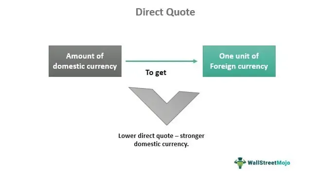

Foreign exchange trading is characterized by a variety of terms and concepts critical to understanding market dynamics, with direct and indirect quotes being among the most fundamental. These quote types significantly influence how exchange rates are determined and shape trading strategies in the forex market. Direct quotes represent the domestic currency as the base while expressing its value in terms of a foreign currency, simplifying transactions for traders within domestic markets. Conversely, indirect quotes invert this relationship, displaying the foreign currency as the base currency. Both types of quotes are pivotal in executing trades effectively, especially in regions where specific quote formats are prevalent due to tradition or market dominance.

In recent years, algorithmic trading has become a pivotal technology in the optimization of these trading processes. By using automated systems to execute trades based on pre-defined criteria, algorithmic trading ensures that buy and sell decisions are made with enhanced precision and speed. These systems handle vast volumes of data, swiftly processing both direct and indirect forex quotes to capitalize on market opportunities. While algorithmic trading aids in optimizing performance, it also provides the potential to adapt swiftly to market changes, offering traders a significant edge.



This article explores direct and indirect quotes in depth, examining their role in forex trading. Furthermore, it discusses how algorithmic trading integrates with these concepts to improve trading outcomes, offering a comprehensive overview of their importance in the current forex market landscape.

## Table of Contents

## Understanding Direct Quotes

A direct quote is a common method of expressing currency exchange rates. In this configuration, a currency pair is represented with the domestic currency as the base and a foreign currency as the relative asset. For example, in the United States, a direct quote might be presented as USD 1 = EUR 0.85, meaning that one U.S. dollar is equivalent to 0.85 euros. This type of quotation is prevalent in countries where the U.S. dollar plays a pivotal role.

The concept of direct quotes serves as a foundational aspect of forex trading, impacting both trading strategies and decision-making processes. In a direct quote, the price of the foreign currency is expressed in terms of the domestic currency, which can provide traders with insights into currency valuation. This type of quotation can influence strategic decisions, such as when to buy or sell a currency based on perceived trends in valuation fluctuation.

One of the key advantages of using direct quotes lies in its straightforwardness, especially for traders who are operating within the same country as the domestic currency, as it allows for easier comprehension of potential profit and loss. For instance, traders can more readily assess how shifts in the currency pair's quoted value will affect their trades and strategies.

A valuable application of direct quotes in trading involves speculation, where traders forecast changes in exchange rates. Based on the direct quote, traders may decide to buy or sell currencies to capitalize on anticipated movements. For example, if a trader believes the value of the euro will rise against the dollar (decreasing the direct quote value), they may choose to invest in euros to eventually make a profit when reconverting to dollars.

Understanding direct quotes also assists in hedging strategies, where businesses and investors protect themselves against unfavorable currency movements. With precise knowledge of direct quotes, they can structure forward contracts or options to lock in future exchange rates, thus minimizing potential exposure to currency risks.

Overall, mastery of direct quotes is essential for traders looking to make informed decisions in the [forex](/wiki/forex-system) market. The ability to interpret these rates accurately and apply them effectively to strategies can contribute to improved financial outcomes, allowing traders to maintain competitiveness in the dynamic landscape of foreign exchange trading.

## Delving into Indirect Quotes

Indirect quotes represent the exchange rate in the opposite fashion to direct quotes by expressing the amount of foreign currency required to purchase one unit of the domestic currency. This type of quotation provides a unique perspective by reversing the traditional view on currency representation that many traders are accustomed to with direct quotes. For example, if participating in the forex market in Canada, an indirect quote might manifest as CAD 1 = USD 0.80, thereby illustrating that for every Canadian dollar, 0.80 U.S. dollars are needed. This method has particular prevalence in regions and scenarios involving the euro and some Commonwealth currencies.

The use of indirect quotes provides distinct advantages in specific trading scenarios, in part due to the psychological and strategic shifts they facilitate. Primarily, these quotes can prove beneficial when traders are dealing with a currency that is not the prevalent market standard, offering a clearer vantage point from which to view currency values domestically. This can be quite useful in regions where a domestic currency isn't predominantly traded on the global stage, affording a more intuitive understanding of currency value from a local standpoint.

Furthermore, indirect quotes offer fertile ground for leveraging [arbitrage](/wiki/arbitrage) opportunities. By utilizing an indirect quote, traders can more readily identify disparities between various currency markets. This is especially beneficial in markets that involve multiple countries and currencies with differing demand and supply dynamics. Arbitrage can be executed by simultaneously buying and selling currency across these markets, capitalizing on the inconsistencies in price to yield profit without significant risk exposure. The ability to swiftly recognize and act on these opportunities can significantly enhance trading efficacy.

In forex trading, the choice between using direct or indirect quotes often depends on the trader's strategy, location, and the currency pairs involved. Indirect quotes are particularly beneficial when the foreign currency represents a larger economic force, or when trading within or between certain Commonwealth nations, where the quotation method may vary against the international norm. Hence, understanding when and how to use indirect quotes is essential for optimizing trading strategies and achieving competitive advantages in the forex market.

Through these strategic insights, indirect quotes demonstrate their unique utilities and advantages, urging traders to consider their application judiciously to harness potential profit avenues and achieve precise currency evaluations.

## Algorithmic Trading in Forex

Algorithmic trading, often termed algo trading, employs pre-programmed instructions to automate and optimize trading processes, aiming at executing trades with optimal timing and efficiency. This method leverages mathematical models and computational resources, allowing traders to handle foreign exchange (forex) trades, including direct and indirect quotes, with enhanced precision and speed. 

The integration of algorithms facilitates real-time analysis and swift adaptation to market movements. By automating the decision-making process, trading strategies can be executed without human intervention, significantly reducing the time lag in response to market fluctuations. For instance, algorithms can be programmed to react instantaneously to currency pair changes, thereby minimizing potential losses from volatile market movements.

Several tools and software platforms enable [algorithmic trading](/wiki/algorithmic-trading) in forex markets. Software like MetaTrader, NinjaTrader, and AlgoTrader provide interfaces for developing and deploying trading algorithms. These platforms often support [backtesting](/wiki/backtesting) features, where traders can evaluate their strategies against historical data before live execution. Access to robust API frameworks allows for real-time data streaming and connectivity with financial exchanges, significantly enhancing the effectiveness of algo trading in forex.

Below is an example of a simple Python script that signals a forex trade based on moving average crossovers, a common algorithmic trading strategy:

```python
import pandas as pd

def moving_average_strategy(data, short_window=40, long_window=100):
    signals = pd.DataFrame(index=data.index)
    signals['price'] = data['price']
    signals['short_mavg'] = data['price'].rolling(window=short_window, min_periods=1, center=False).mean()
    signals['long_mavg'] = data['price'].rolling(window=long_window, min_periods=1, center=False).mean()

    signals['signal'] = 0.0
    signals['signal'][short_window:] = np.where(signals['short_mavg'][short_window:] > signals['long_mavg'][short_window:], 1.0, 0.0)   
    signals['positions'] = signals['signal'].diff()

    return signals

# Example usage (data should be a DataFrame with a 'price' column)
# data = pd.DataFrame({'price': forex_prices}) # forex_prices is a list/array of historical prices
# result = moving_average_strategy(data)
```

The script computes short and long-term moving averages and generates buy or sell signals based on their crossover. Such strategies illustrate how algorithmic trading systems function in practical scenarios, automatically executing transactions when certain criteria are met, thus reducing manual intervention and the risk of human error.

In summary, algorithmic trading enhances forex trading efficiency by automating complex calculations and responding to market conditions swiftly. As technology progresses, the role of algo trading continues to expand, offering traders more sophisticated tools for real-time market engagement and improved trading outcomes.

## Impact and Benefits of Algo Trading with Forex Quotes

Integrating algorithmic trading with forex quotes offers significant advantages in enhancing both the accuracy and speed of transaction executions. Algorithmic trading, which involves the use of computer programs to automate trading activities, provides real-time data processing and incorporates advanced mathematical models to identify and act on market opportunities. This capability is especially beneficial in the forex market, where the rapid fluctuation of currency prices requires quick decision-making and execution.

One of the key benefits of algorithmic systems in forex trading is their ability to swiftly identify arbitrage opportunities. Arbitrage involves the simultaneous purchase and sale of an asset in different markets to profit from tiny price differences. In the context of forex, this could mean exploiting the discrepancies between direct and indirect quotes across various currency pairs and markets. Algorithms can be programmed to detect these opportunities by continuously monitoring the markets and analyzing multiple currency pair quotes instantly.

For instance, suppose a trader identifies a direct quote where USD 1 = EUR 0.85 and an indirect quote where EUR 1 = USD 1.20. An inconsistency in these quotes might indicate an arbitrage opportunity. By executing trades based on this discrepancy using algorithmic systems, traders can potentially lock in risk-free profits before the market adjusts.

Moreover, algorithmic trading proves cost-effective by minimizing human error and transaction costs. Automation reduces the need for manual intervention, which not only speeds up trading processes but also limits the possibility of errors during high-speed transactions. This efficiency is crucial, particularly during volatile market conditions where split-second decisions can drastically influence outcomes.

Risk management is another significant advantage provided by algorithmic strategies. Algorithms can be designed to follow pre-set risk parameters and implement strategies such as stop-loss and take-profit orders without human intervention. This feature helps traders mitigate potential losses and secure gains more consistently. Additionally, algorithmic systems can be backtested using historical data, allowing traders to refine their strategies based on past market performance before applying them in live markets.

In terms of financial outcomes, embracing algorithmic trading in conjunction with forex quotes can lead to enhanced profitability and competitive advantages in the market. By efficiently processing and analyzing large volumes of data, algorithms empower traders to make informed decisions and react promptly to market shifts. This ability to harness technological advancements is increasingly becoming a cornerstone for success in contemporary forex trading practices.

## Practical Considerations and Strategizing

Engaging in forex trading requires a comprehensive understanding of both direct and indirect quotes. Strategies often include hedging, speculation, and leveraged trading, each requiring a precise application of algorithmic trading capabilities.

**Hedging** involves reducing risk by taking an opposite position in the market to offset potential losses. By utilizing direct and indirect quotes effectively, traders can construct hedging strategies that mitigate adverse currency movements. For example, if a trader anticipates a potential decline in the value of a currency they hold, they might use a direct quote in a derivative instrument to hedge against the loss. Algorithmic trading plays a crucial role in automating these hedge trades, ensuring timely and efficient execution.

**Speculation** in forex markets entails predicting currency price movements to capitalize on fluctuations. Here, understanding the subtle differences between direct and indirect quotes is crucial; a trader needs to know the precise value of the trade. Algorithmic systems can analyze large data sets rapidly, identifying trends and executing trades that align with the trader’s speculative strategy. Algorithms are designed to recognize patterns and execute trades at the optimal moment, minimizing the time gap and maximizing potential profits.

**Leveraged trading** allows traders to control a larger position than what their capital permits. This strategy amplifies potential returns but also risks, making the understanding of exchange rate quotes even more significant. Properly leveraged trades require real-time data analysis, achievable through algorithmic trading platforms, which assess market conditions and adjust positions accordingly.

**Time sensitivity** is a crucial factor for successful forex trading strategies. The foreign exchange market is highly dynamic, with rates that can change in seconds. Algorithmic trading systems help manage these time-sensitive trades by executing orders faster than any manual method could achieve. This is particularly useful for trades relying on nuances specific to direct or indirect quotes, where timing can significantly impact the trade outcome.

**Market volatility** can be both an opportunity and a risk for forex traders. High volatility means greater price swings, presenting potential for profits but also for losses. Algorithms can be programmed to respond dynamically to these fluctuations, automatically adjusting trading strategies to benefit from volatile conditions while managing risk exposure.

**Currency conversion fees** affect the profitability of forex trading. These fees vary widely and can impact the net returns on trades; thus, they must be factored into any strategy involving different currency pairs. Algorithmic systems can optimize transaction configurations to minimize costs, effectively leveraging both direct and indirect quotes for cost-effective trading.

In sum, a sound trading strategy that incorporates algorithmic trading capabilities holds significant promise for forex traders. The ability to analyze, respond, and execute trades efficiently using algorithmic support in understanding direct and indirect quotes allows traders to handle market complexities and achieve improved outcomes.

## Conclusion

Understanding the distinction between direct and indirect quotes is pivotal for any forex trader. These quoting mechanisms fundamentally shape how traders view currency valuations and determine appropriate trading strategies. Direct quotes offer a straightforward way to assess the value of a foreign currency against the domestic currency, while indirect quotes reflect the amount of foreign currency required to purchase a unit of domestic currency. Mastery of these concepts is critical as they directly influence decision-making processes in the forex market.

When coupled with algorithmic trading, traders can enhance their market analysis and trading strategies effectively. Algorithmic trading systems automate the process of capturing, analyzing, and responding to forex quotes in real-time, thus allowing traders to act swiftly on emerging market trends. These systems are designed to interpret both direct and indirect quotes, efficiently navigating the complexities of forex trading and identifying lucrative opportunities with precision.

The future of forex trading relies heavily on leveraging technological advancements to stay competitive and achieve better financial outcomes. As technology continues to evolve, tools enabling rapid data processing and execution are becoming increasingly paramount. By integrating advanced algorithms with comprehensive forex quote analysis, traders can significantly improve their ability to execute informed decisions and manage risks.

This article has provided insights into how these elements interconnect and their significance in today’s trading environment. As the forex market becomes ever more dynamic, understanding the nuances of direct and indirect quotes along with employing algorithmic trading techniques will remain crucial for traders aiming to succeed and maintain an edge in the global marketplace. Embracing these concepts not only enhances trading proficiency but also positions traders to navigate future market challenges effectively.

## References & Further Reading

[1]: Adams, G. (2020). ["Algorithmic Trading and DMA: An introduction to direct access trading strategies."](https://www.semanticscholar.org/paper/Algorithmic-trading-%26-DMA-%3A-an-introduction-to-Johnson/aa5de1ab883d5e23b6651faa7c1807586d688e4b) 4Myeloma Press.

[2]: Shmidt, A. (2020). ["Algorithmic Trading in Forex: Create Your Own Forex Trading Robot."](https://traderblocks.com/) CreateSpace Independent Publishing Platform.

[3]: Lopez de Prado, M. (2018). ["Advances in Financial Machine Learning."](https://www.amazon.com/Advances-Financial-Machine-Learning-Marcos/dp/1119482089) Wiley.

[4]: Harris, L. (2003). ["Trading and Exchanges: Market Microstructure for Practitioners."](https://www.amazon.com/Trading-Exchanges-Market-Microstructure-Practitioners/dp/0195144708) Oxford University Press.

[5]: Aronson, D. R. (2007). ["Evidence-Based Technical Analysis: Applying the Scientific Method and Statistical Inference to Trading Signals."](https://onlinelibrary.wiley.com/doi/book/10.1002/9781118268315) Wiley.