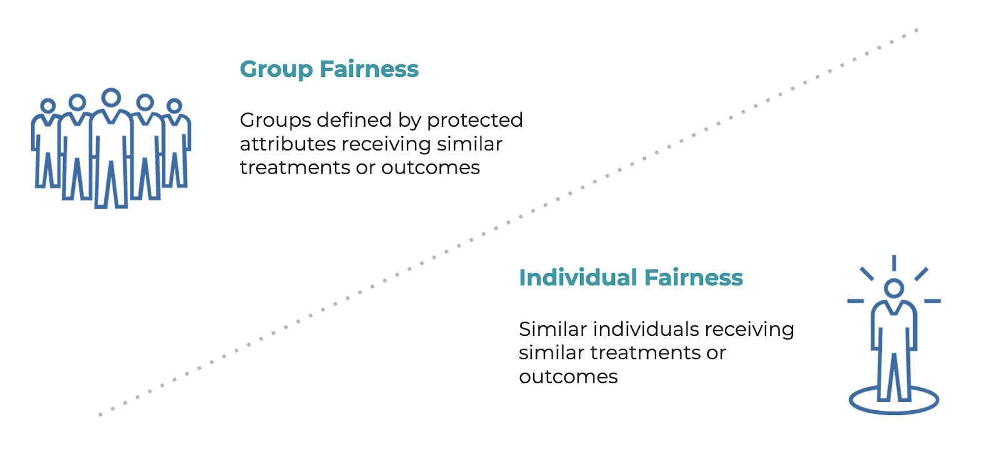

## Table of Contents

## What is individual fairness in the context of machine learning?

Individual fairness in machine learning means treating similar individuals similarly. It's about making sure that the decisions a machine learning model makes are fair for each person, based on their own characteristics. For example, if two people are very similar in all important ways, the model should treat them the same way, no matter their race, gender, or other personal details.

To measure individual fairness, we often use a concept called Lipschitz fairness. This idea says that if two people are close in terms of their features, the outcomes the model gives them should also be close. Mathematically, if we have a model $$f$$ and two individuals with feature vectors $$x_1$$ and $$x_2$$, the difference in their outcomes $$|f(x_1) - f(x_2)|$$ should be small if $$x_1$$ and $$x_2$$ are similar. This helps ensure that the model is fair to each individual by not making big differences in outcomes for people who are alike.

## How does individual fairness differ from group fairness?

Individual fairness and group fairness are two different ways to think about fairness in machine learning. Individual fairness focuses on treating each person fairly based on their own characteristics. It says that if two people are similar in important ways, the model should give them similar results. For example, if two people have the same job experience and education, they should get similar job recommendations from the model, no matter their race or gender. This idea is often measured using something called Lipschitz fairness, which means that if two people's features are close, their outcomes should also be close. Mathematically, if we have a model $$f$$ and two individuals with feature vectors $$x_1$$ and $$x_2$$, the difference in their outcomes $$|f(x_1) - f(x_2)|$$ should be small if $$x_1$$ and $$x_2$$ are similar.

Group fairness, on the other hand, looks at fairness across different groups of people. It tries to make sure that different groups, like different races or genders, are treated equally by the model. For example, group fairness might say that the model should give the same percentage of loan approvals to men and women, or to different racial groups. This approach focuses on balancing outcomes across groups, rather than looking at each person individually. Common measures of group fairness include demographic parity, which says that the proportion of positive outcomes should be the same across different groups, and equalized odds, which says that the true positive and false positive rates should be the same across groups.

Both individual and group fairness are important, but they can sometimes conflict. For example, trying to achieve perfect group fairness might lead to treating similar individuals differently, which goes against individual fairness. On the other hand, focusing only on individual fairness might not address broader societal inequalities that group fairness aims to correct. Balancing these two types of fairness is a key challenge in making machine learning models that are fair and just for everyone.

## Why is individual fairness important in machine learning applications?

Individual fairness is important in machine learning because it makes sure that each person is treated fairly based on their own characteristics. Imagine if two people with the same job experience and education applied for a job, but the machine learning model gave them different results just because of their race or gender. That wouldn't be fair, right? Individual fairness helps prevent this by saying that if two people are similar in important ways, they should get similar outcomes from the model. This idea is often measured using something called Lipschitz fairness. It means that if two people's features are close, their outcomes should also be close. Mathematically, if we have a model $$f$$ and two individuals with feature vectors $$x_1$$ and $$x_2$$, the difference in their outcomes $$|f(x_1) - f(x_2)|$$ should be small if $$x_1$$ and $$x_2$$ are similar.

This focus on individual fairness is crucial for building trust in machine learning systems. People are more likely to trust and use a system if they believe it treats them fairly. If a model is seen as unfair, people might stop using it or even challenge its decisions legally. For example, in areas like loan approvals, hiring, or healthcare, individual fairness can make a big difference in people's lives. Ensuring that each person is treated fairly based on their own merits helps create a more just and equitable society. By focusing on individual fairness, machine learning can help prevent discrimination and promote equality, which is essential for the ethical use of technology.

## What are some common metrics used to measure individual fairness?

Individual fairness in machine learning means treating similar people the same way. One common metric to measure this is called the Lipschitz condition. This idea says that if two people are close in terms of their features, the outcomes the model gives them should also be close. Mathematically, if we have a model $$f$$ and two individuals with feature vectors $$x_1$$ and $$x_2$$, the difference in their outcomes $$|f(x_1) - f(x_2)|$$ should be small if $$x_1$$ and $$x_2$$ are similar. This helps make sure the model is fair to each person by not making big differences in outcomes for people who are alike.

Another metric used to measure individual fairness is called the consistency metric. This metric checks how consistently the model treats similar individuals across different situations or datasets. For example, if two people have similar profiles, the model should give them similar results, even if the data comes from different sources. This helps ensure that the model's fairness isn't just a fluke but is consistent over time and across different conditions. Both the Lipschitz condition and the consistency metric help make sure that machine learning models treat each person fairly based on their own characteristics.

## Can you explain the concept of Lipschitz fairness and its relation to individual fairness?

Lipschitz fairness is a way to measure how fair a machine learning model is to each person. It says that if two people are similar, the model should treat them in a similar way. Imagine you and your friend both want to get a loan, and you both have the same job and income. Lipschitz fairness means the model should give you both a similar chance of getting the loan. Mathematically, if we have a model $$f$$ and two people with feature vectors $$x_1$$ and $$x_2$$, the difference in their outcomes $$|f(x_1) - f(x_2)|$$ should be small if $$x_1$$ and $$x_2$$ are similar. This helps make sure the model is fair by not treating similar people differently.

This idea of Lipschitz fairness is closely related to individual fairness. Individual fairness is all about treating each person fairly based on their own characteristics. It's the idea that if two people are similar in important ways, like their job experience or education, the model should give them similar results. Lipschitz fairness is one way to measure if a model is achieving this kind of individual fairness. By making sure the outcomes for similar people are close, Lipschitz fairness helps ensure that the model is being fair to each person, not just to groups of people.

## How can one implement individual fairness constraints in a machine learning model?

To implement individual fairness constraints in a machine learning model, you can use the Lipschitz condition. This means making sure that if two people are similar, the model treats them similarly. Imagine you and your friend both apply for a loan, and you both have the same job and income. The model should give you both a similar chance of getting the loan. To do this, you can add a term to your model's loss function that penalizes the model for treating similar people differently. Mathematically, if you have a model $$f$$ and two people with feature vectors $$x_1$$ and $$x_2$$, you want to keep the difference in their outcomes $$|f(x_1) - f(x_2)|$$ small if $$x_1$$ and $$x_2$$ are similar. This can be done by adding a regularization term to your loss function that tries to minimize this difference.

Another way to implement individual fairness is by using a technique called adversarial training. This method involves training another model, called a discriminator, to try to figure out if the main model is treating similar people differently. The main model then tries to fool the discriminator by making its predictions more fair. For example, if the main model is predicting loan approvals, the discriminator might try to guess the race or gender of the applicants based on the model's predictions. If the discriminator can do this, it means the main model is not fair. The main model is then updated to make it harder for the discriminator to guess these personal details, which helps make the model more individually fair. This back-and-forth training process helps ensure that the model treats similar people the same way.

## What are the challenges faced when trying to achieve individual fairness in practice?

One big challenge when trying to achieve individual fairness in machine learning is figuring out how to measure if two people are similar. Imagine you and your friend both want a loan, and you both have the same job and income. But what if you also consider things like your credit history or where you live? Deciding which features are important for fairness can be tricky. If you use too many features, the model might treat people unfairly by focusing on things that shouldn't matter. If you use too few, the model might miss important details and still be unfair. This is why the Lipschitz condition, which says that if two people's features $$x_1$$ and $$x_2$$ are close, their outcomes $$|f(x_1) - f(x_2)|$$ should also be close, is hard to use in real life. It's tough to know exactly which features to include and how to measure their importance.

Another challenge is balancing individual fairness with other goals, like accuracy or group fairness. Sometimes, making a model fair to each person can make it less accurate or less fair to groups of people. For example, if a model tries to be very fair to each person by treating similar people the same way, it might miss patterns that help predict things accurately. Also, focusing only on individual fairness might ignore bigger issues of inequality across different groups. This can be a problem because both individual and group fairness are important. Trying to achieve both at the same time can be really hard. It's like trying to juggle many balls at once – if you focus too much on one, you might drop the others.

## How does the choice of distance metric affect the enforcement of individual fairness?

The choice of distance metric is really important when trying to make sure a machine learning model is fair to each person. Imagine you and your friend both want a loan, and you both have the same job and income. If the model uses a distance metric that focuses on these things, it will treat you both the same way, which is fair. But if the model uses a different distance metric that also looks at things like your credit history or where you live, it might treat you differently, even if you're similar in important ways. The distance metric helps decide which features are important for fairness. If you choose the wrong one, the model might be unfair by focusing on things that shouldn't matter.

Choosing the right distance metric is tricky because it can affect how well the model follows the Lipschitz condition. The Lipschitz condition says that if two people's features $$x_1$$ and $$x_2$$ are close, their outcomes $$|f(x_1) - f(x_2)|$$ should also be close. If the distance metric doesn't match what's important for fairness, the model might not treat similar people the same way. For example, if the distance metric puts too much weight on less important features, the model might think two people are very different even if they're similar in the ways that matter. Getting the distance metric right is key to making sure the model is fair to each person.

## What are some real-world examples where individual fairness has been applied or considered?

In the world of hiring, companies are trying to make sure their computer systems are fair to each person. Imagine two people applying for a job, both with the same experience and education. A fair system should give them a similar chance of getting the job, no matter their race or gender. Some companies use a method called Lipschitz fairness to check this. It means if two people are similar in important ways, the system should treat them the same way. Mathematically, if we have a model $$f$$ and two people with feature vectors $$x_1$$ and $$x_2$$, the difference in their outcomes $$|f(x_1) - f(x_2)|$$ should be small if $$x_1$$ and $$x_2$$ are similar. This helps make sure the hiring system is fair to each person.

In the area of loan approvals, banks are also working on individual fairness. If two people have the same income and credit history, the bank's computer system should give them a similar chance of getting a loan. This is important because unfair decisions can affect people's lives a lot. Banks might use something called adversarial training to make their systems fairer. This means they train another model to check if the main model is treating similar people differently. If it is, the main model is adjusted to be fairer. This back-and-forth process helps make sure the bank's system treats each person fairly based on their own characteristics.

## How can individual fairness be balanced with other objectives like accuracy and efficiency?

Balancing individual fairness with other objectives like accuracy and efficiency can be tricky. Imagine you have a computer system that helps decide who gets a loan. You want it to be fair to each person, so if two people have the same income and credit history, they should get a similar chance of getting a loan. This is individual fairness. But you also want the system to be accurate, so it predicts well who will pay back the loan. Sometimes, making the system fair can make it less accurate because it might miss important patterns. You also want the system to work quickly and efficiently. Adding fairness checks can slow things down. So, you need to find a way to make the system fair, accurate, and fast all at the same time.

One way to balance these goals is to use a special part of the computer system called a loss function. This part helps the system learn and make decisions. You can add a term to the loss function that makes the system try to be fair to each person. Mathematically, if you have a model $$f$$ and two people with feature vectors $$x_1$$ and $$x_2$$, you want to keep the difference in their outcomes $$|f(x_1) - f(x_2)|$$ small if $$x_1$$ and $$x_2$$ are similar. This helps make the system fair. At the same time, you can keep other parts of the loss function that help the system be accurate and efficient. By carefully adjusting these parts, you can make the system work well in all these areas. It's like juggling many balls at once – if you focus too much on one, you might drop the others, but with practice, you can keep them all in the air.

## What are the latest research developments in individual fairness?

Recent research in individual fairness has focused on improving how we measure and enforce fairness in machine learning models. One key development is the use of new distance metrics that better capture the similarity between individuals. For example, researchers have proposed using more sophisticated metrics like the Wasserstein distance, which can account for differences in the distribution of features between people. This helps ensure that if two people are similar in important ways, the model treats them similarly, following the Lipschitz condition. Mathematically, if we have a model $$f$$ and two individuals with feature vectors $$x_1$$ and $$x_2$$, the difference in their outcomes $$|f(x_1) - f(x_2)|$$ should be small if $$x_1$$ and $$x_2$$ are similar. These new metrics aim to make individual fairness more accurate and applicable in real-world scenarios.

Another exciting area of research is the development of fairness-aware learning algorithms. These algorithms are designed to balance individual fairness with other important goals like accuracy and efficiency. For instance, some researchers are exploring the use of fairness constraints in the loss function of machine learning models. By adding a term to the loss function that penalizes the model for treating similar people differently, the model can be trained to be more fair. Additionally, techniques like adversarial training have been refined to better enforce individual fairness. In adversarial training, a second model, called a discriminator, tries to detect if the main model is being unfair, and the main model is then adjusted to be more fair. These advancements help ensure that machine learning models are not only accurate but also fair to each person.

## How do regulatory frameworks address individual fairness in machine learning?

Regulatory frameworks are starting to focus on making sure machine learning models treat each person fairly. Imagine you and your friend both apply for a loan, and you both have the same job and income. The law says the computer system should give you both a similar chance of getting the loan, no matter your race or gender. This idea is called individual fairness. In places like the European Union, laws like the General Data Protection Regulation (GDPR) talk about fairness in how personal data is used. They say that decisions made by computers should be fair and not harm people. This means companies have to check their models to make sure they're not treating similar people differently.

In the United States, laws like the Equal Credit Opportunity Act (ECOA) and the Fair Housing Act (FHA) also try to make sure that computer systems are fair. These laws say that when banks or landlords use computer models to make decisions, they should treat everyone the same way if they're similar in important ways. For example, if two people have the same credit history, they should get the same chance of getting a loan. To follow these laws, companies might use a method called Lipschitz fairness. This means if two people's features $$x_1$$ and $$x_2$$ are close, their outcomes $$|f(x_1) - f(x_2)|$$ should also be close. By checking their models this way, companies can make sure they're being fair to each person.