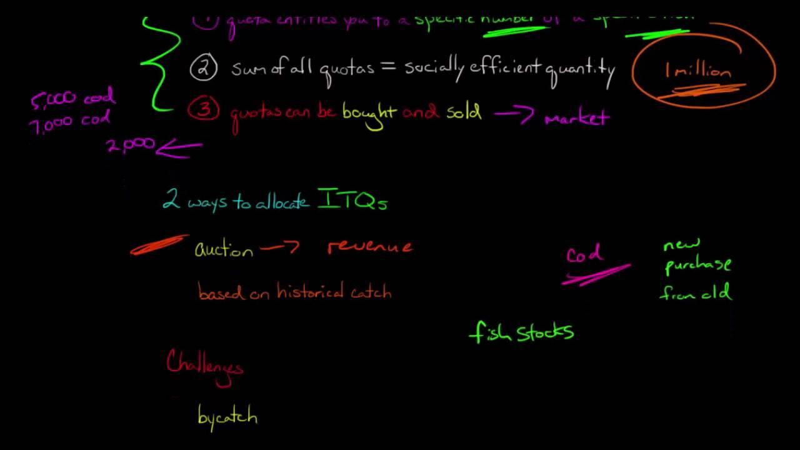

## Table of Contents

## What is an Individual Transfer Quota (ITQ)?

An Individual Transfer Quota (ITQ) is a system used in fisheries management to control the amount of fish that can be caught. It works by giving each fisherman a specific amount of fish they are allowed to catch, called a quota. These quotas can be bought, sold, or traded between fishermen, which helps to make sure that the total amount of fish caught does not harm the fish population.

ITQs help to stop overfishing by making sure that the total catch stays within sustainable limits. By allowing fishermen to trade their quotas, those who are more efficient can catch more fish, while those who are less efficient might choose to sell their quotas instead of fishing. This system can lead to better management of fish stocks and help to keep fishing a viable business for the future.

## How did the concept of ITQs originate?

The idea of Individual Transferable Quotas (ITQs) started in the 1970s. At that time, many fish populations were being overfished, and people were looking for ways to manage fishing better. New Zealand was one of the first countries to try ITQs. They wanted to make sure that fishing could continue without hurting fish populations too much. The basic idea was to give each fisherman a certain amount of fish they could catch, which could be traded with other fishermen.

Since then, many other countries have used ITQs to manage their fisheries. The system helps to keep fishing sustainable by setting limits on how many fish can be caught. It also lets fishermen who are good at fishing catch more, while others can sell their quotas if they want to. This has helped to make fishing more efficient and has been important in protecting fish populations around the world.

## What are the main objectives of implementing ITQs?

The main goal of using Individual Transferable Quotas (ITQs) is to stop overfishing and make sure that fish populations stay healthy. When each fisherman gets a specific amount of fish they can catch, it helps to keep the total catch within safe limits. This means that the fish population can grow and stay strong, which is important for the future of fishing.

Another big reason for using ITQs is to make fishing more efficient. Because fishermen can buy, sell, or trade their quotas, those who are good at fishing can catch more fish. Those who are not as good can sell their quotas and maybe do something else. This helps to make the whole fishing industry work better and can make it easier for fishermen to make a living.

## How are ITQs allocated to individuals or entities?

ITQs are given out by the government or a group that manages fishing. They decide how many fish can be caught in total without hurting the fish population. Then, they split this total amount into smaller parts and give each fisherman or fishing company a part of it. This part is called a quota. Sometimes, they give quotas based on how much a fisherman caught in the past. Other times, they might give them out through a special kind of auction where people can bid on them.

Once the quotas are given out, fishermen can buy, sell, or trade them with each other. This helps make sure that the quotas go to the people who can use them best. For example, a fisherman who is good at catching fish might buy more quotas from someone who is not as good. This way, the total amount of fish caught stays the same, but the fishing industry can work better. It also helps keep fishing a good job for the future.

## What is the process for transferring ITQs?

Transferring ITQs is pretty straightforward. When a fisherman wants to sell or trade their quota, they find someone who wants to buy it. They agree on a price, and then they fill out some paperwork to make the transfer official. This paperwork goes to the group that manages the fishing, and they make sure everything is done right. Once the transfer is approved, the new owner can start using the quota to catch fish.

The whole process is set up to be fair and clear. The group that manages the fishing keeps track of all the transfers to make sure no one catches more fish than they are supposed to. This helps keep the fish population safe. By letting fishermen trade their quotas, the system makes sure that the people who are good at fishing can catch more, while others can sell their quotas if they want to do something else.

## What are the economic benefits of ITQs for fisheries?

ITQs help make fishing more efficient and profitable. When fishermen can buy, sell, or trade their quotas, the ones who are good at fishing can catch more fish. This means they can make more money. The fishermen who are not as good can sell their quotas and do something else that might be better for them. This makes the whole fishing industry work better because the quotas go to the people who can use them the best.

ITQs also help keep the fish population healthy, which is good for the economy in the long run. When fish populations are strong, fishermen can keep catching fish year after year. This means they have a steady job and can plan for the future. It also means that the fishing industry can keep going without running out of fish. This is important because fishing supports many jobs and helps the economy in places where fishing is a big part of life.

## How do ITQs impact the sustainability of fish stocks?

ITQs help keep fish stocks healthy by setting limits on how many fish can be caught. When each fisherman gets a quota, it makes sure that the total amount of fish caught does not hurt the fish population. This means that fish can grow and have babies, so there will be more fish in the future. By keeping the total catch within safe limits, ITQs stop overfishing and help make sure that there are always enough fish in the sea.

Another way ITQs help with sustainability is by letting fishermen trade their quotas. This means that the fishermen who are good at catching fish can buy more quotas and catch more fish. The ones who are not as good can sell their quotas and do something else. This makes the fishing industry more efficient and helps keep it going strong. When the fishing industry is healthy, it can keep fishing without hurting the fish population, which is good for everyone in the long run.

## What are the potential social and economic drawbacks of ITQs?

ITQs can sometimes make it hard for small fishermen to keep fishing. When quotas can be bought and sold, big fishing companies often buy them up. This can leave small fishermen with fewer quotas or none at all. They might have to stop fishing or sell their boats. This can hurt small fishing communities because fishing is a big part of their life and economy. It can also mean that fewer people can start fishing because it's hard to get a quota without a lot of money.

Another problem with ITQs is that they can make it harder for new people to get into fishing. Since quotas can be very expensive, young people or new fishermen might not be able to buy them. This can make the fishing industry less diverse and more controlled by a few big companies. It can also mean that the benefits of fishing, like jobs and money, go to fewer people. This can be bad for the economy of fishing towns because it means less money is spread around the community.

## How do regulatory bodies monitor and enforce ITQ systems?

Regulatory bodies keep an eye on ITQ systems by tracking who has what quotas and how much fish they catch. They use paperwork and computer systems to make sure that everyone follows the rules. When a fisherman catches fish, they have to report it to the regulatory body. This helps the regulators know if someone is catching more fish than their quota allows. If someone breaks the rules, the regulatory body can take away their quota or give them a fine.

Enforcing ITQ systems also involves checking boats and fishing gear. Sometimes, regulators go out on the water to make sure fishermen are not cheating. They might check the size of the nets or the number of fish on the boat. This helps stop people from catching more fish than they are supposed to. By keeping a close watch on everything, regulatory bodies can make sure that the ITQ system works well and that fish populations stay healthy.

## What role do ITQs play in international fisheries management?

ITQs help manage fishing across different countries by setting rules that everyone has to follow. When countries agree to use ITQs, they work together to decide how many fish can be caught in shared waters. This helps stop overfishing and keeps fish populations healthy. By giving each country or fishing group a quota, ITQs make sure that the total catch stays within safe limits. This is important because many fish swim across borders, so countries need to work together to protect them.

Sometimes, countries set up special groups to manage ITQs in international waters. These groups keep track of how many fish are caught and make sure everyone follows the rules. They can also help solve problems if countries disagree about how to share the fish. By using ITQs, countries can work together to make fishing sustainable and fair. This helps keep the fishing industry strong and makes sure there will be fish for people to catch in the future.

## How have ITQs evolved in response to technological and environmental changes?

ITQs have changed a lot over time because of new technology and changes in the environment. When ITQs first started, people used paper to keep track of quotas and catches. Now, with computers and the internet, it's easier to keep track of everything. Fishermen can report their catches online, and regulators can use special software to make sure everyone follows the rules. This helps make the ITQ system work better and stop cheating. Also, new technology like satellite tracking helps regulators watch where boats are fishing, so they can make sure no one is catching fish in places they shouldn't.

Changes in the environment have also made ITQs evolve. As the climate changes, fish move to different areas or change how many babies they have. ITQ systems have to change to keep up with these shifts. For example, if a fish population gets smaller because of warmer water, regulators might lower the total quota to protect the fish. They might also change where people can fish to match where the fish are now living. By being flexible, ITQs can help make sure fishing stays sustainable even when the environment changes.

## What are the future trends and potential reforms in ITQ systems?

In the future, ITQ systems might change to use even more technology. Right now, computers and the internet help keep track of quotas and catches. In the future, things like drones or special sensors might be used to watch fishing boats and make sure they follow the rules. This could make it easier to stop cheating and help keep fish populations safe. Also, new computer programs might be used to predict how many fish will be around in the future. This can help set the right quotas and make sure fishing stays sustainable.

There could also be changes to make ITQs fairer for everyone. Right now, big fishing companies can buy up a lot of quotas, which can be hard on small fishermen. In the future, rules might be made to stop this from happening. For example, there could be limits on how many quotas one person or company can own. This would help small fishermen keep fishing and keep fishing communities strong. Also, there might be ways to help new fishermen get into the business, like special programs or lower prices for quotas. This would make the fishing industry more diverse and help spread the benefits around more.

Environmental changes will also keep shaping ITQ systems. As the climate changes, fish might move to new places or have fewer babies. ITQ systems will need to change to match these shifts. This might mean setting different quotas for different areas or changing the rules about where people can fish. By being flexible, ITQs can help make sure fishing stays sustainable even as the world changes.

## References & Further Reading

[1]: Arnason, R. (2005). ["Property Rights in Fisheries: Iceland’s Experience with ITQs."](https://link.springer.com/article/10.1007/s11160-005-5139-6) Reviews in Fish Biology and Fisheries, 15(3), 243-264.

[2]: Eythórsson, E. (2000). ["A Decade of ITQ-management in Icelandic Fisheries: Consolidation without Consensus."](https://www.sciencedirect.com/science/article/pii/S0308597X0000021X) Marine Policy, 24(6), 483-492.

[3]: Annala, J. H. (1996). ["New Zealand's ITQ System: Have Quota Reforms Been Effective?"](https://link.springer.com/article/10.1007/BF00058519) Marine Policy, 20(5), 409-421.

[4]: Olson, J. (2011). ["Understanding and Contextualizing Social Impacts from the Privatization of Fisheries: An Overview."](https://www.sciencedirect.com/science/article/pii/S0964569111000263) Ocean & Coastal Management, 54(5), 353-363.

[5]: Grafton, R. Q., & McIlgorm, A. (2009). ["Ex ante evaluation of the costs and benefits of individual transferable quotas: A case‐study on the Australian Northern Prawn Fishery."](https://onlinelibrary.wiley.com/doi/abs/10.1111/j.1365-2419.2009.02553.x) Fisheries Economics, 14(5), 343-354.