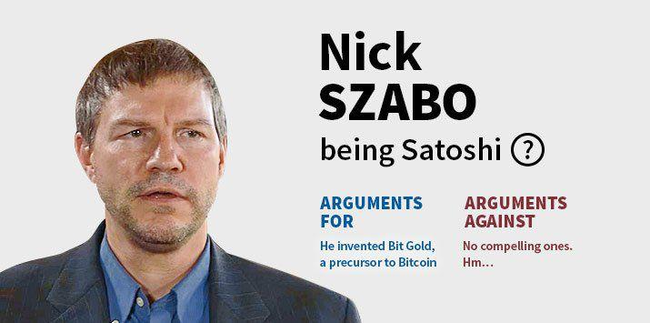

## Table of Contents

## Who is Satoshi Nakamoto?

Satoshi Nakamoto is the name used by the person or group of people who created Bitcoin, the first and most well-known cryptocurrency. Bitcoin was introduced to the world in 2009, and it changed how people think about money and transactions. Satoshi's true identity is still a mystery. Many people have tried to find out who Satoshi is, but no one knows for sure.

Satoshi wrote a paper called the Bitcoin whitepaper, which explained how Bitcoin works. This paper is very important because it started the whole cryptocurrency movement. After helping to start Bitcoin, Satoshi stopped being involved in 2010. Since then, other people have taken over the development of Bitcoin. Even though we don't know who Satoshi is, their work has had a big impact on the world of money and technology.

## Why is the identity of Satoshi Nakamoto important?

The identity of Satoshi Nakamoto is important because it could help us understand more about why Bitcoin was created and how it works. If we knew who Satoshi is, we might learn about their reasons for making Bitcoin and what they hoped it would do for the world. This could give us new ideas about how to use and improve cryptocurrencies.

Also, knowing who Satoshi is could affect how people trust Bitcoin. Some people might feel more confident in Bitcoin if they knew it was created by someone they trust. On the other hand, if Satoshi's identity was revealed and people didn't like or trust them, it could make some people less interested in Bitcoin. So, Satoshi's identity could change how people see and use Bitcoin.

## What are the main theories about Satoshi Nakamoto's identity?

One popular theory is that Satoshi Nakamoto is actually a group of people, not just one person. Some people think that maybe a team of computer experts and economists worked together to create Bitcoin. They believe that it would be hard for one person to have all the skills needed to make something as complex as Bitcoin. Some names that come up a lot in this theory are people who worked at big companies like Google or were part of secret projects.

Another theory is that Satoshi Nakamoto is a single person, and many names have been suggested. One of the most talked-about names is Craig Wright, an Australian computer scientist who has claimed to be Satoshi. However, many people don't believe him because he hasn't been able to prove it in a way that everyone agrees with. Another name that comes up is Nick Szabo, a computer scientist who worked on early ideas that are similar to Bitcoin. But he has said that he is not Satoshi.

There's also a theory that Satoshi Nakamoto might be someone we don't know about yet. Some people think that Satoshi could be someone who has stayed completely hidden and hasn't been part of any public guesses or claims. This idea keeps the mystery alive and makes people think that maybe we'll never know who Satoshi really is.

## Who is Craig Wright and why has he been linked to Satoshi Nakamoto?

Craig Wright is an Australian computer scientist who has said that he is Satoshi Nakamoto, the person who created Bitcoin. He first claimed this in 2016, and it caused a lot of talk and interest in the news. Wright has tried to prove that he is Satoshi by showing some secret codes and messages that only Satoshi would know. However, many people in the Bitcoin community and experts don't believe him because they think his proof is not strong enough.

People have linked Craig Wright to Satoshi Nakamoto because of some clues that seemed to point to him. For example, some old messages and documents that were thought to be from Satoshi had things in them that were similar to things Wright had written or done. Also, Wright has worked on projects that are similar to Bitcoin, which made some people think he might be the real Satoshi. But because he hasn't been able to prove it in a way that everyone agrees with, many people still don't believe he is Satoshi.

## What evidence has been presented to support Craig Wright's claim?

Craig Wright has shown some things that he says prove he is Satoshi Nakamoto. He shared secret codes and messages that only Satoshi would know. These codes are called cryptographic keys, and they are very important for proving who owns Bitcoin. Wright also showed some old emails and documents that seemed to be from Satoshi. These documents had things in them that were similar to things Wright had written or done before.

However, many people in the Bitcoin community and experts don't believe Wright's proof is strong enough. They say that the codes and messages he showed were not enough to prove he is Satoshi. Some people think that the documents he shared might have been changed or faked. Also, Wright has not been able to do everything that Satoshi could do, like moving old Bitcoins that only Satoshi could move. Because of this, many people still think that Craig Wright is not the real Satoshi Nakamoto.

## Who is Dorian Nakamoto and how was he connected to the Satoshi Nakamoto speculation?

Dorian Nakamoto is an American man who got a lot of attention in 2014 because a news reporter from Newsweek said he might be Satoshi Nakamoto, the person who created Bitcoin. The reporter, Leah McGrath Goodman, wrote a story saying that she found clues that led her to Dorian. She said that Dorian's name, background, and some things he said made her think he could be Satoshi. This made a big splash in the news, and many people started talking about it.

But soon after the story came out, Dorian Nakamoto said he was not Satoshi. He told everyone that he had nothing to do with Bitcoin and didn't know anything about it. At the same time, a message appeared on a Bitcoin forum from someone using the name Satoshi Nakamoto. The message said that the real Satoshi had stopped being involved with Bitcoin years ago and that Dorian was not the person they were looking for. This helped clear up the confusion, but it also showed how much people wanted to find out who Satoshi really is.

## What role did Nick Szabo play in the development of Bitcoin, and why is he considered a possible candidate?

Nick Szabo is a computer scientist who worked on ideas that are similar to Bitcoin before it was created. He made something called "Bit Gold" in the late 1990s, which was a way to make digital money that is safe and hard to fake. Bit Gold had some ideas that are a lot like Bitcoin, like using math problems to make new money and keeping records of who owns what. Because of this, some people think that Nick Szabo might have been involved in making Bitcoin.

Nick Szabo is considered a possible candidate for Satoshi Nakamoto because of the similarities between Bit Gold and Bitcoin. Also, some people have looked at old writings and messages from Satoshi and found that the way he wrote is similar to the way Nick Szabo writes. However, Nick Szabo has said many times that he is not Satoshi Nakamoto. Even though he has denied it, the similarities between his work and Bitcoin keep people talking about him as a possible candidate.

## How has Hal Finney been associated with Satoshi Nakamoto?

Hal Finney was a computer programmer who was one of the first people to use Bitcoin. He got the first Bitcoin transaction from Satoshi Nakamoto, which made people think he might have been involved in making Bitcoin. Hal also helped with the early development of Bitcoin by fixing problems and making it better. Because of this, some people think that Hal Finney might have been Satoshi Nakamoto or worked closely with him.

However, Hal Finney always said that he was not Satoshi Nakamoto. He told everyone that he just helped with Bitcoin after it was already made. Sadly, Hal got sick with a disease called ALS and passed away in 2014. Even though he said he was not Satoshi, some people still think about him when they talk about who might have made Bitcoin because of how much he helped in the beginning.

## What is the significance of the P2P Foundation and its connection to Satoshi Nakamoto?

The P2P Foundation is a group that talks about and works on ideas for sharing things and working together without a boss. It's a place where people can share their thoughts and projects about making things more open and fair. Satoshi Nakamoto used the P2P Foundation's website to share the first version of the Bitcoin software in 2009. This was important because it helped people learn about Bitcoin and start using it.

Because Satoshi used the P2P Foundation to share Bitcoin, some people think that Satoshi might have been part of the group or at least liked what they were doing. The P2P Foundation's ideas about sharing and working together without a boss are a lot like what Bitcoin is about. So, the connection between the P2P Foundation and Satoshi Nakamoto shows how Bitcoin fits into bigger ideas about making things more open and fair for everyone.

## How have linguistic analysis and writing styles been used to identify potential candidates for Satoshi Nakamoto?

Linguistic analysis and writing styles have been used to try to find out who Satoshi Nakamoto might be. People have looked at the words and the way Satoshi wrote in emails and messages. They compared these to how other people write. For example, some people thought that the way Satoshi wrote was a lot like how Nick Szabo writes. They looked at things like the words they used, how long their sentences were, and even the kind of grammar they used. By doing this, they hoped to find clues that could point to who Satoshi might be.

However, this kind of analysis is not perfect. It can give us some ideas, but it's hard to be sure. People can change how they write, and many people might write in a similar way. So, while linguistic analysis can help narrow down who Satoshi might be, it's just one part of the puzzle. It's not enough by itself to say for sure who created Bitcoin.

## What are the cryptographic and technical clues that have been analyzed in the search for Satoshi Nakamoto?

Cryptographic and technical clues have been important in trying to find out who Satoshi Nakamoto is. One big clue is the way Satoshi used special codes, called cryptographic keys, to send and receive the first Bitcoins. These keys are like secret passwords that only the person who made them knows. Some people have tried to match these keys to other people's work to see if they can find a match. Also, the way the Bitcoin software was made has been looked at closely. People have checked the code for things that might show who wrote it, like special ways of doing things or comments in the code that could give clues about the person's background.

Another important clue is the timing of when Bitcoin was made. Some people have looked at when certain parts of the Bitcoin software were added and tried to match that to what other people were doing at the same time. For example, if someone was working on a similar project around the same time Bitcoin was made, that could be a clue. But, these clues are hard to be sure about. The world of computer code and secret passwords is very big, and many people might do things that look similar. So, while these clues can help, they don't give a clear answer about who Satoshi Nakamoto really is.

## How have legal and financial investigations contributed to the theories about Satoshi Nakamoto's identity?

Legal and financial investigations have played a big part in trying to find out who Satoshi Nakamoto is. Some people have looked at old court cases and money records to see if they can find clues. For example, when Craig Wright said he was Satoshi, some lawyers and police checked his story. They looked at his money and what he did to see if it matched what Satoshi might have done. But, these checks did not find strong proof that Craig Wright is Satoshi. They also looked at other people who might be Satoshi, like Nick Szabo, but did not find anything clear.

These investigations are important because they can help find real clues about Satoshi. But, they also show how hard it is to be sure about who Satoshi is. Money records and court cases can give some ideas, but they don't always tell the whole story. Sometimes, the information is not clear or it can be changed. So, while legal and financial investigations help, they are just one part of trying to solve the mystery of who Satoshi Nakamoto really is.

## References & Further Reading

[1]: Nakamoto, S. (2008). ["Bitcoin: A Peer-to-Peer Electronic Cash System."](https://nakamotoinstitute.org/library/bitcoin/)

[2]: Popper, N. (2015). ["Digital Gold: Bitcoin and the Inside Story of the Misfits and Millionaires Trying to Reinvent Money."](https://www.amazon.com/Digital-Gold-Bitcoin-Millionaires-Reinvent/dp/006236250X)

[3]: Narayanan, A., Bonneau, J., Felten, E., Miller, A., & Goldfeder, S. (2016). ["Bitcoin and Cryptocurrency Technologies: A Comprehensive Introduction."](https://press.princeton.edu/books/hardcover/9780691171692/bitcoin-and-cryptocurrency-technologies)

[4]: Antonopoulos, A. M. (2017). ["Mastering Bitcoin: Unlocking Digital Cryptocurrencies."](https://books.google.com/books/about/Mastering_Bitcoin.html?id=IXmrBQAAQBAJ)

[5]: Dwyer, G. P. (2015). ["The Economics of Bitcoin and Similar Private Digital Currencies."](https://www.sciencedirect.com/science/article/pii/S1572308914001259) Journal of Financial Stability, 17, 81-91. 

[6]: Dwyer, G. P. (2014). ["Digital Currency: Bitcoin and Its Past and Future."](https://papers.ssrn.com/sol3/papers.cfm?abstract_id=2434628) Journal of Computing in Higher Education, 26(3), 247-262. 

[7]: Narang, R. (2009). ["Inside the Black Box: The Simple Truth About Quantitative Trading."](https://www.amazon.com/Inside-Black-Box-Quantitative-Trading/dp/0470432063)

[8]: Troncoso, C., & Danezis, G. (2017). ["Chapter on Anonymous Communication"](https://carmelatroncoso.com/papers/Troncoso-PETS17.pdf) in "Secure Communication and Algorithms".