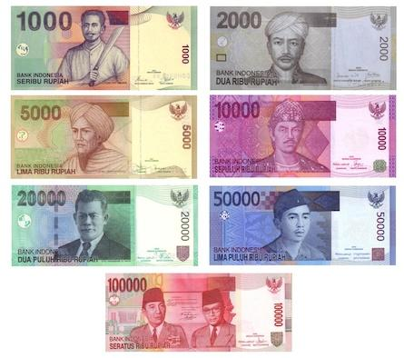

The Indonesian Rupiah (IDR) is not just a currency but a cornerstone of Southeast Asia's economic fabric. As Indonesia's official currency, the IDR has been pivotal in shaping the country's economic policies and interactions with global markets. Recognizing the significance of the IDR requires appreciating its historical journey, its fluctuations over decades, and the emerging role of algorithmic trading in its valuation and trading dynamics.

Historically, the Indonesian Rupiah was introduced in 1946, amid the country's struggle for independence from Dutch colonial rule. It was initially one among several currencies in circulation. By 1950, a unified economic framework saw the IDR become the sole official currency. The evolution of the IDR was marked by various macroeconomic shifts and significant events, such as the Asian Financial Crisis of the late 1990s, which drastically influenced its valuation and trading behavior.



Understanding the IDR's fluctuations involves analyzing the economic policies that have impacted its stability over time. From high inflation rates in the 1960s to stabilization efforts in subsequent decades, the IDR's exchange rate policies have undergone numerous revisions. Notably, the transition to a floating exchange rate system in the late 1990s opened new avenues for market-driven financial strategies.

In recent times, the landscape of trading has been radically transformed by algorithmic trading. Here, algorithms execute trades based on pre-programmed rules, optimizing them according to market conditions. The historical volatility and ongoing economic trends related to the IDR present unique opportunities and challenges for algorithmic traders. Advanced models, powered by artificial intelligence, are increasingly being deployed to make sense of this data-rich environment, identifying profitable trading opportunities or mitigating risks.

This article seeks to explore these foundational aspects of the IDR, providing insights into how its history and modern-day technologies like algorithmic trading intersect. By delving into these dynamics, one gains a deeper appreciation of the complexities surrounding the IDR and the strategic considerations involved in trading it today.

## Table of Contents

## Historical Background of the Indonesian Rupiah

The Indonesian Rupiah (IDR) was introduced in 1946 during a turbulent period as Indonesia sought independence from colonial rule. At that time, the region was characterized by economic and political instability, which saw the circulation of multiple currencies, including the Dutch East Indies guilder and the Japanese yen, remnants of World War II occupation. The introduction of the Rupiah symbolized a step towards national sovereignty, even as it faced challenges in becoming the single official currency.

By 1950, the Rupiah was firmly established as Indonesia's official currency, marking a decisive transition for the young nation. This period was crucial for Indonesia in consolidating its economic systems and instituting policies that would define its monetary framework. Nevertheless, the Rupiah's journey was complex and fraught with obstacles, particularly in adapting to the rapidly changing economic scenarios of the 20th century.

One of the most significant historical events affecting the Rupiah was the Asian Financial Crisis of 1997-1998. This crisis severely impacted numerous economies across Asia, leading to drastic devaluations and substantial fiscal challenges. The Indonesian Rupiah was hit hard; its value dropped precipitously, resulting in widespread economic instability in the country. Efforts to stabilize the currency included interventions by the International Monetary Fund and the restructuring of the national economy, which further underscored the Rupiah's [volatility](/wiki/volatility-trading-strategies) during major regional financial disruptions.

Over the decades, the Rupiah's valuation has been subject to various influences, ranging from internal economic policies to external financial pressures. The currency's historical trajectory provides insights into Indonesia's economic resilience and adaptive strategies in the face of global market dynamics. Understanding these elements is essential for grasping the Rupiah's current position in the global economy.

## Evolution of the Rupiah Post-Independence

The Indonesian Rupiah (IDR) faced significant challenges in maintaining stability during the years following Indonesia's independence, particularly throughout the 1960s. The nation grappled with soaring inflation rates, a common issue among post-colonial economies seeking to establish a stable financial system. The inflation challenges were largely attributed to the political and economic uncertainty during and after the transition from colonial rule. This uncertain climate resulted in erratic fiscal policies and unmonitored increases in money supply, severely impacting the Rupiah's value in comparison to other global currencies.

In response to these challenges, the Indonesian government implemented several stabilization efforts throughout the 1970s. During this period, the government undertook fiscal reform measures, seeking to address the underlying causes of inflation and stabilize the currency. Key among these efforts were controlled spending, improved tax collection, and the introduction of more effective monetary policies. Moreover, the government enacted various exchange rate adjustments aimed at correcting imbalances and enhancing the competitiveness of Indonesian exports. These included the devaluation of the Rupiah, as a means to rectify trade deficits and incentivize foreign investment.

The late 1990s marked a pivotal era for the IDR when Indonesia transitioned to a floating exchange rate system. Prior to this transition, the Rupiah was pegged to the U.S. dollar, a common practice among emerging economies for maintaining relative currency stability. However, the Asian Financial Crisis of 1997-1998 severely impacted the Indonesian economy, compelling the shift from a fixed to a floating exchange rate system. This transition was aimed at allowing market forces to determine the Rupiah's value, providing a more flexible response mechanism to external financial shocks and reducing the pressures on the nation's foreign exchange reserves. By adopting a floating exchange rate, the Indonesian government sought to ensure a more resilient and adaptable financial system, setting the stage for a more market-driven approach to currency valuation and monetary policy planning.

## Algorithmic Trading and Its Impact on IDR

Algorithmic trading has become an essential component of modern financial markets, including the trading of the Indonesian Rupiah (IDR). It involves the use of computer algorithms to automatically execute trades based on predefined criteria, such as timing, price, and [volume](/wiki/volume-trading-strategy). The utilization of [algorithmic trading](/wiki/algorithmic-trading) allows for the execution of orders at speeds and frequencies that are impossible for a human trader to match. This technology leverages a combination of quantitative models, [artificial intelligence](/wiki/ai-artificial-intelligence), and big data analytics to make informed decisions and optimize trading strategies.

The Indonesian Rupiah, characterized by its historical volatility and unique economic factors, presents several opportunities and challenges for algorithmic traders. The volatility of the IDR can be attributed to various factors, including political events, economic policies, and external economic shocks. As a result, algorithmic trading systems are designed to analyze these patterns and execute trades that capitalize on short-term price fluctuations, while managing the risks associated with such volatility.

Advanced algorithmic models often employ techniques from the fields of [machine learning](/wiki/machine-learning) and artificial intelligence to enhance decision-making processes. By utilizing data-driven approaches, these models can identify emerging trends and forecast future price movements with higher accuracy. For instance, machine learning algorithms such as supervised learning models can be trained on historical IDR data to predict future exchange rate movements. These predictions can then inform trading strategies to optimize returns.

Moreover, the application of AI in algorithmic trading extends to the development of adaptive systems that learn from ongoing market conditions. Neural networks and [deep learning](/wiki/deep-learning) models enable these systems to detect complex patterns and make autonomous decisions in real-time. Python has become a popular programming language for developing such models due to its extensive libraries and frameworks, such as Scikit-learn and TensorFlow, which facilitate the implementation of machine learning techniques.

Apart from predictive modeling, algorithmic trading can optimize trade execution through the use of smart order routing and execution algorithms. These algorithms are designed to find the most efficient way to execute trades by splitting large orders into smaller chunks and executing them across various trading venues, thereby minimizing market impact and reducing transaction costs.

Algorithmic trading strategies for the IDR also involve the integration of risk management protocols to safeguard against market anomalies and mitigate potential losses. This includes setting stop-loss orders, volatility forecasts, and scenario analyses to ensure that trading systems remain robust under different market conditions.

Overall, the intersection of algorithmic trading and the dynamic characteristics of the Indonesian Rupiah provides fertile ground for strategic innovation. By harnessing advanced technologies and leveraging mathematical models, traders can effectively navigate the complexities of currency markets and exploit the unique opportunities presented by the IDR. As the field continues to evolve, ongoing research and development in algorithmic methodologies hold the promise of further enhancing the efficiency and success of IDR trading strategies.

## Current Trends and Challenges in IDR Trading

Global economic dynamics and domestic policies play a substantial role in shaping the exchange rates of the Indonesian Rupiah (IDR). The currency's responsiveness to various economic stimuli necessitates robust trading strategies. Algorithmic trading strategies have emerged as critical tools in managing currency risks and seizing trading opportunities in such a dynamic environment.

Algorithmic trading utilizes computer programs to place trades by executing pre-defined instructions. For IDR, these instructions are often formulated based on historical data, statistical models, and real-time market analysis. The volatility inherent in foreign exchange markets can be leveraged by these sophisticated algorithms to optimize trade execution, mitigate risks, and maximize profit margins.

For instance, trading algorithms might employ techniques such as moving averages, mean reversion, and [momentum](/wiki/momentum)-based strategies. Python, widely used for programming such algorithms, offers numerous libraries like NumPy and Pandas for data manipulation, and packages like TA-Lib or PyAlgoTrade for implementing complex trading strategies. Here’s an example of using a simple moving average strategy in Python:

```python
import pandas as pd

# Assuming 'data' is a DataFrame with a DateTime index and 'Close' price column for IDR
data['SMA_20'] = data['Close'].rolling(window=20).mean()
data['SMA_50'] = data['Close'].rolling(window=50).mean()

# Signal generation: Buy when SMA_20 crosses above SMA_50, Sell when it crosses below
data['Signal'] = 0
data['Signal'][20:] = np.where(data['SMA_20'][20:] > data['SMA_50'][20:], 1, -1)
```

The evolution of algorithmic strategies has allowed traders to keep pace with fluctuating economic conditions. Advanced models integrate artificial intelligence, enabling the system to adapt to new data patterns and enhancing predictive accuracy.

Staying informed about political and economic developments is essential for informed decision-making in IDR trading. Indonesia's monetary policy, government stability, and international trade relationships are crucial influencers of IDR's valuation. Changes in these areas can lead to shifts in market sentiment, requiring traders to adjust their algorithmic strategies accordingly.

Moreover, global factors such as geopolitical tensions, [interest rate](/wiki/interest-rate-trading-strategies) changes by major economies, and global economic trends can impact IDR. These aspects make it imperative for traders to remain attuned to both local and international economic landscapes. Tools like economic calendars, financial news services, and real-time data feeds are indispensable in providing the requisite information for successful IDR trading strategies.

In summary, navigating the current trends and challenges in IDR trading requires a combination of algorithmic strategies, an understanding of macroeconomic and geopolitical factors, and an ability to respond rapidly to market changes. These elements together form the foundation of effective trading approaches in the evolving financial markets.

## Conclusion

The Indonesian Rupiah (IDR) has demonstrated resilience and adaptability from its inception during Indonesia's fight for independence to its current role in modern global markets. This journey highlights both the challenges and triumphs faced by the currency as it navigated significant economic events and structural reforms. Understanding the historical context of the IDR, characterized by high inflation in the 1960s and the transition to a floating exchange rate in the late 1990s, provides essential insights into its current dynamics.

In the modern era, the integration of trading technologies such as algorithmic trading offers traders powerful tools to analyze and exploit market fluctuations. The implementation of pre-programmed algorithms allows for swift, data-driven decision-making, capitalizing on the volatility that characterizes the IDR. These modern techniques, coupled with an understanding of historical patterns, empower traders to optimize their strategies concerning the IDR.

However, the landscape is continually evolving. Traders must remain vigilant, considering macroeconomic indicators that influence currency movements. Factors such as global economic conditions, domestic policy changes, and geopolitical events can significantly impact the IDR's value. Therefore, a comprehensive approach that combines historical knowledge with technical analysis and algorithmic strategies is crucial for trading the IDR effectively.

The continued study of these macroeconomic factors and the implementation of advanced algorithmic methodologies will be instrumental in crafting robust trading strategies. As the IDR continues to adapt to changes within Indonesia and the broader global economy, its journey will remain a testament to its resilience, offering opportunities for those who understand its complexities and potential.

## References & Further Reading

[1]: Schwartz, A. J., & Azis, I. J. (2003). ["The Asian Financial Crisis: Crisis, Reform and Recovery."](https://www.jstor.org/stable/j.ctt155j76w) World Bank Publications.

[2]: Lopez de Prado, M. (2018). ["Advances in Financial Machine Learning."](https://www.amazon.com/Advances-Financial-Machine-Learning-Marcos/dp/1119482089) John Wiley & Sons.

[3]: Aronson, D. R. (2012). ["Evidence-Based Technical Analysis: Applying the Scientific Method and Statistical Inference to Trading Signals."](https://www.amazon.com/Evidence-Based-Technical-Analysis-Scientific-Statistical/dp/0470008741) Wiley.

[4]: Jansen, S. (2020). ["Machine Learning for Algorithmic Trading."](https://github.com/stefan-jansen/machine-learning-for-trading) Packt Publishing.

[5]: Chan, E. P. (2009). ["Quantitative Trading: How to Build Your Own Algorithmic Trading Business."](https://github.com/ftvision/quant_trading_echan_book) John Wiley & Sons.