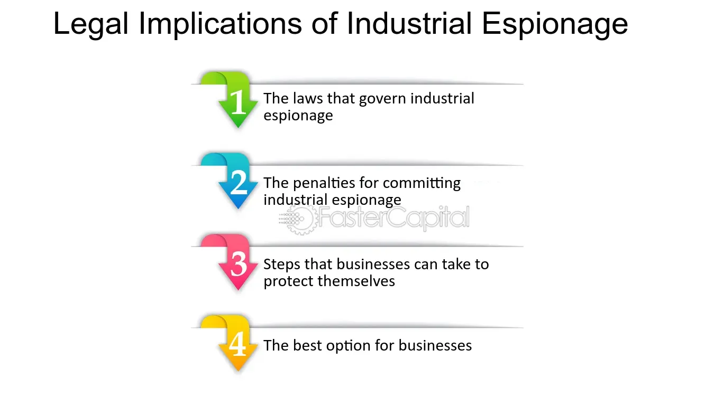

## Table of Contents

## What is industrial espionage?

Industrial espionage is when someone steals secrets from a business to help another business. These secrets can be about new products, how things are made, or special plans. It's like spying, but instead of spying on countries, people spy on companies. This can hurt the company that loses its secrets because it might lose money or customers.

People who do industrial espionage might use different ways to get the secrets. They could hack into computers, bribe workers, or even sneak into offices. Sometimes, they pretend to be someone else to trick people into giving away information. It's a big problem for businesses because it can be hard to stop and can cause a lot of damage.

## What are common methods used in industrial espionage?

Industrial espionage often involves sneaky ways to steal secrets. One common method is hacking into a company's computers. Hackers can break into systems to steal important files or emails. Another way is by bribing workers. Someone might offer money or other rewards to an employee to get them to share secret information. Sometimes, spies will even go into a company's office to take photos or copy documents when no one is looking.

Another method is called social engineering. This is when someone tricks people into giving away information. They might pretend to be a new employee or a repair person to get inside a company. They could also send fake emails that look real to trick people into sharing secrets. Dumpster diving is another simple but effective way. Spies might look through a company's trash to find thrown-away documents with useful information.

These methods show how industrial espionage can happen in many different ways. Companies need to be careful and protect their secrets to avoid losing important information to competitors.

## How does industrial espionage differ from competitive intelligence?

Industrial espionage and competitive intelligence are both about getting information about other businesses, but they are different in important ways. Industrial espionage is when someone steals secrets from a company using sneaky or illegal ways. This could mean hacking into computers, bribing employees, or even sneaking into offices to take photos or copy documents. It's like spying, and it's not allowed because it's not fair and can hurt the company that loses its secrets.

On the other hand, competitive intelligence is when a company gathers information about its competitors in a way that is honest and legal. This can include looking at public reports, studying what competitors say in the news, or even talking to customers to learn about other products. The goal is to understand the market better and make smarter business decisions, but it's done without breaking any laws or stealing. While industrial espionage is sneaky and can harm businesses, competitive intelligence is open and helps companies compete fairly.

## What are the motivations behind industrial espionage?

People do industrial espionage because they want to get ahead in business. They might want to know about a new product that another company is making. If they can steal the plans for this new product, they can make it themselves and start selling it before the other company. This can help them make more money and get more customers. Sometimes, they want to find out how another company makes things cheaper or better. By stealing these secrets, they can use the same methods and save money or make better products.

Another reason for industrial espionage is to hurt a competitor. If a company can steal secrets and then use them to make the other company look bad, they might be able to take away their customers. For example, if they find out about a problem with a competitor's product before it's fixed, they can tell everyone about it and make people not want to buy it. This can make the competitor lose money and maybe even go out of business. So, industrial espionage is often about making more money or hurting someone else's business.

## What are the potential impacts of industrial espionage on businesses?

Industrial espionage can hurt a business a lot. When someone steals secrets, the business might lose money. This can happen if another company starts making and selling the same product before them. The business might also lose customers because people might buy the other company's product instead. Losing secrets can make it hard for the business to keep making new things or stay ahead of others. It can also make the business spend more money to fix the problems caused by the stolen secrets.

Another big problem is that industrial espionage can make people not trust the business anymore. If secrets get out, people might think the business is not good at keeping things safe. This can make customers, partners, and even workers go to other companies. The business might also have to spend a lot of money on lawyers and security to stop more secrets from being stolen. All of these things can make it hard for the business to do well and grow.

## What laws govern industrial espionage in the United States?

In the United States, industrial espionage is against the law. The main law that deals with this is the Economic Espionage Act of 1996. This law says it's illegal to steal trade secrets to help someone else's business or to help a foreign country. If someone breaks this law, they can go to jail for a long time and have to pay a lot of money. The law helps protect businesses by making it clear that stealing secrets is not okay.

Another important law is the Computer Fraud and Abuse Act (CFAA). This law makes it illegal to use computers to steal information or cause damage. If someone hacks into a company's computer to steal secrets, they can be punished under this law. Both of these laws work together to stop people from using sneaky or illegal ways to get business secrets. They help make sure that companies can keep their important information safe.

## How do international laws and treaties address industrial espionage?

International laws and treaties help countries work together to stop industrial espionage. One important agreement is the Trade-Related Aspects of Intellectual Property Rights (TRIPS) agreement. This agreement is part of the World Trade Organization (WTO) and says that countries should protect trade secrets. If someone steals secrets in one country and uses them in another country, the countries can use the TRIPS agreement to work together to stop it. This helps make sure that businesses can keep their secrets safe no matter where they are.

Another way countries fight industrial espionage is through agreements like the Budapest Convention on Cybercrime. This treaty helps countries work together to stop crimes that happen on computers, like hacking to steal business secrets. Countries that agree to the treaty can share information and help each other catch people who break the law. These international laws and treaties are important because they help create rules that everyone follows, making it harder for people to steal secrets across different countries.

## What are the legal consequences for individuals and companies involved in industrial espionage?

If someone gets caught doing industrial espionage, they can face big trouble. In the United States, the Economic Espionage Act of 1996 says that stealing trade secrets can lead to jail time and big fines. A person might go to prison for up to 10 years and have to pay a fine of up to $500,000. If the secrets were stolen to help a foreign country, the punishment can be even worse, with up to 15 years in prison and a fine of up to $5 million. Companies can also be punished if they are involved. They might have to pay fines that can be much larger, sometimes millions of dollars, and they could lose the right to do business in certain places.

International laws also have strong rules against industrial espionage. The Trade-Related Aspects of Intellectual Property Rights (TRIPS) agreement, part of the World Trade Organization, says countries should protect trade secrets. If someone steals secrets in one country and uses them in another, both countries can work together to stop it. The Budapest Convention on Cybercrime is another treaty that helps countries fight computer crimes like hacking to steal business secrets. Countries that agree to this treaty can share information and help each other catch the people who break the law. These international laws make it harder for people to steal secrets across different countries and help protect businesses everywhere.

## How can companies protect themselves against industrial espionage?

Companies can protect themselves against industrial espionage by being careful with their secrets. They should use strong passwords and keep their computer systems safe from hackers. It's also important to teach employees about the dangers of industrial espionage. They should know not to share secrets with anyone outside the company and to be careful with emails or phone calls that might be trying to trick them. Companies can also use special software to watch for strange activity on their computers and stop it before secrets get stolen.

Another way to protect against industrial espionage is to have good security in the office. This means locking up important papers and making sure only certain people can go into certain areas. Companies can also check who they hire carefully to make sure new employees are trustworthy. Sometimes, it's a good idea to have rules about what employees can do with their phones or cameras at work, so they don't accidentally or on purpose take pictures of secret information. By being careful and having strong security, companies can keep their secrets safe and stop industrial espionage from hurting their business.

## What role does technology play in both perpetrating and preventing industrial espionage?

Technology makes industrial espionage easier because people can use computers to steal secrets. Hackers can break into a company's computer system and take important files or emails. They can also use the internet to trick employees into giving away information through fake emails or websites. Sometimes, technology like small cameras or recording devices can be hidden in offices to secretly record conversations or take pictures of secret documents. All these tools help people steal secrets without being caught easily.

On the other hand, technology also helps companies protect themselves from industrial espionage. They can use strong passwords and special software to keep their computer systems safe from hackers. This software can watch for strange activity and stop it before secrets get stolen. Companies can also use technology to check who is coming and going from their offices, making sure only the right people can get in. By using technology smartly, companies can make it much harder for spies to steal their secrets and keep their business safe.

## Can you provide case studies of notable industrial espionage incidents?

One famous case of industrial espionage happened in 1993 with a company called Gillette and a man named Steven Louis Davis. Davis worked for Gillette but was secretly working for a company in South Korea called Uniden. He stole Gillette's plans for a new razor and gave them to Uniden. Gillette found out and took Davis to court. Davis went to jail for 25 years and had to pay a big fine. This case showed how one person's actions could hurt a big company and why it's important to keep secrets safe.

Another well-known case involved a company called DuPont and a man named Gary Min. In 2006, Min, who worked for DuPont, stole secrets about a special kind of paint used on cars. He wanted to sell these secrets to a company in China. The FBI caught him before he could do it. Min went to jail for 18 months and had to pay a fine. This case showed how industrial espionage can happen even in big companies and how important it is to watch out for people trying to steal secrets.

A third case happened in 2012 with a company called Coca-Cola and a man named Joya Williams. Williams, who worked at Coca-Cola, tried to steal secret recipes and sell them to Pepsi. She was caught before she could do it and went to jail for 8 years. This case showed how even well-known companies can be targets of industrial espionage and why it's important to have good security to protect secrets.

## What are the future trends and challenges in combating industrial espionage?

In the future, technology will keep changing how industrial espionage happens and how companies fight it. More and more, hackers will use new ways to break into computer systems and steal secrets. They might use things like [artificial intelligence](/wiki/ai-artificial-intelligence) to find weak spots in a company's security. Companies will need to keep their computer systems up to date and use smart technology to watch for these attacks. They might also use AI to help them spot strange activity and stop it before secrets get stolen. As technology gets better, the fight against industrial espionage will be like a race, with both sides trying to stay one step ahead.

Another big challenge will be keeping secrets safe as companies work more with other businesses around the world. When companies share information with partners in different countries, it can be hard to make sure that information stays safe. Laws and rules about secrets can be different in each country, which makes it harder to protect them. Companies will need to work together with other countries to make sure everyone follows the same rules and can help each other stop industrial espionage. This will be important to keep business secrets safe no matter where they are.

## References & Further Reading

[1]: Zetter, K. (2010). ["Google Hack Attack Was Ultra Sophisticated, New Details Show."](https://www.wired.com/2010/01/operation-aurora/) Wired.

[2]: Clark, L. (1997). ["Volkswagen settles GM espionage case."](https://www.latimes.com/archives/la-xpm-1997-01-10-fi-17138-story.html) BBC News.

[3]: Barwise, P., & Watkins, C. (2017). ["The Impact of Industrial Espionage on Semiconductor Industry."](https://1library.net/document/y68x8w7z-evolution-digital-dominance-got-gafa.html) Journal of Technology Management & Innovation.

[4]: Rose, S. (2010). ["For All the Tea in China: How England Stole the World's Favorite Drink and Changed History."](https://archive.org/details/forallteainchina0000rose) Viking Penguin.

[5]: Roberts, H. (2020). ["Algorithmic Trading and Data Mining: An Overview of the Challenges of Big Data in Finance."](https://www.researchgate.net/publication/309211028_Data_Mining_Algorithms_An_Overview) Journal of Financial Data Science.