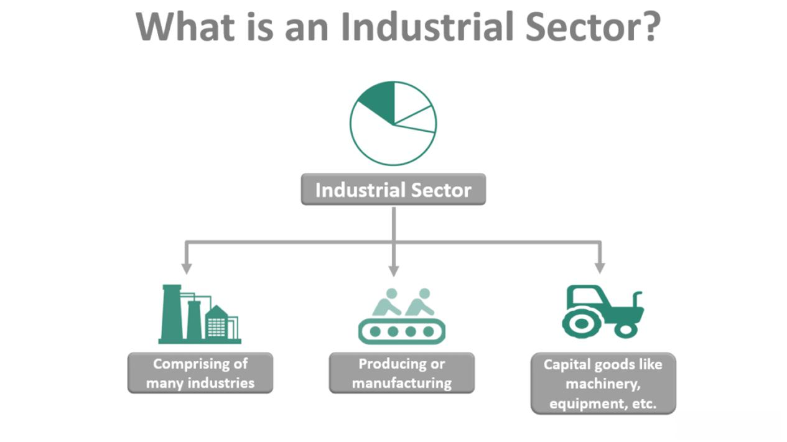

In today's fast-paced financial environment, understanding the interplay between market tracking, sector monitoring, industrial goods, and algorithmic trading is crucial for optimizing trading strategies and investment decisions. Market tracking involves the continuous observation and analysis of financial markets to identify trends, patterns, and potential opportunities. This process is critical in the ever-evolving landscape of industrial goods, where factors such as supply chain disruptions, technological advancements, and regulatory changes can significantly impact market dynamics.

Sector monitoring focuses specifically on analyzing specific industries or sectors, such as industrial goods. This involves evaluating various economic indicators, corporate performance metrics, and external factors that influence a sector's overall health and trajectory. By closely monitoring industry-specific developments, investors and traders can make informed decisions that align with broader market trends and company-specific prospects.



Algorithmic trading, or algo trading, uses pre-programmed algorithms to execute trades at speeds and efficiencies far beyond human capabilities. In the industrial goods market, algo trading can analyze vast amounts of data swiftly, assessing variables such as price movements, historical trends, and earnings reports to make real-time trading decisions. This intersection of technology and market analysis significantly enhances the precision and effectiveness of trading strategies, enabling market participants to capitalize on transient opportunities more effectively.

Market tracking and sector monitoring play integral roles in optimizing trading strategies within the industrial goods sector. By leveraging these tools, traders and investors can refine their approaches to risk management, asset allocation, and profit maximization. These strategies hinge on accurate and timely data, which serves as the backbone of informed decision-making in financial markets.

The purpose of this article is to explore the interconnected landscape of market tracking, sector monitoring, industrial goods, and algo trading. It will delve into the technologies, methodologies, and innovations that drive these fields, offering insights into their current applications and future potential. By understanding this complex ecosystem, businesses and investors are better equipped to harness these strategies for optimum financial performance.

## Table of Contents

## Understanding Market Tracking

Market tracking is the process of consistently observing and analyzing financial markets to understand price movements, trading volumes, and market trends. It involves collecting and interpreting data to make informed decisions regarding buying, selling, and holding securities. Key components of market tracking include data analysis, trend prediction, and performance evaluation.

### Tools and Technologies Used in Market Tracking

1. **Data Feeds and APIs**: These provide real-time data that crucially inform trading decisions. Bloomberg Terminal and Thomson Reuters Eikon are examples of platforms offering market data feeds.

2. **Charting Software**: Tools like MetaTrader and TradingView are used for technical analysis, providing various charting tools to interpret market trends and perform technical analysis.

3. **Analytical Platforms**: Software like MATLAB and R Studio are utilized for complex statistical analyses and model building. These platforms help in identifying patterns and predicting market movements.

4. **Machine Learning Algorithms**: These are used to sift through large datasets to identify trading signals and anomalies. Libraries like scikit-learn in Python are often employed for their robust machine learning functionalities.

### Current Trends in Market Tracking for Industrial Goods

1. **Integration of AI and Machine Learning**: There is increased reliance on AI to enhance predictive analytics, providing more accurate market forecasting and anomaly detection in trading patterns.

2. **Big Data Analytics**: The use of big data is augmenting market tracking by processing vast amounts of data more efficiently, allowing for more nuanced insights into market behavior.

3. **Real-time Data Processing**: Technologies like Apache Kafka enable the real-time processing of data streams, providing traders with up-to-date information for decision-making.

### Benefits of Market Tracking for Investors and Traders

1. **Informed Decision-Making**: By offering insights into market trends and performance, market tracking allows investors to make more informed decisions, thus potentially increasing their returns.

2. **Risk Mitigation**: Continuous market monitoring helps in identifying and mitigating potential risks, reducing the likelihood of substantial losses.

3. **Improved Strategy Development**: Insights gained from market tracking assist in developing robust trading strategies that can adapt to market changes.

### Challenges Faced in Market Tracking and Potential Solutions

1. **Data Overload**: The sheer volume of available data can overwhelm traders. Employing AI and machine learning algorithms can help in filtering and highlighting critical data points.

2. **Data Accuracy and Reliability**: Inaccurate data can lead to erroneous trading decisions. Ensuring high-quality data sources and using data validation techniques is crucial.

3. **Market Volatility**: Sudden market changes can disrupt tracking models. Building adaptable and flexible models that can recalibrate in real-time to market conditions is imperative.

By using advanced tools and embracing innovative technologies, market tracking is becoming increasingly sophisticated, offering traders and investors the ability to stay ahead in competitive financial markets.

## Sector Monitoring in Industrial Goods

Sector monitoring in industrial goods involves analyzing and evaluating specific segments within the broader industrial sector. This practice is crucial for identifying trends, assessing market dynamics, and making informed investment decisions. Sector monitoring provides insights into industry performance, competitive analysis, and potential growth areas. Its significance lies in enabling investors to allocate resources effectively and manage risks associated with economic fluctuations and industry-specific challenges.

Key factors in sector monitoring for industrial goods include economic indicators, supply chain dynamics, technological innovation, regulatory changes, and competitive landscape. Economic indicators, such as GDP growth, inflation rates, and employment levels, influence demand for industrial goods. Supply chain dynamics, including raw material availability and transportation logistics, impact production costs and delivery times. Technological advancements drive efficiency and product development, while regulatory changes can affect compliance costs and market entry barriers. The competitive landscape, characterized by mergers, acquisitions, and strategic alliances, also plays a critical role in shaping sector dynamics.

Sector monitoring significantly impacts investment decisions by providing data-driven insights into market trends and future projections. Investors use this information to identify promising opportunities, evaluate potential risks, and devise strategies that maximize returns. Monitoring helps investors understand the real-time performance of industrial goods companies, guiding decisions on asset allocation and portfolio diversification.

Technological advancements have transformed sector monitoring by providing access to large volumes of data and sophisticated analytical tools. Machine learning and [artificial intelligence](/wiki/ai-artificial-intelligence) enable predictive analytics, identifying patterns and trends that inform tactical and strategic decisions. Real-time data collection and processing allow for rapid response to market changes, enhancing the ability of investors to capitalize on emerging opportunities.

Effective sector monitoring is illustrated by companies that have successfully leveraged data analytics to gain competitive advantages. For example, General Electric (GE) has utilized data-driven strategies to optimize manufacturing processes and improve product quality, enhancing its market position in the industrial goods sector. Similarly, Siemens has implemented advanced monitoring techniques to streamline operations and reduce energy consumption, driving cost efficiencies and sustainability.

Overall, sector monitoring plays a pivotal role in understanding industrial goods markets, guiding investment strategies, and fostering innovation. By keeping abreast of key factors and technological advancements, investors can make informed decisions that mitigate risks and capitalize on growth opportunities.

## Algo Trading: Revolutionizing Industrial Goods Market

Algorithmic trading, commonly known as algo trading, refers to the use of computer algorithms to automate trading processes. Through predefined sets of rules, these algorithms can execute orders at speeds and frequencies that are impossible for human traders. This technology has significantly impacted the industrial goods market, offering numerous advantages such as enhanced speed, improved efficiency, and reduced human error, while also introducing certain risks and considerations.

**Transforming the Industrial Goods Sector**

Algo trading is reshaping the industrial goods sector by optimizing trade execution and increasing market [liquidity](/wiki/liquidity-risk-premium). By analyzing large datasets and market conditions in real time, algorithms can identify optimal trading opportunities and execute trades instantaneously. For instance, in volatile markets where industrial goods prices fluctuate rapidly, algo trading can capitalize on short-term price movements that traditional trading methods may miss. Moreover, with the ability to process complex data and adjust strategies accordingly, algo trading helps minimize risks and maximize returns for institutional and individual investors alike.

**Traditional Trading vs. Algorithmic Trading**

The fundamental difference between traditional and [algorithmic trading](/wiki/algorithmic-trading) lies in the approach and speed of execution. Traditional trading relies heavily on human intuition, decision-making, and manual order placement, which inherently involves delays and the potential for human error. In contrast, algo trading automates the entire process using mathematical models and algorithms, allowing for rapid decision-making and execution. This shift reduces the lag time between order decision and execution, providing traders with a competitive edge in fast-paced markets.

**Benefits of Algo Trading**

1. **Speed**: One of the most significant advantages of algo trading is speed. Algorithms can analyze market conditions and execute trades within milliseconds, far exceeding human capabilities. This speed advantage is crucial in markets where prices change rapidly.

2. **Efficiency**: By streamlining the trading process and eliminating manual intervention, algo trading enhances operational efficiency. Traders can implement complex trading strategies without the need for continuous monitoring, freeing up resources for other tasks.

3. **Reduced Human Error**: Human error is an inherent risk in traditional trading, often leading to costly mistakes. Algo trading minimizes this risk by executing trades based strictly on pre-programmed criteria, reducing the likelihood of errors caused by emotional or cognitive biases.

**Risks and Considerations**

Despite its advantages, algo trading is not without risks. The reliance on algorithms can lead to vulnerabilities, such as technical glitches, which may result in significant financial losses. Additionally, algorithms are only as good as the data and strategies they are built upon; poor-quality data or flawed algorithms can lead to suboptimal trading decisions. Another consideration is the risk of "flash crashes," where rapid, automated trading leads to significant, short-term price anomalies, as evidenced by events like the 2010 Flash Crash. Therefore, continuous monitoring and updating of algorithms are essential to mitigate these risks.

In conclusion, algorithmic trading stands as a transformative force in the industrial goods market, bringing unparalleled speed and efficiency while demanding rigorous risk management and strategy refinement. As the sector continues to evolve, balancing the benefits and challenges of algo trading will be crucial for market participants.

## Integrating Market Tracking and Sector Monitoring with Algo Trading

The integration of market tracking, sector monitoring, and algorithmic trading represents a sophisticated convergence in modern financial markets, offering enhanced opportunities for investors and traders. This synergy hinges largely on advanced technological integration, allowing for the creation and execution of sophisticated trading strategies. Market tracking provides continuous data feeds on market movements, while sector monitoring offers detailed insights into specific industrial goods sectors. Algorithmic trading leverages this data, executing complex strategies at speeds unattainable by human traders.

A practical integration example involves using market tracking to collect real-time price data and [volume](/wiki/volume-trading-strategy) metrics, which algorithmic systems analyze to identify trading signals. Sector monitoring can refine these strategies by incorporating data on industry-specific developments, regulatory changes, or supply chain disruptions. These insights feed into algorithms, which can adjust trading patterns based on the execution of predetermined criteria, optimizing returns while mitigating risks.

Technological advancements continue to facilitate this integration, with platforms increasingly incorporating Artificial Intelligence (AI) and [machine learning](/wiki/machine-learning) algorithms. These technologies enhance data analysis capability, allow for predictive analytics, and tailor strategies according to market conditions. Python has become a crucial tool for developers, given its versatility in handling large datasets and constructing machine learning models. An example script might involve using Python's pandas library to handle dataframes or scikit-learn for creating predictive models.

```python
import pandas as pd
from sklearn.ensemble import RandomForestClassifier

# Load market data
data = pd.read_csv('market_data.csv') 
# Feature selection and model training
features = data[['price', 'volume', 'sector_index']]
labels = data['trading_signal']
model = RandomForestClassifier()
model.fit(features, labels)
```

The future outlook for this integrated approach is promising, driven by continuous advancements in AI and data processing technologies. These tools are set to offer even more refined analyses, allowing for automated adaptability to market shifts and enhanced precision in predictive modeling. However, challenges remain, notably the vast amounts of data and the need for robust computational power, as well as the potential for systemic risks stemming from misbehaving algorithms.

To mitigate these barriers, market participants should focus on securing reliable and efficient data processing pipelines and investing in robust computational infrastructures. Additionally, regular audits of trading algorithms and risk management protocols can help in identifying vulnerabilities and ensuring adherence to regulatory standards. By prioritizing these aspects, the integration of market tracking, sector monitoring, and algorithmic trading can become a cornerstone of financial market strategy, maximizing both opportunity and security.

## Key Tools and Technologies

Market tracking, sector monitoring, and algorithmic trading rely heavily on advanced technology platforms and tools. These components are essential for efficiently processing and analyzing market data to make informed investment decisions. Leading technology platforms in this space include a mixture of proprietary software and third-party solutions that offer comprehensive suites for data analysis, trading algorithms, risk management, and performance monitoring.

**AI and Machine Learning in Market Tracking and Algo Trading**

Artificial Intelligence (AI) and machine learning (ML) have become integral in enhancing the capabilities of market tracking and algorithmic trading systems. These technologies excel at processing large volumes of data and identifying complex patterns that can be used to predict market trends or optimize trading strategies. 

For example, machine learning algorithms can be utilized to refine trading models by continuously learning from historical and real-time data. This process improves prediction accuracy and adapitility to market changes. Techniques like natural language processing (NLP) can also analyze news sentiment and social media to gauge market sentiment.

**Examples of Software and Platforms for Sector Monitoring**

Sector monitoring requires robust platforms that can handle data integration, analytics, and visualization. Bloomberg Terminal and Thomson Reuters Eikon are prominent platforms providing comprehensive market data and analytics tools tailored for sector-specific monitoring. They offer real-time data, historical datasets, and a wide range of analytical tools that help in understanding sector performance and trends.

Additionally, platforms like FactSet and S&P Capital IQ provide specialized services that focus on financial data, analytics, and research to help investors assess sector health and performance.

**Emerging Technologies Shaping the Future**

Several emerging technologies are poised to substantially impact market tracking and algorithmic trading in the future. Blockchain technology, for instance, offers enhanced transparency, security, and efficiency in trade settlements. Quantum computing, although still in its nascent stages, promises to revolutionize data processing speed, allowing for more complex algorithms and models in trading.

Furthermore, developments in IoT (Internet of Things) are contributing to more real-time and granular data collection, particularly in sectors like industrial goods, where operational data can inform trading strategies.

**Sourcing the Best Tools for Different Investment Needs**

Selecting the right tools involves assessing the specific needs of an investor or a trading desk. For robust data analysis and trading execution, platforms like MetaTrader and NinjaTrader provide customizable trading solutions with sophisticated algorithmic trading capabilities.

For those focused on data-driven insights, tools such as Tableau or Microsoft Power BI can offer powerful data visualization and analysis capabilities, although they may need to be paired with additional data sources for comprehensive market intelligence.

Investors and firms may also invest in specialized AI and machine learning platforms like DataRobot or H2O.ai to develop and deploy custom trading algorithms tailored to their specific strategies or market sectors.

In conclusion, staying abreast of technological advancements and selecting the appropriate tools are pivotal for leveraging technology in market tracking, sector monitoring, and algorithmic trading. Combining AI and ML capabilities with emerging technologies can significantly enhance investment strategies and decision-making processes.

## Conclusion

Market tracking, sector monitoring, and algorithmic trading stand as pivotal components in the modern financial ecosystem. These elements not only facilitate informed decision-making but also enhance the precision and efficiency of trading operations. Each plays a distinct yet interconnected role in shaping the contours of today's dynamic markets.

Market tracking provides continuous surveillance of price movements and trends across various asset classes, acting as the backbone for informed investment strategies. It enables investors and traders to comprehensively understand market dynamics and make timely decisions, a crucial aspect in sectors where industrial goods often experience volatile price shifts. However, the fast-paced nature of financial markets presents challenges, such as data overload and the need for real-time processing capabilities. Addressing these issues demands the integration of sophisticated tools and technologies like high-frequency trading systems and predictive analytics.

Sector monitoring, on the other hand, offers a macro-level view by focusing on specific segments of the economy. For industries dealing with industrial goods, this means analyzing factors such as production rates, supply chain logistics, and geopolitical influences that can impact sector performance. This granular level of insight allows investors to anticipate market shifts and position themselves advantageously. Technological advancements have significantly improved the accuracy and speed of sector monitoring, though challenges remain in terms of data integration and analysis.

Algorithmic trading is perhaps the most revolutionary development in the arena of financial markets. By utilizing preprogrammed instructions to execute trades, it offers benefits of rapid execution, minimized human error, and enhanced liquidity. However, it also introduces risks, such as exposure to market anomalies and the propagation of systemic errors, which necessitate robust risk management frameworks and continuous monitoring.

The confluence of market tracking, sector monitoring, and algo trading creates a synergistic effect that modernizes trading strategies. Through the use of artificial intelligence and machine learning, financial professionals can harness vast amounts of data to derive actionable insights and automate complex decisions, thus driving the industry towards a future of seamless integration. Despite potential barriers such as regulatory hurdles and technological limitations, the [momentum](/wiki/momentum) towards integrated financial technology platforms continues. This signals an era where continuous evolution and innovative approaches will dominate, encouraging investors and businesses to embrace these tools to maintain competitive edges.

In conclusion, the integration and enhancement of market tracking, sector monitoring, and algorithmic trading are imperative for any stakeholder aiming to navigate the complexities of the financial markets effectively. As we anticipate further innovations, the call to action for businesses and investors is clear: adopt these transformative technologies or risk falling behind in an ever-evolving landscape.

## References & Further Reading

[1]: Bergstra, J., Bardenet, R., Bengio, Y., & Kégl, B. (2011). ["Algorithms for Hyper-Parameter Optimization."](https://dl.acm.org/doi/10.5555/2986459.2986743) Advances in Neural Information Processing Systems 24.

[2]: ["Advances in Financial Machine Learning"](https://www.amazon.com/Advances-Financial-Machine-Learning-Marcos/dp/1119482089) by Marcos Lopez de Prado

[3]: ["Evidence-Based Technical Analysis: Applying the Scientific Method and Statistical Inference to Trading Signals"](https://www.amazon.com/Evidence-Based-Technical-Analysis-Scientific-Statistical/dp/0470008741) by David Aronson

[4]: ["Machine Learning for Algorithmic Trading"](https://github.com/stefan-jansen/machine-learning-for-trading) by Stefan Jansen

[5]: ["Quantitative Trading: How to Build Your Own Algorithmic Trading Business"](https://www.amazon.com/Quantitative-Trading-Build-Algorithmic-Business/dp/1119800064) by Ernest P. Chan