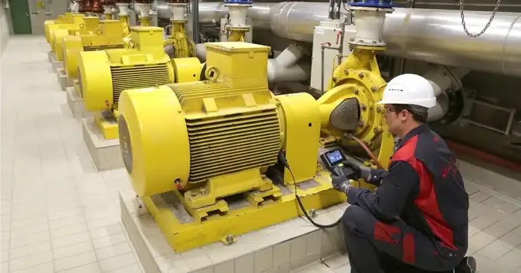

## Table of Contents

## What are industrial goods and what sectors do they encompass?

Industrial goods are products that businesses use to make other products or to help them run their operations. These goods are not usually sold to regular people but to other companies. They can be raw materials like steel or chemicals, or they can be machinery and equipment like conveyor belts or computers. Industrial goods help businesses produce things more efficiently and effectively.

The sectors that industrial goods cover are very broad. They include manufacturing, where companies make things like cars or electronics. Another sector is construction, which uses industrial goods like cement and heavy machinery to build buildings and roads. There's also the energy sector, which uses industrial goods to produce and distribute electricity and other forms of energy. These sectors all rely on industrial goods to function and grow.

## What are the primary functions of industrial goods in manufacturing?

In manufacturing, industrial goods have several important jobs. They help businesses make things faster and better. For example, machines like robots and conveyor belts speed up the work and make sure everything is done the same way every time. This helps companies make more products without as many mistakes. Also, raw materials like metal and plastic are turned into the final products we use every day, like cars and toys.

Industrial goods also help keep the manufacturing process running smoothly. Tools and equipment need to be in good shape, so maintenance and repair parts are very important. Without these, machines could break down and slow down production. Plus, things like computers and software help manage the whole operation, keeping track of what's being made and when it needs to be finished. This helps businesses stay organized and meet their goals on time.

## How do industrial goods contribute to the efficiency of production processes?

Industrial goods help make production processes more efficient by speeding up the work and making it more consistent. Machines like robots and conveyor belts can do tasks much faster than people can. They also do the same thing over and over without getting tired or making mistakes. This means companies can make more products in less time and with fewer errors. For example, a car factory can use robots to put together cars much faster than if people did it by hand.

Industrial goods also help keep everything running smoothly. Raw materials like steel and plastic are used to make the final products. If these materials are of good quality, the products will be better too. Also, maintenance and repair parts keep the machines working well. If a machine breaks down, it can be fixed quickly so it doesn't slow down production. Computers and software help manage everything, keeping track of what's being made and when it needs to be done. This helps businesses stay organized and meet their deadlines.

## What are the common types of machinery and equipment used in the industrial goods sector?

In the industrial goods sector, there are many types of machinery and equipment that help businesses do their work. Some common machines are robots and conveyor belts. Robots can do tasks like welding or assembling parts very quickly and accurately. Conveyor belts move materials and products from one place to another, making the production process smoother and faster. These machines help companies make more products in less time and with fewer mistakes.

Another important type of equipment is heavy machinery, like bulldozers and cranes. These are used a lot in construction and mining to move big things or dig into the ground. In manufacturing, machines like lathes and milling machines shape and cut materials into the right sizes and shapes. Also, there are tools like drills and saws that help with smaller tasks. All these machines and tools make it easier for businesses to build and create things.

Computers and software are also key pieces of equipment in the industrial goods sector. They help manage the whole operation, keeping track of what's being made and when it needs to be finished. This helps businesses stay organized and meet their goals on time. Without computers and software, it would be much harder to keep everything running smoothly and efficiently.

## How is the performance of industrial goods monitored?

The performance of industrial goods is watched closely to make sure they are working well and helping businesses do their jobs. Companies use different ways to keep an eye on their machines and equipment. One way is by using sensors and special devices that can tell if something is not working right. These sensors can check things like temperature, pressure, and how fast the machine is running. If something seems off, the sensors can send a warning so people can fix the problem before it gets worse.

Another way to monitor performance is by using computers and software. These tools can collect data from the machines and show it in a way that's easy to understand. For example, a computer program might show graphs or charts that tell you how well a machine is doing over time. This helps businesses see if their equipment is getting slower or if it needs to be fixed. By keeping track of this information, companies can make sure their industrial goods are always working at their best.

Sometimes, people also check the machines themselves. Workers might do regular checks to see if everything is in good shape. They look for signs of wear and tear or any parts that might need to be replaced. This hands-on approach helps catch problems early and keeps the machines running smoothly. By combining these different methods, businesses can make sure their industrial goods are performing well and helping them be more efficient.

## What are the key metrics used to evaluate the functionality of industrial equipment?

Key metrics used to evaluate the functionality of industrial equipment include uptime, which tells how long the machine works without breaking down. Another important metric is efficiency, which shows how well the machine is doing its job. For example, if a machine is supposed to make 100 parts per hour but is only making 80, it's not very efficient. Also, the rate of defects is crucial. This measures how often the machine makes mistakes or produces bad parts. A low defect rate means the machine is working well.

Maintenance costs are another key metric. This shows how much money is spent to keep the machine running smoothly. If maintenance costs are high, it might mean the machine needs a lot of fixing, which can be a sign of poor functionality. Energy consumption is also important. Machines that use a lot of power might not be as efficient as they should be. By looking at these metrics, businesses can see how well their industrial equipment is performing and decide if they need to make any changes or improvements.

## What technologies are used for real-time monitoring of industrial goods?

Real-time monitoring of industrial goods uses a lot of cool technology to keep an eye on machines and equipment as they work. One big technology is the Internet of Things (IoT). IoT devices, like sensors, are put on machines to watch things like temperature, pressure, and how fast the machine is running. These sensors send information to computers all the time, so people can see what's happening right away. If something goes wrong, the sensors can send a warning, and people can fix the problem quickly before it gets worse.

Another technology used is called Supervisory Control and Data Acquisition (SCADA) systems. These systems collect data from machines and show it on screens in a way that's easy to understand. They can make graphs and charts that help people see how well the machines are doing over time. SCADA systems are really helpful because they let people control the machines from far away and make sure everything is running smoothly. By using these technologies, businesses can keep their industrial goods working well and catch any problems early.

## How can predictive maintenance improve the lifespan and efficiency of industrial goods?

Predictive maintenance helps keep industrial goods working longer and better by guessing when they might need fixing before they break. It uses special tools like sensors and computers to watch how machines are doing all the time. If the tools see that something is not right, they can tell people to fix it before it causes a big problem. This means machines don't break down as often, and businesses can keep making things without stopping. It saves time and money because fixing a small problem is easier and cheaper than fixing a big one.

Using predictive maintenance also makes machines more efficient. When machines are taken care of before they break, they can work at their best all the time. This means they can make more products faster and with fewer mistakes. Businesses can plan when to fix machines, so they don't have to stop working suddenly. This helps keep everything running smoothly and makes sure that the machines last longer. In the end, predictive maintenance helps businesses save money and make more things, which is good for everyone.

## What are the challenges faced in monitoring and maintaining industrial goods?

Monitoring and maintaining industrial goods can be tough because there are so many machines and parts to keep an eye on. It's hard to check everything all the time, and if you miss something, it could cause a big problem later. Also, the machines are often working in tough places, like factories that are hot, dirty, or loud. This makes it hard for sensors and other tools to work well, and it can be hard for people to get to the machines to fix them.

Another challenge is that machines can be very complicated. It takes a lot of knowledge and skill to understand how they work and what might go wrong. Sometimes, the tools used to monitor the machines can be expensive, and not all businesses can afford them. Plus, even if you have the right tools, you need people who know how to use them. If workers don't have the right training, they might not be able to spot problems early or fix them the right way. All these things make it hard to keep industrial goods running smoothly and efficiently.

## How do IoT and AI technologies enhance the monitoring and functionality of industrial equipment?

IoT and AI technologies make it easier to watch over industrial equipment and keep it working well. IoT devices, like sensors, are put on machines to check things like temperature, pressure, and speed all the time. This information is sent to computers, so people can see what's happening right away. If something starts to go wrong, the sensors can send a warning, and people can fix the problem before it gets worse. This helps keep machines running without breaking down, which saves time and money.

AI helps by looking at all the data from the machines and figuring out what it means. It can spot patterns and predict when a machine might need fixing. This is called predictive maintenance. AI can tell people to fix a small problem before it turns into a big one, so machines don't stop working suddenly. This makes everything run more smoothly and helps machines last longer. By using IoT and AI together, businesses can keep their equipment working at its best and make more things without as many problems.

## What are the best practices for optimizing the performance of industrial goods?

To make industrial goods work their best, it's important to keep them in good shape. This means doing regular check-ups and fixing any small problems before they get bigger. Using sensors and computers to watch the machines all the time can help catch issues early. Also, making sure workers know how to use and take care of the machines is key. If everyone knows what to do, they can keep the machines running smoothly and avoid mistakes.

Another good way to keep industrial goods working well is by using smart technology like AI to predict when machines might need fixing. This can save a lot of time and money because you can fix things before they break. It's also a good idea to keep track of how much energy the machines use and try to make them more efficient. By doing all these things, businesses can make sure their industrial goods last longer and work better, which helps them make more products and save money.

## How does the integration of industrial goods monitoring systems affect overall operational efficiency and cost management?

The integration of industrial goods monitoring systems helps businesses work better and save money. By using sensors and computers to watch machines all the time, companies can see when something is going wrong and fix it before it causes a big problem. This means machines don't break down as often, so businesses can keep making things without stopping. When machines are working well, they can make more products faster and with fewer mistakes. This helps businesses meet their goals and make more money.

Monitoring systems also help with cost management. By catching small problems early, businesses can fix them cheaply instead of waiting for a big, expensive problem to happen. Also, these systems can help businesses use less energy and make their machines more efficient. This saves money on energy bills and makes the whole operation run smoother. In the end, using monitoring systems helps businesses save money and work better, which is good for everyone.

## References & Further Reading

[1]: Bergstra, J., Bardenet, R., Bengio, Y., & Kégl, B. (2011). ["Algorithms for Hyper-Parameter Optimization."](https://dl.acm.org/doi/10.5555/2986459.2986743) Advances in Neural Information Processing Systems 24.

[2]: ["Advances in Financial Machine Learning"](https://www.amazon.com/Advances-Financial-Machine-Learning-Marcos/dp/1119482089) by Marcos Lopez de Prado

[3]: ["Evidence-Based Technical Analysis: Applying the Scientific Method and Statistical Inference to Trading Signals"](https://www.amazon.com/Evidence-Based-Technical-Analysis-Scientific-Statistical/dp/0470008741) by David Aronson

[4]: ["Machine Learning for Algorithmic Trading"](https://github.com/stefan-jansen/machine-learning-for-trading) by Stefan Jansen

[5]: ["Quantitative Trading: How to Build Your Own Algorithmic Trading Business"](https://www.amazon.com/Quantitative-Trading-Build-Algorithmic-Business/dp/1119800064) by Ernest P. Chan