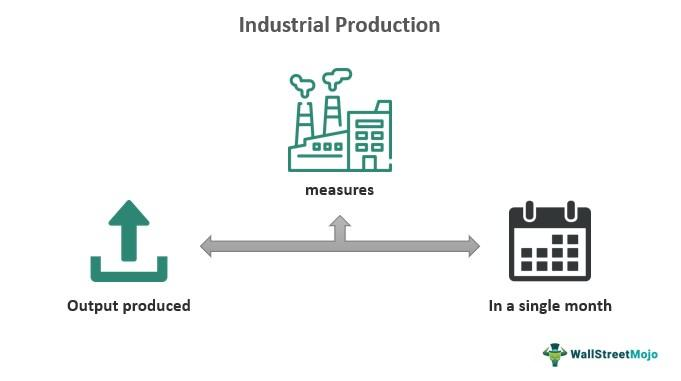

## Table of Contents

## What is the Industrial Production Index (IPI)?

The Industrial Production Index (IPI) is a measure that shows how much stuff factories, mines, and utilities are making. It helps us understand if the economy is growing or shrinking by looking at the output of these industries. The IPI is important because it gives us a quick snapshot of how well the industrial part of the economy is doing.

The IPI is calculated by comparing the current level of industrial output to a base year. If the index goes up, it means that more goods are being produced compared to the base year. If it goes down, it means less is being made. Governments and businesses use this information to make decisions about economic policies and investments.

## Why is the IPI important for measuring economic output?

The Industrial Production Index (IPI) is important for measuring economic output because it shows how much factories, mines, and utilities are producing. This helps us know if the economy is doing well or not. When the IPI goes up, it means more things are being made, which is good for the economy. If it goes down, it means fewer things are being made, which can be a sign of trouble.

People like government officials and business leaders use the IPI to make important decisions. For example, if the IPI is growing, the government might feel confident about the economy and decide to spend more money on new projects. Businesses might also see a rising IPI as a good sign to invest more in their operations. On the other hand, if the IPI is falling, it might be a warning sign for everyone to be more careful with spending and investments.

## How is the IPI calculated?

The Industrial Production Index (IPI) is calculated by comparing the current level of industrial output to a base year. This base year is chosen as a reference point, and the output for that year is set to 100. If the current output is higher than the base year, the IPI will be over 100. If it's lower, the IPI will be under 100. The exact number shows how much the output has changed compared to the base year.

To find the IPI, data is collected from factories, mines, and utilities about how much they are producing. This data is then put into a formula that adjusts for things like seasonal changes or different numbers of working days in a month. The formula helps make sure the IPI gives a fair and accurate picture of how industrial output is changing over time.

## What sectors does the IPI cover?

The Industrial Production Index (IPI) covers three main sectors: manufacturing, mining, and utilities. Manufacturing is all about making things like cars, clothes, and computers. Mining includes digging up things like coal, oil, and metals from the ground. Utilities are services like electricity, gas, and water that people use every day.

These sectors are important because they show how much stuff is being made and used in the economy. When factories make more cars or mines produce more coal, it means the economy might be growing. If less electricity is being used, it might mean people are not using as many things, which can be a sign that the economy is slowing down. By looking at these sectors together, the IPI gives a good picture of the overall health of the industrial part of the economy.

## Can you explain the difference between IPI and other economic indicators like GDP?

The Industrial Production Index (IPI) and Gross Domestic Product (GDP) are both important ways to measure how an economy is doing, but they look at different things. The IPI focuses on how much factories, mines, and utilities are making. It gives a quick snapshot of how the industrial part of the economy is doing by showing if more or less stuff is being produced compared to a base year. This is useful for understanding the health of industries that make physical goods.

On the other hand, GDP is a broader measure that looks at the total value of all goods and services produced in a country over a certain time, usually a year or a quarter. GDP includes everything from the cars made in factories to the haircuts given at salons. It gives a big picture of the economy, showing not just the industrial output but also services and other parts of the economy. While the IPI is more specific to industry, GDP gives a wider view of economic health.

## How often is the IPI data released?

The Industrial Production Index (IPI) data is usually released every month. This means you can see how much factories, mines, and utilities are making each month. It's a good way to keep an eye on how the industrial part of the economy is doing without waiting too long.

Governments and other groups collect this data and then share it with everyone. By looking at the IPI every month, people can see if things are getting better or worse in the industry. This helps them make quick decisions about money and business.

## What are the common uses of IPI data in economic analysis?

IPI data is used by many people to understand how the economy is doing. It helps them see if factories, mines, and utilities are making more or less stuff compared to last month. This information is useful for figuring out if the economy is growing or shrinking. People like government officials and business leaders look at the IPI to decide if they should spend more money or be careful with their budgets. For example, if the IPI goes up, it might mean the economy is doing well, so they might feel good about starting new projects.

Economists also use the IPI to predict what might happen next in the economy. By looking at trends in the IPI over time, they can guess if the economy will keep growing or if it might slow down. This helps them give advice to businesses and the government. The IPI is just one piece of the puzzle, but it's an important one because it shows what's happening in the industrial part of the economy, which can affect everything else.

## How does the IPI relate to business cycles?

The Industrial Production Index (IPI) helps us understand business cycles, which are the ups and downs in the economy over time. When the IPI goes up, it means factories, mines, and utilities are making more stuff. This usually happens during the good times of a business cycle, called an expansion. During an expansion, businesses feel confident and might hire more people or invest in new projects because they see that more goods are being made and sold.

On the other hand, when the IPI goes down, it means less stuff is being made. This can be a sign that the economy is entering a downturn or recession, which is the bad part of a business cycle. During a recession, businesses might cut back on production, lay off workers, or delay new projects because they see that fewer goods are being made and sold. By watching the IPI, people can get early warnings about where the economy might be headed in the business cycle.

## What are the limitations of using the IPI as a measure of industrial output?

The Industrial Production Index (IPI) can be a good way to see how much stuff factories, mines, and utilities are making, but it has some problems. One big issue is that the IPI only looks at the amount of stuff made, not how much it costs to make it or how much people are willing to pay for it. This means the IPI might say the economy is doing great because a lot of stuff is being made, but if the costs are too high or people don't want to buy it, the economy might not be doing as well as it seems.

Another limitation is that the IPI doesn't cover everything in the economy. It only focuses on factories, mines, and utilities, so it misses out on important parts like services, which can be a big part of many modern economies. For example, if a country has a lot of people working in tech or tourism, the IPI won't show how well those parts of the economy are doing. This can make it hard to get a full picture of the economy just by looking at the IPI.

## How can changes in the IPI affect monetary policy decisions?

Changes in the Industrial Production Index (IPI) can help people who make money decisions, like those at central banks, figure out what to do. If the IPI goes up, it means factories, mines, and utilities are making more stuff. This might make the economy grow faster, which can lead to more spending and higher prices. If the central bank sees this happening, they might decide to raise interest rates to slow things down and keep prices from getting too high.

On the other hand, if the IPI goes down, it means less stuff is being made. This could be a sign that the economy is slowing down or even going into a recession. When the central bank sees this, they might lower interest rates to make it cheaper for people and businesses to borrow money. This can help get the economy moving again by encouraging more spending and investment.

## What advanced statistical methods are used to refine IPI data?

To make the Industrial Production Index (IPI) data more accurate, people use advanced math methods. One way is called seasonal adjustment. This helps take out the effects of things like holidays or weather changes that happen every year. For example, factories might make more stuff before Christmas, so seasonal adjustment helps show what's really going on in the economy, not just what happens because of the time of year.

Another method is called smoothing. This helps smooth out the ups and downs in the IPI data so it's easier to see the big trends. Smoothing can be done using things like moving averages, where you look at the average of the IPI over several months instead of just one month. This way, small changes that might not mean much don't mess up the bigger picture of how the economy is doing.

## How does the IPI vary by country, and what are the implications for global economic analysis?

The Industrial Production Index (IPI) can be different from one country to another because each country has its own way of making things. In some countries, like Germany or Japan, factories and industries make a lot of stuff, so their IPI might be higher and change a lot. In other countries, like those that focus more on services instead of making things, the IPI might not change as much or be as important. For example, the United States has a big service sector, so while the IPI is still useful, it's just one part of understanding the whole economy.

When looking at the global economy, the IPI from different countries can help us see how the world is doing. If many countries have a high IPI, it might mean the world economy is growing because a lot of stuff is being made everywhere. But if some big countries have a low IPI, it could slow down the whole world economy. Understanding these differences helps people make better guesses about what might happen next in the global economy and plan accordingly.

## What is the Industrial Production Index (IPI) and how is it understood?

The Industrial Production Index (IPI) serves as a comprehensive monthly indicator that assesses production levels in key industrial sectors such as manufacturing, mining, and utilities, omitting sectors like agriculture and construction. This gauge is crucial for understanding variations in production over time relative to a predetermined base year, reflecting normal economic conditions.

In constructing the IPI, data are amassed from a mix of sources, including industry associations and various government agencies. Key inputs include metrics such as tons of materials used and hours worked by employees in these sectors. This data is essential to the calculation of the index as it represents the physical output of goods. The formula for the index is generally expressed as:

$$
IPI = \left( \frac{\text{Current Production Output}}{\text{Base Year Production Output}} \right) \times 100
$$

This formula helps normalize the output against a baseline, allowing for consistent temporal analysis of industrial production trends.

The publication of the IPI is typically administered by authoritative agencies. In the United States, for example, the Federal Reserve Board is responsible for disseminating these figures, ensuring they are reflective of current and accurate economic conditions. This includes revising past estimates when new or more accurate data becomes available.

The IPI holds significance beyond macroeconomic analysis; it is a critical tool for algorithmic traders. These traders leverage the IPI as a macroeconomic indicator that can influence trading strategies. By monitoring fluctuations in the IPI, traders can derive insights into industrial sector performance, allowing them to anticipate economic trends. For instance, an increase in the IPI might indicate economic expansion, suggesting potentially favorable conditions for industrial stocks or related financial instruments.

For algorithmic application, Python could be employed to automate the analysis process. Here's an example code snippet that simulates tracking the IPI and making trading decisions:

```python
import pandas as pd

# Sample IPI data: Date and IPI value
data = {'Date': ['2023-01', '2023-02', '2023-03'],
        'IPI': [102.5, 103.1, 102.8]}
ipi_df = pd.DataFrame(data)

# Trading logic based on IPI changes
for index, row in ipi_df.iterrows():
    if index > 0:
        previous_ipi = ipi_df.loc[index-1, 'IPI']
        current_ipi = row['IPI']
        if current_ipi > previous_ipi:
            print(f"{row['Date']}: Indicator suggests buying industrial stocks.")
        elif current_ipi < previous_ipi:
            print(f"{row['Date']}: Indicator suggests selling industrial stocks.")
```

This code checks month-over-month changes in the IPI and, based on the change, simulates basic buy or sell recommendations for industrial sector stocks. Such [quantitative trading](/wiki/quantitative-trading) strategies emphasize the IPI's role in enhancing the responsiveness and efficiency of financial markets.

## What is the IPI Calculation and what are its Economic Implications?

The Industrial Production Index (IPI) serves as a measure of industrial sector output, reflecting the performance and capacity utilization across manufacturing, mining, and utilities. Calculation of the IPI involves numerous inputs and methodologies, offering a comprehensive depiction of industrial activity relative to a designated base year.

### Calculation Methodology

The IPI is based on a set of indices comparing current production levels to those of a base year, typically chosen to represent stable economic conditions. The calculation relies on the aggregation of data such as production volumes, man-hours, and production capacity from various sources, including industry associations and governmental departments.

### Capacity and Capacity Utilization

Key components of the IPI include capacity and capacity utilization, which assess the extent to which available productive capacity is employed.

**Capacity** refers to the maximum output that can be achieved under normal working conditions, and **capacity utilization** is a ratio indicating the percentage of potential output currently being realized. 

Mathematically, capacity utilization ($CU$) can be expressed as:

$$
CU = \frac{\text{Actual Output}}{\text{Potential Output}} \times 100\]

High capacity utilization often correlates with economic growth, suggesting that industries are operating near their full potential.

### Economic Implications

An upward trend in the IPI indicates expanding industrial activity, which serves as a promising sign of economic growth. This growth typically results in increased employment opportunities and rising wages as firms scale up production to meet higher demand. On the other hand, declining IPI figures or low capacity utilization may signal potential economic downturns. Such scenarios often prompt policymakers to consider fiscal or monetary interventions to stimulate economic activity.

### Algorithmic Trading Applications

The dynamic nature of IPI data offers valuable insights for [algorithmic trading](/wiki/algorithmic-trading) systems. By integrating IPI-driven indicators, traders can formulate strategies to capitalize on market movements driven by industrial sector changes. For instance, significant growth in the IPI might trigger buy signals in relevant stocks or sectors, anticipating favorable market conditions. Conversely, a declining trend might prompt sell orders to mitigate potential losses.

Incorporating real-time analysis of IPI data allows algorithmic models to execute trades with precision, responding to economic indicators faster than traditional methods. This responsiveness underscores the importance of the IPI as not only a macroeconomic measure but also a critical input for high-frequency trading algorithms.

## What are the Methodologies for Industrial Production Analysis?

Various methodologies are essential in assessing industrial production, with the Industrial Production Index (IPI) being a prominent measure in this domain. Understanding these methodologies provides valuable insights into production efficiency, supports informed decision-making, and enhances operational capabilities for policymakers and business leaders.

One critical methodology is the capacity utilization rate, which reflects how much of a nation's productive capacity is being used. It is calculated as the ratio of actual output to potential output:

$$
\text{Capacity Utilization Rate} = \left( \frac{\text{Actual Output}}{\text{Potential Output}} \right) \times 100
$$

A higher capacity utilization rate typically indicates that resources are being effectively used, while a lower rate may signal underutilization, prompting evaluations for potential scaling or investment adjustments.

Production function analysis is another key approach, analyzing the relationship between inputs (e.g., labor, capital) and outputs. This analysis provides insight into the efficiency and productivity of production processes. The basic form of a production function can be expressed as:

$$
Q = f(L, K)
$$

where $Q$ is the quantity of output, $L$ is labor input, and $K$ is capital input. Understanding how changes in these inputs affect output helps in optimizing resource allocation.

With technological advancements, Industry 4.0 and [artificial intelligence](/wiki/ai-artificial-intelligence) (AI) significantly influence production analysis, improving accuracy and enriching insights. Industry 4.0 introduces smart factories with interconnected machines that offer real-time data, leading to more precise production monitoring and forecasting. AI algorithms facilitate predictive maintenance and quality control, reducing downtime and increasing efficiency.

Machine learning and data visualization are revolutionizing industrial production analysis by enhancing the analytical process. Machine learning algorithms can identify patterns and trends in historical production data, providing predictive insights and optimizing production schedules. Python, for example, is widely used for data analysis and [machine learning](/wiki/machine-learning) tasks due to its strong libraries like pandas, scikit-learn, and TensorFlow. A simple example using Python to predict production output could involve:

```python
import pandas as pd
from sklearn.model_selection import train_test_split
from sklearn.linear_model import LinearRegression

# Load production data
data = pd.read_csv('production_data.csv')
X = data[['labor_input', 'capital_input']]
y = data['output']

# Split data into training and testing sets
X_train, X_test, y_train, y_test = train_test_split(X, y, test_size=0.2, random_state=42)

# Train linear regression model
model = LinearRegression()
model.fit(X_train, y_train)

# Predict production output
predictions = model.predict(X_test)
```

Data visualization tools further aid in interpreting complex data trends, allowing stakeholders to comprehend production trends better. These methodologies collectively arm decision-makers with the required insights to enhance productivity, reduce costs, and adapt to changing economic conditions effectively.

## References & Further Reading

[1]: The Conference Board. ["Understanding the Industrial Production Index."](https://www.investopedia.com/terms/i/ipi.asp) The Conference Board, Research.

[2]: Lopez de Prado, M. (2018). ["Advances in Financial Machine Learning."](https://www.amazon.com/Advances-Financial-Machine-Learning-Marcos/dp/1119482089) Wiley.

[3]: US Federal Reserve. ["Industrial Production and Capacity Utilization - G.17."](https://www.federalreserve.gov/releases/g17/current/) 

[4]: Chan, E. P. (2008). ["Quantitative Trading: How to Build Your Own Algorithmic Trading Business."](https://github.com/egorpe/EPChan-QuantitativeTrading/blob/master/example7_6.m) Wiley.

[5]: Jansen, S. (2020). ["Machine Learning for Algorithmic Trading: Predictive models to extract signals from market and alternative data for systematic trading strategies with Python."](https://www.amazon.com/Machine-Learning-Algorithmic-Trading-alternative/dp/1839217715) Packt Publishing.