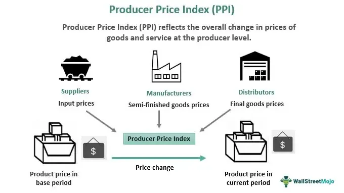

The industrial sector is integral to the economic growth and stability of a nation, serving as a backbone for the production of goods and services. At the core of understanding industrial output is the Industrial Production Index (IPI), a vital economic indicator that quantifies real output across the manufacturing, mining, and utilities sectors. Unlike agricultural and construction activities, which are excluded, the IPI provides a focused measure on sectors critical for gauging industrial strength.

For economists, business leaders, and policymakers, the IPI is indispensable. It serves as a barometer for economic performance, offering insights into production trends and potential growth or contraction in these pivotal industries. The utility of the IPI extends beyond simple measurement; it influences policy decisions aimed at stimulating or tempering economic activity.



Moreover, the role of the IPI extends into modern financial markets, particularly within algorithmic trading. This form of trading depends on economic indicators like the IPI to devise automated strategies that respond to industrial sector performance. The fluctuations in the IPI can help traders anticipate market trends and adjust their portfolios appropriately.

The calculation of the IPI involves methodologies that compare real-time production data against a base year, ensuring output measures accurately reflect current economic conditions. This index's application in algorithmic trading stands as a testament to its significance, providing a mechanism to predict and react to macroeconomic shifts.

An examination of the methodologies used in calculating the IPI reveals its complexity and relevance. This includes using capacity utilization rates and production functions that capture the efficiency of industry operations. An accurate understanding of these concepts aids in refining industrial strategy and optimizing economic policies.

Despite its comprehensive nature, the IPI does face challenges, particularly regarding data accuracy and sector scope. However, the opportunities afforded by advancements in technology and data analytics promise to enhance its application. In conclusion, the Industrial Production Index remains a vital tool for assessing industrial output and guiding economic decisions, poised to evolve alongside technological and methodological advancements.

## Table of Contents

## Understanding the Industrial Production Index (IPI)

The Industrial Production Index (IPI) serves as a comprehensive monthly indicator that assesses production levels in key industrial sectors such as manufacturing, mining, and utilities, omitting sectors like agriculture and construction. This gauge is crucial for understanding variations in production over time relative to a predetermined base year, reflecting normal economic conditions.

In constructing the IPI, data are amassed from a mix of sources, including industry associations and various government agencies. Key inputs include metrics such as tons of materials used and hours worked by employees in these sectors. This data is essential to the calculation of the index as it represents the physical output of goods. The formula for the index is generally expressed as:

$$
IPI = \left( \frac{\text{Current Production Output}}{\text{Base Year Production Output}} \right) \times 100
$$

This formula helps normalize the output against a baseline, allowing for consistent temporal analysis of industrial production trends.

The publication of the IPI is typically administered by authoritative agencies. In the United States, for example, the Federal Reserve Board is responsible for disseminating these figures, ensuring they are reflective of current and accurate economic conditions. This includes revising past estimates when new or more accurate data becomes available.

The IPI holds significance beyond macroeconomic analysis; it is a critical tool for algorithmic traders. These traders leverage the IPI as a macroeconomic indicator that can influence trading strategies. By monitoring fluctuations in the IPI, traders can derive insights into industrial sector performance, allowing them to anticipate economic trends. For instance, an increase in the IPI might indicate economic expansion, suggesting potentially favorable conditions for industrial stocks or related financial instruments.

For algorithmic application, Python could be employed to automate the analysis process. Here's an example code snippet that simulates tracking the IPI and making trading decisions:

```python
import pandas as pd

# Sample IPI data: Date and IPI value
data = {'Date': ['2023-01', '2023-02', '2023-03'],
        'IPI': [102.5, 103.1, 102.8]}
ipi_df = pd.DataFrame(data)

# Trading logic based on IPI changes
for index, row in ipi_df.iterrows():
    if index > 0:
        previous_ipi = ipi_df.loc[index-1, 'IPI']
        current_ipi = row['IPI']
        if current_ipi > previous_ipi:
            print(f"{row['Date']}: Indicator suggests buying industrial stocks.")
        elif current_ipi < previous_ipi:
            print(f"{row['Date']}: Indicator suggests selling industrial stocks.")
```

This code checks month-over-month changes in the IPI and, based on the change, simulates basic buy or sell recommendations for industrial sector stocks. Such [quantitative trading](/wiki/quantitative-trading) strategies emphasize the IPI's role in enhancing the responsiveness and efficiency of financial markets.

## IPI Calculation and Economic Implications

The Industrial Production Index (IPI) serves as a measure of industrial sector output, reflecting the performance and capacity utilization across manufacturing, mining, and utilities. Calculation of the IPI involves numerous inputs and methodologies, offering a comprehensive depiction of industrial activity relative to a designated base year.

### Calculation Methodology

The IPI is based on a set of indices comparing current production levels to those of a base year, typically chosen to represent stable economic conditions. The calculation relies on the aggregation of data such as production volumes, man-hours, and production capacity from various sources, including industry associations and governmental departments.

### Capacity and Capacity Utilization

Key components of the IPI include capacity and capacity utilization, which assess the extent to which available productive capacity is employed.

**Capacity** refers to the maximum output that can be achieved under normal working conditions, and **capacity utilization** is a ratio indicating the percentage of potential output currently being realized. 

Mathematically, capacity utilization ($CU$) can be expressed as:

$$
CU = \frac{\text{Actual Output}}{\text{Potential Output}} \times 100\]

High capacity utilization often correlates with economic growth, suggesting that industries are operating near their full potential.

### Economic Implications

An upward trend in the IPI indicates expanding industrial activity, which serves as a promising sign of economic growth. This growth typically results in increased employment opportunities and rising wages as firms scale up production to meet higher demand. On the other hand, declining IPI figures or low capacity utilization may signal potential economic downturns. Such scenarios often prompt policymakers to consider fiscal or monetary interventions to stimulate economic activity.

### Algorithmic Trading Applications

The dynamic nature of IPI data offers valuable insights for [algorithmic trading](/wiki/algorithmic-trading) systems. By integrating IPI-driven indicators, traders can formulate strategies to capitalize on market movements driven by industrial sector changes. For instance, significant growth in the IPI might trigger buy signals in relevant stocks or sectors, anticipating favorable market conditions. Conversely, a declining trend might prompt sell orders to mitigate potential losses.

Incorporating real-time analysis of IPI data allows algorithmic models to execute trades with precision, responding to economic indicators faster than traditional methods. This responsiveness underscores the importance of the IPI as not only a macroeconomic measure but also a critical input for high-frequency trading algorithms.

## Role of IPI in Algorithmic Trading

Algorithmic trading has revolutionized financial markets by enabling the execution of trades at speeds and accuracies beyond human capabilities. At its core, algorithmic trading relies on complex algorithms that incorporate a wide array of economic indicators, including the Industrial Production Index (IPI). The IPI serves as a critical input for these algorithms, providing valuable insights into the performance of the industrial sector. 

Fluctuations in the IPI are indicative of changes in economic conditions. For instance, an increase in the IPI suggests heightened industrial activity, which may lead to economic growth. Conversely, a decline in the IPI might signal an economic slowdown. Algorithms are designed to detect such variations in the IPI and execute trades based on predicted market movements. This predictive capability allows traders to take advantage of anticipated shifts, enhancing the overall efficiency of trading strategies.

The IPI assists traders in anticipating economic trends and adjusting their portfolios in response to changing conditions. By incorporating IPI data, traders can optimize their strategies to improve performance and mitigate risks. This anticipation and adaptability arise from algorithms that analyze IPI data in real-time. For example, an algorithm might trigger a buying spree when an increase in the IPI is detected, anticipating a rise in stock prices due to expected economic growth.

Sophisticated models in algorithmic trading can dissect IPI data to capture micro trends and macroeconomic conditions that influence the market. These models can use [machine learning](/wiki/machine-learning) techniques to refine their predictive accuracy over time, potentially analyzing historical data to identify patterns. Here's a simple illustration of how historical IPI data might be analyzed using Python to predict future trends:

```python
import pandas as pd
from sklearn.model_selection import train_test_split
from sklearn.ensemble import RandomForestRegressor

# Load the IPI data
ipi_data = pd.read_csv('ipi_historical_data.csv')

# Features and target variable
X = ipi_data.drop('IPI', axis=1)
y = ipi_data['IPI']

# Split data into training and test sets
X_train, X_test, y_train, y_test = train_test_split(X, y, test_size=0.2, random_state=42)

# Initialize and train the random forest model
model = RandomForestRegressor(n_estimators=100, random_state=42)
model.fit(X_train, y_train)

# Predict future IPI values
predictions = model.predict(X_test)
```

Such models provide algorithmic traders with the tools necessary to analyze vast amounts of data swiftly, seizing opportunities in industrial sectors as soon as they arise. By integrating IPI analysis, traders gain a competitive advantage in predicting macroeconomic shifts and market dynamics. Ultimately, by leveraging the insights offered by the IPI, algorithmic trading strategies can better navigate the complexities of modern financial markets, capitalizing on the opportunities presented by the dynamic industrial landscape.

## Methodologies for Industrial Production Analysis

Various methodologies are essential in assessing industrial production, with the Industrial Production Index (IPI) being a prominent measure in this domain. Understanding these methodologies provides valuable insights into production efficiency, supports informed decision-making, and enhances operational capabilities for policymakers and business leaders.

One critical methodology is the capacity utilization rate, which reflects how much of a nation's productive capacity is being used. It is calculated as the ratio of actual output to potential output:

$$
\text{Capacity Utilization Rate} = \left( \frac{\text{Actual Output}}{\text{Potential Output}} \right) \times 100
$$

A higher capacity utilization rate typically indicates that resources are being effectively used, while a lower rate may signal underutilization, prompting evaluations for potential scaling or investment adjustments.

Production function analysis is another key approach, analyzing the relationship between inputs (e.g., labor, capital) and outputs. This analysis provides insight into the efficiency and productivity of production processes. The basic form of a production function can be expressed as:

$$
Q = f(L, K)
$$

where $Q$ is the quantity of output, $L$ is labor input, and $K$ is capital input. Understanding how changes in these inputs affect output helps in optimizing resource allocation.

With technological advancements, Industry 4.0 and [artificial intelligence](/wiki/ai-artificial-intelligence) (AI) significantly influence production analysis, improving accuracy and enriching insights. Industry 4.0 introduces smart factories with interconnected machines that offer real-time data, leading to more precise production monitoring and forecasting. AI algorithms facilitate predictive maintenance and quality control, reducing downtime and increasing efficiency.

Machine learning and data visualization are revolutionizing industrial production analysis by enhancing the analytical process. Machine learning algorithms can identify patterns and trends in historical production data, providing predictive insights and optimizing production schedules. Python, for example, is widely used for data analysis and machine learning tasks due to its strong libraries like pandas, scikit-learn, and TensorFlow. A simple example using Python to predict production output could involve:

```python
import pandas as pd
from sklearn.model_selection import train_test_split
from sklearn.linear_model import LinearRegression

# Load production data
data = pd.read_csv('production_data.csv')
X = data[['labor_input', 'capital_input']]
y = data['output']

# Split data into training and testing sets
X_train, X_test, y_train, y_test = train_test_split(X, y, test_size=0.2, random_state=42)

# Train linear regression model
model = LinearRegression()
model.fit(X_train, y_train)

# Predict production output
predictions = model.predict(X_test)
```

Data visualization tools further aid in interpreting complex data trends, allowing stakeholders to comprehend production trends better. These methodologies collectively arm decision-makers with the required insights to enhance productivity, reduce costs, and adapt to changing economic conditions effectively.

## Challenges and Opportunities in IPI Application

The Industrial Production Index (IPI), while instrumental in providing insights into the performance of key economic sectors, encounters several challenges in its application. Primarily, the IPI's reliance on accurate data reporting from its constituent sectors—manufacturing, mining, and utilities—poses a significant challenge. The exclusion of other sectors, such as agriculture and construction, can result in an incomplete picture of economic activity, potentially leading to skewed assessments of overall economic health.

Further complicating the IPI's utility is the ongoing struggle for data accuracy and consistency. Variations in data collection methods, reporting standards, and revisions can complicate the interpretation of the IPI, impeding effective economic forecasting and policy formulation. The dependence on timely and precise data from industry associations and governmental bodies means discrepancies can impact decision-making processes that rely on stable economic indicators.

Notwithstanding these limitations, the IPI remains a potent tool for economic analysis and algorithmic trading. For economic analysis, the IPI enables insights into the industrial sector's contribution to GDP and assists in forecasting economic trends. Its role as a macroeconomic indicator provides a basis for simulations and predictive analytics, fostering enhanced decision-making in fiscal and monetary policy.

In the context of algorithmic trading, the IPI presents opportunities to incorporate macroeconomic indicators into trading algorithms. Sophisticated models can exploit IPI data to capture market movements and identify trading opportunities, leveraging fluctuations in industrial output to inform dynamic trading strategies.

Emerging technological trends hold promise for refining IPI application. The advent of Industry 4.0, which emphasizes the use of automation and data exchange, could enhance data collection accuracy, thereby improving the IPI's reliability. Additionally, the integration of artificial intelligence and machine learning in data analytics can yield deeper insights and enable real-time analysis of production trends. By leveraging these technologies, the accuracy and timeliness of the IPI could be enhanced, offering more precise assessments of economic conditions and industrial performance.

In conclusion, while the Industrial Production Index faces challenges linked to data representation and accuracy, it also presents considerable opportunities for economic and trading advancements. As technology continues to integrate into economic analysis, the IPI's applicability is poised to expand, offering a robust framework for evaluating industrial activity and informing strategic economic decisions.

## Conclusion

The Industrial Production Index (IPI) is a crucial metric for analyzing the contributions of the industrial sector to a nation's economic landscape. It provides a precise measure of sector output, which is essential for shaping informed decisions regarding economic policy and algorithmic trading strategies. As industries increasingly lean towards automation and incorporate artificial intelligence, the utility of the IPI in economic measurement is poised for significant growth. This evolution enhances the capacity of businesses and policymakers to respond swiftly to production trends and market dynamics.

To maximize the IPI's accuracy and utility, ongoing advancements in data analysis and reporting integrity are paramount. Ensuring the reliability of input data and refining methodologies for IPI calculation are critical steps in sustaining its relevance as an economic indicator. These improvements allow stakeholders to gain a deeper understanding of industrial performance and economic health, facilitating more effective policy adjustments and business strategies.

Furthermore, the integration of cutting-edge technologies, such as machine learning and data analytics, offers promising opportunities to deepen insights garnered from the IPI. These tools enable more detailed analyses of industrial trends, allowing for improved forecasting and strategic alignment. Consequently, the IPI remains an indispensable instrument, providing valuable insights into the industrial sector's role within the broader economic framework.

## References & Further Reading

[1]: The Conference Board. ["Understanding the Industrial Production Index."](https://www.investopedia.com/terms/i/ipi.asp) The Conference Board, Research.

[2]: Lopez de Prado, M. (2018). ["Advances in Financial Machine Learning."](https://www.amazon.com/Advances-Financial-Machine-Learning-Marcos/dp/1119482089) Wiley.

[3]: US Federal Reserve. ["Industrial Production and Capacity Utilization - G.17."](https://www.federalreserve.gov/releases/g17/current/) 

[4]: Chan, E. P. (2008). ["Quantitative Trading: How to Build Your Own Algorithmic Trading Business."](https://github.com/egorpe/EPChan-QuantitativeTrading/blob/master/example7_6.m) Wiley.

[5]: Jansen, S. (2020). ["Machine Learning for Algorithmic Trading: Predictive models to extract signals from market and alternative data for systematic trading strategies with Python."](https://www.amazon.com/Machine-Learning-Algorithmic-Trading-alternative/dp/1839217715) Packt Publishing.