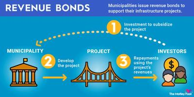

## Table of Contents

## What are Industrial Revenue Bonds (IRBs)?

Industrial Revenue Bonds (IRBs) are a type of municipal bond that governments issue to help businesses finance big projects. These bonds are used to build or expand factories, buy equipment, or start new businesses. The government issues the bonds and then uses the money to help the business. The business pays back the government over time, and the government uses that money to pay back the people who bought the bonds.

IRBs are attractive because they often come with tax benefits. The interest that people earn from these bonds is usually not taxed by the federal government, and sometimes not by the state government either. This makes IRBs a good choice for businesses that need to borrow money and for investors looking for a tax-free way to earn interest. However, there are rules about how these bonds can be used, and they must be used for projects that help the local community.

## How do Industrial Revenue Bonds function?

Industrial Revenue Bonds, or IRBs, work by having a local government issue bonds to raise money for a business project. The government uses the money it gets from selling these bonds to help a company build a factory, buy equipment, or start a new business. The business then agrees to pay the government back over time, usually with interest. The government uses these payments to pay back the people who bought the bonds.

IRBs are popular because they come with tax benefits. The interest that people earn from these bonds is usually not taxed by the federal government, and sometimes not by the state government either. This makes IRBs a good choice for businesses that need money and for people who want to invest without paying taxes on the interest they earn. However, there are rules about how these bonds can be used. They must be used for projects that help the local community, like creating jobs or improving the economy.

## What is the primary purpose of issuing Industrial Revenue Bonds?

The main reason for issuing Industrial Revenue Bonds, or IRBs, is to help businesses get the money they need for big projects. This can include building new factories, buying equipment, or starting new businesses. The local government issues these bonds and uses the money to help the business. The business then pays the government back over time, usually with interest.

IRBs are popular because they offer tax benefits. The interest that people earn from these bonds is usually not taxed by the federal government, and sometimes not by the state government either. This makes IRBs a good choice for businesses that need money and for people who want to invest without paying taxes on the interest they earn. However, there are rules about how these bonds can be used. They must be used for projects that help the local community, like creating jobs or improving the economy.

## Who typically issues Industrial Revenue Bonds?

Industrial Revenue Bonds, or IRBs, are usually issued by local governments. This can be a city, a county, or a special district. The government issues these bonds to help businesses in their area get the money they need for big projects, like building factories or buying equipment.

The business then pays the government back over time, usually with interest. The government uses these payments to pay back the people who bought the bonds. This helps the local economy by creating jobs and bringing in new businesses.

## What types of projects can Industrial Revenue Bonds finance?

Industrial Revenue Bonds, or IRBs, can help pay for many different kinds of projects. They are often used to build new factories or to make old ones bigger. This helps businesses grow and make more things. IRBs can also be used to buy new machines or equipment that a business needs to do its work better.

Another use for IRBs is to help start new businesses. This can bring new jobs and help the local economy grow. The money from IRBs can also be used for projects that help the community, like building new roads or improving public services. All these projects need to help the local area in some way to qualify for IRBs.

## How are Industrial Revenue Bonds structured?

Industrial Revenue Bonds, or IRBs, are set up in a way that helps businesses get money for big projects. A local government, like a city or county, issues these bonds. They sell the bonds to people who want to invest their money. The money from selling the bonds goes to the business, which uses it to build a factory, buy equipment, or start a new business. The business then pays the government back over time, usually with interest. The government uses these payments to pay back the people who bought the bonds.

IRBs are popular because they come with tax benefits. The interest that people earn from these bonds is usually not taxed by the federal government, and sometimes not by the state government either. This makes IRBs a good choice for businesses that need money and for people who want to invest without paying taxes on the interest they earn. However, there are rules about how these bonds can be used. They must be used for projects that help the local community, like creating jobs or improving the economy.

## What are the tax benefits associated with Industrial Revenue Bonds?

Industrial Revenue Bonds, or IRBs, come with special tax benefits that make them attractive to both businesses and investors. One big benefit is that the interest people earn from these bonds is usually not taxed by the federal government. This means that if you buy an IRB and get interest payments, you don't have to pay federal taxes on that money. This can save you a lot of money, especially if you are in a high tax bracket.

Sometimes, the interest from IRBs is also not taxed by the state government. This depends on where you live and the rules in your state. Not having to pay state taxes on the interest can make IRBs even more appealing. These tax benefits help businesses get the money they need for big projects and help investors earn more money without paying as much in taxes.

## What are the risks involved in investing in Industrial Revenue Bonds?

Investing in Industrial Revenue Bonds, or IRBs, can be a good way to earn money, but there are some risks to think about. One big risk is that the business using the money from the bonds might not be able to pay it back. If the business does not do well, it might not have enough money to make the payments to the government. If that happens, the government might not be able to pay back the people who bought the bonds.

Another risk is that the value of the bonds can go up and down. If interest rates go up, the value of the bonds might go down. This means that if you need to sell your bonds before they are paid back, you might get less money than you paid for them. Also, even though the interest from IRBs is usually not taxed, the rules about taxes can change. If the tax benefits go away, the bonds might not be as good of an investment anymore.

## How do Industrial Revenue Bonds impact local economies?

Industrial Revenue Bonds, or IRBs, help local economies by giving businesses the money they need to grow. When a business gets money from IRBs, it can build new factories or buy new equipment. This helps the business make more things and hire more people. When more people have jobs, they spend more money in the local area. This helps other businesses grow too, making the whole economy better.

IRBs also bring new businesses to the area. When a new business starts, it brings new jobs and new money to the local economy. This can make the area more attractive to other businesses and people who want to live there. But, if the business does not do well, it might not be able to pay back the money it borrowed. This could hurt the local economy. So, while IRBs can help a lot, they also come with some risks.

## What is the process for issuing Industrial Revenue Bonds?

When a local government wants to issue Industrial Revenue Bonds, or IRBs, they start by working with a business that needs money for a big project. The government and the business agree on how much money is needed and what the money will be used for. The government then creates the bonds and sells them to people who want to invest their money. The money from selling the bonds goes to the business, which uses it to build a factory, buy equipment, or start a new business.

After the business gets the money, it starts paying the government back over time, usually with interest. The government uses these payments to pay back the people who bought the bonds. The whole process needs to follow rules set by the government. The project must help the local community, like creating jobs or improving the economy. If everything goes well, the business grows, more people get jobs, and the local economy gets better.

## How do Industrial Revenue Bonds compare to other types of municipal bonds?

Industrial Revenue Bonds, or IRBs, are a type of municipal bond that helps businesses get money for big projects. They are different from other municipal bonds because they are used to help private businesses, not just public projects like building schools or roads. The local government issues IRBs and uses the money to help a business. The business then pays the government back over time, and the government uses those payments to pay back the people who bought the bonds. This is different from other municipal bonds where the government might use the money for public projects and pay back investors directly from taxes or other public funds.

IRBs also come with special tax benefits that many other municipal bonds do not have. The interest that people earn from IRBs is usually not taxed by the federal government, and sometimes not by the state government either. This makes IRBs a good choice for investors who want to earn money without paying a lot of taxes. Other types of municipal bonds might also offer tax benefits, but they are usually not as big as those from IRBs. So, while IRBs help private businesses and offer good tax benefits, other municipal bonds are used for public projects and might have different tax rules.

## What are some case studies or examples of successful Industrial Revenue Bond projects?

In Kansas City, Missouri, a company called Ford Motor Company used Industrial Revenue Bonds to build a new assembly plant. The city issued the bonds and gave the money to Ford. Ford used the money to build the plant, which created a lot of new jobs. People in the area were happy because they had more work and the local economy got better. Ford paid the city back over time, and the city used that money to pay back the people who bought the bonds. This project showed how IRBs can help big companies grow and help local areas too.

Another example is in Austin, Texas, where a tech company used IRBs to expand its office space. The city of Austin issued the bonds and gave the money to the company. The company used the money to build a bigger office, which let them hire more people. This helped the local economy because more people had jobs and spent money in the area. The company paid the city back over time, and the city used that money to pay back the people who bought the bonds. This project showed how IRBs can help tech companies grow and bring more jobs to a city.

## References & Further Reading

[1]: Municipal Securities Rulemaking Board. ["Understanding Municipal Securities: Industrial Revenue Bonds."](https://www.msrb.org/) Accessed October 15, 2023.

[2]: Association for Financial Professionals. ["The Role of Algorithmic Trading in Public Finance."](https://www.afponline.org/) Accessed October 15, 2023.

[3]: Lopez de Prado, M. (2018). ["Advances in Financial Machine Learning."](https://www.amazon.com/Advances-Financial-Machine-Learning-Marcos/dp/1119482089) John Wiley & Sons.

[4]: Aronson, D. (2006). ["Evidence-Based Technical Analysis: Applying the Scientific Method and Statistical Inference to Trading Signals."](https://www.amazon.com/Evidence-Based-Technical-Analysis-Scientific-Statistical/dp/0470008741) Wiley.

[5]: Jansen, S. (2018). ["Machine Learning for Algorithmic Trading."](https://www.amazon.com/Hands-Machine-Learning-Algorithmic-Trading/dp/178934641X) Packt Publishing.