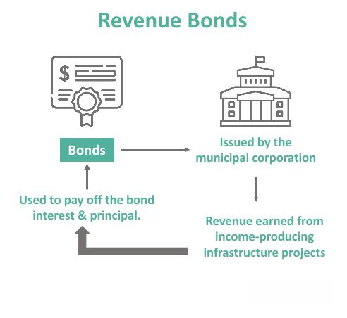

The modern economic environment is characterized by a multifaceted interaction of elements that collectively shape growth and development across different sectors. Central to this environment are financial instruments like industrial revenue bonds (IRBs) and algorithmic trading, which play significant roles in municipal finance and investment management, respectively.

Municipalities, seeking to stimulate economic development, benefit from accessible and innovative financial solutions. Industrial revenue bonds emerge as a crucial mechanism in this context, allowing local governments to secure funds for projects that support infrastructure, job creation, and overall community enhancement. These bonds enable municipalities to partner with private-sector companies, facilitating investments in projects that deliver long-term economic and social gains. The investor appeal of IRBs lies in their tax-exempt status, offering a potentially lower-risk investment opportunity with substantial returns.

Simultaneously, algorithmic trading has become a dominant force in the financial sector, fundamentally transforming how investments are handled. By employing automated systems that execute trades based on predefined criteria, algorithmic trading enhances efficiency and minimizes transaction costs. For municipal finance managers, understanding the dynamics and implications of algorithmic trading is essential. It can influence investment portfolios by offering data-driven insights for maximizing returns, optimizing asset allocation, and improving liquidity management.

As municipalities navigate the complexities of today's economic landscape, the interplay between industrial revenue bonds and algorithmic trading becomes increasingly important. This article examines how these financial tools contribute to sustainable economic development, highlighting their significance in empowering municipal finance and ultimately fostering a higher quality of life for residents.

## Table of Contents

## Understanding Municipal Finance and Economic Development

Municipal finance serves as a fundamental component of local economic development, offering cities and towns the means to fund vital infrastructure projects, essential public services, and various community improvements. Effective management of municipal finances plays a crucial role in attracting investments, creating employment opportunities, and enhancing the overall quality of life for residents.

One of the primary instruments in municipal finance is the Industrial Revenue Bond (IRB), which enables municipalities to support projects that yield significant social and economic benefits. These bonds allow municipalities to raise capital for specific projects by incenting private-sector companies to invest. Typically, projects funded by IRBs involve public infrastructure enhancements that stimulate broader economic growth. By making the interest income on these bonds tax-exempt, IRBs become an attractive investment for certain classes of investors, thus facilitating the necessary funding for municipal projects.

The application of municipal finance strategies, particularly through mechanisms such as IRBs, can lead to sustainable and robust economic growth. These strategies help local governments withstand economic fluctuations by maintaining a sound fiscal structure and ensuring continuous investment in key public sectors. For instance, the issuance of IRBs can lead to the development of industrial parks, manufacturing plants, or other facilities that create jobs and boost local economies.

By strategically leveraging financial instruments like IRBs, municipalities can bolster their economic resilience, ensuring long-term stability and improving the quality of life for their citizens. Understanding the impact and utility of these financial tools is essential for municipal leaders aiming to navigate the complexities of economic development effectively.

## Exploring Industrial Revenue Bonds (IRBs)

Industrial Revenue Bonds (IRBs) are a strategic form of municipal debt designed to support private-sector projects that contribute to public infrastructure and stimulate the local economy. These bonds are particularly significant in their dual role: fostering economic development and providing tax-exempt interest benefits to investors.

**Dual Advantages of IRBs**

IRBs are attractive to both municipalities and investors due to their advantageous structure. They are issued by a municipality but the debt service is typically borne by the private entity benefiting from the funded project. As a result, IRBs facilitate private investment in community-enhancing projects without imposing an undue financial burden on municipal budgets. For investors, these bonds provide tax-exempt interest, often leading to a higher after-tax yield compared to taxable securities, enhancing their attractiveness as an investment vehicle.

**Structure and Regulatory Requirements**

Understanding the structure and regulatory framework governing IRBs is key for municipal finance officers and investors. These bonds require a well-defined agreement outlining the responsibilities of the private entity and the issuing municipality. Typically, the project must meet certain public benefit criteria, such as creating jobs or improving local infrastructure. Regulatory guidelines vary by jurisdiction but generally involve compliance with federal tax laws and municipal bond regulations.

The issuance process for IRBs includes several steps, such as project approval by the relevant municipal body, adherence to state statutes, and sometimes a public hearing. Bond issuance is followed by continuous regulatory compliance to maintain tax-exempt status, often involving the monitoring of how bond proceeds are used.

**Mechanisms of IRBs**

The mechanisms determining the viability of IRBs as a funding option involve several key components. Tax treatment under the Internal Revenue Code ensures these bonds remain attractive by offering tax-exempt interest to holders, provided that the projects meet specific public use criteria. Issuance guidelines often require a detailed examination of the project's potential economic impact and its conformance with public interest goals.

IRBs frequently cater to a variety of projects, ranging from manufacturing facilities to healthcare and educational institutions. Such broad applicability increases their appeal across different sectors, thus playing a significant role in diverse economic landscapes.

In summary, Industrial Revenue Bonds are a pivotal tool for municipalities aiming to spur economic growth through partnerships with the private sector. By catering to mutually beneficial infrastructure projects and offering significant tax advantages, IRBs continue to maintain their status as a viable municipal financing option. Their effective deployment requires a thorough understanding of regulatory landscapes and strategic project planning to maximize public and private benefits.

## The Role of Algorithmic Trading in Public Finance

Algorithmic trading involves the use of automated systems to execute trades based on predetermined criteria. This technology significantly enhances trading efficiency, reduces transaction costs, and facilitates better market access for investors. Its application in public finance, particularly for municipalities, presents numerous opportunities for optimizing investment strategies and maximizing the use of public funds.

Municipalities, which often manage large investment portfolios to meet long-term financial goals, can leverage [algorithmic trading](/wiki/algorithmic-trading) to improve their management strategies. By incorporating these technologies, municipalities gain the ability to dynamically allocate assets in response to changing market conditions, thereby ensuring optimal returns on municipal investments. Algorithmic trading systems can process vast amounts of financial data efficiently, making it possible to identify market trends and execute trades with precision and speed that manual trading cannot match.

Implementing algorithmic trading allows municipal finance managers to increase [liquidity](/wiki/liquidity-risk-premium), meaning that municipal funds can be easily converted into cash or other assets with minimal impact on prices. This liquidity is crucial for municipalities, which must maintain a balance between available funds and investment returns to meet both immediate and future obligations. Moreover, algorithmic trading minimizes risks through diversified trading strategies that balance different financial instruments and sectors.

Beyond optimizing financial performance, the integration of algorithmic trading can enhance transparency in managing municipal funds. The automated nature of these systems means trades are executed and recorded systematically, providing an auditable trail of transactions. This transparency is vital for ensuring accountability in public fund management, as constituents and other stakeholders demand clear and accurate reporting.

The challenge for municipalities is understanding and implementing the technical and strategic aspects of algorithmic trading. Municipal finance officers must be educated on the potential complexities associated with these systems and the regulatory environment governing their use. By doing so, municipalities can harness their potential, optimizing their portfolio management while maintaining rigorous oversight to safeguard public interests.

## Connecting IRBs and Algorithmic Trading

As algorithmic trading continues to advance, its application in the issuance and management of industrial revenue bonds (IRBs) becomes increasingly relevant. Municipalities can leverage algorithmic insights to ascertain bond market conditions more accurately, leading to the issuance of bonds at more competitive rates and optimizing the overall process. The use of predictive analytics and [machine learning](/wiki/machine-learning) models allows finance officers to interpret vast amounts of market data efficiently, enabling them to time the market more effectively and predict [interest rate](/wiki/interest-rate-trading-strategies) changes, which are crucial for IRB issuance. For instance, municipalities could deploy algorithms to analyze historical bond data and current market trends, thereby determining the optimal issuance time to secure lower interest rates, which reduces costs for both the issuer and the investors.

Additionally, strategically timed trades based on algorithmic recommendations can significantly enhance the performance of IRB portfolios. Algorithms can monitor and process real-time data regarding interest rate fluctuations, investor sentiment, and other economic indicators to recommend precise timing for buying or selling these bonds. This active management approach ensures that public funds are allocated efficiently and generate higher returns, while also maintaining a balanced risk profile.

The integration of algorithmic trading with IRBs can lead to improved financial outcomes for municipalities by promoting a more dynamic approach to public finance management. This synergy contributes to broader economic development objectives by ensuring that municipalities have access to the capital necessary for funding essential projects at the lowest possible cost. Enhanced portfolio performance from algorithmically driven strategies not only secures better returns but also supports the fiscal sustainability of local governments, enabling continued investment in community infrastructure and services. As financial markets evolve, municipalities that adopt these advanced techniques can expect to improve their financial standing and support sustainable local economic growth.

## Challenges and Opportunities

Industrial Revenue Bonds (IRBs) and algorithmic trading are integral to modern municipal finance, yet they present a mix of challenges and opportunities. As municipalities seek to maximize the benefits these instruments offer, they must contend with various obstacles.

A significant challenge lies in the regulatory landscape that governs both IRBs and algorithmic trading. IRBs, being a form of municipal debt, are subject to stringent regulatory requirements, often varying by jurisdiction. These regulations can complicate the issuance process, requiring meticulous compliance to avoid legal pitfalls. Similarly, algorithmic trading faces a complex regulatory environment aimed at ensuring market stability and transparency. The potential for algorithmic trades to exacerbate market [volatility](/wiki/volatility-trading-strategies) necessitates robust oversight mechanisms to mitigate systemic risks.

Market volatility presents another challenge. As financial markets fluctuate, the value of IRB investments and the algorithms driving trading strategies can be adversely affected. This volatility can lead to unforeseen financial missteps if not carefully managed. Municipalities must implement risk management strategies that include scenario analysis and stress testing to anticipate and address potential disruptions.

Despite these challenges, opportunities abound. The rise of green investing offers municipalities a chance to align IRB projects with sustainability goals. By issuing green bonds, typically a subset of IRBs used to fund eco-friendly projects, municipalities can attract a growing segment of environmentally-conscious investors. This trend not only broadens the investor base but also supports public commitments to sustainable development.

Public-private partnerships (P3s) are another avenue through which municipalities can leverage financial innovation. By partnering with private entities, municipalities can reduce their financial burden while accessing additional expertise and resources. P3s can be particularly effective when complemented by algorithmic insights that optimize investment strategies and project outcomes.

To fully capitalize on these opportunities, ongoing education and adaptation are essential for municipal finance teams. Staying informed about regulatory changes, market trends, and technological advancements in both IRB markets and algorithmic trading is crucial. Continuous professional development, coupled with the integration of data analytics, enhances decision-making capabilities and ensures that municipalities remain competitive in an evolving financial landscape.

In conclusion, while IRBs and algorithmic trading present complexities, they also offer strategic advantages for municipalities committed to fostering economic development. By navigating the challenges and seizing emerging opportunities, municipalities can position themselves for growth and resilience in an increasingly dynamic economic environment.

## Conclusion

The integration of industrial revenue bonds (IRBs) and algorithmic trading into municipal finance highlights the necessity for innovative approaches to economic development. By effectively understanding and utilizing IRBs, municipalities can channel resources toward projects that drive sustainable growth, which in turn enhances the quality of life for community members. IRBs act as a vital financial instrument, offering municipalities the means to fund infrastructure and industrial projects that ultimately bring long-term socioeconomic benefits. This strategic use of IRBs helps municipalities to stimulate local economies and create jobs, building a foundation for sustained prosperity.

On the other hand, leveraging algorithmic trading technologies provides municipalities with enhanced tools for strategic fiscal management. Algorithmic trading offers the advantages of increased efficiency and reduced transaction costs, allowing municipal finance managers to optimize investment returns. By using these automated systems to manage investment portfolios, municipalities can increase liquidity while minimizing risk exposure, ensuring that public funds are allocated in the most effective manner possible. This often involves leveraging data analytics and real-time market analysis to make informed investment decisions that align with broader economic objectives.

As IRBs and algorithmic trading technologies continue to evolve, municipalities are required to adapt their strategies and practices to fully exploit these financial instruments' potential. This entails staying informed about regulatory changes, technological advancements, and market conditions. By fostering an environment of continuous learning and adaptation, municipal finance teams can maximize the economic growth potential inherent in these tools. In doing so, they ensure that municipal finance remains a cornerstone of local economic development, supporting communities' aspirations for a prosperous and sustainable future.

## References & Further Reading

[1]: Municipal Securities Rulemaking Board. ["Understanding Municipal Securities: Industrial Revenue Bonds."](https://www.msrb.org/) Accessed October 15, 2023.

[2]: Association for Financial Professionals. ["The Role of Algorithmic Trading in Public Finance."](https://www.afponline.org/) Accessed October 15, 2023.

[3]: Lopez de Prado, M. (2018). ["Advances in Financial Machine Learning."](https://www.amazon.com/Advances-Financial-Machine-Learning-Marcos/dp/1119482089) John Wiley & Sons.

[4]: Aronson, D. (2006). ["Evidence-Based Technical Analysis: Applying the Scientific Method and Statistical Inference to Trading Signals."](https://www.amazon.com/Evidence-Based-Technical-Analysis-Scientific-Statistical/dp/0470008741) Wiley.

[5]: Jansen, S. (2018). ["Machine Learning for Algorithmic Trading."](https://www.amazon.com/Hands-Machine-Learning-Algorithmic-Trading/dp/178934641X) Packt Publishing.