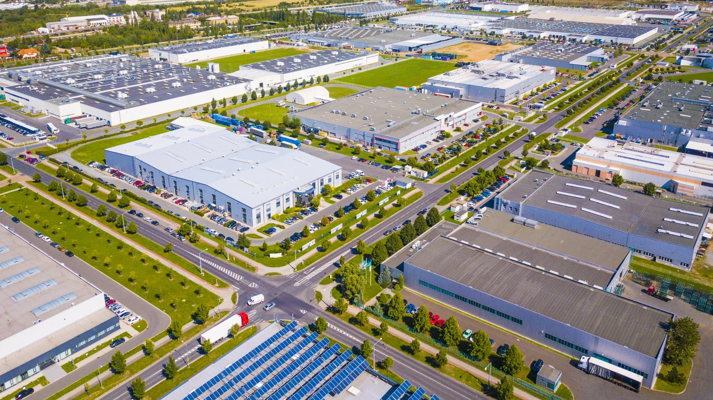

## Table of Contents

## What is an industrial zone?

An industrial zone is a special area where factories and businesses that make things are located. These zones are usually away from where people live, so the noise and pollution from the factories don't bother them. Governments set up these areas to help businesses grow and to create jobs for people.

In an industrial zone, you might see big buildings where cars, machines, or other products are made. There are also places for storing materials and finished goods. These zones help keep the economy strong by bringing different businesses together in one place, making it easier for them to work together and share resources.

## What are the different types of industrial zones?

Industrial zones can be divided into different types based on what they are used for. One type is called a heavy industrial zone. These areas are for big factories that make things like steel, chemicals, or cars. They need a lot of space and can be noisy and dirty, so they are kept away from where people live. Another type is a light industrial zone. These are for smaller businesses that make things like clothes, electronics, or furniture. They are usually cleaner and quieter than heavy industrial zones, so they can be closer to homes and shops.

There are also special economic zones, which are a bit different. These zones are set up to attract businesses from other countries by offering special benefits like lower taxes or fewer rules. They help bring in money and create jobs. Another type is a technology park, which is focused on high-tech businesses like computer software or biotech research. These parks often have special buildings and services to help these businesses grow and work together.

Overall, each type of industrial zone has its own purpose and helps the economy in different ways. They make it easier for businesses to operate and for people to find jobs that match their skills and interests.

## Why are industrial zones important for economic development?

Industrial zones are important for economic development because they help businesses grow and create jobs. When factories and companies are grouped together in one place, it's easier for them to work together and share resources. This can make it cheaper for them to make things, which can help them sell more and make more money. When businesses do well, they can hire more people, which means more jobs for the community. This can make the economy stronger because people have money to spend on things they need and want.

Another reason industrial zones are important is that they can attract businesses from other countries. Governments can offer special benefits like lower taxes or fewer rules to encourage foreign companies to set up in these zones. When foreign companies come, they bring money and new ideas with them, which can help the local economy grow even more. This can also lead to better technology and skills being shared with local workers, making the whole area more competitive and prosperous. Overall, industrial zones play a big role in helping economies grow by supporting businesses and creating jobs.

## How do industrial zones impact local communities?

Industrial zones can have a big impact on local communities. They create jobs, which is good for people who live nearby. When people have jobs, they can earn money to take care of their families and buy things they need. This can make the local economy stronger because people are spending money in shops and restaurants. Also, when businesses in the industrial zone do well, they might pay more taxes to the local government. This money can be used to build better schools, roads, and parks, which can make the community a nicer place to live.

However, industrial zones can also have some problems for local communities. They can cause pollution, like dirty air or water, which can make people sick. The noise and traffic from the factories can be annoying and make it hard for people to enjoy their homes. Sometimes, the land where the industrial zone is built used to be farmland or a natural area, and people might miss having that space. So, while industrial zones can bring jobs and money to a community, they can also bring challenges that need to be managed carefully to make sure everyone can live well.

## What are the key features of a successful industrial zone?

A successful industrial zone has good infrastructure. This means it has good roads, power, water, and internet. These things help businesses run smoothly. The zone should also be in a good location, easy to get to, and close to other businesses and services. This makes it easier for companies to work together and for workers to get to their jobs.

Another important feature is a clear set of rules and benefits. Governments can offer lower taxes or fewer regulations to attract businesses. This helps companies save money and focus on growing. The zone should also have a good mix of businesses, from big factories to small startups. This mix can create a strong community where companies can help each other and share ideas.

Lastly, a successful industrial zone needs to think about the environment and the local community. It should have plans to reduce pollution and noise, so it doesn't harm the people living nearby. The zone should also work with the community to create jobs and improve the area. When businesses and the community work together, everyone can benefit from the industrial zone's success.

## How are industrial zones regulated and managed?

Industrial zones are regulated and managed by governments to make sure they follow rules and work well. Governments set up rules about what businesses can do in the zone, like what they can make and how they should treat the environment. These rules help keep the zone safe and clean. Governments also check that businesses follow these rules by doing inspections and giving out permits. If a business doesn't follow the rules, the government can make them stop or even close them down.

Managing an industrial zone involves making sure it has everything businesses need to succeed. This includes good roads, power, water, and internet. The people in charge of the zone, often called a management authority, work to keep these services running well. They also help businesses work together and solve problems. The management authority might organize meetings or events to help companies share ideas and work better. This helps the whole zone grow and stay successful.

In some places, industrial zones are also managed with help from the community. Governments and businesses talk to people who live nearby to understand their needs and concerns. They might set up groups or committees to make sure the zone benefits everyone. This can include creating jobs for local people or helping to improve local schools and parks. By working together, industrial zones can be a good thing for both businesses and the community.

## What are the environmental considerations in industrial zones?

Industrial zones can affect the environment in many ways. Factories in these zones might make air and water dirty. They can also make a lot of noise and waste. Governments have rules to help keep the environment safe. These rules say how much pollution is allowed and how businesses should handle their waste. Businesses have to follow these rules to keep the air and water clean for everyone.

To help the environment, industrial zones can use special technology. This technology can clean the air and water before they leave the zone. Some zones also try to use less energy and make less waste. They can do this by recycling and using renewable energy like solar or wind power. By taking care of the environment, industrial zones can be good neighbors to the people who live nearby.

## How do industrial zones contribute to job creation?

Industrial zones help create jobs by bringing many businesses together in one place. When factories and companies are close to each other, they can work together and grow bigger. This means they need more workers to help make things, pack them, and send them to stores. So, people in the area can find jobs more easily because there are many businesses right in the industrial zone.

These jobs are important for the local community. When people have jobs, they can earn money to buy food, clothes, and other things they need. This helps the local economy because people are spending money in shops and restaurants. Also, when businesses in the industrial zone do well, they might pay more taxes. The government can use this money to build better schools, roads, and parks, which makes the community a nicer place to live.

## What are the challenges faced by industrial zones?

Industrial zones can face many challenges. One big problem is pollution. Factories in these zones can make the air and water dirty, which can make people sick. They can also make a lot of noise and waste. Governments have rules to help keep the environment safe, but it can be hard for businesses to follow all the rules and still make money. Another challenge is that industrial zones can be far away from where people live. This can make it hard for workers to get to their jobs, especially if they don't have a car or good public transportation.

Another challenge is competition. Industrial zones need to attract businesses to be successful, but there are many other zones around the world trying to do the same thing. Governments might offer lower taxes or fewer rules to bring in companies, but this can be expensive and hard to keep up. Also, industrial zones need good infrastructure like roads, power, and water to work well. If these services are not good, businesses might not want to come or stay in the zone. This can make it hard for the zone to grow and create jobs for the community.

## How do industrial zones integrate with global supply chains?

Industrial zones are important parts of global supply chains because they help businesses make and move things around the world. When factories in an industrial zone make products, they can send them to other countries quickly and easily. This is because industrial zones often have good transportation like roads, ports, and airports. These zones also attract businesses from different countries, which can work together to make and ship products. This helps the global supply chain run smoothly because businesses can get what they need and send out what they make without many problems.

Sometimes, industrial zones are set up as special economic zones, which have special rules to help businesses. These rules can make it cheaper and easier for companies to make things and send them to other countries. This can help the global supply chain because it makes it easier for businesses to work together across different countries. By being part of the global supply chain, industrial zones can help businesses grow and create jobs, which is good for the economy.

## What role do industrial zones play in technological advancement?

Industrial zones help with technological advancement by bringing together businesses that work on new ideas and inventions. When companies are close to each other, they can share their knowledge and work together on projects. This can lead to new technology being created faster. For example, in a technology park, businesses might be working on new computer software or medical research. By being in the same place, they can help each other solve problems and come up with new ideas.

Also, industrial zones often have special services and buildings that help businesses with technology. They might have labs where companies can test new products or places where they can learn about the latest technology. Governments can also offer money or other help to businesses in these zones to encourage them to work on new technology. This support can make it easier for companies to try new things and bring new technology to the market, which helps the whole economy grow.

## How can industrial zones be optimized for sustainability and efficiency?

Industrial zones can be made more sustainable and efficient by using new technology and smart planning. For example, factories can use machines that save energy and make less pollution. They can also use renewable energy like solar or wind power instead of dirty fuels. Good planning means putting businesses that work well together close to each other. This can help them share resources and make things more efficiently. Also, industrial zones can have recycling programs to reduce waste and use less water by treating and reusing it.

Another way to make industrial zones better is by working with the community and the environment. This means listening to people who live nearby and making sure the zone doesn't harm their health or their homes. Industrial zones can plant trees and create green spaces to help clean the air and make the area nicer. They can also have rules to make sure businesses follow laws about pollution and waste. By doing these things, industrial zones can be good for the economy and the environment at the same time.

## What is the Economic Significance of Industrial Zones?

Industrial zones, often referred to as industrial parks or areas, play a crucial role in GDP growth and employment generation across various economies. These zones are strategically planned and developed to enhance industrial activities, often offering businesses the advantage of infrastructure, tax incentives, and proximity to resources.

### Contribution to GDP Growth and Employment

Industrial zones contribute significantly to GDP growth by enhancing production capabilities and offering a concentrated area for manufacturing and services. By providing a localized environment for a broad range of industries, these zones streamline processes and reduce costs, directly contributing to increased economic output. This concentration of industries leads to job creation, as businesses require a skilled workforce to operate efficiently.

For instance, the **Shenzhen Special Economic Zone** in China transformed from a small town into a bustling metropolis and a leading manufacturing hub, significantly boosting China's GDP. Studies have shown that regions with well-developed industrial zones exhibit higher GDP growth rates compared to areas without such infrastructure.

### Multiplier Effect

The multiplier effect generated by industrial hubs is a pivotal aspect of their economic significance. The establishment of an industrial zone can lead to increased economic activity in surrounding areas. This effect occurs as businesses in these zones purchase goods and services from local suppliers, who in turn, invest in labor and materials, thus creating additional economic activity.

Mathematically, the multiplier effect can be expressed as:

$$
\text{Multiplier} = \frac{1}{1-MPC}
$$

where $\text{MPC}$ is the marginal propensity to consume. As the initial increase in economic activity occurs, the generated income leads to further consumption, thus perpetuating the cycle of economic growth.

### Facilitating Trade and Attracting Foreign Direct Investment (FDI)

Industrial zones facilitate trade by providing businesses with access to efficient logistics and transportation networks. Many industrial zones are located near ports, airports, and major highways, reducing the time and cost of shipping goods. This strategic positioning is crucial for businesses involved in global trade.

Moreover, industrial zones attract foreign direct investment (FDI) by offering favorable business environments, including low taxes, reduced tariffs, and simplified regulatory processes. The presence of multinational companies boosts local economies, increases employment opportunities, and enhances industrial expertise.

For instance, the **Jebel Ali Free Zone** in Dubai has attracted thousands of international companies due to its strategic location and business-friendly policies, contributing significantly to the United Arab Emirates' foreign trade and economic diversification.

### Case Studies

A few prominent examples illustrate the transformative impact of industrial zones:

1. **Silicon Valley, USA**: Originally an agricultural region, Silicon Valley's transformation into a global tech hub demonstrates the potential of industrial zones. The concentration of tech companies and startups has spurred innovation, driving economic growth and significantly contributing to the U.S. GDP.

2. **Shannon Free Zone, Ireland**: Established in 1959, it was one of the world's first Free Trade Zones and has had a substantial impact on Ireland's economy by attracting multinational corporations and boosting regional employment.

3. **Special Economic Zones in India**: These have been instrumental in enhancing industrial output and exports. For example, the Mundra SEZ in Gujarat has become a major trading hub, contributing to regional development and employment.

These case studies highlight how industrial zones can transform regional economies by enhancing manufacturing capacities, attracting investments, and generating employment.

 to Algorithmic Trading

Algorithmic trading is a method of executing trades using pre-programmed instructions that account for variables such as timing, price, and [volume](/wiki/volume-trading-strategy). In financial markets, this approach leverages computational algorithms to make decisions and place trades at speeds and frequencies unachievable by human traders. Often referred to as automated or black-box trading, it plays a critical role in enhancing market efficiency and [liquidity](/wiki/liquidity-risk-premium).

### Benefits of Algorithmic Trading

Algorithmic trading offers several advantages over traditional trading methods:

1. **Increased Trading Speed**: Algorithms can process vast amounts of market data and execute orders within milliseconds. This speed allows traders to capitalize on market movements and price inefficiencies far quicker than manual trading could.

2. **Reduced Transaction Costs**: By optimizing order execution, algorithms reduce market impact costs and take advantage of favorable pricing. The automation of trade processes also diminishes the need for manual intervention, thus lowering operational costs.

3. **Enhanced Liquidity**: Algorithmic trading contributes to deeper market liquidity by increasing the volume of buy and sell orders. This, in turn, narrows bid-ask spreads and stabilizes prices. Algorithms can also execute complex strategies, such as arbitrage, which further enhance market liquidity by exploiting price differences across markets.

### Technology and Infrastructure for Algorithmic Trading

Executing [algorithmic trading](/wiki/algorithmic-trading) strategies requires robust technological infrastructure and software solutions. Key components include:

- **High-Frequency Trading Platforms**: These platforms are equipped with the necessary algorithms to automatically generate and place orders. They must be capable of operating with low latency, as even microseconds can impact trade profitability.

- **Market Data Feeds**: Access to real-time market data is crucial for algorithmic trading. These feeds provide the raw data needed to make informed trade decisions. Latency in these feeds can lead to suboptimal trading outcomes.

- **Colocation Services**: To further minimize latency, traders often use colocation services, which involve placing their trading servers in the same location as the exchange's servers. This physical proximity ensures faster data transmission and execution times.

- **Risk Management Systems**: Given the high speed and volume of transactions, algorithmic trading demands advanced risk management systems to monitor and mitigate potential risks, such as market exposure and operational challenges.

Python is commonly used for developing algorithmic trading strategies due to its extensive libraries and adaptability. For instance, libraries like `Pandas` and `Numpy` are useful for data manipulation, whereas `Zipline` and `Backtrader` facilitate [backtesting](/wiki/backtesting) trading strategies.

```python
import pandas as pd

# Example of a moving average crossover strategy
def moving_average_crossover(data, short_window, long_window):
    signals = pd.DataFrame(index=data.index)
    signals['signal'] = 0.0

    # Compute short and long moving averages
    signals['short_mavg'] = data['Close'].rolling(window=short_window, min_periods=1, center=False).mean()
    signals['long_mavg'] = data['Close'].rolling(window=long_window, min_periods=1, center=False).mean()

    # Create buy/sell signals
    signals['signal'][short_window:] = np.where(signals['short_mavg'][short_window:] > signals['long_mavg'][short_window:], 1.0, 0.0)

    # Generate trading orders
    signals['positions'] = signals['signal'].diff()
    return signals
```

In summary, algorithmic trading utilizes sophisticated technological systems to enhance trading speed and efficiency, reduce costs, and improve market liquidity. The integration of state-of-the-art infrastructure is essential for its successful deployment and operation in today’s fast-paced financial markets.

## References & Further Reading

[1]: Bergstra, J., Bardenet, R., Bengio, Y., & Kégl, B. (2011). ["Algorithms for Hyper-Parameter Optimization."](https://dl.acm.org/doi/10.5555/2986459.2986743) Advances in Neural Information Processing Systems 24.

[2]: ["Advances in Financial Machine Learning"](https://www.amazon.com/Advances-Financial-Machine-Learning-Marcos/dp/1119482089) by Marcos Lopez de Prado

[3]: ["Evidence-Based Technical Analysis: Applying the Scientific Method and Statistical Inference to Trading Signals"](https://www.amazon.com/Evidence-Based-Technical-Analysis-Scientific-Statistical/dp/0470008741) by David Aronson

[4]: ["Machine Learning for Algorithmic Trading"](https://github.com/stefan-jansen/machine-learning-for-trading) by Stefan Jansen

[5]: ["Quantitative Trading: How to Build Your Own Algorithmic Trading Business"](https://www.amazon.com/Quantitative-Trading-Build-Algorithmic-Business/dp/1119800064) by Ernest P. Chan