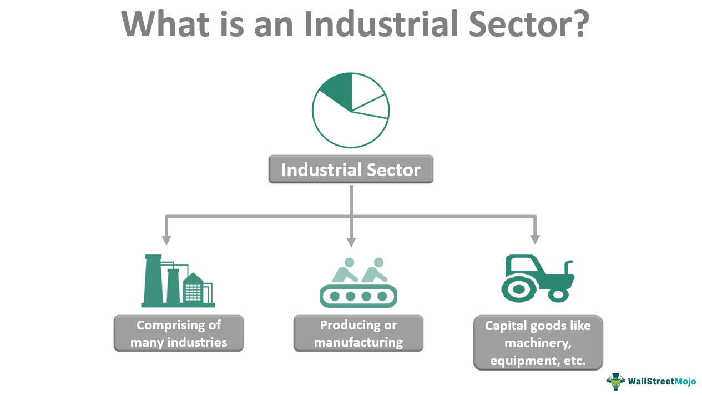

The rise of industrial zones and areas has been instrumental in shaping the landscape of modern economies. These zones serve as focal points for manufacturing, distribution, and trade, thereby bolstering economic development and generating employment. By facilitating the aggregation of industries, industrial zones create synergies that enhance productivity and innovation. They provide essential infrastructure, reduced transaction costs, and often offer tax incentives, positioning themselves as attractive locales for business operations.

At the same time, algorithmic trading has quietly revolutionized financial markets by introducing unparalleled speed and efficiency. This technology-driven approach to trading employs complex algorithms to make decisions and execute trades at a pace and volume unimaginable in traditional trading environments. Algorithmic trading reduces human error, enhances liquidity, and minimizes transaction costs, making it a cornerstone of modern finance.



This article examines the economic significance of industrial zones and highlights the convergence of algorithmic trading within these areas. Industrial zones not only support traditional industries but can also enhance financial activities through algorithmic trading. As hubs of economic activity, these zones can provide the advanced telecommunications and infrastructure necessary to support the data-intensive operations of algorithmic trading systems. The integration of these two domains presents a unique opportunity to optimize economic output and innovation.

Furthermore, the interplay between industrial activities and algorithmic trading may lead to novel synergies, such as the development of fintech innovation hubs. By leveraging the advantages of industrial zones, algorithmic trading can enhance the efficiency and competitiveness of industries located within these areas, ultimately acting as a catalyst for economic growth.

This exploration, therefore, underscores the potential of these zones to not only drive traditional industrial activities but also to support and enhance the rapidly evolving sector of algorithmic trading.

## Table of Contents

## Understanding Industrial Zones and Industrial Areas

Industrial zones and industrial areas are designated regions within a country or city that provide a focused environment for industrial activities, such as manufacturing, distribution, and technology development. These zones are characterized by enhanced infrastructure, specialized facilities, and regulatory frameworks that encourage industrial growth.

### Definition and Characteristics

Industrial zones can be defined as planned economic development areas that are designated for industrial enterprises and activities. These zones often feature elaborate infrastructure, such as transportation networks (roads, ports, and railways), utilities (water, electricity, and gas supply), and telecommunication systems specifically designed to meet the requirements of industrial operations. 

Characteristics of industrial zones include:
- **Zoning Regulations:** These regulations ensure the separation of industrial activities from residential areas, reducing noise, traffic, and pollution disturbances.
- **Infrastructure:** Access to high-quality infrastructure, including logistics and distribution facilities, is crucial for industrial efficiency.
- **Incentives and Policies:** Often, governments offer tax breaks, subsidies, or relaxed regulatory conditions to attract businesses.
- **Geographic and Strategic Positioning:** Location is pivotal, often near resources, markets, or transportation hubs to minimize logistic costs.

### Role in Economic Development and Urban Planning

Industrial zones play a significant role in economic development by:
- **Stimulating Local Economies:** They generate employment opportunities, contributing to GDP growth and raising the standard of living in nearby communities.
- **Encouraging Investment:** By offering a conducive environment for industrial growth, these zones attract both domestic and foreign direct investment (FDI).
- **Facilitating Technology Transfer:** They act as hubs where cutting-edge technologies are implemented and shared among enterprises, fostering innovation.

In urban planning, industrial zones are essential in organizing cities efficiently. They allow for concentrated areas of industrial activity, relieving residential zones from industrial byproducts.

### Key Features Attractive to Businesses

Businesses are attracted to industrial zones due to several features:
- **Infrastructure:** High-quality roads, power supplies, and communication networks that meet industrial needs.
- **Tax Incentives:** Various financial incentives reduce the operational costs for companies.
- **Strategic Location:** Proximity to major transportation channels facilitates efficient supply chain management, optimizing time and cost.

### Comparison of Industrial Zones Globally

Globally, industrial zones vary widely but share core objectives of economic stimulation and industrial accommodation. Successful models include:

- **Special Economic Zones (SEZs) in China:** These zones, like Shenzhen, have transformed from small towns to megacities by attracting massive foreign investments, offering vast labor resources, and integrating with global supply chains.

- **Tech Parks in Silicon Valley, USA:** Known for its concentration of technology companies and skilled workforce, Silicon Valley exemplifies how industrial zones can evolve into innovation epicenters.

- **Free Trade Zones (FTZ) in Dubai, UAE:** These zones offer 100% foreign ownership, zero taxation, and full repatriation of profits, becoming a gateway for international business.

Industrial zones are instrumental in shaping local and global economies by providing specialized environments that encourage industrial growth, technological innovation, and strategic urban planning. They have a considerable impact, evidenced by their ability to attract investment, create jobs, and foster economic development.

## Economic Significance of Industrial Zones

Industrial zones, often referred to as industrial parks or areas, play a crucial role in GDP growth and employment generation across various economies. These zones are strategically planned and developed to enhance industrial activities, often offering businesses the advantage of infrastructure, tax incentives, and proximity to resources.

### Contribution to GDP Growth and Employment

Industrial zones contribute significantly to GDP growth by enhancing production capabilities and offering a concentrated area for manufacturing and services. By providing a localized environment for a broad range of industries, these zones streamline processes and reduce costs, directly contributing to increased economic output. This concentration of industries leads to job creation, as businesses require a skilled workforce to operate efficiently.

For instance, the **Shenzhen Special Economic Zone** in China transformed from a small town into a bustling metropolis and a leading manufacturing hub, significantly boosting China's GDP. Studies have shown that regions with well-developed industrial zones exhibit higher GDP growth rates compared to areas without such infrastructure.

### Multiplier Effect

The multiplier effect generated by industrial hubs is a pivotal aspect of their economic significance. The establishment of an industrial zone can lead to increased economic activity in surrounding areas. This effect occurs as businesses in these zones purchase goods and services from local suppliers, who in turn, invest in labor and materials, thus creating additional economic activity.

Mathematically, the multiplier effect can be expressed as:

$$
\text{Multiplier} = \frac{1}{1-MPC}
$$

where $\text{MPC}$ is the marginal propensity to consume. As the initial increase in economic activity occurs, the generated income leads to further consumption, thus perpetuating the cycle of economic growth.

### Facilitating Trade and Attracting Foreign Direct Investment (FDI)

Industrial zones facilitate trade by providing businesses with access to efficient logistics and transportation networks. Many industrial zones are located near ports, airports, and major highways, reducing the time and cost of shipping goods. This strategic positioning is crucial for businesses involved in global trade.

Moreover, industrial zones attract foreign direct investment (FDI) by offering favorable business environments, including low taxes, reduced tariffs, and simplified regulatory processes. The presence of multinational companies boosts local economies, increases employment opportunities, and enhances industrial expertise.

For instance, the **Jebel Ali Free Zone** in Dubai has attracted thousands of international companies due to its strategic location and business-friendly policies, contributing significantly to the United Arab Emirates' foreign trade and economic diversification.

### Case Studies

A few prominent examples illustrate the transformative impact of industrial zones:

1. **Silicon Valley, USA**: Originally an agricultural region, Silicon Valley's transformation into a global tech hub demonstrates the potential of industrial zones. The concentration of tech companies and startups has spurred innovation, driving economic growth and significantly contributing to the U.S. GDP.

2. **Shannon Free Zone, Ireland**: Established in 1959, it was one of the world's first Free Trade Zones and has had a substantial impact on Ireland's economy by attracting multinational corporations and boosting regional employment.

3. **Special Economic Zones in India**: These have been instrumental in enhancing industrial output and exports. For example, the Mundra SEZ in Gujarat has become a major trading hub, contributing to regional development and employment.

These case studies highlight how industrial zones can transform regional economies by enhancing manufacturing capacities, attracting investments, and generating employment.

 to Algorithmic Trading

Algorithmic trading is a method of executing trades using pre-programmed instructions that account for variables such as timing, price, and [volume](/wiki/volume-trading-strategy). In financial markets, this approach leverages computational algorithms to make decisions and place trades at speeds and frequencies unachievable by human traders. Often referred to as automated or black-box trading, it plays a critical role in enhancing market efficiency and [liquidity](/wiki/liquidity-risk-premium).

### Benefits of Algorithmic Trading

Algorithmic trading offers several advantages over traditional trading methods:

1. **Increased Trading Speed**: Algorithms can process vast amounts of market data and execute orders within milliseconds. This speed allows traders to capitalize on market movements and price inefficiencies far quicker than manual trading could.

2. **Reduced Transaction Costs**: By optimizing order execution, algorithms reduce market impact costs and take advantage of favorable pricing. The automation of trade processes also diminishes the need for manual intervention, thus lowering operational costs.

3. **Enhanced Liquidity**: Algorithmic trading contributes to deeper market liquidity by increasing the volume of buy and sell orders. This, in turn, narrows bid-ask spreads and stabilizes prices. Algorithms can also execute complex strategies, such as arbitrage, which further enhance market liquidity by exploiting price differences across markets.

### Technology and Infrastructure for Algorithmic Trading

Executing [algorithmic trading](/wiki/algorithmic-trading) strategies requires robust technological infrastructure and software solutions. Key components include:

- **High-Frequency Trading Platforms**: These platforms are equipped with the necessary algorithms to automatically generate and place orders. They must be capable of operating with low latency, as even microseconds can impact trade profitability.

- **Market Data Feeds**: Access to real-time market data is crucial for algorithmic trading. These feeds provide the raw data needed to make informed trade decisions. Latency in these feeds can lead to suboptimal trading outcomes.

- **Colocation Services**: To further minimize latency, traders often use colocation services, which involve placing their trading servers in the same location as the exchange's servers. This physical proximity ensures faster data transmission and execution times.

- **Risk Management Systems**: Given the high speed and volume of transactions, algorithmic trading demands advanced risk management systems to monitor and mitigate potential risks, such as market exposure and operational challenges.

Python is commonly used for developing algorithmic trading strategies due to its extensive libraries and adaptability. For instance, libraries like `Pandas` and `Numpy` are useful for data manipulation, whereas `Zipline` and `Backtrader` facilitate [backtesting](/wiki/backtesting) trading strategies.

```python
import pandas as pd

# Example of a moving average crossover strategy
def moving_average_crossover(data, short_window, long_window):
    signals = pd.DataFrame(index=data.index)
    signals['signal'] = 0.0

    # Compute short and long moving averages
    signals['short_mavg'] = data['Close'].rolling(window=short_window, min_periods=1, center=False).mean()
    signals['long_mavg'] = data['Close'].rolling(window=long_window, min_periods=1, center=False).mean()

    # Create buy/sell signals
    signals['signal'][short_window:] = np.where(signals['short_mavg'][short_window:] > signals['long_mavg'][short_window:], 1.0, 0.0)

    # Generate trading orders
    signals['positions'] = signals['signal'].diff()
    return signals
```

In summary, algorithmic trading utilizes sophisticated technological systems to enhance trading speed and efficiency, reduce costs, and improve market liquidity. The integration of state-of-the-art infrastructure is essential for its successful deployment and operation in today’s fast-paced financial markets.

## Synergy Between Industrial Zones and Algorithmic Trading

Industrial zones have traditionally served as epicenters for manufacturing and trade, evolving to incorporate advanced technologies and digital infrastructures. The integration of algorithmic trading within these zones signifies a new era in which industrial and financial technologies collaborate, enhancing both sectors' productivity and innovation potential.

Advanced telecommunications and data centers form the backbone of algorithmic trading operations, ensuring seamless execution of trades at high speeds and with low latency. These critical infrastructures are increasingly being established within industrial zones due to their strategic advantages. Industrial zones provide robust connectivity solutions through high-speed internet and reliable electricity supply, vital for the algorithmic trading processes that require processing vast arrays of data in real-time. Data centers, often housed within these zones, offer the requisite processing power and storage capabilities to support complex computational tasks involved in algorithmic trading.

Moreover, economic zones, particularly those with a focus on technology and innovation, have the potential to become hubs for fintech and algorithmic trading companies. The concentration of technology firms, financial institutions, and startups fosters collaboration and knowledge sharing. Industrial zones are increasingly adopting industry-specific focus, such as fintech clusters, where the presence of shared resources and infrastructure reduces operational costs and enhances efficiency for algorithmic trading enterprises.

As centers of innovation, these zones can facilitate the development and testing of new algorithmic trading strategies and technologies. The presence of regulatory sandboxes, for instance, allows fintech companies to experiment with innovative financial products under a controlled environment, providing a platform for regulatory engagement and risk assessment.

The synergy between industrial zones and algorithmic trading is exemplified by the growth of smart industrial parks, which integrate digital technologies and sustainable practices. These parks offer a conducive environment for the convergence of manufacturing and financial activities, supported by cutting-edge telecommunications and data infrastructure. By fostering an ecosystem that nurtures both industrial production and digital innovation, industrial zones can catalyze advancements in algorithmic trading, driving economic growth and development.

## Challenges and Considerations

Industrial zones and algorithmic trading present significant economic opportunities, yet they also pose several environmental, social, regulatory, and security challenges that need addressing to ensure sustainable development.

### Environmental and Social Challenges

Industrial zones often contribute to pollution and public health concerns. The concentration of manufacturing activities can result in substantial emissions of greenhouse gases, pollutants, and waste. Factories may release volatile organic compounds (VOCs), particulate matter (PM), and other pollutants, adversely affecting air quality. Additionally, industrial activities can lead to soil and water contamination through the improper disposal of hazardous materials.

Socially, the establishment of industrial zones can strain local communities. The influx of workers seeking employment opportunities often leads to increased demand for housing, education, and healthcare, potentially outpacing the local infrastructure's ability to support the growth. Moreover, there can be significant dislocation of communities as land is repurposed for industrial development, impacting their traditional livelihoods.

### Regulatory and Security Challenges in Algorithmic Trading

Algorithmic trading is characterized by high-speed transactions conducted by complex algorithms, which introduce specific regulatory and security challenges. One significant concern is market manipulation, where traders might use algorithms to artificially influence stock prices or trading volumes. The flash crash of 2010 is often cited as a result of algorithmic trading gone awry, highlighting the potential for large-scale financial disruptions.

Regulatory bodies are challenged to keep pace with the rapid technological advances in trading algorithms, requiring robust frameworks to ensure market integrity and investor protection. Regulatory measures may include stringent requirements for algorithm testing, real-time monitoring, and reporting to minimize systemic risks.

### Balancing Economic Benefits with Sustainable Development

To align economic growth with sustainable development goals, industrial zones must adopt strategies that minimize environmental impacts while maximizing economic benefits. Promoting the development of eco-industrial parks can be one solution, where businesses cooperate to optimize resource efficiency and reduce waste. This involves the integration of renewable energy sources, recycling initiatives, and sustainable waste management practices into the design and operation of industrial areas.

On the algorithmic trading front, the incorporation of [artificial intelligence](/wiki/ai-artificial-intelligence) (AI) and [machine learning](/wiki/machine-learning) can enhance risk management and improve market stability, ensuring that financial systems contribute positively to economic sustainability. Moreover, fostering transparency and regulatory compliance can build trust among stakeholders, supporting a stable financial ecosystem.

Overall, addressing the challenges posed by industrial zones and algorithmic trading requires comprehensive approaches that incorporate technological advancements, regulatory oversight, and community engagement to achieve harmonious and resilient economic growth.

## Future Trends and Opportunities

Emerging trends in industrial zone development indicate a shift towards sustainable and technologically advanced models, with green and digital industrial parks gaining prominence. These parks integrate environmentally-friendly practices, such as renewable energy sources, waste reduction, and sustainable transportation options, to minimize their ecological footprint. The emergence of digital industrial parks exemplifies the blend of traditional industry with cutting-edge technology, providing advanced infrastructure that supports IT and telecommunications needs. These developments not only address environmental concerns but also enhance the competitiveness and appeal of industrial zones to forward-thinking businesses.

Economic zones, especially Special Economic Zones (SEZs), present significant opportunities to incorporate artificial intelligence (AI) and machine learning into algorithmic trading. AI algorithms can optimize trading strategies by analyzing vast datasets to identify patterns and forecast market movements, thus improving decision-making and minimizing risks. Machine learning models can adapt to new data, continuously refining their predictive capabilities. The presence of robust data centers and high-speed internet within SEZs can facilitate this technological integration, making these zones attractive hubs for fintech innovation and algorithmic trading advancements.

In the aftermath of the COVID-19 pandemic, economic zones are pivotal in global economic recovery and trade realignment. SEZs can act as conduits for reshoring manufacturing, mitigating supply chain disruptions, and fostering economic diversification. The strategic location and infrastructural advantages of these zones can help businesses adapt to changing trade landscapes by reducing dependency on distant supply chains and encouraging local production. By promoting investment in technology and sustainable practices, industrial zones can play a central role in stabilizing and revitalizing the global economy, fostering a more resilient and adaptable trade network.

## Conclusion

Industrial zones and algorithmic trading have significantly contributed to the evolution and efficiency of modern economies. Industrial zones offer structured environments where manufacturing and trade activities thrive, supported by robust infrastructure and strategic locations. These areas not only boost GDP growth and create employment opportunities but also facilitate international trade and attract foreign investments. By serving as economic drivers, industrial zones create a multiplier effect that extends economic benefits beyond their geographical limits.

Algorithmic trading, on the other hand, has transformed financial markets through increased speed and reduced costs. It harnesses technology to optimize trading operations, improving market liquidity and price stability. As financial activities become increasingly digitized, algorithmic trading supports the economic functionality of financial hubs by leveraging data centers and telecommunications advancements.

The potential for growth and innovation at the intersection of industrial zones and algorithmic trading is considerable. As technology continues to advance, these zones can facilitate burgeoning fintech activities, with robust telecommunications infrastructure enhancing algorithmic trading capabilities. The synergy between these domains underscores the role of industrial areas not only as manufacturing centers but also as potential hubs for financial and technological innovation.

Strategically developing industrial zones can further bolster global economic interconnectedness. By integrating sustainable practices and advanced technologies such as AI, these zones can evolve into modern economic powerhouses. This development aligns with the dynamic shifts in global trade and economic recovery post-pandemic. As such, the strategic advancement of industrial zones will be pivotal in accommodating and catalyzing future economic trends and facilitating deeper integration into the global economy.

## References & Further Reading

[1]: Bergstra, J., Bardenet, R., Bengio, Y., & Kégl, B. (2011). ["Algorithms for Hyper-Parameter Optimization."](https://dl.acm.org/doi/10.5555/2986459.2986743) Advances in Neural Information Processing Systems 24.

[2]: ["Advances in Financial Machine Learning"](https://www.amazon.com/Advances-Financial-Machine-Learning-Marcos/dp/1119482089) by Marcos Lopez de Prado

[3]: ["Evidence-Based Technical Analysis: Applying the Scientific Method and Statistical Inference to Trading Signals"](https://www.amazon.com/Evidence-Based-Technical-Analysis-Scientific-Statistical/dp/0470008741) by David Aronson

[4]: ["Machine Learning for Algorithmic Trading"](https://github.com/stefan-jansen/machine-learning-for-trading) by Stefan Jansen

[5]: ["Quantitative Trading: How to Build Your Own Algorithmic Trading Business"](https://www.amazon.com/Quantitative-Trading-Build-Algorithmic-Business/dp/1119800064) by Ernest P. Chan