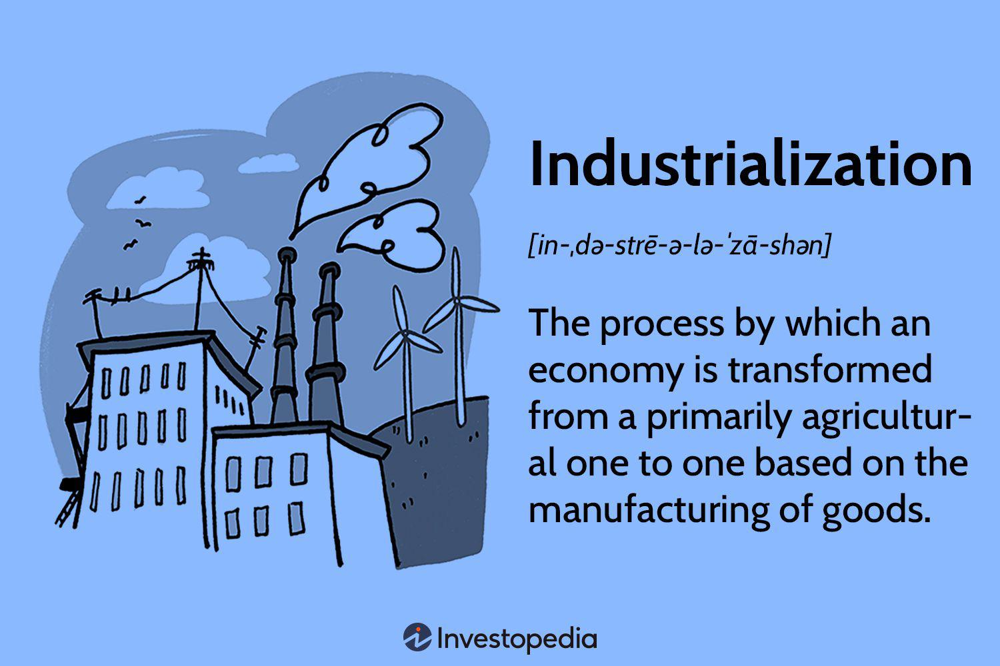

Industrialization and algorithmic trading (algo trading) have significantly influenced economic landscapes and financial markets. Industrialization marks the shift from agrarian economies to those dominated by industry and manufacturing, heralding an era of mechanized mass production and technological advancement. This period brought about urbanization, transformed labor markets, and gave rise to the modern industrial society. Such shifts reshaped industries, created new livelihoods, and altered global economic dynamics, making industrialization a cornerstone of modern economic history.

Conversely, algorithmic trading emerged with the advancement of technology in financial markets. By utilizing computer algorithms to automate trading decisions and executions, algo trading processes vast amounts of data at speeds unreachable by human traders, often occurring within milliseconds. This technological phenomenon has dramatically increased market liquidity and efficiency but also introduced complexities like increased volatility and a growing debate on market fairness, especially with the rise of high-frequency trading.



Both industrialization and algo trading underscore the transformative power of technology over economic systems. They illustrate how technological advancements can both facilitate growth and present new challenges, urging societies to balance innovation with ethical and regulatory considerations. This article aims to elucidate the societal impact of industrialization, examine specific examples, and analyze the profound influence algo trading has had on today's financial markets.

## Table of Contents

## Understanding Industrialization

Industrialization marks a significant transformation from agrarian economies, which were primarily based on agriculture and manual labor, to economies characterized by industries focused on mass production and manufacturing. This shift is often associated with the period known as the Industrial Revolution, which began in the late 18th century and continued into the 19th century, primarily in Europe and North America. The essence of industrialization lies in its ability to produce goods on a large scale through the extensive use of machinery, which replaced the traditional handcraft methods that were prevalent during the pre-industrial times.

The transition to industrial economies is intrinsically linked to substantial economic growth and technological advancements. Key technological innovations played a pivotal role in this transformation—steam engines, mechanized textile equipment, and advances in metallurgy, such as the production of iron and steel, formed the backbone of industrial capabilities. These technological advancements enabled factories to increase their productivity exponentially. For instance, the introduction of the steam engine by James Watt improved the efficiency of machinery across various industries, creating more opportunities for economic expansion and wealth generation.

Mechanized mass production emerged as a fundamental element of industrialization, bringing profound changes to society. The efficiency brought about by the use of machines allowed for the production of a larger quantity of goods, making products more accessible and affordable for the general population. This new mode of production contributed not only to economic growth but also to shifts in social structures. The factory system replaced the earlier domestic system, concentrating production in centralized locations and requiring substantial numbers of workers to operate machinery. This created a demand for labor, leading to the migration of workers from rural to urban areas, and giving rise to industrial cities.

The societal implications of mechanized mass production were significant, resulting in changes in employment patterns, living conditions, and social relationships. It introduced the concept of wage labor and began to redefine class structures, as families moved from subsistence living to working for wages in factories. The need for a skilled workforce drove improvements in education and training systems, contributing to a more educated population that could meet the demands of industrial labor.

Overall, industrialization not only initiated an era of unprecedented economic growth but also reshaped the social fabric by altering the way people lived and worked. The technological advancements made during this period set the foundation for future innovations and continue to influence the modern economic landscape.

## Societal Impact of Industrialization

Industrialization marked a major turning point in history, bringing widespread changes to societal structures and living conditions. It is commonly associated with increased urbanization, as populations shifted from rural regions to urban centers in search of better employment opportunities and living standards. This demographic shift significantly transformed the landscape of societies worldwide, leading to the expansion of cities and the development of new urban areas.

One of the primary societal impacts of industrialization was the rise of a middle class. The shift from agrarian economies to industrial production created new job opportunities in factories, businesses, and services, which were predominantly based in urban settings. Improved employment prospects and the accumulation of wealth enabled many individuals to transition from subsistence farming to more stable and lucrative occupations, fostering the growth of a middle class with increased purchasing power and consumer demand.

Despite the overall improvement in living standards, industrialization also introduced significant labor-related challenges. The rapid urbanization and demand for factory labor led to overcrowded living conditions, inadequate infrastructure, and poor sanitation in many cities. Factory workers often faced long hours, low wages, and unsafe working conditions, which sometimes resulted in exploitation and social unrest. The need for reform became apparent as these labor issues persisted, paving the way for labor rights movements and legislation to protect workers.

The societal shifts brought about by industrialization also affected family structures, education systems, and economic disparities. Traditional family dynamics underwent changes as individuals, particularly women and children, entered the workforce to support their households. This shift challenged established norms and contributed to evolving gender roles within families and society.

Education systems began to evolve in response to industrial needs, emphasizing literacy, numeracy, and technical skills to equip individuals for new types of employment. The demand for educated workers stimulated the expansion of public education and vocational training programs, ultimately contributing to higher literacy rates and better-educated populations.

However, industrialization also exacerbated economic disparities, with wealth and power becoming concentrated in the hands of industrial capitalists and factory owners. The widening gap between the wealthy and the working class fostered social tensions and called for economic reforms to address inequality.

In conclusion, industrialization was a catalyst for profound societal transformations, empowering many while also presenting significant challenges. Its legacy is reflected in the urbanized, industrial economies of today, where the need to balance economic progress with social welfare remains a central issue.

## Key Examples of Industrialization's Impact

Manufacturing, transportation, and mining are key areas where industrialization has had a profound impact, reshaping economies and societies.

**Manufacturing**: Industrialization revolutionized manufacturing processes, exemplified by the invention of the cotton gin, developed by Eli Whitney in 1793. This innovation dramatically increased the efficiency of cotton processing by rapidly separating cotton fibers from their seeds, which had previously been done by hand. The cotton gin enabled mass production in the textile industry, significantly boosting cotton supply and reducing production costs. This advancement not only transformed the textile industry but also played a crucial role in the expansion of the cotton economy, particularly in the Southern United States. The increased efficiency in manufacturing propelled economic growth and facilitated the rise of factory-based production systems, laying the groundwork for modern industrial economies.

**Transportation**: The advent of steam-powered locomotives and steamboats marked a pivotal moment in transportation during the industrial revolution. Steam locomotives, such as those developed by George Stephenson in the early 19th century, enabled the rapid movement of goods and people over land. The construction of extensive railway networks connected distant regions, fostering trade and economic integration. Similarly, the development of steamboats by innovators like Robert Fulton revolutionized water transport by providing reliable and efficient means of navigating rivers and oceans. These transportation innovations reduced travel time and costs, stimulated commerce, and facilitated the movement of resources and labor, contributing significantly to the economic dynamism of the industrial age.

**Mining**: Industrialization also ushered in significant advancements in the mining sector, which was crucial for supplying raw materials essential for industrial activities. Technological innovations, such as the development of steam-powered mining equipment and improved extraction techniques, increased the efficiency and scale of mining operations. These advancements enabled the extraction of coal and other minerals necessary for powering steam engines and manufacturing processes. The increased availability of these resources was instrumental in supporting the expanding infrastructure and industries of the time. Furthermore, innovations in mining catalyzed technological progress in other sectors, including metallurgy and engineering, driving further industrial development.

Industrialization's impact on manufacturing, transportation, and mining not only transformed these sectors but also contributed to widespread economic and societal changes, fostering urbanization, shaping labor markets, and altering global economic dynamics.

## What is Algorithmic Trading?

Algorithmic trading, often referred to simply as "algo trading," is a method of executing orders through the use of automated, pre-programmed trading instructions that account for variables such as time, price, and [volume](/wiki/volume-trading-strategy). These algorithms are designed to make trading decisions at speeds and frequencies that would be impossible for a human trader. By harnessing the power of sophisticated mathematical models and extensive datasets, [algorithmic trading](/wiki/algorithmic-trading) allows for the processing and analysis of financial data at an exceptionally rapid pace.

A significant advantage of algorithmic trading lies in its capacity to handle large datasets efficiently and execute trades at speeds measured in milliseconds or even microseconds. This speed is achieved by leveraging powerful computational power and advanced mathematical techniques to optimize the timing, pricing, and quantity of trades. Traders and firms utilize a variety of algorithms, including those based on statistical [arbitrage](/wiki/arbitrage), [market making](/wiki/market-making), [trend following](/wiki/trend-following), and [machine learning](/wiki/machine-learning).

Algorithmic trading has reshaped the financial markets, with estimates suggesting it accounts for a substantial portion of stock market activity. In fact, studies indicate that algo trading represents over half of equity market volumes in major financial markets. This shift has eclipsed manual trading, as algorithms provide the ability to exploit market inefficiencies and respond swiftly to market signals.

The codes used in algorithmic trading are often implemented in programming languages such as Python or C++, which allow for efficient data handling and complex numerical calculations. A simple example of a trading algorithm in Python might involve a moving average crossover strategy:

```python
import pandas as pd

# Load historical price data
data = pd.read_csv('stock_data.csv')

# Calculate moving averages
data['Short_MA'] = data['Close'].rolling(window=50).mean()
data['Long_MA'] = data['Close'].rolling(window=200).mean()

# Generate trading signals
data['Signal'] = 0
data.loc[data['Short_MA'] > data['Long_MA'], 'Signal'] = 1
data.loc[data['Short_MA'] < data['Long_MA'], 'Signal'] = -1

# Execute trades based on signals
for i in range(1, len(data)):
    if data['Signal'][i] > data['Signal'][i-1]:
        print(f"Buy on day {i}, Price: {data['Close'][i]}")
    elif data['Signal'][i] < data['Signal'][i-1]:
        print(f"Sell on day {i}, Price: {data['Close'][i]}")
```

This code snippet demonstrates how an algorithm might generate buy and sell signals based on the intersection of short-term and long-term moving averages. Such strategies can be customized and refined to reflect specific market conditions and trader preferences.

In summary, algorithmic trading represents a transformative evolution in financial markets, characterized by speed, precision, and the ability to handle substantial volumes of trades. While it provides significant advantages in terms of market efficiency and [liquidity](/wiki/liquidity-risk-premium), it also introduces complex challenges concerning market regulation and stability.

## Societal Impact of Algo Trading

Algorithmic trading, commonly known as algo trading, has significantly transformed financial markets by enhancing market liquidity and efficiency. The automation of trading processes through complex algorithms allows for the seamless processing of vast datasets and rapid execution of trades, often within milliseconds. This capacity has made financial markets more accessible to a broader audience, as the barriers to entry have been lowered, and transactions have become more efficient and less costly.

However, algo trading is not without its criticisms. One major concern is its contribution to market [volatility](/wiki/volatility-trading-strategies), particularly during events dubbed as 'flash crashes.' These are sudden, severe market downturns followed by swift recoveries, which are exacerbated or sometimes even triggered by the rapid pace of algorithmic trades. For instance, the Flash Crash of May 6, 2010, witnessed the Dow Jones Industrial Average plummet nearly 1,000 points within minutes before bouncing back, an event largely attributed to the breakdown of automated trading systems.

Further concerns arise from the proliferation of high-frequency trading ([HFT](/wiki/high-frequency-trading-strategies)), a subset of algo trading characterized by extremely high-speed transactions. HFT has improved liquidity and narrowed bid-ask spreads, benefiting market stability under regular conditions. However, it has prompted debates regarding fairness, as HFT firms, equipped with sophisticated algorithms and superior technology, may hold an undue competitive advantage over traditional traders. This technological edge has caused apprehension about the integrity and equality of competition in financial markets.

Moreover, the rise of algo trading raises ethical and regulatory issues, as the sheer speed and volume of trading can amplify systemic risks. The interplay between machine-driven trading and human oversight is complex, necessitating robust monitoring and regulation to preclude manipulative practices, such as spoofing, where orders are placed with the intent to cancel before execution, misleading market participants.

In summary, while algorithmic trading has undeniably modernized financial markets by increasing liquidity and efficiency, it also poses significant challenges. The balance between technological innovation and maintaining a fair, stable market environment remains a pivotal area for regulators and market participants alike.

## Comparing Industrialization and Algo Trading

Both industrialization and algorithmic trading have dramatically transformed their respective spheres, manufacturing, and financial markets. Industrialization marked the transition from agrarian societies to industrial economies, leading to mass production and significantly altering societal frameworks. Algorithmic trading, on the other hand, revolutionized financial markets through the automation of trading processes, enabling large volumes of trades to occur at speeds unattainable by human traders.

These transformations have led to notable advancements. Industrialization drove technological innovation, increased productivity, and contributed to urbanization and the rise of a middle class. Similarly, algorithmic trading has enhanced market liquidity, improved access, and increased efficiency in trade execution through the use of sophisticated algorithms that analyze vast datasets.

However, both phenomena also introduced challenges that necessitate new regulatory and ethical considerations. The rapid expansion of industrialization brought about labor exploitation, environmental degradation, and widened economic inequalities, prompting the development of labor laws and environmental regulations. Algorithmic trading, particularly high-frequency trading (HFT), has been criticized for contributing to market volatility, exemplified by occurrences like "flash crashes." This has sparked debates over market fairness and the ethical implications of speed-based competition, leading to calls for regulatory oversight to maintain stability and ensure equitable market practices.

The comparison between industrialization and algorithmic trading underscores broader themes of technological advancement vis-à-vis societal impact. In both cases, technological progress has sparked economic growth and introduced efficiencies but also challenges traditional ethical frameworks and complicates regulatory landscapes. As society continues to grapple with these changes, a balance must be struck between embracing technological benefits and safeguarding societal welfare. This ongoing narrative reflects the essential need for adaptive regulatory structures that can address the dual forces of innovation and social responsibility.

## Regulatory Considerations

The progression of industrialization necessitated the development of legal frameworks to protect labor rights and address environmental concerns. This evolution in legislation was crucial as industrialization introduced new work environments and production methods, which often posed risks to workers and the environment. Labor laws emerged to standardize working hours, improve working conditions, and prevent child labor, while regulations aimed at environmental protection addressed the pollution and resource depletion that accompanied industrial activities.

Algorithmic trading, much like industrialization, presents its own set of regulatory challenges that require careful consideration. The rapid and automated nature of algo trading, especially high-frequency trading (HFT), can sometimes destabilize markets, as observed during so-called "flash crashes." These events have highlighted the need for regulatory oversight to ensure market stability and protect investors. Algo trading's complexity and speed have outpaced traditional regulatory measures, prompting the development of more sophisticated approaches to maintain fairness and transparency in financial markets.

Smart regulation is essential in distinguishing beneficial technologies in algo trading from those that pose risks. A regulatory framework that supports innovation while minimizing potential harm requires a nuanced understanding of how these technologies function and impact market dynamics. Regulators must collaborate with financial technology experts to enhance their capabilities in monitoring and evaluating algorithmic trades.

Future regulations may incorporate advanced technologies, such as machine learning models, to predict and mitigate market anomalies caused by algorithmic trading. For example, using Python libraries like scikit-learn, regulators could develop predictive models that analyze historical trade data to identify patterns indicative of potential market disruptions:
```python
from sklearn.model_selection import train_test_split
from sklearn.ensemble import RandomForestClassifier
from sklearn.metrics import classification_report

# Sample data preparation
# data: assumed historical trade dataset with features and target variable 'anomaly'
data = ...

# Splitting the dataset
X = data.drop('anomaly', axis=1)
y = data['anomaly']
X_train, X_test, y_train, y_test = train_test_split(X, y, test_size=0.2, random_state=42)

# Model training
model = RandomForestClassifier(n_estimators=100, random_state=42)
model.fit(X_train, y_train)

# Predictions and evaluation
y_pred = model.predict(X_test)
print(classification_report(y_test, y_pred))
```

Through initiatives like these, regulators can proactively address the challenges posed by algorithmic trading, ensuring that financial markets remain robust and equitable. As technology continues to evolve, regulation will need to strike a balance between fostering innovation and safeguarding against the unintended consequences of rapid technological advances.

## Conclusion

The journey from industrialization to modern algorithmic trading encapsulates a narrative of continuous innovation, profound disruption, and inevitable adaptation. As industrialization once reshaped agrarian societies into industrial powerhouses, algorithmic trading is now redefining the landscape of financial markets with its speed, precision, and technological prowess. 

Both industrialization and algorithmic trading reveal the delicate balancing act required between technological advancements and societal welfare. The mechanization of industry significantly enhanced production capabilities and living standards but also posed labor-related and environmental challenges. Similarly, while algorithmic trading introduces efficiency and liquidity to markets, it also raises concerns over volatility, market fairness, and accessibility.

The future trajectory of these transformative forces will inevitably continue to influence societal norms and economic frameworks. Emerging technologies and innovations in both manufacturing and financial sectors will demand vigilant oversight and adaptive regulatory measures. Ensuring that technological progress serves the broader societal good necessitates policies that address the socio-economic disparities and ethical considerations that accompany such transformative changes.

Ultimately, the dynamic between technological evolution and social impact highlights the importance of fostering an environment that encourages innovation while safeguarding the well-being of society. As industries and markets evolve, so too must the approaches to integrating technology into the fabric of everyday life, striving for an equilibrium that benefits both economic advancement and societal welfare.

## References & Further Reading

[1]: Mokyr, J. (1998). ["The Second Industrial Revolution, 1870-1914."](https://faculty.wcas.northwestern.edu/jmokyr/castronovo.pdf) In R. Whaples (Ed.), EH.Net Encyclopedia.

[2]: Bernanke, B. S., & Gertler, M. (1999). ["The Economic Consequences of the Industrial Revolution."](https://www.sciencedirect.com/science/article/pii/S157400489910034X) National Bureau of Economic Research, Working Paper No. 7207.

[3]: Rothschild, M. (1990). ["The Industrial Revolution: Trends and New Perspectives."](https://archive.org/details/bionomicseconomy0000roth) National Institute Economic Review, 133(1), 53-85.

[4]: MacKenzie, D. (2005). ["Mechanizing the Merc: The Introduction of Computers to Financial Markets."](https://direct.mit.edu/books/monograph/2641/Mechanizing-ProofComputing-Risk-and-Trust) Socio-Economic Review, 3(1), 129-164.

[5]: Aldridge, I. (2010). ["High-Frequency Trading: A Practical Guide to Algorithmic Strategies and Trading Systems."](https://www.amazon.com/High-Frequency-Trading-Practical-Algorithmic-Strategies/dp/1118343506) Wiley Trading.