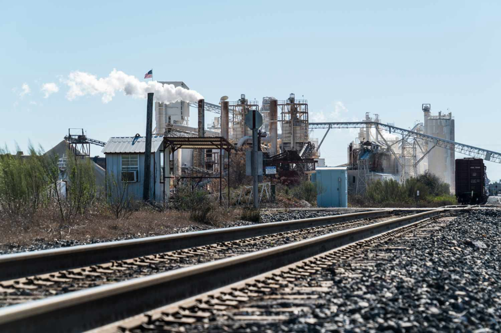

Economic development, industrialization, and urbanization are interconnected processes that have significantly reshaped societies globally over the past few centuries. These phenomena have driven profound transformations in economic structures, societal norms, and physical landscapes. The historical backdrop of these changes can be traced back to the Industrial Revolution, which marked the transition from agrarian economies to industrial societies. This period ushered in technological advancements and economic incentives that have driven urbanization, resulting in the dense cityscapes we see today. As technology progressed, these developments laid the groundwork for modern economic systems and transformations.

Urbanization has been a direct outcome of industrialization, where cities emerged as focal points for commerce, innovation, and cultural exchange. Initially, this urban growth was fueled by the establishment of factories and the promise of jobs, leading to mass migration from rural to urban areas. Over time, urban centers have become hubs for economic activity and technological advancement, fostering a dynamic environment for continued development. The strategic location of these urban areas, often near water sources, underscores their role in supporting industrial growth and economic development.



In contemporary settings, the evolution of financial markets has been significantly impacted by algorithmic trading, a technological leap in the financial sector. This form of trading leverages automation to execute trades with high frequency and precision, enhancing market liquidity and efficiency. Algorithmic trading epitomizes the integration of technology in urban economic landscapes, highlighting how innovation continues to shape modern economies. This evolution not only improves market operations but also aligns with broader technological advancements within urban centers.

Understanding the interplay between economic development, industrialization, and urbanization is crucial for forecasting future trends and addressing emerging challenges. Historical patterns provide valuable insights into how these processes have developed and interacted over time, offering a lens to anticipate future shifts in economic landscapes. As technological advancements continue to emerge, their potential impacts on urbanization and economic structures must be carefully studied to facilitate sustainable and inclusive growth. Balancing these factors will be paramount for stakeholders aiming to harness opportunities while navigating the challenges of future economic development.

## Table of Contents

## Economic Development and Industrialization

Industrialization signifies a pivotal transformation through which societies transitioned from agrarian-based economies to industrial powerhouses. This transition began prominently with the Industrial Revolution during the late 18th and 19th centuries, which brought about revolutionary changes in production processes. The era was characterized by the mechanization of industries, the rise of factory systems, and significant improvements in transportation infrastructure.

Mechanization played a crucial role as machinery replaced manual labor, dramatically increasing production scales and efficiency. The steam engine's innovation, for example, powered factories and revolutionized industries such as textiles and mining. Factory systems emerged, concentrating production processes within centralized locations, which optimized labor utilization and reduced production costs. Furthermore, advancements in transportation, particularly the expansion of the rail and canal networks, facilitated the swift movement of goods and raw materials, linking previously isolated regions to burgeoning economic hubs.

The effects of industrialization directly correlated with substantial job creation, as factories required a large workforce, stimulating urban migration and establishing a foundation for modern economic policies. The shift brought about a significant increase in economic growth, as industrial productivity contributed to a rising GDP and increased living standards. This economic expansion allowed for investments in education, health, and infrastructure, further driving development.

Today's technological hubs mirror the industrialization period's historical shifts by acting as catalysts for urban growth and economic advancement. Cities such as Silicon Valley epitomize this by fostering innovation and attracting global talent, much like the industrial cities of the past. These hubs are centers for technology development, where state-of-the-art research and digital advancements continuously drive economic growth.

The interconnectedness of these technological hubs with global markets echoes the earlier industrial era's integration, highlighting industrialization's enduring impact on economic development. This historical perspective provides valuable insights into how societies can harness current technological advancements to foster sustainable economic progress. Understanding these dynamics is essential for formulating policies that enhance industrial growth while ensuring equitable economic participation.

## The Role of Urbanization

Urbanization involves the migration of populations from rural to urban areas, predominantly driven by the pursuit of economic opportunities. This demographic shift has transformed cities into pivotal centers of commerce, innovation, and cultural exchange, magnifying the effects of industrialization. Cities provide a unique environment where economic activities can flourish due to concentrated resources, diverse labor markets, and increased consumer bases. 

Historically, urbanization has tended to cluster around water bodies, which were essential for trade, transportation, and the sustenance of early industrial cities. This geographical preference facilitated easy access to raw materials and markets, making these areas ideal for establishing industrial hubs. For instance, cities like London and New York burgeoned alongside rivers and coastlines, laying the groundwork for the economic giants they have become today.

In contemporary settings, about 75% of the world's largest urban areas are located in coastal regions. This continuing trend underscores the strategic importance of location in urban planning and development. Coastal cities not only benefit from access to maritime trade but also attract tourism and have a natural advantage in global connectivity.

However, rapid urbanization presents significant challenges. Urban areas must manage resources efficiently to sustain large populations, which often leads to infrastructural strains. Socio-economic divides can become pronounced, as the influx of individuals in search of better prospects can lead to overcrowding and inadequate provision of housing and services. Environmental concerns, too, are heightened in urban settings, with increased pollution and waste production posing threats to ecological sustainability.

Addressing these challenges requires innovative urban planning and policy solutions aimed at equitable resource distribution and sustainable development practices. By understanding the dynamics of urbanization, policymakers can harness its potential to boost economic growth while mitigating its adverse impacts.

## Algorithmic Trading and Modern Financial Dynamics

Algorithmic trading employs automated systems for trade executions, profoundly transforming financial markets. These systems use complex algorithms to make decisions and execute trades at speeds and frequencies unattainable by human traders, thereby facilitating high-frequency trading ([HFT](/wiki/high-frequency-trading-strategies)). HFT enhances market [liquidity](/wiki/liquidity-risk-premium), which refers to the ease with which assets can be bought or sold in the market, and boosts overall market efficiency. This efficiency is primarily achieved through the ability of algorithms to process vast amounts of data rapidly and accurately, reducing the time and cost associated with traditional trading methods.

A key characteristic of [algorithmic trading](/wiki/algorithmic-trading) is its reliance on sophisticated mathematical models and statistical analyses to predict market trends and price movements. Algorithms can quickly identify and capitalize on [arbitrage](/wiki/arbitrage) opportunities—situations where assets are priced differently in separate markets—thus aligning prices and reducing discrepancies across global exchanges.

The advancement of algorithmic trading is a notable component of broader financial technology innovations, representing a critical area of economic development. Tech-driven financial services are increasingly concentrated in urban economic zones, contributing to the modern landscape of smart cities and financial hubs that rely heavily on technological infrastructure.

The integration of algorithmic trading systems into the financial ecosystem has brought about significant changes. For instance, trading volumes can now surge almost instantaneously in reaction to new information, a phenomenon that has both stabilized and, at times, destabilized markets. The Flash Crash of 2010 is an example where rapid selling by algorithmic systems led to an abrupt market downturn before mechanisms could stabilize prices.

Regulatory frameworks have had to evolve in response to the complexities introduced by algorithmic trading. Regulatory bodies, such as the U.S. Securities and Exchange Commission (SEC) and the European Securities and Markets Authority (ESMA), have instituted measures like the Market Abuse Regulation (MAR) and the MiFID II directive to ensure fair and transparent trading practices. These regulations aim to mitigate risks associated with algorithmic trading, such as market manipulation and systemic risks, while fostering an environment that promotes innovation and growth in financial services.

Despite these regulatory measures, the rapid pace of technological change presents ongoing challenges. Policymakers must strike a balance between encouraging technological progress and ensuring robust safeguards that protect investors and maintain market integrity. As algorithmic trading becomes more prevalent, continuous adaptation of both technological and regulatory approaches will be essential to harness its benefits while mitigating potential downsides.

## Challenges and Opportunities

Rapid urbanization and technological advancements present numerous challenges that require adaptive strategies in infrastructure and policy. As urban areas expand, there is a pressing need for sustainable solutions that efficiently manage housing, transportation, and resource utilization. These aspects are crucial for maintaining the livability and functionality of burgeoning cities. Developing innovative housing solutions that minimize environmental impact while maximizing space efficiency is one path toward sustainable urban growth. Similarly, advanced transportation systems, such as electric public transit and autonomous vehicles, could alleviate congestion and reduce carbon footprints.

Economic policies play a vital role in ensuring that industrial growth leads to equitable wealth distribution. Traditional economic models often emphasize gross domestic product (GDP) growth, but a more comprehensive approach would balance GDP with indicators of social welfare and economic equality. Policies could focus on equitable taxation, subsidizing innovation, and investing in public goods like education and healthcare, which would help bridge socio-economic divides and provide opportunities for all societal segments.

Algorithmic trading, a dominant force in modern financial markets, introduces both regulatory challenges and opportunities for market stabilization. These automated systems facilitate high-frequency trading, enhancing market liquidity and efficiency. Algorithmic trading systems depend heavily on sophisticated algorithms that can analyze vast datasets rapidly. A basic example of such an algorithm could analyze stock price trends using Python:

```python
import numpy as np

def moving_average(data, window_size):
    return np.convolve(data, np.ones(window_size)/window_size, mode='valid')

# Sample stock prices
stock_prices = [120, 121, 119, 123, 125, 130, 128, 127]
window_size = 3

ma = moving_average(stock_prices, window_size)
print("Moving Averages: ", ma)
```

This algorithm computes a simple moving average, providing insights into stock price trends over a specified period. However, the rapid execution of trades by algorithms can increase market [volatility](/wiki/volatility-trading-strategies), necessitating robust regulatory frameworks to mitigate risks such as flash crashes. Effective regulation could transform these challenges into opportunities by fostering innovation in new financial products and maintaining market integrity.

Furthermore, as the world becomes increasingly driven by technology, there is a continuous need to integrate education with technological advancements. Educational curricula need to evolve to prepare the workforce for the digital economy, focusing on skills like programming, data analysis, and critical thinking. This integration can unlock the potential offered by digital tools, fostering a generation capable of navigating and leading within this evolving landscape.

Ultimately, addressing these challenges and leveraging the opportunities requires a coordinated effort from policymakers, industry leaders, and educational institutions. By adopting adaptive policies and innovative practices, societies can harness the full potential of urbanization and technological progress to achieve a sustainable and equitable future.

## Conclusion

Industrialization and urbanization have long been transformative forces in shaping modern economic landscapes. From the mechanization of production processes to the migration of populations into burgeoning urban centers, these phenomena have driven significant economic and societal changes. The evolution of algorithmic trading further exemplifies how modern technological advancements continue to drive new economic paradigms.

Algorithmic trading, with its use of automated systems to execute trades at high frequencies, has revolutionized financial markets. This technological advancement enhances market efficiency and liquidity, highlighting the profound impact of technology on economic structures. The integration of algorithmic trading within urban economic zones is a testament to how interconnected these factors are, necessitating comprehensive planning and policy-making to address their complexities.

The future of economic prosperity will rely heavily on sustainable growth models and the ability to adapt to technological changes. Urbanization, coupled with rapid technological progress, presents both opportunities and challenges that require innovative solutions. Sustainable urban growth, balanced economic policies, and equitable wealth distribution are integral to harnessing the full potential of these developments.

Understanding historical patterns of industrialization and urbanization provides valuable insights for stakeholders aiming to navigate future economic challenges. Analyzing past trends allows for better preparation and strategic planning, ensuring that emerging opportunities are effectively capitalized upon. By aligning technological advancements with comprehensive policy-making, future economic landscapes can achieve balanced growth and adaptability, sustaining long-term prosperity.

## References & Further Reading

[1]: Allen, R.C. (2009). ["The British Industrial Revolution in Global Perspective."](https://www.cambridge.org/core/books/british-industrial-revolution-in-global-perspective/29A277672CCD093D152846CE7ED82BD9) Cambridge University Press.

[2]: Glaeser, E. (2012). ["Triumph of the City: How Our Greatest Invention Makes Us Richer, Smarter, Greener, Healthier, and Happier."](https://www.jstor.org/stable/41474071) Penguin Books.

[3]: Polanyi, K. (1944). ["The Great Transformation: The Political and Economic Origins of Our Time."](https://books.google.com/books/about/The_Great_Transformation.html?id=YfpIs1Z6B2sC) Beacon Press.

[4]: Harvey, D. (2009). ["Social Justice and the City."](https://www.jstor.org/stable/j.ctt46nm9v) University of Georgia Press.

[5]: Montgomerie, J., & Büdenbender, M. (2015). ["Round the Houses: Homeownership and Failures of Asset-based Welfare in the United Kingdom."](https://www.academia.edu/20325932/Round_the_Houses_Homeownership_and_Failures_Of_Asset_Based_Welfare_in_the_United_Kingdom) New Political Economy, 20(3), 386-405.

[6]: MacKenzie, D. (2006). ["An Engine, Not a Camera: How Financial Models Shape Markets."](https://academic.oup.com/mit-press-scholarship-online/book/20588) The MIT Press.

[7]: Colander, D., & Kupers, R. (2014). ["Complexity and the Art of Public Policy: Solving Society's Problems from the Bottom Up."](https://press.princeton.edu/books/paperback/9780691169132/complexity-and-the-art-of-public-policy) Princeton University Press.