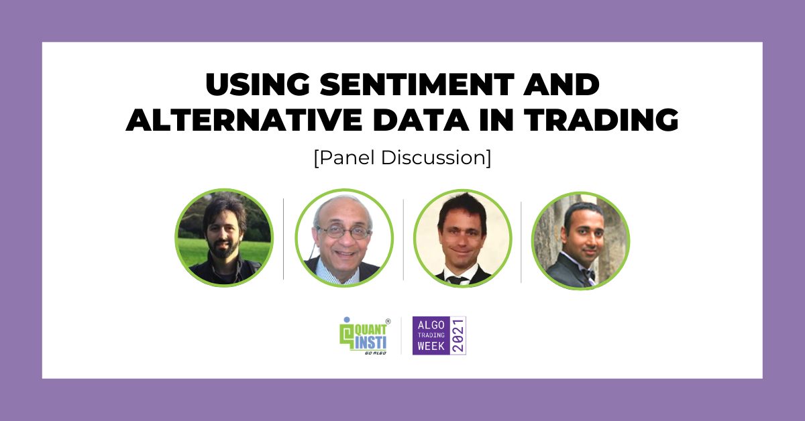

## Table of Contents

## What is alternative data in the context of industrials?

Alternative data in the context of industrials refers to information that companies use to gain insights and make better decisions, but it's not the usual data they typically look at. This can include things like satellite images of factories, data from sensors on machines, or even social media posts about a company's products. By using this kind of data, industrial companies can learn more about their operations, their competitors, and the market in general.

For example, a company might use satellite images to see how full a competitor's parking lot is, which can give them an idea of how busy the competitor's factory is. Or they might use sensor data to predict when a machine is likely to break down, so they can fix it before it causes problems. This kind of information can help industrial companies work more efficiently, plan better, and stay ahead of their competition.

## How can alternative data be used to gain insights in the industrials sector?

Alternative data can help companies in the industrials sector learn a lot about their business and the market. For example, they can use satellite images to see how busy a competitor's factory is by looking at how full their parking lot is. This can tell them if the competitor is doing well or not. They can also look at social media to see what people are saying about their products or their competitor's products. This helps them understand what customers like or don't like, and they can use this information to make their products better.

Another way [alternative data](/wiki/best-alternative-data) can be used is by looking at data from sensors on machines. This data can help companies predict when a machine might break down. If they know this, they can fix the machine before it causes problems, which saves time and money. Also, companies can use data from shipping and logistics to see how quickly products are moving from the factory to stores. This helps them plan better and make sure they have enough products to meet demand. By using all these different kinds of data, industrial companies can make smarter decisions and stay ahead of their competition.

## What are some common sources of alternative data for industrials?

Alternative data for industrials comes from many places. One common source is satellite imagery. Companies can use these images to see how busy a competitor's factory is by looking at how full their parking lot is. Another source is sensor data from machines. This data helps companies predict when a machine might break down, so they can fix it before it causes problems. Social media is also a big source of alternative data. Companies can learn what people think about their products or their competitor's products by reading posts and comments online.

Another source of alternative data is shipping and logistics data. This helps companies see how quickly their products are moving from the factory to stores, which helps them plan better and make sure they have enough products to meet demand. Credit card transactions are another useful source. By looking at these, companies can see how much people are spending on their products and where they are buying them. All these different kinds of data help industrial companies make smarter decisions and stay ahead of their competition.

## How does alternative data differ from traditional data in the industrials sector?

Alternative data in the industrials sector is different from traditional data because it comes from unusual places and gives new kinds of information. Traditional data is the usual stuff companies look at, like sales numbers, financial reports, and market research. This data helps companies understand how well they are doing and plan for the future. But it's limited to what companies already know and can measure easily.

On the other hand, alternative data comes from sources like satellite images, sensor data, social media, and shipping logs. This data can show things that traditional data can't, like how busy a competitor's factory is, what customers really think about a product, or when a machine might break down. By using alternative data, companies can get a fuller picture of their business and the market, helping them make better decisions and stay ahead of their competition.

## What are the benefits of using alternative data in industrials analysis?

Using alternative data in the industrials sector can help companies learn a lot more about their business and the market. It gives them information that they can't get from traditional data like sales numbers or financial reports. For example, satellite images can show how busy a competitor's factory is, and social media can tell them what customers really think about their products. This helps companies understand things they might not have known before, like how well their competitors are doing or what people like or don't like about their products.

Another big benefit of alternative data is that it helps companies make better decisions and plan more effectively. For instance, sensor data from machines can predict when a machine might break down, so companies can fix it before it causes problems. This saves time and money. Also, data from shipping and logistics can show how quickly products are moving from the factory to stores, helping companies make sure they have enough products to meet demand. By using all these different kinds of data, companies can work more efficiently, plan better, and stay ahead of their competition.

## What are the challenges and limitations of using alternative data in the industrials sector?

Using alternative data in the industrials sector can be tricky. One big challenge is that it's not always easy to get this kind of data. For example, satellite images or social media data can be hard to find or expensive to buy. Also, companies need special tools and skills to collect and understand this data. Not every company has these resources, so it can be tough for them to use alternative data effectively.

Another challenge is that alternative data can be messy and hard to trust. It might not always be accurate or complete, which can make it risky to use for making important decisions. For example, social media posts can be full of opinions and feelings, but they might not give a clear picture of what's really happening. Companies need to be careful and check their data carefully to make sure they're making good decisions based on it.

Lastly, there are also rules and privacy concerns to think about. Using data from sources like social media or sensors can sometimes break laws about privacy or data protection. Companies need to make sure they're following these rules, which can add more work and costs. This can make it even harder for them to use alternative data in their analysis.

## How can companies in the industrials sector collect and analyze alternative data?

Companies in the industrials sector can collect alternative data from many different places. They can use satellites to take pictures of factories and see how busy they are. They can also use sensors on machines to gather data about how the machines are working. Social media is another good source, where companies can read what people are saying about their products. They can also look at shipping and logistics data to see how quickly products are moving from the factory to stores. To collect all this data, companies might need to buy it from special companies that gather it, or they might need to use their own tools and technology.

Once they have the data, companies need to analyze it to find useful information. They can use special software to look at satellite images and see patterns, like how full a competitor's parking lot is over time. They can also use data analysis tools to look at sensor data and predict when a machine might break down. For social media, they might use software that can read a lot of posts and find out what people like or don't like about their products. It's important for companies to check their data carefully to make sure it's accurate and useful. They also need to follow rules about privacy and data protection to make sure they're not breaking any laws.

## What ethical considerations should be taken into account when using alternative data in industrials?

When companies in the industrials sector use alternative data, they need to think about ethical issues. One big issue is privacy. Companies might use data from social media or sensors, but they need to make sure they're not breaking privacy laws. People's personal information should be protected, and companies need to be careful about how they collect and use this data. They should also be open about what data they're using and why, so people know what's happening with their information.

Another ethical consideration is fairness. Companies need to make sure they're not using alternative data in a way that hurts other people or gives them an unfair advantage. For example, if a company uses data to predict when a competitor's machine will break down, they might be able to take advantage of that information in a way that's not fair. Companies should use alternative data to help everyone, not just themselves. They should also check their data carefully to make sure it's accurate and not misleading, because making decisions based on bad data can cause problems for everyone involved.

## Can you provide case studies where alternative data has significantly impacted decision-making in the industrials sector?

One good example of how alternative data helped in the industrials sector is with a company called Caterpillar. They make big machines like bulldozers and excavators. Caterpillar used satellite images to see how full the parking lots were at their dealers' locations. By doing this, they could tell how busy the dealers were and how much demand there was for their machines. This helped Caterpillar make better decisions about where to send their products and how many to make. It also helped them plan better and save money.

Another case is with a company called General Electric (GE). They used sensor data from their jet engines to predict when the engines might need repairs. By looking at this data, GE could tell when an engine was starting to have problems, even before it broke down. This helped them fix the engines before they caused big problems, which saved a lot of time and money. It also made their customers happier because their planes were flying more and breaking down less. This showed how alternative data can help companies work better and make smarter choices.

## What advanced analytical techniques are used to process alternative data in industrials?

Companies in the industrials sector use advanced analytical techniques to make sense of alternative data. One common technique is [machine learning](/wiki/machine-learning). This is when computers learn from data to find patterns and make predictions. For example, a company might use machine learning to look at sensor data from machines and predict when they might break down. This helps the company fix the machines before they cause problems, which saves time and money. Another technique is data mining, where companies dig through large amounts of data to find useful information. They might use data mining to look at social media posts and see what people like or don't like about their products.

Another important technique is geospatial analysis, which is used to understand data that has to do with locations, like satellite images. Companies can use geospatial analysis to see how busy a competitor's factory is by looking at how full their parking lot is. This helps them understand how well their competitors are doing and plan their own business better. Lastly, companies often use predictive analytics to make forecasts based on alternative data. For example, they might use shipping and logistics data to predict how quickly their products will move from the factory to stores. This helps them make sure they have enough products to meet demand. All these techniques help companies in the industrials sector use alternative data to make smarter decisions and stay ahead of their competition.

## How is machine learning and AI integrated into the analysis of alternative data in the industrials sector?

Machine learning and AI are really important for understanding alternative data in the industrials sector. Companies use machine learning to look at data from sensors on machines and predict when those machines might break down. This helps them fix the machines before they cause big problems, which saves time and money. They also use AI to go through lots of data, like social media posts, to find out what people think about their products. This helps them understand what customers like or don't like, so they can make their products better.

Another way AI helps is by looking at satellite images to see how busy a competitor's factory is. By using AI, companies can see patterns in these images, like how full the parking lot is over time. This tells them if their competitor is doing well or not, which helps them plan their own business better. AI also helps companies predict how quickly their products will move from the factory to stores by looking at shipping and logistics data. This helps them make sure they have enough products to meet demand. By using machine learning and AI, companies can make smarter decisions and stay ahead of their competition.

## What future trends can we expect in the use of alternative data within the industrials sector?

In the future, we can expect more companies in the industrials sector to use alternative data to make their businesses better. They will use even more advanced technology like machine learning and AI to understand this data. For example, they might use AI to look at social media and find out what people want from their products. They could also use satellite images to see how their factories are doing compared to their competitors. This will help them make smarter decisions about where to send their products and how many to make.

Another trend we might see is companies using alternative data to be more environmentally friendly. They could use sensor data to make their machines work more efficiently and use less energy. They might also use data from shipping and logistics to plan their deliveries in a way that reduces their carbon footprint. By using alternative data in these ways, companies can not only make more money but also help the planet.

## How can we evaluate and implement industrial alternative data?

Evaluating the quality and relevance of industrial datasets is essential for successful [algorithmic trading](/wiki/algorithmic-trading). The initial step involves assessing data accuracy, which refers to the precision and correctness of the data. Accurate data ensures that trading algorithms make informed predictions based on true reflections of industrial activities.

Timeliness is equally critical. Timely data allows traders to respond to market changes promptly, making it necessary to source datasets that are updated frequently. For example, real-time sensor data from manufacturing equipment offers up-to-date insights into production output, which can influence market strategies.

Granularity, or the level of detail present in the dataset, is another [factor](/wiki/factor-investing) to consider. Highly granular data can provide more precise information about specific industry segments, aiding traders in constructing detailed and nuanced models. However, excessive granularity might complicate the data integration process by introducing noise.

Once a suitable dataset is chosen, integration involves several technical processes. Firstly, data cleaning is crucial. This process entails identifying and correcting errors or inconsistencies within the dataset. Cleaning can involve removing outliers, addressing missing values, and ensuring consistency in data formats.

Next is data processing, which involves converting raw data into a format that is more useful for analysis. This may include aggregating data points to enhance comprehensibility or transforming data using techniques such as normalization. Normalization adjusts the dataset so that its numerical values fall within a particular range, allowing algorithms to function optimally without being skewed by large variations in data magnitude.

A simple example of data normalization is the min-max scaling, which adjusts the values of a dataset to fit within the [0, 1] range:

$$
x' = \frac{x - \text{min}(X)}{\text{max}(X) - \text{min}(X)}
$$

Where:
- $x'$ is the normalized value,
- $x$ is the original value,
- $\text{min}(X)$ and $\text{max}(X)$ are the minimum and maximum values of the dataset $X$.

By ensuring that the forward-looking datasets meet these criteria, traders can integrate industrial alternative data effectively into algorithmic trading models. The ultimate objective is to ensure that these datasets align with the algorithms and strategies employed, maximizing their potential to predict market trends accurately.

## References & Further Reading

[1]: Lopez de Prado, M. (2018). ["Advances in Financial Machine Learning"](https://books.google.com/books/about/Advances_in_Financial_Machine_Learning.html?id=oU9KDwAAQBAJ). Wiley.

[2]: Aronson, D. R. (2007). ["Evidence-Based Technical Analysis: Applying the Scientific Method and Statistical Inference to Trading Signals"](https://www.amazon.com/Evidence-Based-Technical-Analysis-Scientific-Statistical/dp/0470008741). Wiley.

[3]: Jansen, S. (2018). ["Machine Learning for Algorithmic Trading: Predictive models to extract signals from market and alternative data for systematic trading strategies with Python"](https://www.amazon.com/Machine-Learning-Algorithmic-Trading-alternative/dp/1839217715). Packt.

[4]: Chan, E. P. (2009). ["Quantitative Trading: How to Build Your Own Algorithmic Trading Business"](https://github.com/ftvision/quant_trading_echan_book). Wiley.

[5]: Ramaswamy, S. (2018). ["Alternative Data (Handbook of Market Intelligence)"](https://www.taylorfrancis.com/books/edit/10.1201/9781003293644/handbook-alternative-data-finance-volume-gautam-mitra-kieu-thi-hoang-christina-erlwein-sayer-diana-roman-zryan-sadik). John Wiley & Sons.