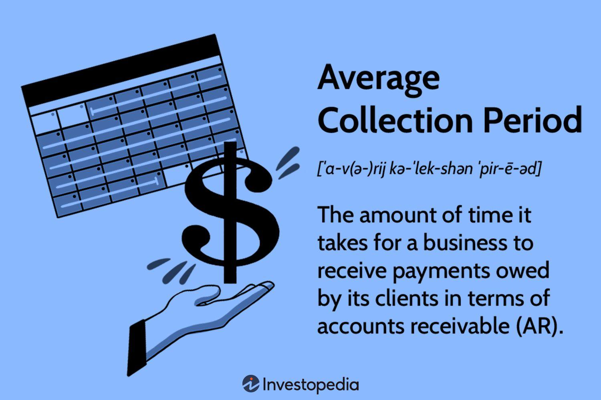

## Table of Contents

## What is the average collection period and why is it important?

The average collection period is the average number of days it takes for a business to receive payment from its customers after a sale. It is calculated by dividing the average accounts receivable by the total credit sales per day. This number helps businesses understand how quickly they are getting paid and how well they are managing their credit and collections.

It's important because it shows how efficient a company is at collecting money it is owed. If the average collection period is short, it means the company is getting paid quickly, which is good for cash flow. A long average collection period might mean the company needs to improve its credit policies or collection processes. This can affect the company's ability to pay its own bills and invest in growth.

## How is the average collection period calculated?

The average collection period is figured out by dividing the average accounts receivable by the total credit sales per day. To find the average accounts receivable, you add the accounts receivable at the start of the period to the accounts receivable at the end of the period and then divide by two. Total credit sales per day is the total credit sales for the period divided by the number of days in the period.

This calculation gives you the number of days it takes, on average, for a business to get paid after making a sale on credit. It's an important number because it shows how fast money is coming in. If it takes a long time to get paid, the business might have trouble paying its own bills or growing. If the time is short, it means the business is doing a good job at getting paid quickly.

## Which industries typically have a longer average collection period?

Some industries have longer average collection periods because of how they work and who they sell to. For example, the construction industry often has longer collection periods. This is because construction projects can take a long time to finish, and payments might be spread out over the life of the project. Also, government contracts, which are common in construction, can have slower payment processes.

Healthcare is another industry where the average collection period can be longer. This is because of how insurance and billing work. Hospitals and clinics have to wait for insurance companies to process claims and pay them, which can take a while. Sometimes, patients also have to pay part of the bill, and collecting from individuals can be slower than from businesses.

Other industries like manufacturing might also see longer collection periods, especially if they sell to other businesses on credit. These businesses might take longer to pay because they need to sell the products they bought before they can pay for them. This chain of payments can slow down the whole process.

## Why is the average collection period significant in the healthcare industry?

In the healthcare industry, the average collection period is important because it shows how long it takes for hospitals and clinics to get paid after they provide care. This time can be longer because of how insurance and billing work. When a patient gets treatment, the healthcare provider sends a bill to the insurance company. The insurance company then has to check the bill and decide how much they will pay. This process can take a while, and during this time, the healthcare provider is waiting to get paid.

On top of waiting for insurance payments, healthcare providers also have to collect money from patients. Sometimes, patients have to pay part of the bill themselves, and collecting this money can be slow. If the average collection period is long, it can make it hard for healthcare providers to pay their own bills, like salaries for staff and costs for medicine and equipment. A shorter collection period means the healthcare provider can get the money they need faster, which helps them run their business better.

## How does the average collection period affect cash flow in the construction industry?

In the construction industry, the average collection period is how long it takes to get paid after finishing a job. This time can be long because construction projects take a while to complete, and payments are often spread out over the project's life. Also, many construction companies work with government contracts, which can have slow payment processes. If the average collection period is long, it means the construction company has to wait a long time to get the money they are owed.

Waiting a long time to get paid can make it hard for construction companies to manage their cash flow. Cash flow is the money coming in and going out of a business. If money is coming in slowly, the company might struggle to pay for things like materials, workers, and equipment. A shorter average collection period means the company gets paid faster, which helps them keep their cash flow healthy and run their business smoothly.

## What role does the average collection period play in the financial health of manufacturing companies?

In the manufacturing industry, the average collection period is how long it takes for a company to get paid after selling its products. This time can be longer because manufacturers often sell to other businesses on credit. These businesses might need to sell the products they bought before they can pay for them, which can slow down the payment process. If the average collection period is long, it means the manufacturing company has to wait a while to get the money they are owed.

Waiting a long time to get paid can affect the financial health of a manufacturing company. If money is coming in slowly, it can be hard for the company to pay for things like raw materials, workers, and machinery. This can lead to cash flow problems, making it difficult for the company to keep running smoothly. A shorter average collection period means the company gets paid faster, which helps them keep their cash flow healthy and maintain good financial health.

## How can businesses in the retail sector optimize their average collection period?

In the retail sector, businesses can optimize their average collection period by making it easier for customers to pay quickly. One way to do this is by offering different payment options like credit cards, mobile payments, and online payment systems. When customers can pay the way they want, they are more likely to pay right away. Retailers can also set clear payment terms and send reminders to customers about when their payments are due. This helps make sure payments come in on time.

Another way to optimize the average collection period is by keeping a close eye on who owes money and how long they've been owing it. Retailers can use software to track accounts receivable and see which customers are slow to pay. If a customer is always late, the retailer might need to change their credit terms or stop selling to them on credit. By managing credit and collections well, retail businesses can get paid faster and keep their cash flow healthy.

## What are the industry benchmarks for average collection period in utilities?

In the utilities industry, the average collection period can be longer compared to other sectors. This is because utilities often bill customers monthly and have to wait for those bills to be paid. The industry benchmark for the average collection period in utilities is around 30 to 45 days. This means that, on average, utility companies get paid within this time frame after sending out a bill.

A longer average collection period in utilities can be due to the nature of the service. People need utilities like water, electricity, and gas, but they might not pay their bills right away. Sometimes, utility companies have to deal with late payments or set up payment plans for customers who can't pay the full amount at once. Keeping the average collection period close to the industry benchmark helps utility companies manage their cash flow better and keep their services running smoothly.

## How do government regulations impact the average collection period in the telecommunications industry?

Government regulations can make the average collection period longer in the telecommunications industry. For example, rules about how companies can bill customers or collect payments can slow things down. Some countries have laws that say telecom companies have to give customers more time to pay their bills or set up payment plans. This means the companies have to wait longer to get their money, which makes the average collection period longer.

Also, government agencies might take a long time to pay telecom companies for services. If a telecom company provides services to the government, like internet or phone lines, they might have to wait for the government to process and approve the payment. This can take longer than getting paid by regular customers. So, government regulations and processes can make it harder for telecom companies to collect money quickly, affecting their average collection period.

## What strategies can service-based industries implement to reduce their average collection period?

Service-based industries can reduce their average collection period by making it easy for customers to pay quickly. They can do this by offering many ways to pay, like credit cards, online payments, and even mobile apps. When customers have choices, they are more likely to pay right away. Service businesses can also set clear rules about when payments are due and send reminders to customers. This helps make sure payments come in on time and keeps the money flowing into the business.

Another way to shorten the average collection period is by keeping a close eye on who owes money and how long they've been owing it. Service businesses can use computer programs to track which customers are slow to pay. If a customer is always late, the business might need to change their payment terms or stop offering credit to them. By managing credit and collections well, service businesses can get paid faster and keep their cash flow healthy.

## How does the average collection period influence credit policies in the wholesale trade?

In the wholesale trade, the average collection period can change how a business sets its credit policies. If the average collection period is long, it means customers are taking a lot of time to pay. This can make the business think about making its credit rules stricter. They might ask for payments sooner or give credit only to customers who have a good history of paying on time. This helps the business get its money faster and keep its cash flow healthy.

On the other hand, if the average collection period is short, the business might feel okay about offering more credit to customers. They could let customers pay later because they know they will get the money quickly. This can help the business sell more and grow, but they still need to watch their credit policies carefully. Keeping a good balance between offering credit and getting paid on time is important for the financial health of the business.

## What advanced analytics can be used to predict and manage the average collection period in high-tech industries?

In high-tech industries, companies can use advanced analytics to predict and manage their average collection period. One way to do this is by using data from past sales and payments to make models that guess how long it will take to get paid in the future. These models can look at things like how much a customer buys, how they pay, and how long they usually take to pay. By understanding these patterns, high-tech companies can see which customers might take longer to pay and plan their credit policies better.

Another way high-tech companies can use advanced analytics is by keeping an eye on their accounts receivable in real time. They can use special software that watches how much money is owed and how long it's been owed. This software can send alerts when a payment is late or if a customer is taking longer than usual to pay. By catching these problems early, the company can talk to the customer and fix the issue before it gets worse. This helps them keep their average collection period short and their cash flow healthy.

## What is the Average Collection Period and how does it help in understanding financial metrics?

The average collection period is a critical financial metric that evaluates a company's effectiveness in managing its credit policies and accounts receivable. This metric sheds light on how proficiently a company converts outstanding invoices into cash, directly impacting its liquidity and overall financial stability.

The average collection period is calculated using the formula:

$$
\text{Average Collection Period} = \left(\frac{\text{Average Accounts Receivable}}{\text{Total Net Credit Sales}}\right) \times \text{Number of Days}
$$

Here, the average accounts receivable represents the mean value of intraperiod accounts receivable. Total net credit sales equivalently reflect the company's sales over a period, adjusted for returns and allowances, providing a realistic figure for revenue generated on credit terms.

Industries demonstrate distinct dependencies on receivables, necessitating an understanding of industry-specific norms for the average collection period. Sectors such as retail, construction, and healthcare, each with unique operational dynamics, benefit from comprehending their distinct collection timelines. For retail, manageable periods ensure continued stock replenishment and operational fluidity. Construction companies, often managing significant upfront investments, require timely receivables to maintain project [momentum](/wiki/momentum) and financial solvency. In the healthcare industry, a complex interaction between insurance payments and service providers heightens the importance of monitoring collection periods to avoid cash flow constraints.

Efficient management of the average collection period can significantly bolster cash flows, enhancing a company's ability to meet obligations and invest in growth opportunities. By optimizing credit policies, businesses not only secure operational [liquidity](/wiki/liquidity-risk-premium) but also strategically position themselves for competitive advantage and financial health.

## References & Further Reading

For those seeking a deeper understanding of financial metrics such as the average collection period and innovative trading methodologies like [algorithmic trading](/wiki/algorithmic-trading), several resources are recommended. Industry publications, peer-reviewed journals, and authoritative financial analysis [books](/wiki/algo-trading-books) are excellent starting points.

1. **Industry Publications**:
   - The "Harvard Business Review" often covers practical applications and strategies related to financial metrics and trading.
   - "The Journal of Finance" provides in-depth research articles that address various aspects of the financial market, fulfilling a need for rigorous analysis and theory.

2. **Financial Analysis Books**:
   - "Financial Statement Analysis and Security Valuation" by Stephen H. Penman offers comprehensive insights into the evaluation of financial statements and metrics.
   - "Algorithmic Trading: Winning Strategies and Their Rationale" by Ernest P. Chan presents a detailed explanation of the theoretical and practical aspects of algorithmic trading strategies.

3. **Online Resources and Articles**:
   - Websites like Investopedia and Seeking Alpha provide easy-to-understand articles and tutorials on financial metrics and market strategies.
   - The Securities and Exchange Commission (SEC) website offers official documentation and guidelines regarding trading and financial reporting.

4. **Mathematical and Computational Tools**:
   - Python-based tools and libraries, such as NumPy and pandas, are widely used in financial modeling and analysis. Below is a sample Python code to calculate the average collection period:

```python
def average_collection_period(average_receivables, net_credit_sales, days):
    return (average_receivables / net_credit_sales) * days

# Example usage:
average_receivables = 50000
net_credit_sales = 200000
days = 365

collection_period = average_collection_period(average_receivables, net_credit_sales, days)
print(f"Average Collection Period: {collection_period} days")
```

5. **Continued Education and Workshops**:
   - Participate in workshops and webinars conducted by financial institutions like the CFA Institute, which often cover recent trends and strategies in financial management and trading technologies.

These resources serve as a foundation for expanding knowledge and proficiency in financial metrics and algorithmic trading techniques, pivotal for modern financial and strategic decision-making.

