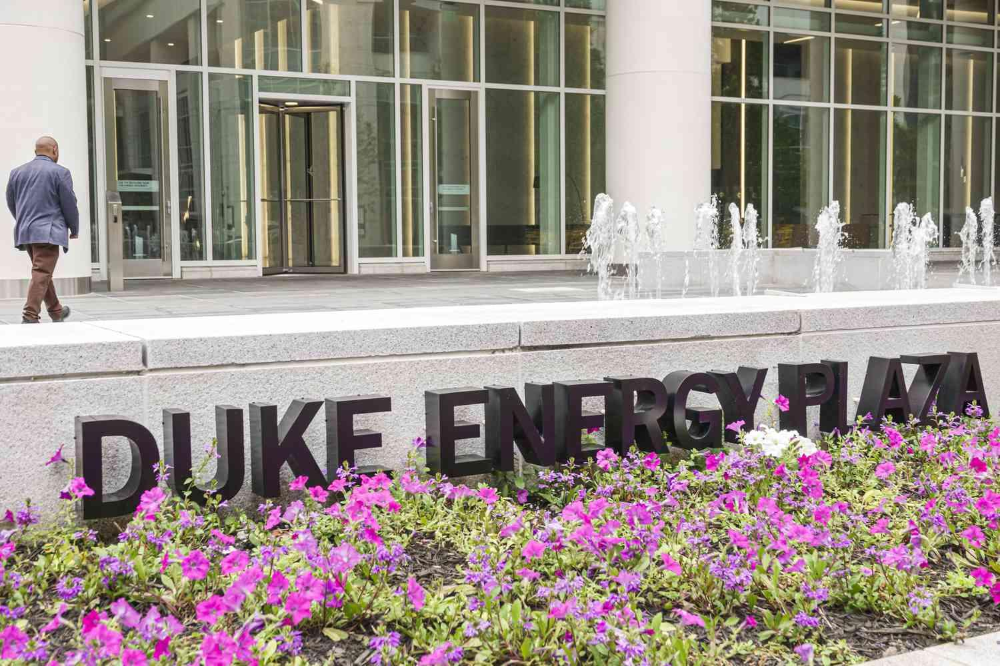

The increasing frequency and severity of weather events globally have become a significant concern for governments, industries, and investors alike. Climate change has been linked to more frequent occurrences of extreme weather such as hurricanes, floods, droughts, and wildfires. According to a report by the National Oceanic and Atmospheric Administration (NOAA), the United States alone experienced 22 weather and climate disaster events with losses exceeding $1 billion each in 2020, a trend mirrored in many parts of the world. These disasters not only threaten human safety but also have substantial economic implications, disrupting industries and supply chains and causing considerable losses.

Algorithmic trading, which involves using computer programs to execute trades at high speeds and volumes based on pre-defined criteria, has become increasingly influential in global financial markets. Originally born out of the desire to minimize costs and maximize efficiency, algorithmic trading now accounts for a significant portion of total trading volumes. Its reliance on speed, data, and technology has transformed traditional trading strategies, providing both opportunities and challenges. 



Severe weather conditions can have profound impacts on various industries, leading to production halts, supply chain disruptions, and significant price volatility. For example, the agriculture sector is particularly vulnerable to extreme weather, which can directly affect crop yields and subsequent commodity prices. The energy sector also faces challenges as natural disasters can damage infrastructure and disrupt energy supply, leading to market instability.

The purpose of this article is to explore the intersection of these factors, specifically focusing on how severe weather and algorithmic trading influence each other and their broader economic impacts. As algorithmic trading systems react to price changes, the market volatility induced by severe weather can significantly alter trading patterns and outcomes. Furthermore, we will examine how algorithmic trading strategies adapt to incorporate weather data and forecasts to mitigate potential losses.

To comprehensively understand this dynamic, the article will cover several aspects: the economic implications of severe weather, an overview of algorithmic trading, the impact of severe weather on trading algorithms, and industry-specific case studies. Additionally, we will explore technological innovations that could enhance algorithmic trading's resilience to weather disruptions and discuss potential future trends and strategies to mitigate economic impacts.

## Table of Contents

## Understanding Severe Weather and Its Economic Implications

Severe weather conditions, including hurricanes, floods, droughts, and wildfires, represent significant climatological events with far-reaching economic implications. These events, defined by their intensity and potential for destruction, vary widely in their characteristics and triggers. Hurricanes are intense tropical cyclones characterized by strong winds, heavy rainfall, and storm surges. Floods result from excessive water accumulation in normally dry areas, often due to heavy rainfall or rapid snowmelt. Droughts are prolonged periods of deficient rainfall leading to water shortages, while wildfires are uncontrolled fires that spread quickly across vegetated landscapes.

The frequency and severity of these weather conditions have increased over recent decades, largely attributed to climatic changes. According to the National Aeronautics and Space Administration (NASA), there has been a noticeable increase in the intensity and frequency of extreme weather events as a result of global warming. The Intergovernmental Panel on Climate Change (IPCC) reported that there is high confidence that climate change is affecting the frequency and intensity of temperature extremes, including heatwaves and record high temperatures.

Economically, severe weather events have profound impacts on various industries. In agriculture, weather extremes can destroy crops, leading to reduced yields and increased food prices. The insurance industry faces escalating claims and payouts, impacting profitability and underwriting processes. Energy sectors, heavily reliant on weather conditions for production and distribution, experience disruptions that can lead to fluctuating prices and supply shortages. Transportation, both infrastructure and logistics, is similarly affected by delays and damages caused by extreme conditions, leading to increased operational costs and logistical challenges.

Supply chain disruptions due to severe weather events contribute to significant market [volatility](/wiki/volatility-trading-strategies). Physical damages impede production and distribution channels, creating bottlenecks that affect global supply chains. The aftermath of such disruptions often leads to increased costs for raw materials and finished goods, affecting market stability and pricing structures. For instance, Hurricane Katrina in 2005, one of the costliest hurricanes on record, caused widespread destruction in the Gulf Coast region, leading to substantial disruptions in oil production and refining, which in turn led to worldwide spikes in oil prices.

Recent case studies further illustrate the economic ramifications of severe weather. The 2017 Atlantic hurricane season, notably marked by hurricanes Harvey, Irma, and Maria, led to over $300 billion in economic losses. Harvey alone caused catastrophic flooding in Houston, affecting numerous industries and leading to long-term economic recovery efforts. Similarly, the California wildfires in 2018 not only destroyed thousands of homes and businesses but also resulted in significant insurance payout burdens and economic displacement.

In summary, severe weather conditions are increasingly frequent due to climate change, carrying substantial economic implications for a range of industries. The direct destruction of physical assets and indirect market perturbations necessitate adaptive strategies across sectors to mitigate the ensuing economic impacts.

## Algorithmic Trading: A Brief Overview

Algorithmic trading refers to the use of computer algorithms to automate and enhance trading decisions in financial markets. This method leverages complex mathematical models to process vast datasets, execute trades at optimal speeds, and minimize human intervention. Algorithmic trading has become increasingly prevalent, accounting for a significant portion of trading volumes across various financial markets, including equities, commodities, and [forex](/wiki/forex-system).

### Types of Algorithmic Trading Strategies

Algorithmic trading encompasses a variety of strategies, each designed to exploit different aspects of market behavior:

1. **Trend Following**: This strategy identifies and follows market trends to capitalize on momentum. Algorithms often use moving averages or other technical indicators to predict price movements and enter or exit positions accordingly.

2. **Statistical Arbitrage**: By analyzing historical price relationships between different securities, statistical arbitrage aims to profit from average price deviations. Algorithms often deploy techniques like pairs trading, where they simultaneously buy and sell correlated securities to exploit temporary price discrepancies.

3. **Market Making**: This strategy involves placing buy and sell orders to profit from the bid-ask spread. Market-making algorithms continuously update quotes to maintain liquidity in the market and earn small profits on each trade.

4. **Mean Reversion**: Mean reversion strategies assume that prices will revert to their historical averages. Algorithms detect overbought or oversold conditions and initiate trades to capture potential price corrections.

5. **High-Frequency Trading (HFT)**: HFT strategies execute a large number of orders at extremely high speeds. The focus is on maximizing profits through small price changes over brief intervals, often utilizing advanced technologies to minimize latency.

### Importance of Speed, Data, and Technology

Speed, data, and technology are integral to [algorithmic trading](/wiki/algorithmic-trading). Speed is crucial, as faster execution can lead to better trade prices and minimize exposure to unfavorable market conditions. High-frequency trading, in particular, relies on low-latency infrastructure to gain advantages over slower market participants.

Data is the lifeblood of algorithmic trading strategies. Algorithms require access to real-time and historical market data to identify patterns and make informed decisions. The integration of alternative datasets, such as weather reports or social media analytics, is increasingly employed to gain additional insights.

Technological advancements have empowered algorithmic trading through the use of [artificial intelligence](/wiki/ai-artificial-intelligence) and [machine learning](/wiki/machine-learning). These technologies enable the development of sophisticated models that can adapt to changing market conditions, continuously improving the accuracy and efficiency of trade executions.

### Advantages Over Traditional Trading

Algorithmic trading confers several advantages over traditional manual trading methods:

- **Increased Efficiency**: Algorithms can process vast amounts of data and execute trades faster than human traders, resulting in more efficient market operations.
- **Reduced Transaction Costs**: Automation minimizes the need for manual intervention, reducing labor costs and errors associated with human trading.
- **Consistency and Precision**: Algorithms execute pre-defined trading strategies without emotional or psychological biases, ensuring consistent decision-making and precision.

### Challenges in Algorithmic Trading

Despite its benefits, algorithmic trading faces several challenges:

- **Regulatory Issues**: The rise of algorithmic trading has prompted increased regulatory scrutiny to ensure market fairness and stability. Regulations aim to prevent manipulation and excessive volatility driven by automated trading activities.

- **Technological Failures**: Algorithmic trading systems are vulnerable to technological glitches, software bugs, and cyberattacks. Such failures can result in significant financial losses or contribute to market disruptions.

- **Market Impact**: Rapid trade executions by algorithms can lead to increased volatility and heightened market impact, potentially destabilizing conventional trading norms.

Algorithmic trading continues to shape financial markets by enhancing trading efficiency and expanding strategic possibilities. However, its growing influence also underscores the need for robust oversight and technological safeguards to address the associated risks.

## Impact of Severe Weather on Algorithmic Trading

Severe weather conditions, such as hurricanes, floods, and wildfires, have the potential to introduce significant market volatility, affecting trading patterns and strategies. Algorithmic trading, which relies on the execution of pre-programmed instructions, can be highly susceptible to these abrupt market changes. The highly automated nature of algorithmic trading means that even minor disruptions can lead to substantial financial implications.

Algorithmic trading depends heavily on data analysis and predictive modeling to execute trades rapidly and efficiently. When weather events disrupt markets, they can cause rapid and unexpected fluctuations, which may not be immediately accounted for in the trading algorithms. This vulnerability can result in substantial financial losses if algorithms fail to adapt in real-time to the evolving market conditions. For instance, unexpected deviations in commodity prices due to a hurricane impacting oil production can lead to a sharp decline or surge in prices, affecting trading decisions.

To mitigate these risks, algorithmic traders have begun to incorporate weather data and forecasts into their trading models. Advanced machine learning techniques and AI-driven models are utilized to predict potential market disruptions triggered by weather events. By analyzing historical weather patterns and correlating them with market reactions, traders can create more robust algorithms. Furthermore, real-time weather updates integrated into trading systems enable quick assessment and action. Python libraries such as `pandas` and `scikit-learn` can be employed to process and analyze large datasets for this purpose.

```python
import pandas as pd
from sklearn.linear_model import LinearRegression

# Example: Incorporating weather data into trading model
weather_data = pd.read_csv('weather_data.csv')  # Hypothetical weather dataset
market_data = pd.read_csv('market_data.csv')  # Hypothetical market dataset

# Preprocessing and merging datasets
merged_data = pd.merge(weather_data, market_data, on='date')

# Training a simple linear regression model
X = merged_data[['temperature', 'rainfall', 'wind_speed']]
y = merged_data['market_volatility']

model = LinearRegression()
model.fit(X, y)

# Predicting market volatility based on current weather conditions
current_weather = [[23, 5, 12]]  # Example: [temperature, rainfall, wind_speed]
predicted_volatility = model.predict(current_weather)
```

Real-world examples demonstrate how severe weather has influenced market outcomes significantly. During the 2017 Atlantic hurricane season, hurricanes Harvey and Irma disrupted oil production and refining capacities, leading to volatility in energy markets. Algorithmic traders who had anticipated such disruptions by incorporating weather forecasts into their models were able to hedge risks more effectively.

The evolution of trading algorithms continues as the accuracy of weather predictions improves. New advancements in neural networks and AI allow for even more precise anticipations of weather-related market impacts. For instance, convolutional neural networks (CNNs) can analyze satellite imagery to forecast weather more accurately, feeding into trading strategies that adjust based on these predictions.

In conclusion, severe weather events undeniably affect market dynamics, influencing algorithmic trading patterns. As algorithmic models evolve, their capacity to account for and adapt to such events will be crucial in minimizing financial risks, ensuring stability, and driving innovation in financial markets.

## Industry Case Studies

The influence of severe weather on various industries and the intersecting role of algorithmic trading is substantial. Here we examine specific sectors impacted by such dynamics:

### Agriculture Industry: Weather's Effect on Commodity Prices and Trading

Severe weather significantly impacts agricultural output, leading to volatile commodity prices. For instance, droughts can diminish crop yields, increasing prices, whereas floods can destroy harvests, leading to similar effects. Algorithmic trading models in agriculture now frequently incorporate weather forecasts and satellite data to anticipate such price shifts. These models use machine learning to analyze vast datasets, improving prediction accuracy.

Consider the corn futures market. Data on soil moisture levels, temperature, and rainfall is fed into algorithms that estimate yield probabilities. A Python script using libraries like `pandas` and `scikit-learn` may look like this:

```python
import pandas as pd
from sklearn.linear_model import LinearRegression

# Load weather-related data
data = pd.read_csv('weather_yield_data.csv')
X = data[['rainfall', 'temp', 'soil_moisture']]
y = data['corn_yield']

# Train model
model = LinearRegression().fit(X, y)

# Predict yields
yield_prediction = model.predict([[20, 85, 0.30]])  # example input
```

### Energy Industry: Weather Impact on Markets and Algorithmic Strategies

Weather-related impacts on the energy sector can be profound, affecting both supply and demand. For instance, cooler climates increase natural gas demand, influencing market prices. Similarly, hurricanes can disrupt oil production, leading to supply constraints and price hikes. Algorithmic trading strategies in energy must thus integrate weather predictions, often utilizing real-time data for rapid adjustments.

Advanced algorithms may employ predictive analytics to position trades ahead of forecasted supply chain disruptions. This involves real-time weather feeds incorporated into trading systems to adjust positions based on anticipated weather developments.

### Insurance Industry: Algorithmic Models for Weather Risk Mitigation

The insurance industry uses algorithmic models to cope with weather-related risks. Predictive analytics in insurance employs historical weather data to model potential risks and calculate premiums. Machine learning models assess the probability of events like hurricanes or floods, allowing insurers to optimize their risk portfolios accordingly.

For example, algorithms might calculate expected payouts by:

$$
\text{Expected Payout} = \sum (\text{Probability of Event}_i \times \text{Amount of Loss}_i)
$$

These models help in crafting coverage strategies that mitigate financial exposure from severe weather events.

### Transportation and Logistics: Managing Operational Risks

Severe weather challenges transportation and logistics, affecting route efficiency and delivery schedules. Companies employ algorithmic trading insights to optimize routes and manage risks. For instance, logistics firms may use predictive models to reroute shipments around storm-affected areas, minimizing delays and costs.

Tools for route optimization often involve algorithms that analyze weather forecasts in conjunction with real-time traffic data, ensuring operational efficiency despite adverse conditions. Using a Python-based solution might involve integrating APIs for weather and traffic updates, allowing dynamic adjustments to logistical plans.

In summary, severe weather deeply influences these key industries, prompting a reliance on algorithmic strategies to anticipate and adapt to these challenges.

## Technological Innovations and Future Perspectives

Current technological advancements in weather prediction and data analytics have significantly enhanced our ability to anticipate and respond to severe weather conditions. One of the key developments in this field is the increased accuracy and granularity of weather forecasts, enabled by improved computational models and more extensive data collection networks. Satellite technology and remote sensing provide high-resolution data, which is crucial for predicting localized weather events. For instance, the incorporation of machine learning algorithms has improved the precision of weather models by identifying patterns and correlations that traditional methods might overlook.

The integration of AI and machine learning in improving algorithmic trading resilience is particularly notable. Machine learning models can rapidly process vast amounts of data, including weather forecasts, to identify trends and adjust trading strategies accordingly. Techniques such as natural language processing (NLP) allow models to extract pertinent information from weather reports and news articles, which can then be quantified and integrated into trading algorithms. Reinforcement learning techniques enable algorithms to learn from past trading experiences and optimize decision-making processes in response to weather-driven market volatility.

Future trends in algorithmic trading are likely to involve more sophisticated use of AI technologies to anticipate and mitigate the impacts of severe weather on financial markets. As climate change exacerbates weather extremes, the demand for algorithms capable of adapting to unpredictable market conditions will grow. Predictive models might incorporate more advanced climate simulations and [factor](/wiki/factor-investing) in long-term environmental trends to strategize around potential market shifts.

Blockchain technology also holds promise for enhancing trading transparency and efficiency. Blockchain's decentralized ledger could improve the accuracy and accessibility of weather-related data used in trading, ensuring that all stakeholders have access to consistent and verified information. The use of smart contracts, self-executing contracts with terms directly written into code, could automate and streamline trading responses to weather triggers, reducing the delay and complexity inherent in current systems.

To mitigate the economic impact of severe weather across various industries, several strategies are being explored. Diversification of supply chains, backed by predictive analytics, can help businesses anticipate disruptions and secure alternative sources. The development of real-time monitoring systems that integrate IoT devices to track environmental changes offers a proactive approach to managing risks. Additionally, collaborative platforms that facilitate information sharing between sectors—such as finance, agriculture, and energy—could lead to more coordinated responses to extreme weather events.

These technological innovations and strategies are vital for enhancing the resilience of financial markets and industries susceptible to weather disruptions. Continuous research and development in these areas will play a crucial role in safeguarding economies against the increasing frequency and severity of weather impacts.

## Conclusion

The profound impact of severe weather on industries and algorithmic trading has been increasingly evident, as intensifying climate patterns continue to disrupt global economic activities. This article explored how severe weather events, such as hurricanes, floods, droughts, and wildfires, have consequential effects on various industries, including agriculture, insurance, energy, and transportation. These weather events introduce significant market volatility, challenging the efficacy of traditional and algorithmic trading strategies.

Algorithmic trading, which relies on data speed and technological precision, is vulnerable to the abrupt market shifts induced by extreme weather conditions. However, the integration of weather data into trading models has become critical for algorithmic traders aiming to anticipate and navigate these fluctuations. The ongoing adaptation and innovation in weather prediction tools and trading algorithms are essential, as they enhance predictive accuracy and market responsiveness.

Safeguarding industries and financial markets from the unpredictability of severe weather demands a concerted effort to develop advanced technological solutions. Investments in AI, machine learning, and emerging technologies like blockchain are pivotal for building more resilient algorithmic trading systems and ensuring transparent, efficient market operations.

To enhance economic resilience, there's a need for continuous research and collaboration across industries. Multi-disciplinary partnerships can yield innovative strategies to mitigate the economic repercussions of severe weather, promoting a robust adaptation framework. As industries and the financial sector evolve, reinforcing these collaborative mechanisms will be imperative for sustaining operational stability amid the challenges posed by extreme climate phenomena.

## References & Further Reading

[1]: Bergstra, J., Bardenet, R., Bengio, Y., & Kégl, B. (2011). ["Algorithms for Hyper-Parameter Optimization."](https://papers.nips.cc/paper/4443-algorithms-for-hyper-parameter-optimization) Advances in Neural Information Processing Systems 24.

[2]: ["Advances in Financial Machine Learning"](https://www.amazon.com/Advances-Financial-Machine-Learning-Marcos/dp/1119482089) by Marcos Lopez de Prado

[3]: ["Evidence-Based Technical Analysis: Applying the Scientific Method and Statistical Inference to Trading Signals"](https://www.amazon.com/Evidence-Based-Technical-Analysis-Scientific-Statistical/dp/0470008741) by David Aronson

[4]: ["Machine Learning for Algorithmic Trading"](https://github.com/PacktPublishing/Machine-Learning-for-Algorithmic-Trading-Second-Edition) by Stefan Jansen

[5]: ["Quantitative Trading: How to Build Your Own Algorithmic Trading Business"](https://books.google.com/books/about/Quantitative_Trading.html?id=j70yEAAAQBAJ) by Ernest P. Chan