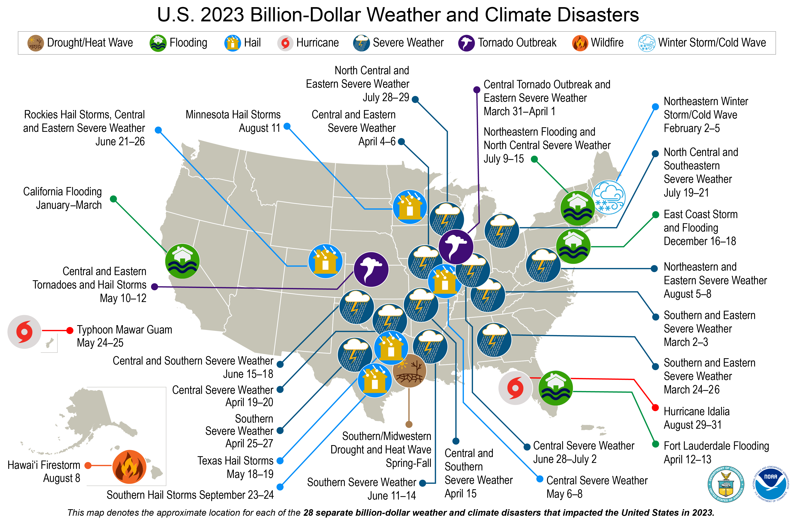

## Table of Contents

## What are severe weather events?

Severe weather events are extreme weather conditions that can be dangerous and cause a lot of damage. These events include things like hurricanes, tornadoes, blizzards, and heatwaves. They can happen suddenly and can be very powerful, affecting large areas and many people.

These events can lead to problems like flooding, power outages, and damage to buildings and roads. People might need to leave their homes, and sometimes, these events can even cause loss of life. It's important for communities to be prepared and have plans in place to stay safe during severe weather.

Scientists study these events to understand them better and to help predict when they might happen. By knowing more about severe weather, we can take steps to protect ourselves and our communities. This includes building stronger buildings, having emergency supplies ready, and following safety warnings from weather experts.

## How do severe weather events impact industries?

Severe weather events can hurt industries a lot. When a hurricane or tornado hits, factories and businesses might have to close down for a while. This means they can't make or sell their products, and they lose money. Also, if the weather damages buildings or machines, it costs a lot of money to fix them. For example, a farm might lose its crops in a flood, which means no food to sell and no money coming in. This can make prices go up for everyone because there's less of everything to go around.

Some industries, like insurance, feel the impact in different ways. After a big storm, lots of people need to fix their homes and businesses, so they make claims on their insurance. This means insurance companies have to pay out a lot of money, which can be hard for them. But, it also means more work for construction and repair businesses because they're busy fixing everything that got damaged. So, while some industries struggle, others might actually get more business because of severe weather events.

## Which industries are most commonly affected by severe weather?

Severe weather events like hurricanes, tornadoes, and floods can really hurt a lot of industries. Farming is one of the most affected because crops can get destroyed by too much rain or not enough rain. This means farmers lose money and there's less food to go around. Also, the energy industry can be hit hard. Power lines and oil rigs can get damaged, causing blackouts or stopping oil production. This affects everyone because we all need electricity and fuel.

Another industry that feels the impact is tourism. When a big storm hits, people cancel their trips, and hotels and restaurants lose business. Construction and manufacturing also face big problems because their buildings and machines can get wrecked, stopping work and costing a lot to fix. On the other hand, the insurance industry gets busy because everyone needs to claim money to fix their damaged stuff, but it's still tough for them because they have to pay out so much.

Overall, severe weather can mess up many industries in different ways. Some lose money right away, while others get more work but still face challenges. It's important for all these industries to be ready and have plans to deal with severe weather so they can bounce back faster.

## Can you name specific examples of industries that benefit from severe weather events?

Some industries actually do better when severe weather happens. For example, the construction and repair industry gets a lot more work after a big storm. When homes and buildings get damaged, people need to fix them, so builders and repair workers are busy and make more money. Also, the insurance industry can see more business because people need to file claims to get money to fix their stuff.

Another industry that can benefit is the emergency supply industry. When a hurricane or blizzard is coming, people buy things like flashlights, batteries, and bottled water to be ready. Stores that sell these items see a big jump in sales. So, while severe weather can cause a lot of problems, it also creates more work and sales for some businesses.

## What role does the insurance industry play during severe weather events?

During severe weather events, the insurance industry plays a big role in helping people and businesses recover. When a hurricane or tornado damages homes and buildings, people file claims with their insurance companies to get money to fix the damage. This money helps them repair their homes, replace lost items, and get back to normal life. Without insurance, many people would struggle a lot more after a disaster.

The insurance industry also works to predict and prepare for severe weather. They use data and models to estimate how much damage might happen and how much it will cost to fix. This helps them set prices for insurance and make sure they have enough money to pay out claims. After a big storm, insurance companies send out teams to assess the damage and process claims quickly, so people can start rebuilding as soon as possible.

## How does the construction industry benefit from severe weather events?

The construction industry gets a lot of work after severe weather events like hurricanes or tornadoes. When these storms damage buildings and homes, people need to fix them. This means more jobs for builders, carpenters, and other workers in the construction field. They get busy fixing roofs, walls, and other parts of buildings that got hurt by the storm. This extra work can help construction companies make more money.

Also, after a big storm, there's a rush to rebuild quickly. This means construction companies might get special help from the government or other groups to speed up the work. They might get more money to hire extra workers or buy new tools. This can be good for the construction industry because it means more jobs and more money coming in. Even though severe weather can cause a lot of problems, it can also lead to a busy time for construction workers.

## What opportunities do severe weather events create for the energy sector?

Severe weather events can create opportunities for the energy sector in a few ways. When storms knock out power lines or damage energy infrastructure, there's a need to fix and rebuild. This means more work for energy companies. They have to repair the damage, which can lead to new jobs and more money coming in for them. Also, after a big storm, people might want to make their homes and businesses more ready for the next one. This can mean installing backup generators or solar panels, which is good for companies that sell these things.

Another way severe weather can help the energy sector is by pushing for better and stronger energy systems. After a storm, people see how important it is to have reliable power. This can lead to more investment in things like burying power lines to protect them from future storms or upgrading the grid to handle extreme weather better. These changes can create new business for energy companies and help them grow. So, while severe weather can cause a lot of problems, it also opens up chances for the energy sector to do more work and improve their services.

## How do weather forecasting and technology companies capitalize on severe weather?

Weather forecasting and technology companies can make the most out of severe weather events. When a big storm is coming, people want to know what's going to happen. So, they turn to weather apps and websites to get the latest news. This means more people using these services, which can help these companies make more money from ads or subscriptions. Also, when there's a big storm, news channels and websites need good weather data to report on it. They often pay weather forecasting companies for this information, giving these companies another way to earn money.

Another way these companies benefit is by selling special technology that helps during severe weather. For example, they might sell weather alert systems that warn people when a storm is coming. Or, they might offer tools that help businesses and cities plan for bad weather. When people see how useful these tools are during a big storm, they're more likely to buy them. This can help weather forecasting and technology companies grow their business and make more money. So, while severe weather can be tough, it also creates chances for these companies to do well.

## What are the economic impacts of severe weather on industries that benefit from these events?

Severe weather events can actually help some industries make more money. When a big storm hits, the construction industry gets busy fixing damaged buildings and homes. This means more work for builders and repair workers, which can help them earn more. The insurance industry also sees a lot of action because people need to file claims to get money to fix their stuff. This can lead to more business for insurance companies, even though they have to pay out a lot of money. Also, companies that sell emergency supplies like flashlights and batteries see a big jump in sales as people get ready for the storm.

Weather forecasting and technology companies also do well during severe weather. When a storm is coming, people use weather apps and websites to stay updated, which can help these companies make money from ads or subscriptions. News channels and websites also need good weather data, so they pay these companies for it. Plus, these companies can sell special technology like weather alert systems that warn people about storms. When people see how useful these tools are, they're more likely to buy them, helping these companies grow their business.

Overall, while severe weather can cause a lot of problems, it also creates opportunities for certain industries to make more money and grow. The construction, insurance, emergency supply, and weather technology sectors all see benefits from the increased demand and work that comes with severe weather events.

## How do government policies and subsidies influence industries benefiting from severe weather?

Government policies and subsidies can really help industries that do well after severe weather. For example, after a big storm, the government might give money to help fix damaged buildings and homes. This is good for the construction industry because they get more work and can hire more people. The government might also offer special loans or tax breaks to help businesses recover faster. This means companies in the construction and repair business can make more money and grow.

Also, the government can help the insurance industry by setting rules about what they have to cover during severe weather. This can make sure people get the help they need to fix their homes and businesses. Sometimes, the government gives money to people to help them buy insurance, which means more business for insurance companies. These policies and subsidies can make it easier for industries to benefit from severe weather events and help them be ready for the next storm.

## What are the long-term sustainability issues for industries dependent on severe weather events?

Industries that do well after severe weather, like construction and insurance, can face big problems in the long run. If they depend too much on storms and other bad weather to make money, they might have trouble when there are no big storms for a while. This can make it hard for them to plan for the future and keep their business going strong. Also, if they focus too much on fixing things after storms, they might not spend enough time and money on making their business better in other ways, like using new technology or finding new ways to make money.

Another problem is that severe weather is getting worse because of climate change. This means there could be more big storms in the future, but it also means the damage could be bigger and harder to fix. For industries like construction and insurance, this could mean they have to spend more money to fix things and might not make as much profit. They need to think about how to be ready for these changes and find ways to keep their business going strong, even as the weather gets worse.

## How can industries prepare for and adapt to the increasing frequency of severe weather events?

Industries can get ready for more severe weather by making strong plans. They should think about what might happen during a storm and how they can keep working even if things get damaged. For example, construction companies can use better materials and build in ways that can stand up to storms. They can also have extra workers and supplies ready to fix things quickly. Insurance companies can use new technology to predict storms better and set prices that help them pay for damage without losing too much money. By being ready, these industries can keep going strong even when the weather gets bad.

Adapting to more severe weather means finding new ways to make money and grow. Industries should look for ways to help people and businesses be more ready for storms. For example, energy companies can work on making the power grid stronger and more able to handle bad weather. They can also sell things like backup generators and solar panels to help people keep their power on during storms. Weather forecasting and technology companies can make better tools to warn people about storms and help them plan. By doing these things, industries can turn the problems of severe weather into chances to do well and help their communities.

## What are some examples of Industry Case Studies?

The influence of severe weather on various industries and the intersecting role of algorithmic trading is substantial. Here we examine specific sectors impacted by such dynamics:

### Agriculture Industry: Weather's Effect on Commodity Prices and Trading

Severe weather significantly impacts agricultural output, leading to volatile commodity prices. For instance, droughts can diminish crop yields, increasing prices, whereas floods can destroy harvests, leading to similar effects. Algorithmic trading models in agriculture now frequently incorporate weather forecasts and satellite data to anticipate such price shifts. These models use machine learning to analyze vast datasets, improving prediction accuracy.

Consider the corn futures market. Data on soil moisture levels, temperature, and rainfall is fed into algorithms that estimate yield probabilities. A Python script using libraries like `pandas` and `scikit-learn` may look like this:

```python
import pandas as pd
from sklearn.linear_model import LinearRegression

# Load weather-related data
data = pd.read_csv('weather_yield_data.csv')
X = data[['rainfall', 'temp', 'soil_moisture']]
y = data['corn_yield']

# Train model
model = LinearRegression().fit(X, y)

# Predict yields
yield_prediction = model.predict([[20, 85, 0.30]])  # example input
```

### Energy Industry: Weather Impact on Markets and Algorithmic Strategies

Weather-related impacts on the energy sector can be profound, affecting both supply and demand. For instance, cooler climates increase natural gas demand, influencing market prices. Similarly, hurricanes can disrupt oil production, leading to supply constraints and price hikes. Algorithmic trading strategies in energy must thus integrate weather predictions, often utilizing real-time data for rapid adjustments.

Advanced algorithms may employ predictive analytics to position trades ahead of forecasted supply chain disruptions. This involves real-time weather feeds incorporated into trading systems to adjust positions based on anticipated weather developments.

### Insurance Industry: Algorithmic Models for Weather Risk Mitigation

The insurance industry uses algorithmic models to cope with weather-related risks. Predictive analytics in insurance employs historical weather data to model potential risks and calculate premiums. Machine learning models assess the probability of events like hurricanes or floods, allowing insurers to optimize their risk portfolios accordingly.

For example, algorithms might calculate expected payouts by:

$$
\text{Expected Payout} = \sum (\text{Probability of Event}_i \times \text{Amount of Loss}_i)
$$

These models help in crafting coverage strategies that mitigate financial exposure from severe weather events.

### Transportation and Logistics: Managing Operational Risks

Severe weather challenges transportation and logistics, affecting route efficiency and delivery schedules. Companies employ algorithmic trading insights to optimize routes and manage risks. For instance, logistics firms may use predictive models to reroute shipments around storm-affected areas, minimizing delays and costs.

Tools for route optimization often involve algorithms that analyze weather forecasts in conjunction with real-time traffic data, ensuring operational efficiency despite adverse conditions. Using a Python-based solution might involve integrating APIs for weather and traffic updates, allowing dynamic adjustments to logistical plans.

In summary, severe weather deeply influences these key industries, prompting a reliance on algorithmic strategies to anticipate and adapt to these challenges.

## References & Further Reading

[1]: Bergstra, J., Bardenet, R., Bengio, Y., & Kégl, B. (2011). ["Algorithms for Hyper-Parameter Optimization."](https://papers.nips.cc/paper/4443-algorithms-for-hyper-parameter-optimization) Advances in Neural Information Processing Systems 24.

[2]: ["Advances in Financial Machine Learning"](https://www.amazon.com/Advances-Financial-Machine-Learning-Marcos/dp/1119482089) by Marcos Lopez de Prado

[3]: ["Evidence-Based Technical Analysis: Applying the Scientific Method and Statistical Inference to Trading Signals"](https://www.amazon.com/Evidence-Based-Technical-Analysis-Scientific-Statistical/dp/0470008741) by David Aronson

[4]: ["Machine Learning for Algorithmic Trading"](https://github.com/PacktPublishing/Machine-Learning-for-Algorithmic-Trading-Second-Edition) by Stefan Jansen

[5]: ["Quantitative Trading: How to Build Your Own Algorithmic Trading Business"](https://books.google.com/books/about/Quantitative_Trading.html?id=j70yEAAAQBAJ) by Ernest P. Chan