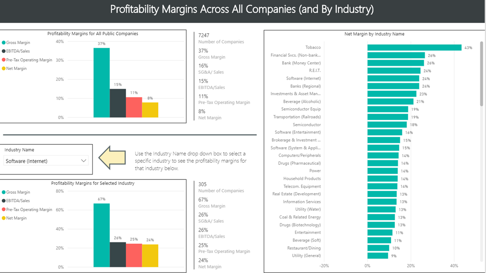

## Table of Contents

## What is EBITDA and how is it calculated?

EBITDA stands for Earnings Before Interest, Taxes, Depreciation, and Amortization. It's a way to measure how well a company is doing by looking at its profits before taking away certain costs. These costs include interest on loans, taxes, and the gradual reduction in value of things like buildings and equipment, which is called depreciation and amortization. By not including these costs, EBITDA gives a clearer picture of the money a company makes from its main business activities.

To calculate EBITDA, you start with the company's earnings, which is usually the net income found on the income statement. Then, you add back the interest, taxes, depreciation, and amortization that were subtracted to get to the net income. So, if a company's net income is $100,000, and it paid $20,000 in interest, $30,000 in taxes, and had $10,000 in depreciation and amortization, the EBITDA would be $100,000 + $20,000 + $30,000 + $10,000 = $160,000. This number helps investors and managers see the company's operating performance without the influence of financing and accounting decisions.

## Why are high EBITDA margins important for industries?

High EBITDA margins are important for industries because they show that a company is good at making money from its main business activities. When a company has a high EBITDA margin, it means that it can make a lot of profit before paying for things like interest, taxes, and the wear and tear of its equipment. This is good news for investors because it suggests that the company is efficient and can manage its costs well. Industries with high EBITDA margins are often seen as more attractive because they have the potential to generate more cash flow, which can be used to grow the business, pay down debt, or return money to shareholders.

In addition, high EBITDA margins can give a company a competitive advantage. If a company in an industry has a higher margin than its competitors, it might be able to lower prices to gain more customers, invest more in research and development, or weather economic downturns better than others. This can lead to a stronger position in the market and more long-term success. For industries, having companies with high EBITDA margins can mean the industry as a whole is healthy and has good growth prospects, which can attract more investment and talent.

## Which industries typically have high EBITDA margins?

Some industries that usually have high EBITDA margins include software and technology, especially those that make software as a service (SaaS). These companies can have high margins because once they create their software, it doesn't cost much to sell it to more customers. They don't need a lot of physical stuff, like factories or stores, so they can keep more of the money they make.

Another industry with high EBITDA margins is pharmaceuticals. These companies can have high margins because they spend a lot on research to create new drugs, and once they have a successful drug, they can sell it for a high price. It's expensive to get started, but if they find a good drug, they can make a lot of profit.

Other industries with high margins can include luxury goods and certain types of financial services. Luxury goods can have high margins because people are willing to pay a lot for them, and financial services can have high margins because they deal with money and don't need a lot of physical stuff to make money.

## How do high EBITDA margins affect a company's valuation?

High EBITDA margins can make a company look more valuable to investors. When a company has high margins, it shows that it's good at making money from what it does every day. This makes investors feel confident because it means the company can keep making profits even if things like taxes or interest rates change. Because of this, investors might be willing to pay more for the company, which can push up its valuation.

In simple terms, a company with high EBITDA margins can be seen as a safer bet. It's like having a business that keeps more of the money it makes, which can be used to grow the business, pay off debts, or give money back to shareholders. This makes the company more attractive, and when something is more attractive, people are usually willing to pay more for it. That's why high EBITDA margins can lead to a higher valuation for a company.

## What factors contribute to high EBITDA margins in specific industries?

High EBITDA margins in specific industries often come from the nature of the business itself. For example, in the software industry, especially with SaaS companies, once the software is developed, it doesn't cost much to sell it to more customers. They don't need a lot of physical stuff like factories or stores, so they can keep more of the money they make. This is why software companies can have high margins. In the pharmaceutical industry, the high cost of research and development can lead to high margins if a company successfully develops a new drug. Once the drug is on the market, it can be sold at a high price, leading to big profits.

Another [factor](/wiki/factor-investing) that helps some industries have high EBITDA margins is the demand for their products or services. Luxury goods companies, for instance, can charge a lot for their products because people are willing to pay for the status or quality that comes with them. This means they can keep a bigger part of the money they make as profit. In the financial services industry, companies can have high margins because they work with money and don't need a lot of physical things to make money. They can offer services like banking or investment advice, and if they do it well, they can keep a lot of the money they make.

## Can you provide examples of companies with high EBITDA margins in different industries?

In the software industry, companies like Microsoft and Adobe are known for having high EBITDA margins. Microsoft makes a lot of money from its software, like Windows and Office, and from its cloud services like Azure. They don't need a lot of physical stuff to sell these, so they can keep more of the money they make. Adobe, on the other hand, has a high margin because it sells creative software like Photoshop through a subscription model. This means they get steady money from customers every month, and it doesn't cost them much to keep providing the service.

In the pharmaceutical industry, companies like Pfizer and Johnson & Johnson have high EBITDA margins. Pfizer makes a lot of money from drugs like their COVID-19 vaccine, which was in high demand. They spend a lot on research, but once they have a successful drug, they can sell it for a high price. Johnson & Johnson also makes money from drugs, but they also sell medical devices and consumer health products, which helps them keep their margins high. Both companies can keep a big part of the money they make because of the high demand for their products.

In the luxury goods industry, companies like LVMH and Hermès have high EBITDA margins. LVMH owns brands like Louis Vuitton and Dior, which people are willing to pay a lot for because of their status and quality. Hermès is known for its high-end products like the Birkin bag, which can cost thousands of dollars. These companies can charge a lot for their products, so they can keep a bigger part of the money they make as profit.

## How do economic cycles impact industries with high EBITDA margins?

Economic cycles can affect industries with high EBITDA margins in different ways. When the economy is doing well, people and businesses have more money to spend. This can be good for industries like software and luxury goods because people are more likely to buy their products or services. For example, companies like Microsoft or LVMH might see their sales go up, which can help keep their high margins. But, if the economy starts to slow down, people might not want to spend as much money on luxury items or new software, which can hurt these companies' profits and margins.

In the pharmaceutical industry, economic cycles can have a different impact. Even when the economy is not doing well, people still need medicine and healthcare. This means that companies like Pfizer or Johnson & Johnson might not see their sales drop as much as other industries. Their high margins can help them keep making money even during tough times. But, if the economy is really bad, governments might cut back on healthcare spending, which could affect these companies' profits. So, while high EBITDA margins can help these companies weather economic downturns better, they are not completely safe from the effects of economic cycles.

## What are the challenges faced by industries maintaining high EBITDA margins?

Keeping high EBITDA margins can be tough for industries because many things can make their costs go up or their sales go down. For example, if the cost of making their products or services goes up because of higher prices for materials or labor, it can eat into their profits. Also, if new competitors come into the market and offer similar products or services for less money, it can force companies to lower their prices to keep customers. This can make it hard to keep their margins high.

Another challenge is that changes in what customers want can affect industries with high margins. If people start wanting different things, companies might have to spend a lot of money to change what they offer. This can be expensive and risky, and it might not work out. Also, if the economy is not doing well, people might not want to spend as much money on things like luxury goods or new software, which can hurt sales and margins. So, even though high EBITDA margins are good, they can be hard to keep because of all these challenges.

## How do regulatory environments influence EBITDA margins in different industries?

Regulatory environments can have a big impact on EBITDA margins in different industries. For example, in the pharmaceutical industry, strict rules about how drugs are made and tested can make it more expensive for companies to do business. They have to spend a lot of money to make sure they follow all the rules, which can lower their profits and their EBITDA margins. On the other hand, if a company can get a special approval for a new drug, it might be able to charge a high price for it, which can help keep their margins high.

In the financial services industry, regulations can also affect EBITDA margins. Banks and other financial companies have to follow a lot of rules about how they handle money and what they can charge for their services. If new rules come in that make it harder for them to make money, it can lower their margins. But, if the rules help them keep their costs down or charge more for their services, it can help them keep their margins high. So, the regulatory environment can either help or hurt a company's EBITDA margins, depending on the rules and how they are enforced.

## What strategies can companies use to improve their EBITDA margins?

Companies can improve their EBITDA margins by finding ways to make more money or spend less. One way to make more money is to raise prices if customers are willing to pay more. Another way is to sell more to existing customers or find new customers. Companies can also look at what they're selling and focus on the things that make the most profit. For example, if a software company finds that one of its products is really popular, it might decide to spend more time and money on that product to sell even more of it.

On the other hand, companies can also work on spending less money. This can mean finding cheaper ways to make their products or services, like using less expensive materials or finding ways to do things more efficiently. They might also look at their costs and see if there are any that they can cut back on, like reducing the number of employees or moving to a less expensive office. By making more money and spending less, companies can improve their EBITDA margins and keep more of the money they make as profit.

## How do technological advancements affect EBITDA margins in high-margin industries?

Technological advancements can help companies in high-margin industries make more money and spend less, which can improve their EBITDA margins. For example, in the software industry, new technology can help companies create better products faster and more cheaply. This means they can sell more software without spending a lot more money, which can increase their profits. In the pharmaceutical industry, new technology can help companies do research more quickly and at a lower cost, which can lead to new drugs that they can sell for a high price. So, technology can help these companies keep their costs down and their profits up.

However, technological advancements can also make things harder for companies trying to keep high EBITDA margins. If new technology makes it easier for other companies to enter the market, it can increase competition. This might force companies to lower their prices to keep customers, which can hurt their margins. Also, if a company has to spend a lot of money to keep up with new technology, it might not see the benefits right away. This can make their costs go up before their profits do, which can be a challenge. So, while technology can help improve EBITDA margins, it can also make it harder to keep them high if not managed carefully.

## What are the future trends expected to influence industries with high EBITDA margins?

In the future, industries with high EBITDA margins will likely be influenced by trends like the growth of [artificial intelligence](/wiki/ai-artificial-intelligence) and automation. These technologies can help companies do things faster and cheaper, which can lead to higher profits. For example, in the software industry, AI can help make better software more quickly. In the pharmaceutical industry, automation can speed up the process of finding new drugs. This can help these companies keep their high margins by making more money while spending less. But, if other companies use these technologies too, it might make the market more competitive, which could push down prices and margins.

Another trend that will affect high-margin industries is the move towards more sustainable and eco-friendly practices. Customers are starting to care more about how products are made and their impact on the environment. This means companies might have to spend more money to make their products in a way that is good for the planet. This could raise their costs and make it harder to keep high margins. However, if companies can find ways to be more sustainable without spending too much, it could help them attract more customers and keep their margins high. So, while sustainability is important, it will be a challenge for these industries to balance it with their profits.

## What is EBITDA and EBITDA Margin?

EBITDA stands for Earnings Before Interest, Taxes, Depreciation, and Amortization. It is a financial metric used to evaluate a company's operating performance by analyzing earnings derived strictly from core business operations. EBITDA provides insights into a company’s profitability before accounting for financial and accounting decisions such as interest payments, tax liabilities, and depreciation of assets. The formula for calculating EBITDA is:

$$
\text{EBITDA} = \text{Net Income} + \text{Interest} + \text{Taxes} + \text{Depreciation} + \text{Amortization}
$$

The EBITDA Margin is an extension of this concept, representing the percentage of a company's total revenue that is converted into EBITDA. It is calculated by dividing EBITDA by total revenue, thus offering a clear picture of operating profitability. The formula for EBITDA Margin is:

$$
\text{EBITDA Margin} = \left( \frac{\text{EBITDA}}{\text{Total Revenue}} \right) \times 100\%
$$

The EBITDA margin is crucial because it allows businesses to determine profitability independent of their financing strategy and tax influences, thus offering an unbiased view of operational efficiency. This makes it easier to compare the performance of companies across different industries or geographical regions where tax rates and capital structures might differ significantly.

While EBITDA is a valuable measure of operational efficiency, it's important to contrast it with other profitability metrics like net profit margin, which takes into account all expenses, including interest, taxes, depreciation, and amortization. Net profit margin is calculated as:

$$
\text{Net Profit Margin} = \left( \frac{\text{Net Income}}{\text{Total Revenue}} \right) \times 100\%
$$

Unlike the net profit margin, which considers all components of income and expenditure, EBITDA margin focuses solely on operating factors, thus presenting a raw operational profitability measure. Critics of EBITDA argue that by excluding key expenses, it might give an overly positive image of financial health. However, due to its focus on operational performance, EBITDA remains widely used among analysts and investors, especially when assessing firms in capital-intensive industries where depreciation can significantly affect net income.

## References & Further Reading

[1]: {"Koller, T. (2015). "Measuring and Managing the Value of Companies: McKinsey & Company's Guide to Financial Metrics." McKinsey & Company.}

[2]: {"Lazonick, W., & O'Sullivan, M. (2000). "Perspective: The Performance of US Corporations: New Perspectives on the Separation of Ownership and Control." Journal of Economic Literature, 38(3), 737-758."}

[3]: {"Damodaran, A. (2007). "Valuation Techniques for Finance Professionals." John Wiley & Sons."}

[4]: {"Lopez de Prado, M. (2018). "Advances in Financial Machine Learning." Wiley."}

[5]: {"Aronson, D. R. (2007). "Evidence-Based Technical Analysis: Applying the Scientific Method and Statistical Inference to Trading Signals." Wiley."}

[6]: {"Jansen, S. (2020). "Machine Learning for Algorithmic Trading." Packt Publishing."}

[7]: {"Chan, E. P. (2009). "Quantitative Trading: How to Build Your Own Algorithmic Trading Business." Wiley."}