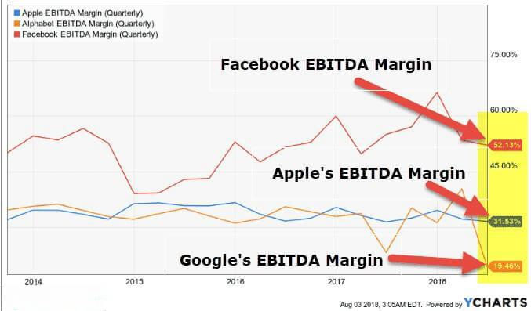

EBITDA, an acronym for Earnings Before Interest, Taxes, Depreciation, and Amortization, represents a key financial metric commonly used to assess a company's operating performance. It provides a clear picture of a firm's profitability by focusing solely on its core operational outcomes, excluding non-operating factors such as financing costs, tax obligations, and non-cash expenses like depreciation and amortization. This focus on fundamental operating efficiency makes EBITDA a vital tool for comparing companies within and across industries, offering insights into how effectively a company is managed.

The EBITDA margin, expressed as a percentage, is calculated by dividing EBITDA by total revenue. It serves as a critical indicator of operational efficiency, highlighting how much cash a company generates from its operations relative to its sales. A higher EBITDA margin suggests a highly efficient operation, indicative of strong management and lucrative business practices.



Industries characterized by high EBITDA margins are frequently scrutinized due to their ability to maintain superior profitability through scalable operations and advantageous financial structures. High EBITDA margin industries typically exhibit robust pricing power and benefit from economic moats—competitive advantages that protect them against market competition, such as high barriers to entry, brand strength, or regulatory advantages.

For investors and analysts, utilizing EBITDA as a comparative tool is invaluable in evaluating the relative profitability of businesses across diverse sectors. It strips away the noise of differing capital structures and tax environments, enabling more apples-to-apples comparisons. Consequently, a company with a high EBITDA margin is generally viewed as more adept at converting revenues into cash flows compared to its peers.

In recent years, the integration of algorithmic trading in high EBITDA margin industries has revolutionized investment strategies. This use of complex mathematical models and algorithms to execute trades based on EBITDA data and other financial metrics offers significant potential in optimizing profitability. Algorithmic trading enables rapid and efficient decision-making, exploiting market conditions to enhance returns in sectors such as finance and technology. This convergence of cutting-edge technology with traditional financial metrics like EBITDA has underscored the evolving landscape of industry profitability analysis.

## Table of Contents

## What is EBITDA and EBITDA Margin?

EBITDA stands for Earnings Before Interest, Taxes, Depreciation, and Amortization. It is a financial metric used to evaluate a company's operating performance by analyzing earnings derived strictly from core business operations. EBITDA provides insights into a company’s profitability before accounting for financial and accounting decisions such as interest payments, tax liabilities, and depreciation of assets. The formula for calculating EBITDA is:

$$
\text{EBITDA} = \text{Net Income} + \text{Interest} + \text{Taxes} + \text{Depreciation} + \text{Amortization}
$$

The EBITDA Margin is an extension of this concept, representing the percentage of a company's total revenue that is converted into EBITDA. It is calculated by dividing EBITDA by total revenue, thus offering a clear picture of operating profitability. The formula for EBITDA Margin is:

$$
\text{EBITDA Margin} = \left( \frac{\text{EBITDA}}{\text{Total Revenue}} \right) \times 100\%
$$

The EBITDA margin is crucial because it allows businesses to determine profitability independent of their financing strategy and tax influences, thus offering an unbiased view of operational efficiency. This makes it easier to compare the performance of companies across different industries or geographical regions where tax rates and capital structures might differ significantly.

While EBITDA is a valuable measure of operational efficiency, it's important to contrast it with other profitability metrics like net profit margin, which takes into account all expenses, including interest, taxes, depreciation, and amortization. Net profit margin is calculated as:

$$
\text{Net Profit Margin} = \left( \frac{\text{Net Income}}{\text{Total Revenue}} \right) \times 100\%
$$

Unlike the net profit margin, which considers all components of income and expenditure, EBITDA margin focuses solely on operating factors, thus presenting a raw operational profitability measure. Critics of EBITDA argue that by excluding key expenses, it might give an overly positive image of financial health. However, due to its focus on operational performance, EBITDA remains widely used among analysts and investors, especially when assessing firms in capital-intensive industries where depreciation can significantly affect net income.

## Key Characteristics of High EBITDA Industries

Industries characterized by high EBITDA (Earnings Before Interest, Taxes, Depreciation, and Amortization) margins often exhibit distinct economic features and structural elements that contribute to their profitability. These industries are typically marked by significant capital intensity, scalability, economic moats, and pricing power. Furthermore, they often have high barriers to entry, creating environments where EBITDA margins can remain elevated over time.

**Capital Intensity and Scalability:**

High EBITDA margin industries frequently involve substantial capital investments in infrastructure, technology, or specialized equipment. Such capital intensity serves to create barriers to entry, reducing competition and helping sustain high profitability. For example, the oil and gas industry requires significant capital expenditures to explore, extract, and refine resources. Once the capital investment is made, however, these industries benefit from economies of scale, allowing them to spread the fixed capital costs over a larger output [volume](/wiki/volume-trading-strategy), boosting EBITDA margins.

Scalability also plays a pivotal role. Industries that can scale operations without a proportional increase in costs can achieve higher margins. For instance, the semiconductor industry can increase production with minimal additional costs once the initial capital expenditure is done, which enhances their EBITDA margins.

**Economic Moats and Pricing Power:**

An economic moat refers to a company's ability to maintain competitive advantages that protect it from competitors, contributing to sustained profitability. High EBITDA margin industries often have strong economic moats derived from factors like brand reputation, unique production processes, or exclusive access to crucial resources.

Pricing power is another critical [factor](/wiki/factor-investing). Industries with high pricing power can pass increased costs onto consumers without losing market demand. This ability is often seen in industries with inelastic demand, such as telecommunications, where consumers consistently require services, allowing companies to maintain or increase prices to protect or enhance their margins.

**Industries with Naturally High Barriers to Entry:**

Industries with high barriers to entry typically experience less competition, allowing existing companies to maintain high EBITDA margins. Natural monopolies, where a single player can most efficiently serve the entire market due to high infrastructure costs, exemplify industries with such barriers. Utilities and telecommunications, for example, require massive capital outlays for infrastructure setup, limiting new entrants and enabling existing firms to maintain strong profitability.

Other examples include pharmaceutical and aerospace industries, where complex regulatory requirements and the need for specialized technology and knowledge act as formidable entry barriers.

In summary, high EBITDA margin industries often feature a combination of capital intensity, scalability, economic moats, and high entry barriers, all contributing to their robust profitability metrics. Understanding these characteristics helps in assessing the operational efficiency and long-term profit potential of companies within such sectors.

## Industries with High EBITDA Margins

Industries with high EBITDA margins are often characterized by their ability to maintain robust profitability levels due to inherent sectoral advantages and strategic positioning. Among these industries, oil and gas, telecommunications, and semiconductors notably stand out.

### Oil and Gas Industry

The oil and gas industry is traditionally recognized for its high EBITDA margins due to several factors, including the critical nature of its products and the capital-intensive processes involved in production and distribution. Companies in this sector benefit from significant pricing power, and high barriers to entry further protect their market positions. Moreover, the global dependency on energy products underscores the industry’s capacity to sustain strong financial performance.

#### Regulatory Environment

The regulatory landscape within the oil and gas industry can be stringent, involving environmental standards, safety regulations, and geopolitical influences. Despite these constraints, the ability to operate internationally and tap into diverse geographic resources helps balance regulatory challenges with financial profitability.

#### Key Companies

Prominent companies like ExxonMobil, Chevron, and Royal Dutch Shell consistently report high EBITDA margins. Their strategies often involve new exploration, technological innovations, and efficiency improvements to maintain operational efficiencies and profitability.

### Telecommunications Industry

Telecommunications is another industry with high EBITDA margins, supported by its essential services and technological advancements. The increasing demand for data services and connectivity directly contributes to sustaining healthy profit margins.

#### Competitive Dynamics

Competition in the telecommunications sector is intense, with key players constantly investing in infrastructure and technology to enhance service offerings. However, significant capital investments are required to build and maintain extensive network infrastructures, which creates a competitive barrier for new entrants.

#### Notable Companies

Companies like Verizon, AT&T, and Vodafone have established themselves as leaders in the telecommunications sector, consistently achieving high EBITDA margins through strategic pricing, customer retention strategies, and technological enhancements.

### Semiconductor Industry

The semiconductor industry, which plays a pivotal role in the technology supply chain, also boasts high EBITDA margins. The demand for semiconductors is fueled by continued advancements in consumer electronics, automotive technology, and data centers.

#### Economic Moats

Semiconductor companies often benefit from economic moats created by high R&D costs, complex manufacturing processes, and the critical nature of semiconductors in modern technology ecosystems. These factors contribute to their ability to achieve substantial profit margins.

#### Industry Leaders

Within this sector, companies such as Intel, TSMC (Taiwan Semiconductor Manufacturing Company), and NVIDIA are known for their strong EBITDA margins. These firms leverage economies of scale and technological leadership to optimize profitability.

In summary, industries like oil and gas, telecommunications, and semiconductors maintain high EBITDA margins due to their fundamental roles in the global economy, strategic advantages, and ability to navigate complex regulatory and competitive landscapes.

## Algorithmic Trading in High EBITDA Margin Sectors

Algorithmic trading has transformed the landscape of high EBITDA margin sectors, providing enhanced efficiency and precision in executing trades. This form of trading involves using computer algorithms to analyze market data and execute orders at speeds and frequencies beyond human capabilities. In high EBITDA margin industries, such as finance and technology, [algorithmic trading](/wiki/algorithmic-trading) can significantly impact profitability by leveraging key financial metrics, including EBITDA, to inform trading decisions.

EBITDA, which stands for Earnings Before Interest, Taxes, Depreciation, and Amortization, serves as an essential measure of a company's operational performance. Algorithmic trading strategies increasingly incorporate EBITDA data to evaluate a company's financial health and potential for profit. By analyzing a company's EBITDA margin—the ratio of EBITDA to total revenue—algorithms can assess operational efficiency and compare profitability across different firms and sectors. This comparative analysis aids in identifying investment opportunities and optimizing trade decisions.

One of the primary benefits of algorithmic trading in high EBITDA margin sectors is the ability to optimize profitability through rapid decision-making and execution. Algorithms can process vast amounts of data to identify patterns and trends that inform trade execution strategies. For example, a trading algorithm might be programmed to initiate a buy order when a company's EBITDA margin exceeds a specific threshold, indicating strong operational performance.

In finance, algorithmic trading applications include quantitative hedge funds that utilize sophisticated models to predict market movements based on various financial indicators, including EBITDA. These models often use statistical techniques and [machine learning](/wiki/machine-learning) to analyze historical data and project future price movements, enabling funds to maximize returns on investment. Moreover, in sectors like technology, companies may employ algorithmic trading to manage portfolio investments by evaluating the operational efficiency represented by EBITDA margins, thus optimizing capital allocation and achieving higher profitability.

Python is a popular programming language for developing algorithmic trading strategies due to its robust libraries and frameworks for data analysis and machine learning. An example of a simple algorithmic trading strategy using Python could look like this:

```python
import pandas as pd
import numpy as np

# Sample data: Company A's revenue and EBITDA
data = {'Revenue': [1000, 1200, 1100, 1300],
        'EBITDA': [200, 250, 220, 280]}
df = pd.DataFrame(data)

# Calculate EBITDA margin
df['EBITDA_Margin'] = df['EBITDA'] / df['Revenue']

# Define a trading strategy based on EBITDA margin threshold
def trading_strategy(row, threshold=0.2):
    if row['EBITDA_Margin'] > threshold:
        return "Buy"
    else:
        return "Hold"

# Apply trading strategy
df['Strategy'] = df.apply(trading_strategy, axis=1)

print(df)
```

This Python snippet demonstrates a basic approach to constructing a trading strategy by calculating the EBITDA margin and determining trade actions based on a predefined threshold.

Overall, algorithmic trading in high EBITDA margin industries offers considerable advantages by enabling faster and more informed trading decisions. As technology and data analytics continue to evolve, the integration of algorithmic trading with EBITDA and other financial metrics will likely play an increasingly crucial role in capitalizing on profitability opportunities in these sectors.

## Challenges and Opportunities in High EBITDA Margin Industries

Companies operating within high EBITDA margin industries often face a complex array of challenges and opportunities that can significantly impact their profitability and growth prospects. Understanding these dynamics is crucial for sustaining and enhancing EBITDA margins over time.

One of the primary challenges for companies in high EBITDA margin industries is the potential for increased regulatory scrutiny. Industries such as oil and gas, telecom, and semiconductors are often subject to stringent regulations that can affect operational practices and cost structures. Compliance with these regulations requires significant resources, and any changes in regulatory policies can lead to unexpected financial burdens. Furthermore, these industries may face geopolitical risks that can disrupt operations and affect profitability.

Market conditions pose another challenge. High EBITDA margin industries are not immune to economic cycles. Fluctuations in demand, commodity prices, and exchange rates can influence revenue and cost structures. For example, in the oil and gas sector, changes in [crude oil](/wiki/crude-oil) prices directly impact EBITDA margins. Similarly, in the semiconductor industry, demand swings driven by technological advancements or shifts in consumer preferences can affect margins.

Technological advancements, while offering significant opportunities, also present challenges. Rapid technological changes can render existing processes or products obsolete, requiring substantial investment in research and development to stay competitive. However, companies that successfully innovate can leverage these advancements to improve efficiency, reduce costs, and enhance their market positions. For instance, adopting automation technologies and optimizing supply chains can lead to substantial cost reductions and improved EBITDA margins.

Innovation also provides opportunities for growth. Companies that invest in new technologies or develop unique products can capture additional market share and command premium pricing, thereby enhancing profitability. In sectors like telecommunications, advancements in 5G technology offer opportunities for firms to expand services and increase revenue streams.

Moreover, companies can explore strategic partnerships and collaborations to drive growth and maintain high EBITDA margins. Collaborating with technology providers, for instance, can enable firms to integrate cutting-edge solutions into their operations, enhancing efficiency and reducing costs.

In conclusion, while high EBITDA margin industries face a myriad of challenges, including regulatory scrutiny, market fluctuations, and the need for constant technological innovation, they also possess numerous opportunities to bolster their profitability. Companies that adeptly navigate these environments, adapt to changing conditions, and invest in innovation are well-positioned to sustain and grow their EBITDA margins over the long term.

## Conclusion

EBITDA margin stands as a vital measure of profitability, offering a clear view of a company's operational efficiency by isolating earnings before the impacts of interest, taxes, depreciation, and amortization. This metric is essential for understanding how well a company or industry can convert revenue into earnings, independent of its capital structure and other non-operational factors. By focusing on operational performance, the EBITDA margin assists stakeholders in making informed decisions, especially when comparing entities across different sectors.

Industries characterized by high EBITDA margins often exhibit certain defining traits. These industries, such as oil and gas, telecom, and semiconductors, usually experience high capital intensity, scalability, and possess significant economic moats, such as robust pricing power and barriers to entry. These factors contribute to sustained profitability and operational efficiency, making these industries attractive to investors and essential to national and global economies.

Algorithmic trading has profound implications for industries with high EBITDA margins. By leveraging vast amounts of EBITDA data, algorithmic trading strategies can optimize investment decisions and enhance profitability. These strategies employ sophisticated algorithms to analyze financial metrics rapidly and accurately, enabling investors to capitalize on market movements with precision and speed. This approach not only increases efficiency but also drives competitive advantage, particularly in fast-paced sectors such as finance and technology.

Ongoing analysis and an in-depth understanding of profitability metrics like EBITDA margins remain crucial for industries and investors alike. These metrics offer insights into the operational health and potential growth trajectories of companies, guiding strategic decisions and investment strategies. As market dynamics and technological advancements continue to evolve, the ability to interpret and utilize EBITDA margins effectively will be pivotal in sustaining and enhancing profitability. Encouraging continual learning and adaptation in the face of changing economic landscapes is vital for maintaining competitive positions and achieving long-term success.

## References & Further Reading

[1]: {"Koller, T. (2015). "Measuring and Managing the Value of Companies: McKinsey & Company's Guide to Financial Metrics." McKinsey & Company.}

[2]: {"Lazonick, W., & O'Sullivan, M. (2000). "Perspective: The Performance of US Corporations: New Perspectives on the Separation of Ownership and Control." Journal of Economic Literature, 38(3), 737-758."}

[3]: {"Damodaran, A. (2007). "Valuation Techniques for Finance Professionals." John Wiley & Sons."}

[4]: {"Lopez de Prado, M. (2018). "Advances in Financial Machine Learning." Wiley."}

[5]: {"Aronson, D. R. (2007). "Evidence-Based Technical Analysis: Applying the Scientific Method and Statistical Inference to Trading Signals." Wiley."}

[6]: {"Jansen, S. (2020). "Machine Learning for Algorithmic Trading." Packt Publishing."}

[7]: {"Chan, E. P. (2009). "Quantitative Trading: How to Build Your Own Algorithmic Trading Business." Wiley."}