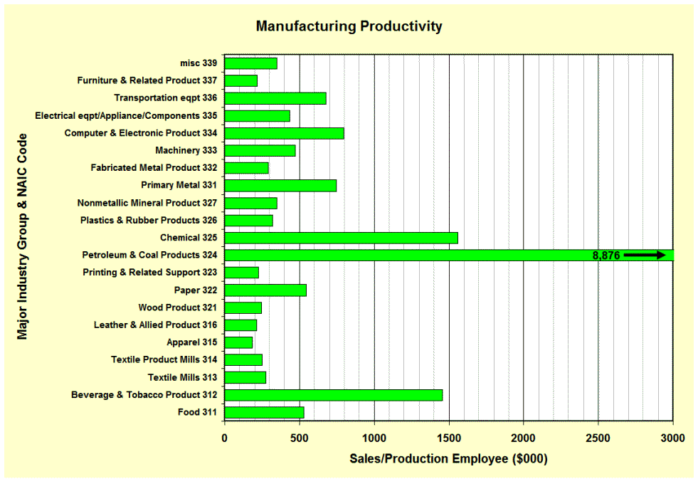

## Table of Contents

## What is inventory turnover?

Inventory turnover is a measure that shows how often a business sells and replaces its stock of goods over a certain period, usually a year. It helps businesses understand how well they are managing their inventory. A high turnover rate means the business is selling its products quickly and efficiently. On the other hand, a low turnover rate might suggest that the business has too much stock that isn't selling well, which can tie up money and space.

To calculate inventory turnover, you divide the cost of goods sold by the average inventory for the period. The cost of goods sold is the total cost of all the products sold during the period, while the average inventory is the average value of the stock held over that time. This simple calculation gives businesses a clear picture of their inventory management and helps them make better decisions about buying and selling products.

## Why is inventory turnover important for businesses?

Inventory turnover is important for businesses because it shows how well they are selling their products. If a business has a high inventory turnover, it means they are selling their products quickly. This is good because it means the business is making money and not keeping too much stock that just sits around. On the other hand, if the inventory turnover is low, it means the products are not selling well. This can be bad because the business might be spending too much money on stock that is not moving, and this can hurt their profits.

Understanding inventory turnover also helps businesses plan better. If they know how fast their products are selling, they can order just the right amount of stock. This saves money and space, and it helps keep customers happy because they can always find what they need. By keeping a close eye on inventory turnover, businesses can make smart decisions about what to buy and when to buy it, which can help them be more successful.

## Which industries typically have the highest inventory turnover?

The industries that usually have the highest inventory turnover are grocery stores and fast food restaurants. These businesses sell food and other items that people need every day. Because these products are used up quickly, they need to be replaced often. This means that grocery stores and fast food places have to keep ordering new stock to keep up with what customers are buying.

Another industry with high inventory turnover is the fashion industry, especially fast fashion. Companies like these sell clothes and accessories that change with the seasons and trends. People buy new clothes all the time, so these businesses need to keep their stock fresh and up-to-date. This leads to a high turnover rate because they are always selling and replacing their inventory to stay in style.

## How is inventory turnover calculated?

Inventory turnover is calculated by dividing the cost of goods sold by the average inventory for a certain period, usually a year. The cost of goods sold is the total cost of all the products that a business sold during that time. The average inventory is found by adding the value of the inventory at the start of the period to the value at the end of the period, then dividing by two.

This simple calculation helps businesses see how fast they are selling and replacing their stock. If a business has a high inventory turnover, it means they are selling their products quickly and need to restock often. A low inventory turnover means the products are not selling as fast, and the business might have too much stock that is just sitting around.

## What factors contribute to high inventory turnover in certain industries?

High inventory turnover in certain industries often comes from selling things that people need or want every day. For example, grocery stores and fast food restaurants sell food that people buy all the time. Food goes bad quickly, so these businesses have to keep buying new stock to replace what they sell. This means they have to order more often, which leads to a high turnover rate. It's important for them to keep their shelves full so customers can always find what they need.

Another reason for high inventory turnover is when businesses sell things that change quickly, like clothes in the fashion industry. Fast fashion companies sell new styles all the time to keep up with trends. People like to buy new clothes to stay in style, so these businesses have to keep their stock fresh. This means they sell their old stock fast and bring in new items, which leads to a high turnover rate. Keeping up with what customers want helps these businesses sell more and stay successful.

## Can you provide examples of companies in industries with high inventory turnover?

Grocery stores like Walmart and supermarkets like Kroger have high inventory turnover. These stores sell food and other things that people need every day. Food can go bad quickly, so these stores have to keep buying new stock to replace what they sell. This means they have to order more often, which leads to a high turnover rate. It's important for them to keep their shelves full so customers can always find what they need.

Fast food restaurants like McDonald's and Subway also have high inventory turnover. They sell food that people eat every day, and they need to keep their stock fresh. Fast food goes bad quickly, so these restaurants have to order new supplies often. This means they sell their old stock fast and bring in new items, which leads to a high turnover rate. Keeping up with what customers want helps these businesses sell more and stay successful.

In the fashion industry, companies like Zara and H&M have high inventory turnover. They sell clothes and accessories that change with the seasons and trends. People like to buy new clothes to stay in style, so these businesses have to keep their stock fresh. This means they sell their old stock fast and bring in new items, which leads to a high turnover rate. Keeping up with what customers want helps these businesses sell more and stay successful.

## How does inventory turnover affect profitability in these industries?

High inventory turnover can help businesses in industries like grocery stores, fast food, and fashion make more money. When a business sells its products quickly, it means they are making money from sales more often. This is good because it helps them pay for the cost of the goods they sell and other expenses. If a business can sell its stock fast, it doesn't have to keep a lot of money tied up in products that are just sitting around. This can lead to more profit because the business can use that money for other things, like growing the business or improving their products.

On the other hand, if inventory turnover is low, it can hurt a business's profits. When products don't sell quickly, the business has to keep paying to store them, and the products might even go bad or go out of style. This means the business might have to sell the products at a lower price just to get rid of them, which can lead to less profit. In industries where products need to be fresh or in style, like food and fashion, having a low turnover rate can be especially bad for profits because the business might lose money on stock that they can't sell at full price.

## What strategies do companies in high inventory turnover industries use to manage their inventory?

Companies in high inventory turnover industries, like grocery stores and fast food restaurants, use several strategies to manage their inventory well. One key strategy is to keep track of what they sell every day. They use computers and special software to see which products are selling fast and which ones are not. This helps them order just the right amount of stock so they don't have too much sitting around. Another strategy is to work closely with their suppliers. By talking to their suppliers often, they can get new stock quickly when they need it. This helps them keep their shelves full and their food fresh.

In the fashion industry, companies like Zara and H&M also have smart ways to manage their inventory. They keep their stock fresh by bringing in new styles often. They use data to see what customers are buying and then make more of those items. This way, they can sell their clothes quickly and keep up with the latest trends. They also plan their stock carefully, making sure they have enough of the popular items without overstocking. By doing this, they can keep their inventory turnover high and make more money.

## How do seasonal trends impact inventory turnover in these industries?

Seasonal trends can have a big impact on inventory turnover in industries like grocery stores, fast food, and fashion. During certain times of the year, like holidays or summer, people buy different things. For example, in the summer, grocery stores might sell more ice cream and barbecue supplies. This means they need to order more of these items to keep up with demand, which can increase their inventory turnover. If they don't order enough, they might miss out on sales, but if they order too much, they could be left with extra stock that doesn't sell.

In the fashion industry, seasonal trends are even more important. Companies like Zara and H&M need to change their stock to match the seasons and the latest trends. In winter, they might sell more coats and sweaters, while in summer, they focus on lighter clothes like shorts and t-shirts. By keeping their inventory fresh and in line with what people want to buy at different times of the year, these companies can sell their products faster. This helps them keep their inventory turnover high and make more money, but it also means they need to plan carefully to avoid being stuck with out-of-season stock.

## What are the challenges faced by industries with high inventory turnover?

Industries with high inventory turnover, like grocery stores, fast food, and fashion, face many challenges. One big challenge is keeping the right amount of stock. If they order too much, they might end up with products that go bad or go out of style before they can sell them. This can cost them a lot of money. On the other hand, if they don't order enough, they might run out of popular items, and customers could go somewhere else to buy what they need. This can hurt their sales and profits.

Another challenge is keeping up with fast-changing trends and customer needs. In the fashion industry, new styles come out all the time, and companies need to keep their stock fresh to stay in style. In grocery stores and fast food, people's tastes can change quickly, and businesses need to be ready to offer new products. This means they have to keep a close eye on what's selling and what's not, and they need to be able to change their orders quickly. If they can't do this, their inventory turnover might go down, and they could lose money.

## How do technological advancements influence inventory turnover in these industries?

Technological advancements help businesses in industries with high inventory turnover manage their stock better. They use computers and special software to keep track of what they sell every day. This helps them see which products are popular and which ones are not selling well. By knowing this, they can order just the right amount of stock. They don't have to keep a lot of money tied up in products that just sit around. This can help them sell their products faster and make more money.

In the fashion industry, technology helps companies like Zara and H&M stay on top of the latest trends. They use data from their sales to see what customers are buying and then make more of those items. This way, they can keep their stock fresh and in style. Technology also helps them plan their orders better, so they don't end up with too much stock that they can't sell. By using technology, these businesses can keep their inventory turnover high and make more profit.

## What future trends might affect inventory turnover rates in high-turnover industries?

In the future, more businesses might use technology like [artificial intelligence](/wiki/ai-artificial-intelligence) (AI) to help them manage their stock better. AI can look at a lot of data to see what people are buying and what they might want to buy next. This can help businesses order just the right amount of stock, so they don't have too much or too little. This could make their inventory turnover even higher because they can sell their products faster and not waste money on things that don't sell.

Another trend that might affect inventory turnover is the rise of online shopping. More people are buying things online, and this can change how businesses manage their stock. They might need to keep more stock in warehouses to send out to customers quickly. But they also need to be careful not to order too much, or they could end up with a lot of stock that doesn't sell. By using technology to keep track of what people are buying online, businesses can keep their inventory turnover high and make more money.

## References & Further Reading

[1]: ["Supply Chain Coordination and Inventory Turnover: A Case of the U.S. Retail Industry"](https://link.springer.com/referenceworkentry/10.1007/978-3-030-89822-9_57-1) by Jiang, R. J., & Andreosso-O'Callaghan, B.

[2]: ["Inventory Management: Non-Classical Views"](https://www.taylorfrancis.com/books/mono/10.1201/9781420079982/inventory-management-mohamad-jaber) by Ganeshan, R., & Petterson, R. B.

[3]: Meybodi, M. O., & Vatani, S. (2016). ["Inventory Turnover and Firm Stock Returns"](https://scholar.google.com/citations?user=n2OALakAAAAJ). Advances in Accounting, 35, 37-45.

[4]: ["Advances in Financial Machine Learning"](https://www.amazon.com/Advances-Financial-Machine-Learning-Marcos/dp/1119482089) by Marcos Lopez de Prado

[5]: ["The Impact of Algorithmic Trading on the Inventory Turnover Ratio"](https://www.researchgate.net/publication/378548435_Algorithmic_Trading_and_AI_A_Review_of_Strategies_and_Market_Impact) by Sato, Y.

[6]: ["Quantitative Trading: How to Build Your Own Algorithmic Trading Business"](https://www.amazon.com/Quantitative-Trading-Build-Algorithmic-Business/dp/1119800064) by Ernest P. Chan

[7]: ["Strategic Logistics Management"](https://books.google.com/books/about/Strategic_Logistics_Management.html?id=UCU3QAAACAAJ) by Donald J. Bowersox, David J. Closs

[8]: ["Machine Learning for Algorithmic Trading"](https://www.amazon.com/Machine-Learning-Algorithmic-Trading-alternative/dp/1839217715) by Stefan Jansen