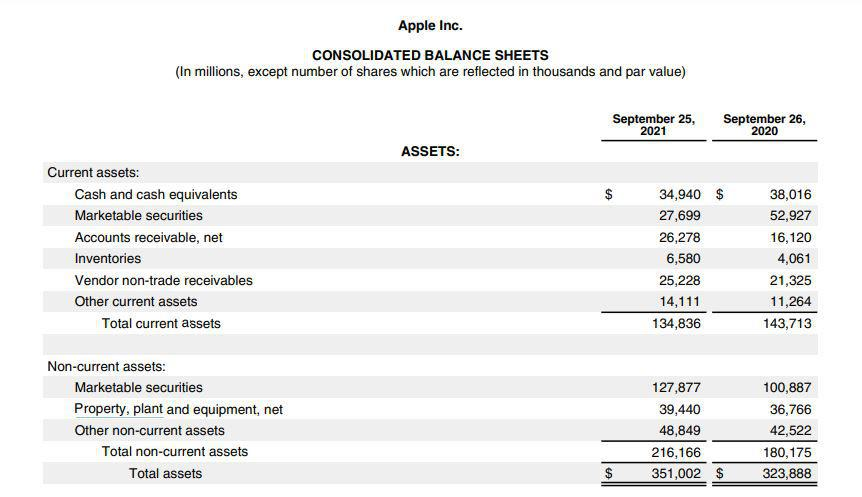

Lobbying is a fundamental component of the U.S. political and economic systems, characterized by its significant financial implications. At its core, lobbying encompasses a variety of activities aimed at influencing decision-makers within the government, thereby shaping legislation and regulatory frameworks. The financial ramifications of these activities are profound, as industries and organizations invest substantial sums to ensure their interests are represented and their voices heard.

The significance of lobbying in the U.S. political landscape cannot be overstated. Lobbying serves as a bridge between the public and private sectors, facilitating dialogue and collaboration between policymakers and industry stakeholders. This interaction is pivotal, as it allows for the articulation of industry-specific concerns and the proposal of solutions that policymakers might otherwise overlook. Economically, lobbying can sway policies that enhance market conditions, stimulate growth, and foster innovation, but it can also skew regulations in favor of well-funded interests, potentially disadvantaging smaller entities or the public interest.

Several key industries are heavily involved in lobbying efforts. These include the pharmaceutical, insurance, technology, and financial sectors, which consistently rank among the top spenders in lobbying expenditures. Each of these industries seeks to mold policies to fit their respective business models and regulatory environments. For instance, the pharmaceutical industry might lobby for favorable drug approval processes, while the technology sector may focus on privacy regulations or intellectual property laws. 

The primary purpose of lobbying is to influence policy-making to reflect the interests and needs of those funding the lobbying efforts. This impact manifests in legislative outcomes that can dictate market dynamics, competitive landscapes, and the regulatory environment of entire industries. Lobbying efforts can lead to the enactment, amendment, or termination of laws, which in turn shapes business strategies and economic policies at both national and state levels.

An emerging area of interest within this context is algorithmic trading, which represents the intersection of finance and technology. Algorithmic trading involves the use of complex algorithms to execute trades at high speed, offering significant advantages in terms of efficiency and speed. Its relevance to lobbying arises from the regulatory challenges and opportunities it presents. As algorithmic trading grows, numerous firms within the financial sector are increasingly engaging in lobbying activities to influence regulations that govern trading practices, data usage, and market access.

Lobbying, thus, plays a crucial role in shaping industry-specific regulations and broader economic policies. Its impact is multifaceted, reflecting both the economic power of those who lobby and the democratic processes through which their voices are expressed. Understanding the dynamics of lobbying is essential for comprehending how policies are crafted and the economic implications they bear.

## Table of Contents

## Understanding Lobbying

Lobbying in the United States has a long and intricate history, reflecting its integral role in the political landscape. Lobbying is essentially the act of attempting to influence the decisions of government officials, usually legislators or members of regulatory agencies. This influence can be exerted by individuals, groups, or organizations, aiming to impact legislation or policy in a way that benefits their interests. 

The concept of lobbying has roots in the early days of the United States, with citizens and groups seeking to influence political representatives to voice their concerns and interests. Over time, lobbying evolved into a more formalized and strategic activity, pivotal in shaping the legislative decisions and policy-making processes. Lobbyists can be professional advocates, often hired by entities such as corporations, non-profit organizations, or trade associations, who communicate with lawmakers to advocate for their clients' interests.

Lobbyists play a crucial role in shaping policy by providing lawmakers with information, expertise, and insights that assist in the legislative process. This interaction helps bridge the gap between the policymakers and the real-world implications of their decisions, ensuring the voices of diverse stakeholders are considered. Lobbyists use various means, including direct meetings, testimony before legislative committees, and the provision of research and data, to influence policy outcomes. 

There are two primary types of lobbying: corporate and individual/ideological lobbying. Corporate lobbying is conducted by companies and trade associations that aim to sway legislation to promote favorable business conditions or to mitigate regulatory challenges. For example, a pharmaceutical company might lobby for longer patent protections to maximize its commercial advantage. Individual or ideological lobbying, on the other hand, is carried out by individuals or groups advocating for specific causes or viewpoints, often related to social issues or environmental protection. These lobbyists push for legislative changes that align with their ethical, moral, or political beliefs.

Lobbyists wield considerable influence over government decisions, especially when it comes to the intricate process of drafting and amending legislation. Through the networks they cultivate and the information they provide, lobbyists can significantly sway the direction of policy-making. This influence, however, raises questions about the balance of power and access, as entities with substantial resources might have a disproportionate impact on legislative outcomes relative to less financially endowed groups. 

As the system currently stands, lobbying is both a mechanism for interest representation and a potential challenge to equity in democratic governance. The effectiveness of a lobbyist often depends on their strategic use of information, relationships, and timing, making them adept navigators of the political environment. However, the ethical implications of lobbying underscore the ongoing debate about transparency and accountability in this critical facet of political engagement.

## Industry Expenditures on Lobbying

Lobbying is a fundamental component of the U.S. political landscape, where a multitude of industries actively participate to advocate for legislative and regulatory changes that favor their interests. Among these industries, the pharmaceuticals, insurance, and electronics sectors are consistently among the highest spenders on lobbying efforts.

### Overview of Major Industries Engaged in Lobbying

Lobbying expenditures vary significantly across industries, reflecting each sector's reliance on governmental policies and regulations. Leading the charge are pharmaceuticals, insurance, and electronics, each with distinct legislative interests that drive their substantial investments in lobbying.

### Detailed Financial Analysis of Lobbying Expenditures by Industry

Financial analysis of lobbying activities reveals the scale and scope of expenditures by these industries. The pharmaceutical industry, for example, spends billions of dollars annually to influence healthcare legislation, drug pricing, and FDA regulations. According to OpenSecrets.org, the pharmaceutical sector allocated over $300 million to lobbying in 2022 alone, demonstrating a significant commitment to shaping policies that impact drug approval processes and patent laws.

The insurance industry, another major player, focuses its lobbying efforts on issues such as healthcare reforms, insurance regulations, and consumer protection laws. Insurance companies spent approximately $150 million on lobbying in 2022, aiming to influence legislation that affects premium rates and coverage requirements.

In the electronics industry, companies primarily concentrate on technology regulations, data protection laws, and intellectual property rights. The electronics sector's lobbying expenditure was estimated to be around $120 million in 2022. These investments facilitate the cultivation of an environment conducive to innovation and competitive advantage by influencing relevant technological standards and trade policies.

### Breakdown of Top Spending Industries: Pharmaceuticals, Insurance, and Electronics

1. **Pharmaceuticals**: The pharmaceutical industry represents the highest lobbying expenditure, driven by the need to navigate complex regulatory landscapes and extend market exclusivity for their products. The sector's spending is directed towards maintaining favorable drug pricing frameworks and ensuring smooth pathways for new drug approvals.

2. **Insurance**: Insurers invest heavily in lobbying to shape policies impacting healthcare coverage, tax laws, and federal insurance regulations. By engaging with policymakers, the insurance industry seeks to mitigate potential legislative impacts on their business models and profitability.

3. **Electronics**: The electronics industry's lobbying efforts focus on technology policy, cybersecurity legislation, and trade agreements. These companies prioritize legislative outcomes that protect intellectual property, facilitate global trade, and maintain an innovative edge.

### Insight into How These Funds Are Used to Influence Legislation

Funds allocated for lobbying are strategically deployed to foster relationships with legislators, support political campaigns, and conduct research to advocate for specific policy positions. The influence of lobbying funds extends to drafting legislation, organizing educational campaigns, and engaging in public advocacy to sway public opinion and legislative outcomes.

Pharmaceutical companies, for example, leverage their lobbying funds to support research initiatives that demonstrate the benefits of their products, thereby influencing healthcare policy decisions. Insurance companies might fund data analysis on the impacts of proposed healthcare reforms, while electronics firms focus on promoting the economic benefits of technology-friendly policies.

In conclusion, industries allocate significant resources towards lobbying to shape legislative and regulatory environments in their favor. Through financial investments and strategic engagement with policymakers, major sectors like pharmaceuticals, insurance, and electronics assert considerable influence over U.S. legislative processes, ultimately affecting market dynamics and competitive landscapes.

## Algo Trading: The Intersection of Finance and Technology

Algorithmic trading, often referred to as "algo trading," has revolutionized the financial markets by utilizing advanced mathematical models and high-speed software for executing trades at optimal speeds. Unlike traditional trading, [algorithmic trading](/wiki/algorithmic-trading) employs computer algorithms to determine the timing, price, and quantity of trades, making it a highly efficient and popular method in modern finance. 

# to Algorithmic Trading and Its Growing Popularity

Initially gaining prominence in the early 2000s, algorithmic trading has seen exponential growth due to its ability to manage large volumes of trades at unprecedented speeds. It reduces human error and emotional bias, thus optimizing the buying and selling decisions. As technology advances, the prevalence of algo trading in equities, [forex](/wiki/forex-system), commodities, and derivatives markets has significantly increased. High-frequency trading ([HFT](/wiki/high-frequency-trading-strategies)), a subset of algo trading, further exemplifies this growth, focusing on extremely high-speed execution and shorter-term strategies.

### Key Players in the Algorithmic Trading Industry

Key players driving the algorithmic trading industry include proprietary trading firms, large hedge funds, financial institutions, and technology companies. Firms like Citadel Securities, Virtu Financial, and Two Sigma Investments have become industry leaders by leveraging algorithmic techniques to gain competitive advantages in the market. These firms utilize complex algorithms, [machine learning](/wiki/machine-learning), and big data analytics to navigate financial markets efficiently.

### How Algorithmic Trading Companies Engage in Lobbying Efforts

Lobbying activities have become integral for algorithmic trading companies to influence regulatory decisions that can profoundly affect their operations. These entities typically engage lobbyists to advocate for favorable conditions regarding trading regulations, market infrastructure, and data privacy laws. For instance, algorithmic trading firms might lobby for deregulation to reduce transaction costs or oppose measures that could curtail high-frequency trading activities.

One lobbying approach entails forming alliances with industry groups, such as the Securities Industry and Financial Markets Association (SIFMA), to present unified positions to policymakers. Additionally, direct engagement with regulators like the Securities and Exchange Commission (SEC) helps in shaping policies that align with industry needs.

### Impact of Regulatory Changes on Algorithmic Trading Companies

Regulatory changes can have a substantial impact on the operations and profitability of algorithmic trading firms. Policies aimed at increasing market transparency, reducing systematic risk, or curbing excessive risk-taking can alter the trading landscape substantially. For example, the introduction of the MiFID II directive in the European Union required firms to ensure more transparency and rigorous reporting, impacting trading strategies and operational costs.

Algorithmic trading companies must continuously adapt to a dynamic regulatory environment. Changes in policies related to latency, financial transaction taxes, and capital requirements compel these firms to re-evaluate their models and strategies constantly. Consequently, lobbying becomes a vital mechanism for these companies to influence favorable outcomes and maintain their competitive edge in the financial markets.

## Lobbying Strategies in Algo Trading

Algorithmic trading firms employ various lobbying strategies to advocate for regulatory environments that favor their operations. These strategies are multifaceted and often involve comprehensive efforts to influence policy in ways that enhance their competitive edge and technological capabilities.

### Common Lobbying Strategies

1. **Coalition Building**: Algo trading firms often form alliances with industry groups, financial institutions, and technology companies to create a unified front. These coalitions can amplify their collective voice, making it more compelling for policymakers to consider their perspectives.

2. **Engagement with Regulatory Bodies**: Firms actively engage with financial regulatory bodies such as the Securities and Exchange Commission (SEC) and the Commodity Futures Trading Commission (CFTC). By providing expertise and data, they help shape policies that impact their operations, particularly those related to speed trading, data transparency, and market infrastructure.

3. **Direct Advocacy**: Direct meetings and communications with lawmakers are frequent. Lobbyists representing algo trading firms articulate the potential economic benefits of algorithmic trading, such as increased liquidity and market efficiency, advocating for legislation that minimizes regulatory burdens.

### Specific Legislative Interests

Algo trading companies tend to focus on key legislative interests that can reduce operational constraints or enhance technological advancements. These include:

- **Market Data Access**: Ensuring fair and equitable access to market data is crucial, as it allows firms to implement trading strategies effectively.

- **Regulatory Simplicity**: Advocacy for simplified compliance requirements to reduce costs and operational complexities is fundamental. This often includes lobbying for clarity and conciseness in financial market regulations.

- **Technology Development Incentives**: Lobbying for tax incentives or grants that promote the development of new trading technologies and infrastructures is a primary focus.

### Recent Lobbying Campaigns

Recent years have seen several high-profile lobbying campaigns, particularly geared towards deregulation. In the wake of increased scrutiny following notable market events, algo trading firms have pushed back against stringent reforms that threatened to slow technological evolution or impose restrictive trading conditions.

- **Campaigns for Deregulation**: There has been a concerted effort to roll back or prevent the implementation of regulations perceived as excessive, such as certain Volcker Rule provisions that limit proprietary trading.

- **Advocacy Against Transaction Taxes**: Many algo trading firms oppose financial transaction taxes, arguing they could dampen market liquidity and increase trading costs.

### Case Studies of Successful Lobbying Efforts

1. **Flash Crash Reforms**: Post-2010 Flash Crash, algo trading firms played a critical role in shaping the discussion around program trading and its regulatory environment. Through coordinated lobbying, these firms contributed to reforms that balanced oversight with the flexibility required for effective algorithmic trading.

2. **MiFID II Adjustments**: In the European context, lobbying efforts led to significant adjustments in the Markets in Financial Instruments Directive II (MiFID II), allowing more room for dark pool trading, which is beneficial for large-volume algo trades.

The algorithmic trading industry's strategic lobbying actions significantly influence legislative outcomes, shaping policies that foster innovation while maintaining market integrity. This ongoing dialogue between algo trading firms and regulators highlights the dynamic relationship between technology and policy in the financial sector.

## Impact of Lobbying on Policy and the Economy

Lobbying by major industries significantly affects regulatory frameworks, exerting influence over the creation, modification, and enforcement of laws. When industries lobby, they aim to sway legislators and regulators to adopt policies favorable to their interests. This can lead to changes in regulations that impact the broader economic landscape. For example, extensive lobbying by the financial industry has historically led to deregulatory measures, such as the repeal of the Glass-Steagall Act in 1999, which altered the framework of financial regulations in the United States.

The consequences of lobbying on market competition and innovation can be profound. Industries often use lobbying as a tool to shape regulations that can create barriers to entry, thereby reducing competition. For instance, by influencing standards and regulations, established firms might increase the difficulty for new entrants to compete, thus maintaining their market dominance. However, this can stifle innovation, as smaller firms, which are often the source of novel ideas and technologies, may find it challenging to navigate the regulatory landscape shaped by their larger competitors.

Lobbying also plays a critical role in economic growth and stability. On one hand, industry lobbying can lead to favorable policies that promote investment and economic expansion. For example, lobbying efforts that result in tax incentives for certain sectors can stimulate growth in those industries, potentially contributing to overall economic prosperity. However, excessive influence from lobbying can lead to regulatory capture, where agencies prioritize the interests of specific industries over public interest, potentially leading to economic imbalances and crises.

To assess lobbying's influence on economic growth, it is essential to consider both its direct and indirect effects. Directly, lobbying can lead to industry-specific benefits, such as subsidies or relaxed regulations, which can boost growth in targeted sectors. Indirectly, however, the skewing of policies might lead to inefficiencies and misallocation of resources, potentially offsetting initial growth benefits.

The impact of lobbying activities is not universally negative or positive; it produces a complex interplay of outcomes. On the positive side, lobbying can facilitate a better alignment of business needs with regulatory requirements, fostering a conducive environment for growth and innovation. It allows industries to share expertise and insights, potentially improving policy outcomes.

Conversely, negative impacts of lobbying include the risk of regulatory capture and the marginalization of public interests. Lobbying can contribute to economic inequality when industries secure benefits at the expense of broader societal needs. Moreover, when lobbying leads to reduced competition, it can deter innovation and economic dynamism.

In conclusion, while lobbying significantly impacts policy and the economy, its effects are multifaceted. Balancing industry influence with public interest is essential to ensure that lobbying contributes positively to economic growth and maintains a competitive and innovative market environment.

## Controversies and Ethical Considerations in Lobbying

Lobbying, a practice integral to modern democratic systems, often finds itself mired in controversies and ethical debates. At the heart of these controversies are concerns about the influence money can exert over politics and policy-making. Critics argue that lobbying, particularly when driven by large financial interests, can undermine democratic values by privileging the voices of a select few over the broader public interest. 

**Ethical Concerns Surrounding Lobbying Practices**

One of the primary ethical concerns associated with lobbying is the potential for conflict of interest. Lobbyists often represent powerful corporate or industry interests, and their efforts can prioritize those interests over the needs of the society at large. This disproportionate influence raises questions about fairness and equality in the political process. Additionally, the "revolving door" phenomenon, where individuals move between roles as lawmakers or regulators and positions within lobbying firms, further complicates the ethical landscape. This can lead to situations where former public officials use their insider knowledge and connections to secure favorable outcomes for their clients, which may not align with public welfare.

**Public Perception of Lobbying and Its Influence Over Politics**

Public perception of lobbying tends to be negative, with many viewing it as an avenue for corruption and undue influence. This perception is partly fueled by high-profile cases where lobbyists have been linked to scandals or accused of unethical behavior. The substantial amounts of money involved in lobbying campaigns contribute to the perception that political decisions can be swayed more by financial power than by the merits of an argument or the needs of constituents.

**Debate Over Transparency and Accountability in Lobbying Activities**

Transparency and accountability are critical areas of debate in the context of lobbying. While lobbying is a legal activity, the lack of transparency in how decisions are influenced and made can breed distrust. There are calls for more stringent disclosure requirements that would mandate lobbyists to provide detailed accounts of their interactions with public officials and the financial resources they expend. Such measures aim to increase accountability and reassure the public that policy decisions are made in the open and are subject to public scrutiny.

**Regulations and Reforms Aimed at Controlling Lobbying Influence**

In response to these ethical concerns, various regulations and legislative reforms have been proposed and implemented over the years. The United States, for example, has enacted laws such as the Lobbying Disclosure Act of 1995, which requires lobbyists to register and report their activities. More recently, there have been discussions on further tightening these laws to prevent conflicts of interest and ensure greater transparency. Measures such as imposing restrictions on the revolving door practice, setting limits on campaign contributions from lobbyists, and enhancing whistleblower protections are frequently part of reform agendas aimed at curbing the influence of money in politics.

Despite these efforts, the effectiveness of regulations in holding lobbyists accountable remains a subject of debate. Critics argue that loopholes in the legal framework and the adaptability of lobbying strategies often undermine regulatory intentions. Consequently, ongoing dialogue about the balance between necessary influence and overreach is crucial to ensuring that lobbying serves as a tool for advocacy without compromising democratic principles.

## Conclusion

In conclusion, lobbying plays a pivotal role in shaping the political and economic landscape of the United States, influencing policy-making through substantial financial investments from various industries. The exploration of lobbying activities reveals its deep entrenchment in the U.S. political system, where industries such as pharmaceuticals, insurance, and technology spend millions annually to sway legislation. The impact of these expenditures is seen in the regulatory frameworks that govern sector-specific practices, often tilting in favor of those with substantial lobbying power.

Algorithmic trading, at the intersection of finance and technology, exemplifies how modern industries leverage lobbying to push for favorable legislative outcomes. As algo trading grows in prominence, these firms increasingly engage in sophisticated lobbying strategies to influence regulatory changes. Their lobbying efforts underscore the rising trend of tech-centric industries seeking a voice in policy discussions that shape their operational landscape.

Looking ahead, the future of lobbying, especially in sectors like algorithmic trading, will likely involve navigating a complex interplay of technological advancements and regulatory scrutiny. As these industries continue to innovate, the challenge will be to balance influence with democratic ideals, ensuring that policy decisions reflect broader societal interests rather than the narrow priorities of powerful stakeholders.

Balancing lobbying's influence in policy-making with the principles of democracy requires transparency and accountability in lobbying practices. Efforts to regulate lobbying activities aim to mitigate undue influence, fostering an environment where policy decisions serve the public good. As the debate over lobbying's role continues, the focus should remain on aligning industry influence with democratic values, ensuring an equitable policymaking process that fosters competition, innovation, and economic growth.

## References & Further Reading

[1]: Center for Responsive Politics. ["Lobbying Database."](https://www.opensecrets.org/federal-lobbying) OpenSecrets.org.

[2]: Drutman, L. (2015). ["The Business of America is Lobbying: How Corporations Became Politicized and Politics Became More Corporate."](https://academic.oup.com/book/9937) Oxford University Press.

[3]: Kedar-Levy, H. (2021). ["Algorithmic Trading and Its Implications on Capital Markets."](https://scholar.google.co.il/citations?user=eNXSw_wAAAAJ&hl=en) World Scientific Publishing Company.

[4]: Kim, K. M., & Lotto, A. (2018). ["The Economics of Algorithmic Trading: The Role of Regulation."](https://royalsocietypublishing.org/doi/10.1098/rsta.2017.0355) SSRN Electronic Journal.

[5]: Goldman, L. (2013). ["The Role of Research in Financial Lobbying: The Case of In-depth Analysis."](https://link.springer.com/content/pdf/10.1057/9781137410764_5.pdf) Business and Politics.