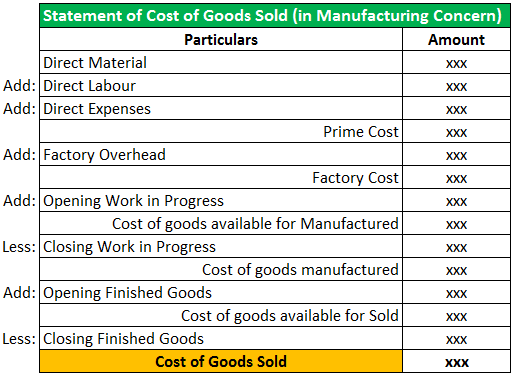

Cost of Goods Sold (COGS) is a fundamental component in accounting that represents the direct costs attributable to the production of goods sold by a company. These costs typically include expenses related to raw materials, direct labor, and manufacturing overhead, all of which are integral in determining the gross profit of a business. The formula for calculating COGS is often expressed as:

$$
\text{COGS} = \text{Beginning Inventory} + \text{Purchases} - \text{Ending Inventory}
$$

COGS is crucial across various industries such as manufacturing and retail, as it directly impacts financial statements, tax calculations, and pricing strategies. In these sectors, COGS provides insight into cost management and operational efficiency, hence playing a substantial role in financial analysis and inventory management.

However, there are industries where traditional COGS calculations are not directly applicable or are handled in a distinctly different manner. This disparity arises from unique cost structures or business models that do not primarily involve tangible goods. For example, software companies and certain sectors within finance operate on a model that relies heavily on intangible assets or services, thus complicating the application of traditional COGS.

Algorithmic trading is a prime example of an industry where traditional COGS calculations may not readily apply. In algorithmic trading, the focus is on leveraging algorithms and high-frequency data to execute trades. The costs involved are more associated with technology infrastructure, software development, and data acquisition rather than the direct cost of goods sold.

This article aims to explore the accounting practices related to COGS in industries like algorithmic trading where traditional calculations may be irrelevant or need adaptation. By examining the unique cost structures, the discussion will provide insight into how these industries manage, report, and leverage costs for strategic advantage.

## Table of Contents

## Understanding COGS in Traditional Industries

Cost of Goods Sold (COGS) is a crucial accounting metric used widely in traditional industries like manufacturing and retail to assess the direct costs associated with the production of goods or services sold by a company. It encompasses expenses directly tied to manufacturing or purchasing products, such as raw materials, direct labor, and manufacturing overhead. By accounting for these costs, businesses can determine their gross profit, which is the difference between sales revenue and COGS.

In the manufacturing sector, COGS typically includes costs such as the purchase of raw materials, wages for workers directly involved in production, and depreciation on production equipment. For example, a car manufacturer would count the cost of steel, tires, and labor required to assemble a vehicle as part of its COGS. Similarly, in the retail industry, COGS consists of the cost of purchasing inventory from suppliers, which is then sold to consumers. For a clothing retailer, this would include the wholesale price paid to the clothing manufacturer.

COGS is fundamental in determining gross profit, a key indicator of a company’s financial health and efficiency. Gross profit is calculated by subtracting COGS from total revenue:

$$
\text{Gross Profit} = \text{Total Revenue} - \text{COGS}
$$

Gross profit informs financial analysis by highlighting how efficiently a company uses its resources in production. A higher gross profit margin indicates effective cost control and pricing strategies, while a lower margin may suggest rising costs or pricing challenges.

Moreover, COGS plays a vital role in inventory management. Accurate computation of COGS ensures that inventory levels are correctly accounted for, thereby aiding in supply chain management and decision-making processes related to purchasing and stock rotation. Understanding these costs helps businesses set competitive pricing strategies by ensuring prices cover production costs while providing a desired profit margin.

Furthermore, COGS can affect a company’s tax obligations. Since it is subtracted from total revenues, a higher COGS will result in lower taxable income. Thus, accurate and strategic management of COGS is essential not only for operational reasons but also for effective tax planning.

In essence, COGS serves as a critical benchmark in the strategic and financial planning of traditional industries, influencing pricing strategies, inventory control, and profitability analysis.

## COGS-Excluded Industries: An Overview

Industries can be considered COGS-excluded when their cost structures do not align with the traditional framework used to calculate the Cost of Goods Sold (COGS). This generally occurs when direct costs related to the production of goods are not a significant part of the industry’s operations. Instead, these industries might focus on intangible assets or services where direct material or labor costs are negligible or absent.

For example, in the software industry, the costs primarily revolve around research and development, maintenance, and updates, rather than tangible products. This means that traditional COGS calculations, which focus on the direct costs of manufacturing goods, do not provide a meaningful metric for financial analysis. Similarly, in the finance industry, and more specifically within [algorithmic trading](/wiki/algorithmic-trading), the notion of COGS is less applicable because the 'products' being traded are intangible financial instruments, and the primary costs involve technology, data acquisition, and transaction fees rather than physical production costs.

The fundamental differences in cost structure that lead to the exclusion of COGS in these industries rest on the division between direct and indirect costs. In manufacturing or retail, direct costs such as raw materials and direct labor form the bulk of expenses and are thus crucial to account for under COGS. In contrast, industries like software and finance prioritize intellectual properties and services which incur indirect costs. These might include salaries for software developers or quantitative analysts, costs for maintaining IT infrastructure, and fees associated with data access and processing.

Algorithmic trading exemplifies an industry where traditional COGS calculations are not applicable. This type of trading relies heavily on complex software algorithms to execute trades, which requires costs such as developing proprietary trading systems, obtaining real-time market data, and maintaining high-performance computing environments. The absence of physical 'goods' in the equation shifts the emphasis away from COGS toward an understanding of different categories of expenses that are more relevant to the financial analysis of such enterprises.

In summary, industries are characterized as COGS-excluded when their business models inherently lack direct product-related costs that traditional COGS calculations capture. Instead, alternative cost management strategies are utilized to reflect the unique operational costs encountered, enabling more accurate financial reporting and strategic decision-making.

## The Role of Algorithmic Trading in COGS-Excluded Industries

Algorithmic trading, or algo trading, is a method of executing trades using pre-programmed and automated instructions. These instructions can incorporate various variables such as price, timing, and [volume](/wiki/volume-trading-strategy), allowing traders to execute transactions at speeds and frequencies impossible for a human trader. The operation of algo trading primarily involves complex algorithms, high-speed data analysis, and lightning-fast execution platforms.

### Operating Mechanisms and Cost Structures

Algo trading predominantly relies on sophisticated software and cutting-edge technology to function effectively. The associated costs diverge significantly from those in traditional industries where Cost of Goods Sold (COGS) is an essential metric. Traditional COGS calculations primarily focus on direct costs, like raw materials and labor. However, in algo trading, the cost structure is distinct, focusing on:

1. **Data Fees**: Access to high-quality financial data is crucial. Traders need historical data to back-test their strategies, real-time data for live trading, and alternative data sources to gain insights, which often incur significant fees.

2. **Technology and Infrastructure Costs**: Algo trading requires substantial investments in technology, such as high-performance computing, low-latency connectivity, and sophisticated software. These expenditures are critical as they directly impact trading speed and efficiency.

3. **Research and Development**: Constantly evolving market dynamics necessitate continuous R&D to refine existing algorithms or develop new ones. These costs are primarily associated with hiring skilled personnel and investing in advanced analytics.

### Excluding Traditional COGS Calculations

The primary reason traditional COGS is not applicable in algo trading is due to the nature of costs involved. Unlike industries where tangible goods are produced and direct costs can be clearly demarcated, algo trading operates in a digital and intellectual space where direct costs are less discernible. There is no inventory of raw materials or labor in the traditional sense, thus making the application of traditional COGS irrelevant.

### Implications for Financial Reporting and Performance Analysis

Excluding COGS affects several aspects of financial reporting and analysis in algo trading:

- **Gross Profit Margin Calculation**: Traditional industries rely on COGS to calculate gross margins, crucial for assessing operational efficiency. In algo trading, alternative metrics must be used to understand the financial standing, focusing more on net gains from trading activities.

- **Expense Reporting**: Without COGS, financial statements must emphasize operational expenses like data and technology costs. This shift highlights a different set of key performance indicators (KPIs) for investors and stakeholders.

- **Performance Metrics**: Performance is often gauged using metrics like Sharpe Ratio, Sortino Ratio, and algorithmic efficiency, which are more indicative of success than gross profit margins.

- **Investor Perception**: The absence of COGS requires educating investors on the unique cost structure and profitability metrics pertinent to algo trading, ensuring accurate assessment of the firm’s financial health.

In conclusion, while algorithmic trading is categorized as a COGS-excluded industry due to its distinctive cost structure, understanding and adapting financial analysis techniques to align with this model is critical for accurate financial reporting and strategic decision-making.

## Accounting Practices for COGS-Excluded Industries

Accounting practices in industries where Cost of Goods Sold (COGS) is excluded necessitate distinctive approaches to cost management and reporting. In algorithmic trading and similar sectors, traditional COGS metrics are not applicable due to the unique nature of their cost structures. Consequently, these industries adopt alternative strategies for managing and reporting costs.

In algorithmic trading, for example, direct costs typically associated with COGS, such as raw materials or labor, are replaced by expenses related to technology infrastructure, data acquisition, and software development. Instead of focusing on inventories and materials, cost management emphasizes the optimization of trading algorithms, minimizing latency, and maximizing computational efficiency. This shift mandates a reassessment of performance metrics and profitability analysis.

One alternative strategy involves categorizing costs into operational expenses more relevant to the industry, such as data fees, server maintenance, and system upgrades. These costs are often classified under "Operating Expenses" rather than COGS, reflecting their recurring and non-inventory nature. Algorithmic trading firms invest heavily in state-of-the-art hardware and data subscription services, which are crucial for maintaining competitive edge in executing high-frequency trades.

Reporting operational costs in these industries requires transparent documentation and accurate portrayal of how these expenses impact profitability. Financial statements might highlight software amortization, research and development costs, and ongoing technology investments as key components of their financial outlays. This approach ensures that investors and stakeholders comprehend the firm's expenditure priorities and their direct link to its operational capabilities.

The adapted accounting practices present both challenges and benefits. A significant challenge is the difficulty in standardizing practices due to the rapid evolution of technology and trading methodologies. This constant change complicates efforts to establish uniform accounting standards and benchmarks, potentially causing discrepancies in financial comparability across firms.

On the positive side, these practices allow for a more tailored and relevant representation of the company's financial health, aligned with its operational focus. By concentrating on the actual drivers of success, such as technological advancement and efficiency in trade execution, firms can provide investors with clearer insights into their strategic positioning and future growth potential.

In summary, accounting adaptations in COGS-excluded industries require a focus on technology-driven operational costs, necessitating innovative stewardship of resources and a transparent approach to financial reporting. These practices not only reflect the distinct nature of these industries but also offer strategic advantages by emphasizing the elements that contribute most to their success.

## Economic Implications and Strategic Considerations

In industries where Cost of Goods Sold (COGS) is excluded from traditional accounting practices, the economic implications are significant and multifaceted. These implications manifest in the ways companies approach competition, evaluate profitability, and manage investor perceptions. Understanding these factors is crucial for businesses to strategically position themselves within their respective industries.

### Competition and Profitability

In industries such as algorithmic trading, software, and finance, where traditional COGS calculations are not applicable, companies often compete on different grounds than traditional manufacturing or retail businesses. The absence of direct costs associated with physical goods shifts the competitive focus to innovation, efficiency, and technology. For example, in algorithmic trading, the primary costs are related to technology infrastructure, data acquisition, and intellectual capital rather than raw materials or labor. This scenario necessitates a focus on optimizing technology costs and enhancing algorithm efficiency to gain a competitive edge.

The profitability analysis in COGS-excluded industries tends to rely more on operational expenses (OPEX) and capital expenditures (CAPEX). Since direct costs are minimal or non-existent, profitability metrics such as gross margin provide less insight, and greater emphasis is placed on measures like operating margin and return on investment (ROI). The strategic reduction of OPEX, through improvements in technology or streamlining processes, can significantly impact the bottom line.

### Investor Perceptions

Investor perceptions of companies in COGS-excluded industries are fundamentally different. Without traditional COGS figures to rely on, investors must evaluate the financial health of a company based on its ability to manage operational costs and its potential for scalability. Metrics such as customer acquisition cost (CAC), lifetime value (LTV), and churn rate become more relevant in assessing long-term viability.

Investors may also prioritize innovation and adaptability, as these factors often indicate a company's capacity to maintain competitive advantage in rapidly evolving markets. This perspective requires transparent and detailed financial reporting that highlights the unique cost structures and revenue models of these industries.

### Strategic Considerations

For companies operating in COGS-excluded industries, strategic considerations focus on leveraging unique cost structures for competitive advantage. This leverage can be achieved through several means:

1. **Technology Investment**: Prioritizing investments in advanced technologies that enhance efficiency and reduce long-term operational costs is crucial. In algorithmic trading, for instance, faster and more efficient algorithms can lead to significant gains without the traditional COGS burden.

2. **Scalability**: Building scalable business models that capitalize on low marginal costs can drive growth. Software companies, by taking advantage of digital distribution, can scale rapidly with minimal increase in variable costs, unlike industries bound by physical product constraints.

3. **Innovation and R&D**: Continuously investing in research and development to create proprietary technologies or software solutions that differentiate the company from competitors is essential. This investment often results in a unique product offering that competitors cannot easily replicate.

By understanding and strategically exploiting these factors, companies in COGS-excluded industries can create sustainable competitive advantages and drive long-term success in their respective markets. The ability to navigate these strategic landscapes not only enhances profitability but also builds investor confidence and positions the company as a leader in innovation and adaptability.

## Conclusion

The examination of Cost of Goods Sold (COGS) across different industries reveals significant variances in how it is treated within traditional and COGS-excluded sectors. Understanding these differences is crucial, as it highlights the unique financial frameworks employed by industries such as algorithmic trading where conventional COGS calculations are not applicable. This inapplicability arises primarily due to the distinct nature of costs associated with these industries, such as data and technology expenses, which do not align with the direct cost definitions typically observed in manufacturing or retail sectors.

Identifying and adapting accounting practices to fit the specific needs of COGS-excluded industries are paramount for accurate financial analysis and reporting. By recognizing that traditional approaches may not suffice, companies can develop alternative strategies that more accurately reflect their operational costs and performance metrics. This adaptation not only aids in improving internal financial management but also influences how such companies are perceived by investors and stakeholders, providing them with a truer reflection of profitability and competitive positioning.

Encouraging further exploration and dialogue in this area can yield enhanced insights into the economic implications of excluding COGS in certain industries. It can also foster the development of tailored accounting methodologies that align more closely with the operational realities of these sectors. Continued research and discussion will be instrumental in refining these practices and ensuring they keep pace with the evolving landscape of industries like algo trading, where technological advancements and data-driven operations continually reshape financial paradigms.

## References & Further Reading

[1]: Bergstra, J., Bardenet, R., Bengio, Y., & Kégl, B. (2011). ["Algorithms for Hyper-Parameter Optimization."](https://papers.nips.cc/paper/4443-algorithms-for-hyper-parameter-optimization) Advances in Neural Information Processing Systems 24.

[2]: ["Advances in Financial Machine Learning"](https://www.amazon.com/Advances-Financial-Machine-Learning-Marcos/dp/1119482089) by Marcos Lopez de Prado

[3]: ["Evidence-Based Technical Analysis: Applying the Scientific Method and Statistical Inference to Trading Signals"](https://www.amazon.com/Evidence-Based-Technical-Analysis-Scientific-Statistical/dp/0470008741) by David Aronson

[4]: ["Machine Learning for Algorithmic Trading"](https://github.com/stefan-jansen/machine-learning-for-trading) by Stefan Jansen

[5]: ["Quantitative Trading: How to Build Your Own Algorithmic Trading Business"](https://www.amazon.com/Quantitative-Trading-Build-Algorithmic-Business/dp/1119800064) by Ernest P. Chan