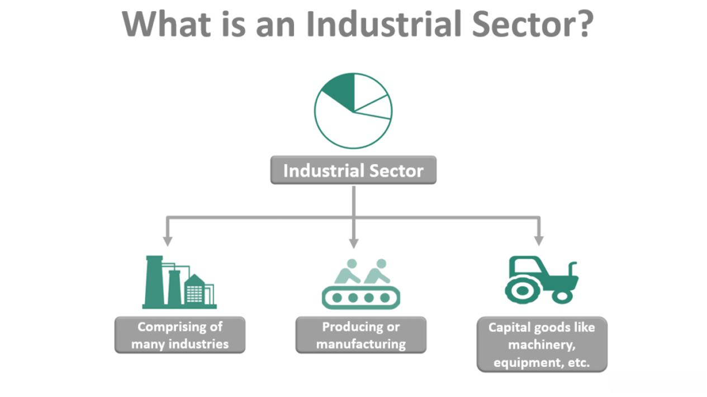

In today's rapidly changing global economy, certain sectors have shown a remarkable ability to withstand the test of time. These industries, often referred to as 'perennial sectors,' are deemed essential to human life and culture, and thus enjoy a certain degree of immunity from economic downturns. This article explores such industries, highlighting their longevity and resilience.

Algorithmic trading, a relatively new industry compared to others, intersects with these sectors by offering strategic advantages in navigating market cycles. Algorithmic trading automates investment strategies, utilizing complex algorithms to analyze large datasets for optimal decision-making. By doing so, it enhances the resilience and operational efficiency of perennial sectors, providing them with tools to maintain stability during economic fluctuations.



Whether fulfilling basic human needs or adapting to technological advancements, these industries demonstrate the power of innovation and adaptability. For example, the food, healthcare, and education sectors are central to human existence and cultural growth, continuously evolving to meet changing societal demands. Integration of algorithmic trading in these sectors optimizes operations, ranging from supply chain management to resource allocation, thereby ensuring their sustained growth in an ever-competitive market. Our focus will include an analysis of these key sectors and their integration with the ever-evolving algorithmic trading practices, revealing how contemporary technology sustains their timeless relevance.

## Table of Contents

## Understanding Perennial Sectors

Perennial sectors are integral to human existence and culture because they address essential needs such as food, healthcare, and education. These industries maintain stable demand, even in the face of economic downturns, thereby achieving economic robustness. Their resilience is largely driven by the unavoidable necessity: people need consistent access to food and healthcare, and education remains a priority in most societies. This consistent demand forms the foundation of these sectors' longevity, making them prime candidates for long-term investment strategies.

The inherent stability of perennial sectors makes them appealing not only to consumers but also to investors seeking reliable returns. The predictability of demand for food, healthcare, and education reduces investment risk and provides a buffer against market fluctuations. This characteristic is particularly advantageous during economic downturns when these sectors typically outperform more volatile industries.

An important aspect of understanding perennial sectors is their capacity to absorb and adapt to technological advancements, economic shifts, and changing consumer behaviors. For instance, the food industry has embraced innovations like precision agriculture and vertical farming to enhance productivity and sustainability. These technological advancements allow the sector to meet increasing demands while addressing environmental concerns.

Healthcare and pharmaceuticals continually evolve through research and development initiatives, leading to new treatments and medications that address emerging health challenges. The integration of technologies such as telemedicine and health informatics enhances accessibility and efficiency, catering to the growing global demand for quality healthcare.

Similarly, the education sector is transforming with the advent of digital learning platforms and online courses, significantly expanding its reach and adaptability. These innovations allow educational institutions to serve a broader demographic while meeting diverse learning needs in an ever-globalized world.

Investors and businesses aiming to leverage the potential of these enduring industries must analyze their ability to navigate technological disruptions and economic changes. Understanding this dynamic allows stakeholders to make informed investment decisions that capitalize on the perpetual nature of perennial sectors. Above all, recognizing the intrinsic value and demand stability of these essential industries is key to harnessing their long-term economic potential.

## Key Perennial Industries

Several industries have shown remarkable resilience against economic fluctuations, primarily due to their essential nature in fulfilling fundamental human needs. Among them, the food industry stands out as a crucial sector, encompassing a wide range of activities from agricultural production to food processing and packaging. This industry continuously evolves to meet the global demand for nourishment, ensuring the availability of sustenance through various economic conditions.

The healthcare and pharmaceutical industries are equally vital, driven by the ever-increasing global population and a growing awareness of health and wellness. These sectors continually achieve expansion through substantial investments in research and development, aimed at addressing emerging health challenges. Innovations in medical technology and pharmaceuticals not only improve patient outcomes but also contribute extensively to the sector's growth and stability.

Education, too, remains a cornerstone of societal advancement by fostering the development of knowledge and essential skills. The rapid advancement of digital education platforms exemplifies this industry's adaptability and potential for expansion. Online learning environments have democratized access to education, providing opportunities for individuals worldwide to enhance their skills and knowledge irrespective of geographical constraints. This digital shift not only complements traditional educational settings but also signifies the industry's ability to thrive amidst evolving technological landscapes.

## The Role of Algorithmic Trading in Industry Longevity

Algorithmic trading has transformed the investment landscape, particularly within perennial industries, by providing a sophisticated means of analyzing and acting upon market data. Through the employment of complex algorithms, vast quantities of data are processed at speeds unattainable by human traders, facilitating the prediction of market trends and identification of lucrative investment opportunities. This method of trading is characterized by its precision and rapid execution, which are crucial for maximizing returns while mitigating the risks inherent to market fluctuations.

In perennial industries, which are defined by their continuous demand and essential nature, the application of [algorithmic trading](/wiki/algorithmic-trading) presents unique advantages. For instance, by analyzing historical and real-time data, algorithms can optimize supply chain processes. This includes enhancing inventory management and streamlining logistics to ensure efficiency and cost-effectiveness. Further, trading algorithms can refine pricing strategies by assessing patterns and market dynamics, enabling firms to adjust prices proactively to maintain competitive advantage.

A noteworthy application of algorithmic trading is observed in the healthcare sector. With its intricate supply chains and critical service delivery, healthcare can greatly benefit from the predictive capabilities of algorithms. These algorithms can determine optimal stock levels, forecast demand for medical supplies, and manage the distribution networks to allocate resources precisely where they are needed most. This ensures that healthcare providers can deliver uninterrupted services, thereby enhancing system resilience and reliability.

Algorithmic trading also aids in market timing by analyzing a plethora of market signals to identify the ideal moments for buying or selling assets. This is particularly beneficial in perennial sectors where market sequences, though relatively stable, can still experience [volatility](/wiki/volatility-trading-strategies) due to external factors such as regulatory changes or technological advancements.

Moreover, the integration of [machine learning](/wiki/machine-learning) with algorithmic trading systems adds another layer of sophistication. Machine learning algorithms are capable of improving their predictions through exposure to new data, enabling them to provide more accurate forecasts and identify non-trivial market patterns. For businesses focusing on perennial industries, employing machine learning enhances their ability to adapt strategies promptly, ensuring sustained growth and industry longevity.

In summary, algorithmic trading offers invaluable tools for navigating the complexities of perennial industries. By optimizing supply chains, fine-tuning pricing strategies, and improving resource allocation, these algorithms not only help maximize profitability but also reinforce the sectors' resilience against economic perturbations.

## Investment Strategies for Perennial Sectors

Perennial sectors, due to their fundamental role in meeting essential human needs, are often viewed as stable investment options. During economic downturns, their resilience provides a safe haven for investors seeking to protect their portfolios from volatility. Investment strategies in these sectors typically emphasize long-term holding, diversification, and harnessing growth opportunities through technological advancements.

Long-term holding involves maintaining investments over an extended period to benefit from the stability and growth potential that perennial sectors offer. These sectors, such as healthcare, food, and education, often provide steady returns which align with conservative investment goals. By focusing on long-term growth, investors can weather temporary market fluctuations and benefit from compounded returns.

Diversification, a key principle in risk management, involves spreading investments across various perennial sectors to reduce exposure to any single industry. By investing in a mix of stable industries, investors can better manage risks and ensure more consistent returns over time. Diversified portfolios are typically less susceptible to sector-specific downturns, making them particularly attractive during periods of economic uncertainty.

Technological integration offers another dimension of growth potential in perennial sectors. By adopting innovations and new technologies, these industries can enhance efficiency and expand their market reach. For instance, the integration of digital tools in education or the use of advanced biotechnology in agriculture represents significant growth opportunities. Investors who recognize and capitalize on these trends can potentially achieve superior returns.

Algorithmic trading complements these investment strategies by providing data-driven insights and enhanced risk management capabilities. Employing algorithms enables investors to analyze vast amounts of market data swiftly, identify undervalued stocks, and pinpoint optimal times to enter or [exit](/wiki/exit-strategy) investments. For example, Python, with libraries such as NumPy and pandas, allows for sophisticated data analysis and is widely used in developing trading strategies. A simple example of using Python for data analysis might look like this:

```python
import pandas as pd

# Load historical market data
data = pd.read_csv('market_data.csv')

# Calculate moving averages as a simple trading indicator
data['SMA_20'] = data['Close'].rolling(window=20).mean()
data['SMA_50'] = data['Close'].rolling(window=50).mean()

# Identify trading signals
data['Buy_Signal'] = (data['SMA_20'] > data['SMA_50']) & (data['SMA_20'].shift(1) <= data['SMA_50'].shift(1))
data['Sell_Signal'] = (data['SMA_20'] < data['SMA_50']) & (data['SMA_20'].shift(1) >= data['SMA_50'].shift(1))

# Display signals
print(data[['Date', 'Buy_Signal', 'Sell_Signal']].dropna())
```

This script calculates simple moving averages to generate buy and sell signals based on historical data. Such algorithmic tools can refine investment strategies by optimizing asset allocation and enhancing decision-making processes.

Combining fundamental and technical analysis with algorithmic insights allows investors to make well-informed decisions tailored to their financial goals and risk tolerance. By understanding both the inherent stability of perennial sectors and the potential of algorithmic trading, investors can effectively navigate the complexities of the market, optimizing returns while minimizing associated risks.

## Conclusion

Perennial industries display notable resilience and growth, primarily driven by fundamental human needs and a remarkable ability to adapt to changing conditions. These traits not only ensure economic security for investors but also play a pivotal role in fostering economic progress. The integration of algorithmic trading with these industries signifies a promising synergy, as they increasingly rely on cutting-edge technology to maintain their longevity and competitiveness.

As these industries continue to advance, the application of algorithmic insights offers the potential to further enhance strategic decision-making and operational efficiency. Algorithmic trading can provide valuable data-driven perspectives, enabling a more nuanced understanding of these industries' complexities. This understanding is crucial for both businesses and investors aiming to leverage opportunities and navigate the dynamic economic landscapes.

Ultimately, those who are equipped with knowledge of perennial industries, underpinned by algorithmic insights, are well-positioned to capitalize on emerging potentials and mitigate potential risks. By aligning investment and operational strategies with technological advancements, stakeholders can ensure sustained growth and resilience.

## References & Further Reading

[1]: Bergstra, J., Bardenet, R., Bengio, Y., & Kégl, B. (2011). ["Algorithms for Hyper-Parameter Optimization."](https://papers.nips.cc/paper/4443-algorithms-for-hyper-parameter-optimization) Advances in Neural Information Processing Systems 24.

[2]: ["Advances in Financial Machine Learning"](https://www.amazon.com/Advances-Financial-Machine-Learning-Marcos/dp/1119482089) by Marcos Lopez de Prado

[3]: ["Evidence-Based Technical Analysis: Applying the Scientific Method and Statistical Inference to Trading Signals"](https://books.google.com/books/about/Evidence_Based_Technical_Analysis.html?id=jbD47VkOHAEC) by David Aronson

[4]: ["Machine Learning for Algorithmic Trading"](https://github.com/stefan-jansen/machine-learning-for-trading) by Stefan Jansen

[5]: ["Quantitative Trading: How to Build Your Own Algorithmic Trading Business"](https://www.amazon.com/Quantitative-Trading-Build-Algorithmic-Business/dp/1119800064) by Ernest P. Chan