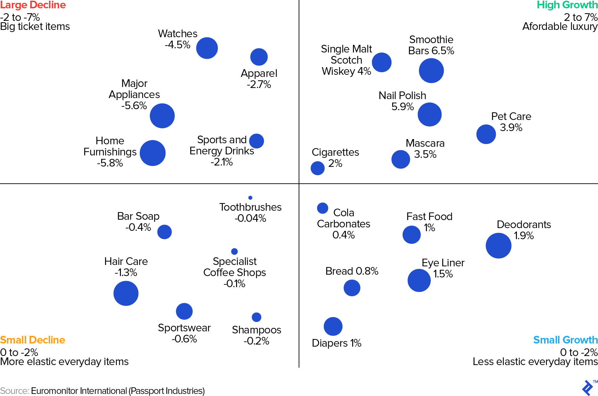

## Table of Contents

## What is an economic recession?

An economic recession is when a country's economy gets smaller for a while. This usually means that people are buying less stuff, companies are making less money, and more people are out of work. Economists often say a recession is happening if the economy shrinks for two quarters in a row, which is six months.

During a recession, things can get tough for a lot of people. Businesses might have to close or lay off workers because they're not selling enough. People might spend less money because they're worried about their jobs or because they don't have as much money coming in. Governments and banks might try to help by lowering interest rates or giving out money to help people and businesses get through the tough times.

## Which industries are generally considered resilient during economic downturns?

Some industries tend to do better than others during economic downturns. One of these is the healthcare industry. People always need medical care, no matter what's happening with the economy. So, hospitals, clinics, and companies that make medicine usually keep doing okay. Another industry that often does well is utilities, like electricity and water. People need these services to live, so they keep paying for them even when times are tough.

Another resilient industry is consumer staples. This includes things like food, drinks, and basic household items. People can't stop buying these things, even if they have less money. They might switch to cheaper brands, but they still need to eat and keep their homes running. Lastly, education can also be somewhat stable. People might still want to learn and improve their skills, especially during tough economic times, to better their chances of getting a job when things get better.

## Why are healthcare and utilities considered stable industries in a recession?

Healthcare is considered a stable industry during a recession because people always need medical care. No matter how bad the economy gets, people still get sick or hurt and need doctors, hospitals, and medicine. This means that even when people are cutting back on other spending, they usually can't cut back on healthcare. So, hospitals, clinics, and companies that make medicine keep making money, even when other businesses are struggling.

Utilities like electricity, water, and gas are also stable because they are essential services. People need these services to live comfortably and safely in their homes. Even if someone loses their job or has less money, they will still pay for these services because they can't live without them. This steady demand for utilities means that the companies providing these services keep doing well, even during tough economic times.

## How does the consumer goods sector perform during economic recessions?

The consumer goods sector, especially consumer staples like food, drinks, and basic household items, usually does okay during economic recessions. People always need to eat and use basic things at home, so they keep buying these products even when times are tough. They might switch to cheaper brands to save money, but they can't stop buying these things altogether. This steady demand helps companies in the consumer staples industry stay stable.

On the other hand, consumer discretionary goods, like fancy clothes, electronics, and big-ticket items, usually don't do as well during recessions. These are things people can live without, so when money gets tight, people cut back on buying them. Companies that make or sell these kinds of goods often see their sales drop because people are saving their money for essentials. So, while consumer staples hold up pretty well, consumer discretionary goods can struggle a lot during economic downturns.

## What role does the education sector play during economic downturns?

During economic downturns, the education sector can play an important role. People often look to education to improve their skills and job prospects. When jobs are hard to find, many people go back to school or take classes to learn new things that might help them get a job when the economy gets better. This can mean more students for schools and colleges, which helps keep the education sector stable.

However, not all parts of the education sector do well during recessions. Public schools might face budget cuts because governments have less money to spend. This can lead to fewer teachers and fewer programs. Private schools and universities might also see fewer students if families can't afford the higher costs. So, while some areas of education can stay strong, others might struggle during tough economic times.

## Can technology companies thrive during a recession, and if so, how?

Technology companies can actually do well during a recession. People might spend more time at home and use more tech products like computers, phones, and internet services. Also, businesses might want to save money by using technology to do things like working from home or using software to help them work better. This can mean more customers for tech companies.

But not all tech companies will do well. Companies that make things people can wait to buy, like new gadgets, might see fewer sales. People might not want to spend a lot of money on new tech when times are tough. On the other hand, companies that offer essential services, like internet providers or software that helps businesses save money, might keep doing okay. So, it depends on what kind of tech a company makes or sells.

## What makes the food and beverage industry resilient to economic fluctuations?

The food and beverage industry is resilient to economic fluctuations because people always need to eat and drink. No matter how bad the economy gets, people still need to buy food and drinks to survive. This means that even when people have less money, they will still spend it on these basic needs. They might choose cheaper options or buy less fancy food, but they can't stop buying food altogether.

Another reason the food and beverage industry does well during tough times is that it includes a lot of different kinds of businesses. There are grocery stores, restaurants, and companies that make food and drinks. While some parts of the industry, like fancy restaurants, might struggle because people go out to eat less, other parts, like grocery stores, keep doing okay. People might cook at home more to save money, which means they buy more groceries. So, the variety in the food and beverage industry helps it stay strong even when the economy is not doing well.

## How do government and public sector jobs hold up during recessions?

Government and public sector jobs usually do okay during recessions. These jobs are important for keeping things running smoothly in a country, like schools, hospitals, and police. Because they are so important, governments try hard to keep these jobs safe, even when money is tight. This means that people working in the public sector are less likely to lose their jobs during a recession.

But, it's not always perfect. Sometimes, when the economy is really bad, governments might have to cut back on spending. This can mean fewer new hires or even some layoffs in the public sector. Still, these cuts are usually less than in the private sector, so government and public sector jobs are often seen as safer bets during tough economic times.

## What strategies do companies in resilient industries use to maintain stability?

Companies in resilient industries often focus on keeping their costs low to stay stable during tough times. They might look for ways to save money, like using cheaper materials or finding new ways to make things more efficiently. They also try to keep their prices steady so people can still afford their products or services. This helps them keep their customers, even when people have less money to spend.

Another strategy is to keep a close eye on what their customers need and want. For example, a food company might start selling more affordable products if they see people are trying to save money. They might also offer deals or discounts to help people buy their products. By staying flexible and listening to their customers, these companies can keep doing well, even when the economy is not doing great.

## How can investors identify and capitalize on recession-resistant industries?

Investors can identify recession-resistant industries by looking at what people always need, no matter how bad the economy gets. Industries like healthcare, utilities, and food and beverages are good examples. These are things people can't stop using, even when they have less money. Investors can also look at how companies in these industries are doing during past recessions. If a company did well before, it might do well again.

To capitalize on these industries, investors should think about buying stocks or bonds from companies in these sectors. They might also look at mutual funds or exchange-traded funds (ETFs) that focus on these industries. It's important to do some research and maybe talk to a financial advisor to make sure they're making smart choices. By investing in companies that are likely to stay strong during a recession, investors can protect their money and maybe even make some profit when times are tough.

## What are the long-term trends affecting the resilience of industries during economic recessions?

Long-term trends are changing how well industries can handle economic downturns. One big trend is technology. More and more, technology is making it easier for companies to keep going even when times are tough. For example, businesses can use the internet to sell things or work from home, which saves money. This means that industries that use technology well, like tech companies or those that sell online, might do better during a recession. But it also means that old-fashioned businesses that don't use technology might struggle more.

Another trend is how people think about health and the environment. People are caring more about these things, so industries like healthcare and green energy are growing. Healthcare is always important, but now people are spending even more on it to stay healthy. Green energy is also becoming more popular because people want to help the planet. These industries might do better during a recession because people see them as important for the future. So, industries that focus on health and the environment might be more resilient in the long run.

## How do global economic factors influence the resilience of specific industries during a recession?

Global economic factors can have a big impact on how well industries do during a recession. When the world economy is doing badly, it can make things harder for industries that depend on selling things to other countries. For example, if a country is in a recession, it might buy less from other countries. This can hurt industries like manufacturing or exports. On the other hand, if a country's currency gets weaker because of global economic problems, it might be able to sell more things to other countries because they are cheaper. This can help some industries stay strong.

Another way global economic factors can affect industries is through things like interest rates and trade policies. If big countries like the United States or China change their interest rates, it can affect the whole world. Lower interest rates can make it easier for companies to borrow money and keep going during tough times. But if trade policies change, like when countries put up new taxes on imports, it can make it harder for some industries to sell their products. Industries that can adapt to these changes, like by finding new markets or using new technology, might do better during a recession.

## References & Further Reading

[1]: Bergstra, J., Bardenet, R., Bengio, Y., & Kégl, B. (2011). ["Algorithms for Hyper-Parameter Optimization."](https://papers.nips.cc/paper/4443-algorithms-for-hyper-parameter-optimization) Advances in Neural Information Processing Systems 24.

[2]: ["Advances in Financial Machine Learning"](https://www.amazon.com/Advances-Financial-Machine-Learning-Marcos/dp/1119482089) by Marcos Lopez de Prado

[3]: ["Evidence-Based Technical Analysis: Applying the Scientific Method and Statistical Inference to Trading Signals"](https://www.amazon.com/Evidence-Based-Technical-Analysis-Scientific-Statistical/dp/0470008741) by David Aronson

[4]: ["Machine Learning for Algorithmic Trading"](https://github.com/stefan-jansen/machine-learning-for-trading) by Stefan Jansen

[5]: ["Quantitative Trading: How to Build Your Own Algorithmic Trading Business"](https://www.amazon.com/Quantitative-Trading-Build-Algorithmic-Business/dp/1119800064) by Ernest P. Chan