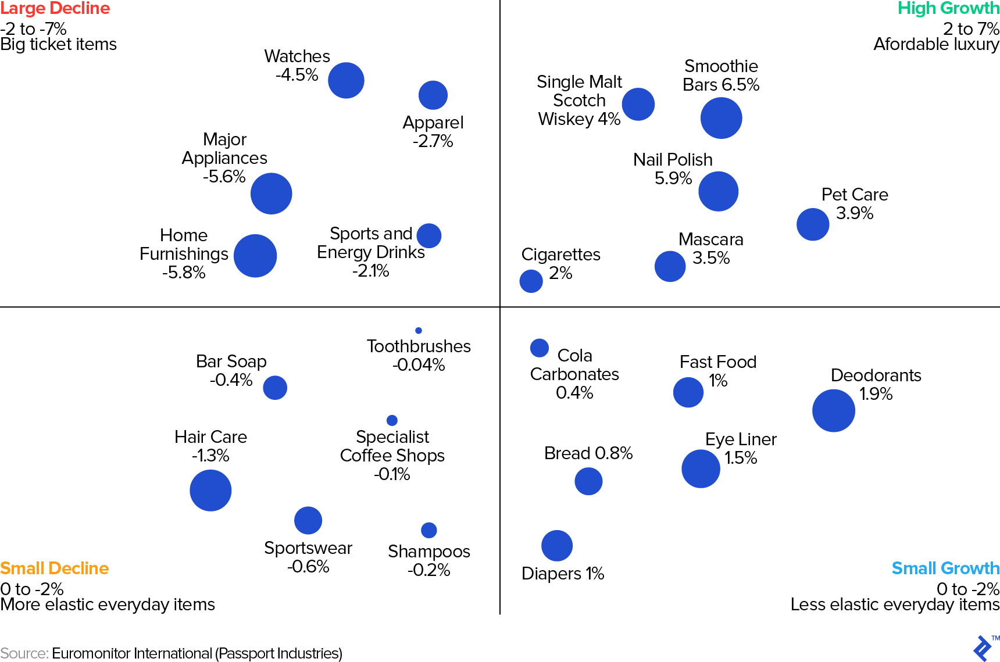

## Table of Contents

## What is an economic recession?

An economic recession is when a country's economy starts to shrink instead of grow. This happens when people and businesses spend less money, which leads to fewer jobs and lower incomes. Economists often say a recession is happening if the economy has shrunk for two quarters in a row. During a recession, it can be harder for people to find jobs, and companies might struggle to make profits.

Recessions can be caused by many things, like big financial crises, sudden drops in consumer confidence, or even unexpected events like natural disasters. Governments and central banks try to help by lowering interest rates or spending more money to boost the economy. While recessions can be tough, they usually don't last forever. After a while, the economy starts to recover, and things get better again.

## Which industries are typically considered resilient during an economic downturn?

Some industries tend to do better during an economic downturn because they provide things that people need no matter what. For example, healthcare is always important. People still get sick or need medicine, so hospitals, clinics, and drug companies usually keep going strong. Another industry that does well is utilities, like electricity and water. People can't live without these basic services, so these companies stay stable even when the economy is struggling.

Another resilient industry is consumer staples, which includes things like food, drinks, and household items. People always need to eat and take care of their homes, so these products keep selling even when money is tight. Also, discount stores often see more business during a recession because people look for cheaper options. These industries might not grow a lot, but they tend to be more reliable when the economy is down.

## Why are healthcare and utilities considered recession-resistant?

Healthcare is considered recession-resistant because people always need medical care, no matter what's happening with the economy. When times are tough, people might cut back on other things, but they still need to go to the doctor, get medicine, or go to the hospital if they're sick or hurt. This means that hospitals, clinics, and companies that make medicine keep doing well even when other businesses are struggling. 

Utilities, like electricity and water, are also very stable during a recession. These are basic services that everyone needs every day. People can't just stop using electricity or water because they're trying to save money. So, even if the economy is not doing well, the companies that provide these services keep making money because people have to keep paying their bills.

## How do consumer behavior changes during a recession affect certain industries?

During a recession, people usually start to spend less money because they're worried about their jobs or their savings. They focus on buying things they really need, like food and medicine, and cut back on things they want but can't afford, like new clothes or going out to eat. This means that industries like restaurants, fashion, and travel can struggle a lot because fewer people are buying what they sell. On the other hand, stores that sell basic items, like grocery stores and discount shops, might do better because people are looking for cheaper ways to get what they need.

Also, people might try to save money by doing things themselves instead of paying others to do it. For example, they might fix their own cars or cut their own hair. This can hurt businesses that offer these services. But it can help companies that sell the tools or products people need to do these things themselves. So, while some industries suffer because people are spending less, others can do okay or even grow because they offer what people need during tough times.

## What role do government policies play in protecting industries during economic downturns?

Government policies can help protect industries during a recession by giving them money or making rules that help them. When the economy is bad, the government might give money to businesses to keep them going. They might also give money to people so they can keep buying things, which helps businesses stay open. The government can also change rules to make it easier for businesses to borrow money or to help them pay their workers. All these things can stop industries from getting hurt too much during a recession.

Another way the government helps is by spending more money on big projects, like building roads or schools. This can create jobs and keep money moving in the economy. The government might also lower taxes so people and businesses have more money to spend. By doing these things, the government can help industries that are struggling and make sure the economy doesn't get too bad. These actions can give industries the support they need to survive until the economy gets better.

## Can you explain the concept of counter-cyclical industries with examples?

Counter-cyclical industries are types of businesses that do better when the economy is not doing well. When most people are worried about money and spending less, these industries actually see more business because they offer things people need no matter what. So, when the economy goes down, these industries go up, and when the economy gets better, they might not do as well.

Some good examples of counter-cyclical industries are healthcare and utilities. People always need to go to the doctor or get medicine, so healthcare businesses do well even when the economy is bad. The same goes for utilities like electricity and water. People can't live without these services, so the companies that provide them stay strong even during tough economic times. These industries are important because they help keep the economy stable when other parts are struggling.

## How do sectors like education and food production maintain stability during recessions?

Education stays stable during recessions because people always want to learn and get better jobs. Even when money is tight, parents still want their kids to go to school and do well. Also, adults might go back to school to learn new skills if they lose their jobs. So, schools and colleges keep going strong because education is important no matter what the economy is doing.

Food production is also stable during a recession because everyone needs to eat. People might buy cheaper food or cook more at home, but they still need to eat every day. Farms, food factories, and grocery stores keep working because they provide something essential. Even if people change what they buy, the food industry stays busy because it's a basic need that doesn't go away when times are tough.

## What are the financial metrics used to identify recession-proof companies?

To find out if a company is good at surviving a recession, people look at some important numbers. One key number is the debt-to-equity ratio, which shows how much money the company owes compared to what it owns. If this number is low, it means the company doesn't have a lot of debt, which is good because it can handle tough times better. Another important number is the company's cash flow, which tells you how much money is coming in and going out. A strong cash flow means the company has enough money to keep going even when people are not buying as much.

Another number to check is the company's profit margins. This shows how much money the company makes after paying for everything. If the profit margin is high, it means the company is good at making money, even when the economy is bad. Lastly, the price-to-earnings ratio can be useful. It compares the company's stock price to how much money it makes. A lower ratio might mean the company is a safer bet during a recession because its stock is not too expensive compared to its earnings.

## How have historical economic recessions impacted different industries, and which ones showed resilience?

During past economic recessions, many industries have faced big challenges. For example, during the 2008 financial crisis, industries like housing, construction, and finance were hit hard. People stopped buying houses, and banks had a tough time because they had given out too many risky loans. Car makers also struggled because people didn't want to spend money on new cars. Retail stores selling things like clothes and electronics saw fewer customers because people were saving their money instead of spending it.

However, some industries showed they could handle the tough times. Healthcare stayed strong because people always need doctors and medicine. Utility companies that provide electricity and water did well because these are things people can't live without. Food production and grocery stores also kept going because everyone needs to eat. During the Great Recession, discount stores like Walmart saw more business because people looked for cheaper places to buy what they needed. These industries showed that even when the economy is bad, they can still do okay because they offer things people need every day.

## What strategies do companies in vulnerable industries adopt to survive or thrive during a recession?

During a recession, companies in industries that are more likely to struggle often have to find smart ways to keep going. One common strategy is to cut costs. This might mean letting some workers go, closing some stores or factories, or finding cheaper ways to make their products. By doing this, they can keep their business running even if they're making less money. Another thing they might do is focus on selling things that people really need, not just want. For example, a car company might focus more on selling cheaper, basic cars instead of fancy ones that people can't afford during tough times.

Another approach is to look for new ways to make money. Some companies might start selling their products in new places or in different ways. For instance, a restaurant might start offering take-out or delivery if people aren't coming in to eat. Companies might also try to keep their customers by offering sales or special deals. This can help them stay in business until the economy gets better. By being flexible and trying new things, companies in tough spots can survive and even do well during a recession.

## How does globalization affect the resilience of industries during global economic downturns?

Globalization makes the world's economies more connected. This means that when one big economy has a recession, it can affect many other countries too. For example, if the U.S. has a recession, it might buy fewer things from other countries, which can hurt their economies. This can make it harder for industries in those countries to stay strong. On the other hand, some industries can benefit from globalization during a recession. Companies might move their factories to countries where it's cheaper to make things, which can help them save money and stay in business.

However, globalization can also help some industries be more resilient. Companies that sell things all over the world might be able to keep going even if one part of the world is having a recession. If people in one country aren't buying as much, the company can still sell to people in other countries. This can help industries like technology and consumer goods stay strong because they can reach customers everywhere. So, while globalization can make recessions spread more easily, it can also give some industries a better chance to survive by helping them find customers in different parts of the world.

## What future trends might influence the resilience of industries to economic recessions?

In the future, technology will play a big role in how well industries can handle recessions. More and more businesses are using technology to do things cheaper and faster. This can help them save money and stay strong even when the economy is bad. For example, companies might use robots or computers to make their products, which means they don't need as many workers. This can help them keep going even if people aren't buying as much. Also, technology can help businesses reach customers all over the world, which can make them less dependent on just one market.

Another trend that might affect how industries do during recessions is the focus on sustainability. More people are caring about the environment and wanting to buy things that are good for the planet. This means that industries that make green products or use clean energy might do better during tough times. People might keep buying these products even if they're saving money because they see them as important. Also, governments might help these industries more because they want to support sustainable practices. So, industries that focus on being eco-friendly could be more resilient in the future.

## What is the role of algorithmic trading in stabilizing economies?

Algorithmic trading, often referred to as algo trading, has become a pivotal element in contemporary financial markets. By automating transaction processes, [algorithmic trading](/wiki/algorithmic-trading) reduces the potential for human error, thereby enhancing market efficiency. This is especially crucial during economic downturns, where maintaining market stability becomes challenging.

During recessions, [liquidity](/wiki/liquidity-risk-premium) is paramount to ensuring the smooth operation of markets. Algorithmic models are equipped to maintain this liquidity by executing trades at high speed and precision. Their ability to process vast amounts of data quickly allows them to facilitate ongoing market activities without substantial interruptions. This continuous flow supports market participants in executing trades without excessive delays, thus contributing to overall market stability.

The predictive powers of algorithmic trading are derived from sophisticated data analytics. By analyzing historical data and applying advanced statistical models, algorithmic systems generate predictive insights that guide investment decisions even in volatile periods. For instance, a common statistical tool used in algo trading is the Exponential Moving Average (EMA), defined mathematically as:

$$
\text{EMA}_t = \alpha \cdot P_t + (1 - \alpha) \cdot \text{EMA}_{t-1}
$$

where $\alpha$ is the smoothing factor and $P_t$ is the price at time $t$. By utilizing such formulas, algorithms can identify trends and forecast market movements, allowing investors to strategically position their portfolios.

Algorithms operate on pre-defined strategies and market signals, executing trades without the biases and emotional triggers to which human traders are susceptible. This mitigates the risk of irrational decision-making patterns, such as panic selling, often observed during recessions. By maintaining a rational approach, algorithmic trading contributes to balanced market behaviors and can protect portfolios from the adverse impacts of economic downturns.

Furthermore, the implementation of algorithmic trading strategies can be executed through programming, with Python being a popular language choice due to its libraries and tools for financial analysis. A basic example in Python might look like:

```python
import numpy as np

def calculate_ema(prices, days):
    weights = np.exp(np.linspace(-1., 0., days))
    weights /= weights.sum()

    ema = np.convolve(prices, weights, mode='full')[:len(prices)]
    ema[:days] = ema[days]
    return ema

prices = [120, 121, 119, 120, 122, 123, 121]  # Example price list
ema_values = calculate_ema(prices, len(prices))
```

In summary, algorithmic trading plays a crucial role in preserving market functionality during economic downturns. By automating processes and leveraging data-driven insights, these systems ensure that markets remain liquid and rational, even amid financial uncertainties.

## References & Further Reading

[1]: Bergstra, J., Bardenet, R., Bengio, Y., & Kégl, B. (2011). ["Algorithms for Hyper-Parameter Optimization."](https://dl.acm.org/doi/10.5555/2986459.2986743) Advances in Neural Information Processing Systems 24.

[2]: ["Advances in Financial Machine Learning"](https://www.amazon.com/Advances-Financial-Machine-Learning-Marcos/dp/1119482089) by Marcos Lopez de Prado

[3]: ["Evidence-Based Technical Analysis: Applying the Scientific Method and Statistical Inference to Trading Signals"](https://www.amazon.com/Evidence-Based-Technical-Analysis-Scientific-Statistical/dp/0470008741) by David Aronson

[4]: ["Machine Learning for Algorithmic Trading"](https://github.com/stefan-jansen/machine-learning-for-trading) by Stefan Jansen

[5]: ["Quantitative Trading: How to Build Your Own Algorithmic Trading Business"](https://www.amazon.com/Quantitative-Trading-Build-Algorithmic-Business/dp/1119800064) by Ernest P. Chan