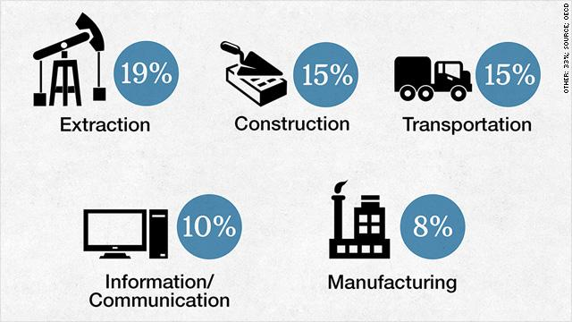

## Table of Contents

## What is corruption and how does it affect industries?

Corruption is when people in power, like government officials or business leaders, misuse their position for personal gain. This can happen through bribery, where someone pays money to get special favors, or through embezzlement, where someone steals money that they are supposed to be managing. Corruption can also involve favoritism, where people get jobs or contracts because of who they know, not because they are the best for the job.

Corruption can hurt industries in many ways. When companies have to pay bribes to do business, it increases their costs and makes it harder for them to compete fairly. This can lead to higher prices for customers and can make it difficult for honest businesses to succeed. Corruption also discourages investment because investors do not want to put their money into a system where the rules are not followed. This can slow down economic growth and make it harder for industries to develop and create jobs.

In some cases, corruption can lead to unsafe working conditions or poor-quality products because companies might cut corners to save money or to pay bribes. This not only affects the workers and consumers but can also damage the reputation of the entire industry. Over time, widespread corruption can erode trust in both the government and the business community, making it harder for industries to operate effectively and for countries to prosper.

## Which industries are most commonly associated with corruption?

Some industries are more often linked to corruption because they deal with big money or have a lot of rules to follow. The construction industry is one of them. Building projects can be very expensive, and sometimes companies pay bribes to get contracts or to speed up the approval process. The oil and gas industry is another one. It involves a lot of money and resources, and corruption can happen when companies want to explore new areas or when they need permits to operate.

The healthcare industry also sees a lot of corruption. This can happen when drug companies pay doctors to use their medicines or when hospitals pay bribes to get more patients. The defense industry is another area where corruption is common. Selling weapons and military equipment can be very profitable, and sometimes companies bribe officials to win big contracts. These industries show how corruption can affect different parts of the economy and society.

## What are the main factors that make an industry susceptible to corruption?

Industries can be more likely to have corruption if they deal with a lot of money. When there is a lot of money involved, some people might be tempted to break the rules to get more of it for themselves. For example, in the construction industry, building big projects can cost a lot of money. Companies might pay bribes to win contracts or to make sure their projects get approved quickly. In the oil and gas industry, exploring new areas or getting permits can be very expensive, so companies might be tempted to pay bribes to get what they need.

Another [factor](/wiki/factor-investing) that makes an industry more prone to corruption is when there are a lot of rules and regulations. When there are many rules, it can be hard for companies to follow all of them, and some might try to cheat by paying bribes. For instance, in the healthcare industry, drug companies might pay doctors to use their medicines, which is against the rules. In the defense industry, selling weapons can be very profitable, and companies might bribe officials to win big contracts. When industries have to deal with many rules, the risk of corruption goes up.

## How does corruption manifest in the construction industry?

Corruption in the construction industry often happens when companies want to win big building projects. These projects can be very expensive, so some companies might pay bribes to get the contract. They might give money or gifts to government officials or people in charge of choosing the company for the project. This can make it unfair for other companies that follow the rules. It can also mean that the best company does not get the job, which can lead to lower quality buildings or delays.

Another way corruption shows up in construction is when companies need permits or approvals to start building. Sometimes, they might pay bribes to speed up the process or to get around safety rules. This can be dangerous because it might mean that buildings are not built properly or safely. Corruption can also happen when companies are doing the actual building work. They might use cheaper materials or cut corners to save money, which they might use to pay bribes. This can affect the quality of the construction and put people's lives at risk.

## What role does government regulation play in reducing corruption in industries?

Government regulation is important for reducing corruption in industries. When the government makes clear rules and checks that everyone follows them, it makes it harder for people to cheat. For example, if there are strict rules about how companies get contracts, it can stop them from paying bribes to win jobs. The government can also set up special groups to watch for corruption and punish people who break the rules. This can make people think twice before trying to be corrupt because they know they might get caught.

But, too many rules can sometimes make corruption worse. If the rules are too hard to follow, some companies might try to pay bribes to get around them. So, it is important for the government to make rules that are fair and easy to understand. Also, the government needs to make sure that the people who are supposed to enforce the rules are honest and do their job well. If the people in charge are corrupt, then the rules will not help stop corruption in industries.

## How can corruption in the pharmaceutical industry impact public health?

Corruption in the pharmaceutical industry can hurt public health a lot. When drug companies pay doctors to use their medicines, it can mean that patients do not get the best treatment. Doctors might choose a drug because they got money, not because it is the best for the patient. This can make people sicker or even cause them to die if they do not get the right medicine. Also, if companies pay to get their drugs approved faster, those drugs might not be safe or effective. This can lead to more people getting sick or having bad side effects.

Another way corruption can affect public health is by making medicines more expensive. When companies pay bribes to get their drugs used, it can raise the cost of healthcare. This means that some people might not be able to afford the medicines they need. If people cannot get the drugs they need, their health can get worse. Corruption can also make it harder for new and better medicines to reach the market. If companies pay to keep competitors out, patients might not have access to the best treatments available.

## What are some examples of corruption in the energy sector?

In the energy sector, corruption can happen when companies want to explore new areas for oil or gas. They might pay bribes to get the permits they need. For example, a company might give money to government officials to get permission to drill in a certain place. This can be unfair to other companies that follow the rules. It can also harm the environment if the company does not follow safety rules because they paid to get around them.

Another way corruption shows up in the energy sector is when companies want to build power plants or pipelines. They might pay bribes to win the contracts for these big projects. This can mean that the best company does not get the job, which can lead to lower quality work or delays. Corruption can also happen when companies are supposed to follow rules about how much they can charge for energy. They might pay bribes to set higher prices, which can make energy more expensive for everyone.

## How do international trade and globalization influence corruption in industries?

International trade and globalization can make corruption in industries worse. When companies do business in different countries, they might have to deal with many different rules and governments. This can make it easier for them to pay bribes to get what they need. For example, a company might pay a bribe to get a permit to sell their products in a new country. This can be unfair to other companies that follow the rules. Also, when countries trade a lot with each other, there is more money involved, which can tempt people to be corrupt.

But, international trade and globalization can also help fight corruption. When countries work together, they can make rules that stop companies from paying bribes. For example, many countries have agreed to follow laws that punish companies for corrupt behavior, no matter where it happens. This can make it harder for companies to get away with corruption. Also, when companies do business all over the world, they have to be more careful about their reputation. If they are caught being corrupt, it can hurt their business everywhere, so they might be less likely to take the risk.

## What measures can companies implement to prevent corruption within their operations?

Companies can take several steps to stop corruption within their operations. One important thing they can do is to make clear rules about what is allowed and what is not. They should tell all their employees about these rules and make sure everyone understands them. Companies can also set up a way for people to report corruption without being afraid of getting in trouble. This can help catch problems early. Another good step is to check their business deals regularly to make sure no one is breaking the rules. By doing these things, companies can make it harder for corruption to happen.

Another way companies can fight corruption is by training their employees. They can teach people about the dangers of corruption and how to avoid it. This can help everyone know what to do if they see something wrong. Companies can also make sure their leaders set a good example. When the people in charge follow the rules, it shows everyone else that corruption is not okay. By having strong rules, good training, and honest leaders, companies can work to keep corruption out of their operations.

## How effective are anti-corruption laws and their enforcement in different countries?

Anti-corruption laws and how well they are enforced can be very different from one country to another. In some countries, the laws are strong and the government works hard to catch people who break them. For example, in places like the United States and many European countries, there are strict rules and special groups that watch for corruption. These countries often punish people who are corrupt, which can help stop others from doing the same thing. But even in these countries, corruption can still happen if the rules are not followed well or if the people in charge are not honest.

In other countries, the laws might be weak or not enforced well. This can make it easier for corruption to happen. In some places, the government might not have enough money or power to stop corruption, or the people in charge might be corrupt themselves. This can make it hard to fight corruption because the people who should be stopping it are part of the problem. Overall, how well a country can fight corruption depends a lot on its laws and how seriously it takes enforcing them.

## What advanced technologies are being used to detect and prevent corruption in industries?

Advanced technologies are helping to find and stop corruption in industries. One way is by using data analytics. Companies can use computers to look at a lot of information quickly and find strange patterns that might show corruption. For example, if a company sees that someone is always getting contracts from the same person, it might mean they are paying bribes. Another technology is blockchain. It is like a special kind of record-keeping that is very hard to change or cheat. This can help make sure that deals and contracts are honest and clear.

Artificial intelligence (AI) is also being used to fight corruption. AI can learn to spot signs of corruption by looking at past data. It can watch for things like unusual payments or strange behavior that might mean someone is being corrupt. AI can also help by making it easier to report corruption. For example, some companies use AI chatbots that people can talk to if they see something wrong. These technologies are making it harder for corruption to happen and easier to catch when it does.

## How can industry-specific anti-corruption strategies be developed and what challenges might they face?

Industry-specific anti-corruption strategies can be developed by first understanding the unique risks and challenges of each industry. For example, in the construction industry, companies might focus on making sure that contracts are awarded fairly and that building projects follow safety rules. They can do this by setting up clear rules for how contracts are given out and by checking that everyone follows them. In the pharmaceutical industry, companies might work on making sure that doctors choose medicines based on what is best for patients, not because they got money from drug companies. They can do this by having strict rules about gifts and payments to doctors and by training employees to spot and report corruption.

Developing these strategies can face several challenges. One big challenge is that different countries have different rules and ways of doing things. What works in one country might not work in another, so companies need to be flexible and adapt their strategies. Another challenge is that corruption can be hard to spot and prove. It often happens in secret, so companies need to use technology and good detective work to find it. Also, if the people in charge are corrupt, it can be hard to stop corruption because they might not want to follow the rules. Companies need to make sure their leaders are honest and that everyone knows the importance of fighting corruption.

## References & Further Reading

[1]: Transparency International. ["Mining for Sustainable Development."](https://transparency.org.au/publications/mining-for-sustainable-development/)

[2]: OECD. ["Preventing Corruption in Public Procurement."](https://baselgovernance.org/sites/default/files/2020-03/oecd_preventing_corruption_in_public_procurement_2016.pdf)

[3]: Global Transport and Logistics. ["Transportation and Corruption."](https://sutp.org/publications/fighting-corruption-in-the-road-transport-sector/)

[4]: Financial Conduct Authority. ["Financial Crime."](https://www.fca.org.uk/publications/corporate-documents/reducing-and-preventing-financial-crime)

[5]: Bergstra, J., Bardenet, R., Bengio, Y., & Kégl, B. (2011). ["Algorithms for Hyper-Parameter Optimization."](https://proceedings.neurips.cc/paper/2011/file/86e8f7ab32cfd12577bc2619bc635690-Paper.pdf) Advances in Neural Information Processing Systems 24.

[6]: Lopez de Prado, Marcos. ["Advances in Financial Machine Learning."](https://www.amazon.com/Advances-Financial-Machine-Learning-Marcos/dp/1119482089)

[7]: Aronson, David. ["Evidence-Based Technical Analysis: Applying the Scientific Method and Statistical Inference to Trading Signals."](https://books.google.com/books/about/Evidence_Based_Technical_Analysis.html?id=jbD47VkOHAEC)

[8]: Jansen, Stefan. ["Machine Learning for Algorithmic Trading."](https://github.com/stefan-jansen/machine-learning-for-trading)

[9]: Chan, Ernest P. ["Quantitative Trading: How to Build Your Own Algorithmic Trading Business."](https://github.com/justinchou/books-quantitative-trading)