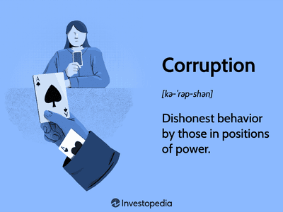

Algorithmic trading has become an integral component of various industries, revolutionizing how transactions are executed by using sophisticated mathematical models and computer programs. Predominantly utilized in the financial sector, algorithmic trading is increasingly finding applications in other industries such as retail and energy, where precision and speed are critical. This computational approach to trading has brought about greater efficiency and reduced human error, yet it presents unique challenges, particularly in sectors susceptible to corruption.

Certain industries are notably prone to corrupt practices, largely due to the significant economic interests at stake, the complexity of transactions involved, and the lack of transparency. For instance, extractive industries like oil, gas, and mining often struggle with corrupt practices due to the substantial revenues they generate, which can lead to bribery and exploitation. The construction and infrastructure sectors are also vulnerable, as large-scale projects may result in opaque dealings and kickbacks. Similarly, the financial and investment sectors have long battled issues of insider trading and information asymmetry, which can undermine market integrity.

Globally, corruption in these industries hampers economic development and perpetuates inequality. The World Bank estimates that over $1 trillion is paid in bribes annually, highlighting the pervasive nature of corruption and its impact on global economies. This systemic issue not only erodes public trust but also stifles innovation and growth, particularly in developing countries where resources are limited.

In this context, algorithmic trading emerges as both a potential solution and a risk factor for corruption. On one hand, the use of algorithms can enhance transparency and reduce opportunities for illegal practices by eliminating human bias and ensuring a consistent application of rules. On the other hand, the complexity and opacity of algorithms can be exploited by malicious actors to engage in unethical activities, such as market manipulation or exploiting information asymmetries.

The article explores these dual roles of algorithmic trading, analyzing its implications across various industries prone to corruption. It provides a comprehensive overview of algorithmic trading, discusses the challenges and risks it poses, and examines the regulatory landscape aiming to mitigate these issues. By offering strategies to prevent corruption within algorithmic trading and addressing regulatory needs, the article seeks to highlight the potential for fostering a corruption-free environment through appropriate governance and technological innovation.

## Table of Contents

## Algorithmic Trading: An Overview

Algorithmic trading, also known as automated or black-box trading, involves using computer algorithms to execute trading decisions with minimal human intervention. These algorithms are designed to evaluate a vast array of market data, identify investment opportunities, and execute orders at optimal conditions. Automated decision-making allows for high-speed execution and can operate at volumes and precision levels that are difficult for human traders to achieve.

The origins of [algorithmic trading](/wiki/algorithmic-trading) can be traced back to the 1970s when the New York Stock Exchange (NYSE) introduced the first electronic order entry systems. However, significant advancements occurred in the late 1980s and 1990s with the development of more sophisticated algorithms and faster processing speeds, enabling computers to execute trades within milliseconds. The continuous evolution of technology has further revolutionized algorithmic trading, incorporating developments in [machine learning](/wiki/machine-learning) and [artificial intelligence](/wiki/ai-artificial-intelligence) to enhance predictive capabilities and adaptive learning.

In the modern economy, algorithmic trading plays a crucial role in financial markets by increasing market [liquidity](/wiki/liquidity-risk-premium), minimizing transaction costs, and eliminating emotional biases from trading decisions. It is particularly prevalent in high-frequency trading ([HFT](/wiki/high-frequency-trading-strategies)), where algorithms execute thousands of trades per second, capitalizing on tiny price discrepancies to generate profits. Additionally, algorithmic trading contributes to market efficiency by continuously aligning prices with real-time information.

Various industries across the financial spectrum employ algorithmic trading strategies. For instance, hedge funds and investment banks use them to implement complex trading strategies, manage large portfolios, and conduct quantitative research. Retail brokers and [forex](/wiki/forex-system) traders also leverage algorithmic approaches to optimize trade execution and provide clients with competitive pricing. Outside of pure finance, industries such as commodities and energy trading utilize algorithmic techniques to manage risk and price assets effectively, given the high [volatility](/wiki/volatility-trading-strategies) and data complexity in these markets.

Overall, algorithmic trading represents a pivotal development in financial technology, offering unmatched speed and precision. Its continued adoption across diverse sectors underscores its significance in shaping the future landscape of global financial markets.

## Industries Prone to Corruption

Extractive industries, which include oil, gas, and mining, are historically susceptible to corruption due to several intrinsic factors. These industries often involve high-stakes investments and access to natural resources, generating significant revenue. However, the management and distribution of these financial gains can lead to corrupt practices, especially in countries with weak governance structures. The complexity of extraction operations and the substantial regulatory compliance required often create opportunities for corruption, such as bribery and embezzlement. This corruption can severely impact economic development and lead to a misallocation of resources, further entrenching poverty and inequality within regions where these resources are extracted ([Transparency International, "Mining for Sustainable Development"](https://www.transparency.org/en/projects/mining-for-sustainable-development)).

The construction industry and infrastructure projects also face risks of corruption, driven by factors like large-scale investments and complex contractual frameworks. Projects in this sector often entail numerous stakeholders, including government bodies, private contractors, and financial institutions, facilitating potential conflicts of interest. Corruption in construction may lead to inflated project costs, compromised quality, and delayed timelines. It is not uncommon for public officials to engage in corrupt practices to expedite permits or approvals, or for contractors to engage in bid rigging and kickbacks to secure contracts. Such malpractices can undermine public trust and lead to inefficiencies and financial losses. Effective anti-corruption measures are vital to ensuring transparency and accountability in this sector, as highlighted by the Organization for Economic Co-operation and Development (OECD) in its study on public procurement ([OECD, "Preventing Corruption in Public Procurement"](http://www.oecd.org/gov/ethics/public-procurement.htm)).

The transportation and storage sector is characterized by the complexity of logistics and supply chain operations, rendering it vulnerable to corrupt activities. Corruption can manifest in various forms, including fraudulent documentation, bribery for expedited services, and misrepresentation of goods. Customs officials and transportation personnel may engage in corrupt practices, particularly in regions with limited regulatory oversight. Additionally, the globalization of trade has increased the need for robust compliance mechanisms to avoid violations and ensure the integrity of transportation networks ([Global Transport and Logistics, "Transportation and Corruption"](https://www.globaltradelogistics.org/transportation-corruption)).

Finally, the investing and finance sector is susceptible to corruption, primarily due to the vast amounts of capital flow and the intricate nature of financial transactions. Financial markets are dynamic environments where insider trading, market manipulation, and fraudulent reporting can occur. These corrupt practices can distort market conditions, leading to financial instability and loss of investor confidence. Regulatory bodies globally have recognized these challenges and have implemented comprehensive frameworks to combat financial corruption, promoting transparency and fair play in the sector ([Financial Conduct Authority, "Financial Crime"](https://www.fca.org.uk/financial-crime/overview)).

In summary, the susceptibility of these industries to corruption highlights the need for stringent regulation, increased transparency, and robust governance mechanisms to prevent and address corrupt practices effectively.

## Challenges in Algorithmic Trading

Algorithmic trading, while revolutionary in enhancing trading efficiency, presents several challenges, particularly in the context of its potential misuse. The automation and speed that define algorithmic trading can be manipulated to engage in fraudulent activities, influencing markets both illegally and unethically.

### Potential Misuse of Algorithms

Algorithms can be deliberately programmed to exploit market inefficiencies or engage in high-frequency trading strategies that may destabilize markets. These strategies can manipulate stock prices or create artificial market demand, leading to unlawful gains. This manipulation often involves an algorithm executing numerous orders at split-second intervals to influence prices before quickly reversing those positions, a practice known as "spoofing".

### Case Studies of Corruption Scandals

There have been notable instances of corruption scandals tied to algorithmic trading. One significant case is that of Navinder Sarao, a British trader. Sarao used an algorithm to manipulate the market, contributing to the 2010 Flash Crash, where major U.S. stock indices dropped and then rebounded rapidly within minutes. His algorithm placed large sell orders that were canceled before execution, creating a false impression of supply and demand.

Another example involves high-frequency trading firms exploiting the milliseconds advantage to front-run orders, thereby undermining the fairness of markets. These firms use fiber-optic and microwave technology to gain speed advantages, impacting prices before others can react.

### Information Asymmetry and Insider Trading

Information asymmetry is a significant challenge, where certain market participants have access to information not available to others, granting them an unfair advantage. Algorithmic systems can be designed to sniff out trades and predict market movements based on patterns not available to all traders.

Insider trading also poses a risk, as algorithms can be employed to execute trades based on non-public information. This might involve trades executed milliseconds after receiving price-sensitive information, actions that undermine market integrity and investor confidence.

### Transparency and Disclosure Issues

Currently, there is a lack of transparency and clear disclosure regarding the algorithms used by trading firms. Financial regulators and market participants often cannot fully understand the strategies or intentions underlying algorithmic trades due to proprietary claims and complexity.

The proprietary nature of these algorithms means that firms are often reluctant to disclose their full functionalities, leading to challenges in monitoring and regulating these systems effectively. Without transparency, it's challenging to determine whether these systems operate fairly or contribute to market manipulation.

### Conclusion

Addressing these challenges requires a concerted effort by regulatory bodies, financial institutions, and technology providers to ensure that algorithmic trading practices are transparent and accountable. Enhanced regulatory frameworks that mandate disclosure, coupled with technology-driven oversight mechanisms, are crucial in assuaging the potential risks and fostering a fair trading environment.

## Regulatory Landscape

### Regulatory Landscape

Algorithmic trading is subject to a complex regulatory framework that aims to balance innovation with the need to prevent market manipulation and fraud. Regulations vary across jurisdictions, primarily focusing on ensuring transparency, protecting market integrity, and promoting fair trading practices. 

One of the pivotal regulatory concerns is the potential misuse of algorithmic trading for manipulative practices such as spoofing, layering, and front-running. Current regulations often require firms to implement robust risk management systems and maintain adequate records of trading algorithms. Moreover, trading venues are expected to enforce circuit breakers and other mechanisms to manage market volatility driven by algorithmic activities.

A significant case that highlights the challenges in regulating algorithmic trading is the BlueCrest Capital Management situation. BlueCrest Capital faced scrutiny when it was revealed that the firm had shifted favored clients to an internal fund, algorithmically trading in a manner that potentially disadvantaged other clients. This case underscores the critical importance of transparency and the difficulty of monitoring trading practices within private entities. As a result, the BlueCrest incident led to increased calls for regulations that enforce disclosure requirements and conflict of interest guidelines.

Recent trends in regulatory measures emphasize a more granular approach to the assessment and oversight of algorithms used in trading. Regulators are increasingly focused on the governance frameworks surrounding algorithm development and deployment, requiring firms to demonstrate detailed documentation of the algorithmic design process and testing procedures.

Despite existing regulations, there remains a strong need for stricter guidelines and enhanced enforcement mechanisms. Emerging technologies such as artificial intelligence and machine learning pose additional challenges, as they introduce complexities that current regulatory frameworks are not yet fully equipped to address. Moreover, cross-border trading activities necessitate a more coordinated international regulatory response. Enhanced surveillance systems and global cooperation among financial regulatory bodies can lead to more effective detection and deterrence of illicit activities in algorithmic trading.

Ultimately, the regulatory landscape must evolve in tandem with technological advancements to safeguard market integrity while encouraging the benefits of innovation. Striking this balance will require ongoing dialogue between industry stakeholders and regulators, supported by the development of technical standards and ethical guidelines.

## Preventing Corruption in Algorithmic Trading

Enhancing transparency and accountability in algorithmic trading is critical to mitigating the risk of corruption and maintaining market integrity. Through a blend of technology, governance, and proactive conflict management, firms can create robust defenses against unethical practices.

## Strategies to Enhance Transparency and Accountability

1. **Algorithm Auditing and Monitoring**: Continuous auditing and monitoring of trading algorithms are crucial to ensure that they operate as intended and adhere to legal standards. This involves checking algorithm code for biases, errors, and potential manipulation capabilities. Employing independent auditors to regularly review these algorithms promotes transparency. Advanced monitoring systems can track algorithmic decisions in real-time, thus reducing the opportunity for misconduct.

2. **Data Traceability and Logging**: Implementing comprehensive data logging systems allows for the traceability of all algorithmic trading activities. This ensures that all trade decisions and transactions are recorded and can be audited. Blockchain technology can be leveraged for immutable record-keeping, enhancing accountability and providing a clear audit trail.

## The Role of Technology in Preventing Corruption

Technology plays a pivotal role in preventing corruption within algorithmic trading. Innovations such as artificial intelligence and machine learning can be integrated to detect unusual patterns indicative of fraudulent activities. Predictive analytics, for instance, can flag deviations from typical trading behavior, enabling preemptive interventions.

Another key technological solution is the deployment of secure multi-party computation and homomorphic encryption. These technologies enable firms to analyze encrypted data without exposing sensitive information, thus maintaining confidentiality while detecting anomalies.

## Importance of Managerial and Board-Level Oversight

Strong governance structures are fundamental in preventing corruption in algorithmic trading. Effective oversight by senior management and the board involves setting clear ethical standards and maintaining a culture of integrity. This includes the development and enforcement of comprehensive risk management policies and procedures specifically tailored to algorithmic trading activities.

Regular training programs for management and board members about the risks and complexities of algorithmic trading help ensure they are equipped to make informed decisions. Additionally, appointing compliance officers dedicated to overseeing algorithmic trading operations can facilitate ongoing supervisory efforts.

## Proactive Approaches to Managing Conflicts of Interest

Managing conflicts of interest requires proactive and preventative measures. Firms should establish and enforce stringent conflict-of-interest policies, clearly defining unacceptable behaviors and setting penalties for violations. This includes the separation of trading and compliance functions to avoid undue influence on decision-making processes.

Utilizing technology to conduct pre-trade compliance checks helps identify potential conflicts before trades are executed. By integrating compliance checks within the trading algorithm itself, companies can prevent violations stemming from conflicts of interest at the algorithmic level.

In conclusion, preventing corruption in algorithmic trading necessitates a multifaceted approach that incorporates transparency, technological innovation, strong oversight, and conflict management. Collectively, these strategies fortify the trading environment against unethical practices, ensuring a fair and competitive market landscape.

## Future of Algorithmic Trading

As algorithmic trading evolves, certain trends are poised to shape its future trajectory significantly. A prominent development is the integration of advanced data analysis techniques. Machine learning and artificial intelligence (AI) are increasingly utilized to enhance decision-making processes. These technologies allow for the processing of vast datasets at unprecedented speeds, identifying patterns and opportunities that might be imperceptible to human traders. This capability is crucial in high-frequency trading scenarios where transaction speeds are a competitive edge.

Emerging technologies, such as quantum computing, hold the potential to further transform algorithmic trading. Quantum algorithms can theoretically solve complex optimization problems more efficiently than classical algorithms, providing faster and more accurate forecasting models. Although quantum computing is still in its nascent stages, its eventual application in trading could revolutionize how financial forecasts and risk assessments are conducted.

Innovation in creating checks and balances for algorithmic trading practices is also critical. The past has shown that without adequate safeguards, these systems can be susceptible to errors and abuse, leading to financial turmoil. There is a growing focus on developing robust monitoring tools employing AI to ensure adherence to regulatory standards and ethical practices. Real-time surveillance systems that flag abnormal trading patterns are one such initiative. Additionally, implementing blockchain technology could enhance transparency and security in transaction records, reducing the risk of manipulation.

The implications of these advancements are profound for global financial markets. Algorithmic trading contributes significantly to market liquidity and efficiency, yet it also introduces volatility due to rapid automated execution. The challenge for future markets is balancing the benefits of speed and efficiency with the need for stability and integrity. As more players enter the algorithmic trading space, the competitive landscape will likely drive even faster innovation cycles.

International collaboration on regulatory standards might become a necessity to address cross-border trading activities and prevent systemic risks. With emerging technologies shaping trading paradigms, regulators will need to adapt swiftly to ensure these innovations contribute positively to market dynamics, maintaining fair and transparent trading environments worldwide. 

The ongoing interaction between technological innovation and regulatory evolution will define the future of algorithmic trading. As stakeholders respond to these changes, opportunities for creating a more resilient and accountable trading ecosystem will undoubtedly emerge, impacting financial markets globally.

## Conclusion

The exploration of algorithmic trading reveals its profound influence on modern finance across various sectors. As automation and technology revolutionize trading, the potential benefits are immense: enhanced efficiency, increased transparency, and reduced operational costs. However, the darker side of algorithmic trading cannot be ignored. Instances of misuse, information asymmetry, and opacity pose significant risks, especially in industries already vulnerable to corruption.

Balancing the advanced capabilities of algorithmic trading with rigorous regulation is critical. While technology can streamline processes and reduce human error, it can also exacerbate ethical issues if not properly controlled. Regulatory bodies worldwide must ensure that rules keep pace with technological advancements, ensuring fair play and safeguarding market integrity. The BlueCrest Capital case serves as a cautionary tale, highlighting the necessity of robust frameworks to prevent abuse.

Stakeholders must proactively engage in shaping a trading environment that prioritizes ethical standards and accountability. Policymakers, industry leaders, and technologists must collaborate to enforce stricter guidelines and promote a culture of transparency and accountability. Through coordinated efforts, the potential for a corruption-free environment becomes attainable, harnessing technology’s capabilities while protecting market integrity.

In conclusion, the future of algorithmic trading hinges on the delicate balance between innovation and regulation. By adopting comprehensive measures, stakeholders can significantly mitigate corruption risks, fostering a sustainable and equitable global financial ecosystem.

## References & Further Reading

[1]: Transparency International. ["Mining for Sustainable Development."](https://transparency.org.au/publications/mining-for-sustainable-development/)

[2]: OECD. ["Preventing Corruption in Public Procurement."](https://baselgovernance.org/sites/default/files/2020-03/oecd_preventing_corruption_in_public_procurement_2016.pdf)

[3]: Global Transport and Logistics. ["Transportation and Corruption."](https://sutp.org/publications/fighting-corruption-in-the-road-transport-sector/)

[4]: Financial Conduct Authority. ["Financial Crime."](https://www.fca.org.uk/publications/corporate-documents/reducing-and-preventing-financial-crime)

[5]: Bergstra, J., Bardenet, R., Bengio, Y., & Kégl, B. (2011). ["Algorithms for Hyper-Parameter Optimization."](https://proceedings.neurips.cc/paper/2011/file/86e8f7ab32cfd12577bc2619bc635690-Paper.pdf) Advances in Neural Information Processing Systems 24.

[6]: Lopez de Prado, Marcos. ["Advances in Financial Machine Learning."](https://www.amazon.com/Advances-Financial-Machine-Learning-Marcos/dp/1119482089)

[7]: Aronson, David. ["Evidence-Based Technical Analysis: Applying the Scientific Method and Statistical Inference to Trading Signals."](https://books.google.com/books/about/Evidence_Based_Technical_Analysis.html?id=jbD47VkOHAEC)

[8]: Jansen, Stefan. ["Machine Learning for Algorithmic Trading."](https://github.com/stefan-jansen/machine-learning-for-trading)

[9]: Chan, Ernest P. ["Quantitative Trading: How to Build Your Own Algorithmic Trading Business."](https://github.com/justinchou/books-quantitative-trading)