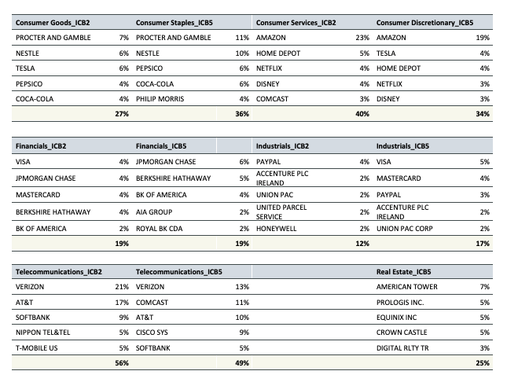

## Table of Contents

## What is the Industry Classification Benchmark (ICB) and why was it developed?

The Industry Classification Benchmark (ICB) is a system that groups companies into different categories based on what they do. It was created by Dow Jones and FTSE in 2005. The ICB helps people who invest in the stock market to understand and compare companies more easily. It sorts companies into four main levels: industry, supersector, sector, and subsector. This makes it easier to see how different companies are related to each other.

The ICB was developed because there was a need for a clear and consistent way to classify companies around the world. Before the ICB, different countries and organizations used their own systems, which made it hard to compare companies globally. By creating a single, standardized system, the ICB helps investors, analysts, and companies themselves to better understand market trends and make more informed decisions. It is widely used by financial professionals and is updated regularly to reflect changes in the global economy.

## Who developed the ICB and when was it first introduced?

The Industry Classification Benchmark (ICB) was developed by Dow Jones and FTSE. They worked together to create this system to help people understand and compare companies more easily.

The ICB was first introduced in 2005. Before that, different countries and organizations used different ways to group companies, which made it hard to compare them globally. The ICB made it easier for everyone by providing a clear and consistent way to classify companies around the world.

## How is the ICB structured and what are its main components?

The Industry Classification Benchmark (ICB) is organized into four main levels that help group companies based on what they do. The first level is called Industry, and it is the broadest category. The second level is Supersector, which breaks down the industries into more specific groups. The third level is Sector, which divides the supersectors into even smaller categories. The fourth and most detailed level is Subsector, which groups companies that are very similar in what they do.

Each level of the ICB helps to make it easier to understand and compare companies. For example, if you start with the Industry level, you might see a category like "Technology." Within that, the Supersector level might include "Software and Computer Services." The Sector level could then break this down further into "Software" and "Computer Services." Finally, the Subsector level might list specific types of software companies, like "Business Intelligence" or "Consumer Digital Services." This structure helps investors and analysts see how companies fit into the bigger picture of the economy.

## What are the four main industry sectors defined by the ICB?

The Industry Classification Benchmark (ICB) sorts companies into four big groups called industry sectors. These are Technology, Health Care, Financials, and Industrials. Each of these sectors groups companies that do similar kinds of work. For example, the Technology sector includes companies that make computers, software, and other tech products. The Health Care sector has companies that make medicines, medical equipment, and provide health services.

These four sectors help people understand the economy better. They show how different parts of the economy are doing. For example, if the Technology sector is growing fast, it might mean that people are buying more computers and using more software. If the Health Care sector is doing well, it could mean that people are spending more on medicines and health services. By looking at these sectors, investors and analysts can make better decisions about where to put their money.

## How does the ICB classify companies within its system?

The Industry Classification Benchmark (ICB) sorts companies into different groups based on what they do. It uses four levels to do this: Industry, Supersector, Sector, and Subsector. The broadest level is Industry, which splits the economy into big chunks like Technology, Health Care, Financials, and Industrials. Each industry is then broken down into Supersectors, which are smaller groups within the industry. For example, the Technology industry might have a Supersector called "Software and Computer Services."

From there, the ICB goes into more detail. Supersectors are divided into Sectors, which are even smaller groups. For instance, "Software and Computer Services" might be split into "Software" and "Computer Services" sectors. Finally, Sectors are broken down into Subsectors, which are the most specific groups. In the "Software" sector, you might find Subsectors like "Business Intelligence" or "Consumer Digital Services." This way, the ICB helps people see how companies are related to each other, from the biggest picture down to the smallest details.

## What are the benefits of using the ICB for investors and analysts?

Using the Industry Classification Benchmark (ICB) helps investors and analysts a lot. It gives them a clear and easy way to group companies based on what they do. This makes it simpler to compare companies and see how they fit into the bigger picture of the economy. For example, if an investor wants to know how tech companies are doing, they can look at the Technology sector in the ICB. This helps them see trends and make better choices about where to put their money.

The ICB also makes it easier for investors and analysts to understand the market around the world. Before the ICB, different countries used different ways to group companies, which made it hard to compare them. Now, with the ICB, everyone uses the same system. This means that an analyst in the U.S. can easily compare a company there with one in Europe or Asia. This global standard helps them make smarter decisions and see how different parts of the world's economy are doing.

## How does the ICB differ from other industry classification systems like GICS?

The Industry Classification Benchmark (ICB) and the Global Industry Classification Standard (GICS) are both ways to group companies, but they do it a bit differently. ICB was created by Dow Jones and FTSE, while GICS was made by MSCI and Standard & Poor's. ICB sorts companies into four levels: Industry, Supersector, Sector, and Subsector. This means it breaks down companies into very detailed groups. On the other hand, GICS uses a simpler structure with only three levels: Sector, Industry Group, and Industry. This makes GICS a bit easier to use but less detailed than ICB.

Another difference is how they group companies. For example, ICB puts oil and gas companies in the "Oil & Gas" industry, while GICS puts them in the "Energy" sector. These small differences can matter a lot to investors and analysts who need to compare companies across different systems. Both systems are updated regularly to keep up with changes in the economy, but they might update at different times and make different choices about how to classify new kinds of businesses. Overall, ICB and GICS both help people understand the market, but they do it in slightly different ways.

## Can you explain how the ICB has evolved since its inception?

Since it started in 2005, the Industry Classification Benchmark (ICB) has changed a lot to keep up with the world's economy. At first, it had 10 industries, but now it has 11. This change happened because they added a new industry called "Real Estate" in 2016. They did this because more and more people were investing in real estate, and it needed its own category. The ICB also gets updated every year to make sure it still makes sense as new kinds of businesses pop up.

Over the years, the ICB has gotten better at grouping companies into smaller, more specific categories. For example, they used to have a big group called "Technology" but now it's split into more detailed groups like "Software and Computer Services" and "Technology Hardware and Equipment." This helps investors and analysts understand what different companies do and how they fit into the economy. By making these changes, the ICB stays useful and helps people make smart choices about where to put their money.

## What are some practical applications of the ICB in financial markets?

The Industry Classification Benchmark (ICB) helps people who work in financial markets in many ways. It makes it easier for them to group companies into categories based on what they do. This helps investors and analysts look at different parts of the economy and see how well they are doing. For example, if someone wants to invest in tech companies, they can use the ICB to find all the companies in the Technology sector. This makes it simpler to compare these companies and see which ones might be good to invest in.

Another way the ICB is used is to help create and manage investment funds. Fund managers use the ICB to pick companies that fit into certain categories for their funds. For example, if a fund is supposed to focus on health care, the manager can use the ICB to find all the companies in the Health Care sector. This helps them build a fund that matches what they want to invest in. It also makes it easier for investors to understand what the fund is all about and how it might do in the future.

## How can the ICB be used in portfolio management and investment strategy?

The Industry Classification Benchmark (ICB) is really helpful for people who manage portfolios and make investment strategies. It groups companies into different categories, so portfolio managers can easily see which companies belong to certain parts of the economy. For example, if a manager wants to invest more in technology, they can look at the Technology sector in the ICB to find all the companies that fit into that group. This makes it easier to decide which companies to buy or sell to balance the portfolio and reach the investment goals.

Using the ICB also helps in creating investment strategies that focus on specific industries or sectors. For instance, if an investor believes that health care will do well in the future, they can use the ICB to pick companies from the Health Care sector. This way, they can build a strategy that takes advantage of trends in that part of the economy. By keeping an eye on how different sectors are doing through the ICB, investors can adjust their strategies to make sure they are putting their money in the best places.

## What are the challenges and limitations of using the ICB for industry classification?

Using the Industry Classification Benchmark (ICB) can be tricky because it's not always easy to fit every company into just one group. Some companies do lots of different things, so it's hard to decide which category they belong in. For example, a company might make both cars and batteries. Should it go in the "Automobiles" or "Electronic and Electrical Equipment" group? This can make it tough for investors and analysts to compare companies accurately.

Another challenge is that the ICB gets updated every year, which can be confusing. When the categories change, it can mess up how people have been tracking companies and sectors. Also, the ICB might not always keep up with new types of businesses fast enough. If a new kind of business comes along that doesn't fit into any of the current categories, it might take a while for the ICB to add a new group for it. This can make it hard for investors to understand and invest in the newest parts of the economy.

## How does the ICB integrate with financial data systems and what tools support its use?

The Industry Classification Benchmark (ICB) works well with financial data systems because it helps organize information about companies in a way that computers can understand easily. Many financial software programs and databases use the ICB to sort and show data about companies. This makes it easier for people to find and analyze information about different industries and sectors. For example, when someone uses a financial platform, they can quickly see how companies in the Technology sector are doing by using the ICB categories.

There are many tools that support the use of the ICB. Some popular ones include financial analysis software like Bloomberg Terminal and Reuters Eikon, which let users sort and filter company data using ICB categories. These tools help investors and analysts look at market trends and make better decisions. Also, many investment research platforms and databases, like FactSet and S&P Capital IQ, use the ICB to help people build and manage their investment portfolios. By using these tools, people can easily keep track of how different parts of the economy are doing and adjust their strategies accordingly.

## What are some case studies and real-world applications?

Traders and financial institutions have effectively integrated the Industry Classification Benchmark (ICB) and the Global Industry Classification Standard (GICS) into their trading platforms, significantly enhancing algorithmic models and improving trading decisions.

Hedge funds are prominent examples of institutions utilizing GICS for implementing sector rotation strategies. By employing predictive analytics, these funds analyze sector-specific performance and macroeconomic indicators to reallocate investments across various sectors. This dynamic approach allows hedge funds to capitalize on cyclical market trends and optimize their portfolios for higher returns. For instance, an algorithm might use historical data to detect sectoral strength and weakness patterns, guiding investment shifts between sectors like technology and utilities in response to anticipated economic changes. The mathematical formulation can be summarized with a sector rotation model, maximizing the expected return $R(t)$:

$$
R(t) = \sum_{i=1}^{n} w_i(t) \times r_i(t)
$$

where $w_i(t)$ represents the weight of sector $i$ at time $t$ and $r_i(t)$ denotes the return of sector $i$.

Retail trading platforms have embraced the ICB to offer customizable strategies tailored to individual investor preferences. By focusing on specific industry segments, these platforms enable retail traders to develop niche market strategies based on granular classification data. For example, an individual interested in renewable energy stocks can leverage ICB classifications to identify relevant industry subsectors, thus refining their investment strategy for better-focused outcomes. This customization not only enhances user engagement but also increases the precision of trading algorithms in targeting specific market segments.

These applications underscore the potential of stock classifications not only in improving trading accuracy but also in enhancing the overall effectiveness of algorithmic models. By providing structured insights into market dynamics, these classification systems facilitate more informed decision-making processes, enabling traders to navigate complex financial landscapes with increased confidence.

Furthermore, advancements in technology and data analysis continue to elevate the sophistication of these classification systems. Machine learning and [artificial intelligence](/wiki/ai-artificial-intelligence) are increasingly being employed to analyze larger datasets more efficiently, further refining the predictive capabilities of trading algorithms. As these technologies progress, the ability of ICB and GICS to adapt and provide even more precise market insights will likely amplify their relevance and utility in [algorithmic trading](/wiki/algorithmic-trading) contexts. This trend highlights an ongoing evolution, where continuous technological innovations pave the way for future breakthroughs in trading strategies and financial analysis.

## References & Further Reading

Research and industry publications provide extensive insights into the utilization of classification systems in trading, highlighting their pivotal role in enhancing algorithmic trading strategies. Key resources include MSCI and FTSE Russell, which detail the frameworks of the Global Industry Classification Standard (GICS) and the Industry Classification Benchmark (ICB), respectively. These resources explore the methodologies behind the classifications, their applications in market analytics, and their impact on investment processes. For comprehensive understanding, resources like MSCI's "GICS Methodology" and FTSE Russell's "Industry Classification Benchmark" documentation offer foundational knowledge for practitioners.

Textbooks such as "Quantitative Trading" by Ernest P. Chan and "Advances in Financial Machine Learning" by Marcos López de Prado are essential for traders seeking to deepen their understanding of algorithmic trading techniques, including the integration of stock classification systems. "Quantitative Trading" provides practical insights into developing and implementing trading strategies, while "Advances in Financial Machine Learning" introduces sophisticated methodologies for leveraging [machine learning](/wiki/machine-learning) in trading, addressing the adoption of classification systems for more accurate market forecasting and decision-making.

Academic papers exploring algorithmic trading strategies through the lens of stock classifications offer valuable empirical analyses and case studies. These studies often evaluate the effectiveness of classification systems like GICS and ICB in optimizing trading algorithms and managing portfolios. Key research articles investigate the predictive power of sector and industry groupings, providing evidence on their utility in enhancing algorithmic trading performance. Researchers and practitioners can gain significant insights from these papers to improve trading models and adapt to dynamic market conditions effectively.

