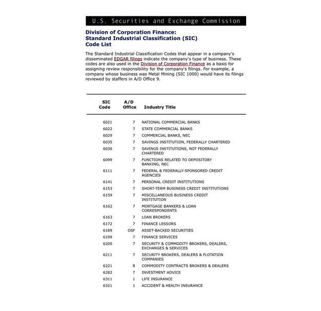

## Table of Contents

## What are Industry Classification Codes?

Industry Classification Codes are like labels that help organize businesses into different groups based on what they do. These codes make it easier for people to understand and compare companies in the same industry. For example, a company that makes cars would have a different code than a company that sells clothes.

There are different systems for these codes, but one of the most common is the North American Industry Classification System (NAICS). This system is used in the United States, Canada, and Mexico. Each business gets a code that shows what kind of work it does, and these codes can be very specific or more general. For instance, a bakery might have a code that shows it's part of the food industry, but also a more detailed code that says it makes baked goods.

Using these codes helps governments, businesses, and researchers keep track of economic activities. They can see how different industries are doing, how they are growing, and how they affect the economy. This information is useful for making decisions about where to invest money or how to plan for the future.

## Why are Industry Classification Codes important?

Industry Classification Codes are important because they help us organize and understand businesses better. They act like a map that shows where each business fits in the world of work. By using these codes, we can group companies that do similar things together. This makes it easier to see how different parts of the economy are doing. For example, if we want to know how the car industry is doing, we can look at all the companies with car-related codes and see if they are growing or shrinking.

These codes are also useful for making big decisions. Governments, businesses, and researchers use them to plan for the future. They can see which industries are getting bigger or smaller and decide where to put their money. For instance, if a government sees that the technology industry is growing fast, they might decide to invest more in schools that teach computer skills. This helps everyone make smarter choices based on clear information about the economy.

## What are the main types of Industry Classification Codes?

There are several main types of Industry Classification Codes used around the world. One of the most common is the North American Industry Classification System (NAICS), which is used in the United States, Canada, and Mexico. NAICS helps to group businesses by what they do, making it easier to compare and study them. For example, a restaurant and a grocery store would have different NAICS codes because they do different things in the food industry.

Another important system is the Standard Industrial Classification (SIC) code, which was widely used before NAICS came along. SIC codes are still used sometimes, especially for looking at older data. They work in a similar way to NAICS, but they are a bit less detailed. For instance, a company making cars and a company making trucks might have the same SIC code, but different NAICS codes.

In Europe, the Statistical Classification of Economic Activities in the European Community, known as NACE, is used. NACE codes are similar to NAICS and SIC codes but are designed specifically for European countries. They help to organize businesses in a way that makes sense for the European economy. Each of these systems helps people understand and compare businesses across different regions and industries.

## How are Industry Classification Codes used in business?

Industry Classification Codes help businesses understand where they fit in the market. When a company knows its code, it can compare itself to other companies in the same group. For example, a small bakery can see how it is doing compared to other bakeries. This helps the bakery know if it is doing well or if it needs to change something to keep up. Companies also use these codes to find new customers or partners. If a company wants to work with others in the same industry, it can look for businesses with similar codes.

These codes are also important for planning and making decisions. Businesses use them to study trends and see which parts of the economy are growing or shrinking. For instance, if a company sees that the technology industry is growing fast, it might decide to invest more in tech. Governments also use these codes to make rules and policies that help different industries. For example, if the government sees that many companies in a certain industry are struggling, it might create programs to help those businesses. By using Industry Classification Codes, businesses and governments can make smarter choices based on clear information about the economy.

## Can you explain the difference between SIC and NAICS codes?

SIC and NAICS codes are both used to group businesses by what they do, but they are a bit different. SIC stands for Standard Industrial Classification, and it was used a lot before NAICS came along. SIC codes are less detailed than NAICS codes. For example, a company making cars and a company making trucks might have the same SIC code because they are both in the vehicle industry. But with NAICS, these two companies would have different codes because NAICS is more specific.

NAICS stands for North American Industry Classification System, and it is used in the United States, Canada, and Mexico. NAICS codes are more detailed and up-to-date than SIC codes. They help to break down industries into smaller groups, which makes it easier to compare businesses that do very similar things. For instance, a restaurant and a grocery store would have different NAICS codes because they do different things in the food industry, even though they might have the same SIC code. This makes NAICS better for understanding the economy today.

## How do you find the Industry Classification Code for a specific company?

To find the Industry Classification Code for a specific company, you can start by visiting the company's official website. Many companies list their NAICS or SIC code in their "About Us" or "Investor Relations" section. If you can't find it there, you can also check business directories like the Yellow Pages or online databases like Manta or Hoovers, which often include this information. Another option is to use government websites, such as the U.S. Census Bureau or the U.S. Securities and Exchange Commission (SEC), which provide tools to look up NAICS codes.

If you still can't find the code, you can use industry-specific resources or search engines. For example, if you know the company's main product or service, you can search for the NAICS or SIC code related to that industry. Websites like the NAICS Association or OSHA's SIC Manual can help you match a company's activities to the correct code. Remember, NAICS codes are more detailed and commonly used today, so it's usually better to look for those if possible.

## What are some common challenges faced when using Industry Classification Codes?

One common challenge when using Industry Classification Codes is that they can be hard to understand. The codes are made up of numbers and letters, and it can be tough to figure out what they mean. For example, a company might do a lot of different things, and it can be hard to pick just one code that fits everything they do. This can lead to mistakes where a company gets put in the wrong group, which can make it harder to compare them to other businesses.

Another challenge is that the codes can change over time. As new industries pop up or old ones change, the codes need to be updated. This means that a company's code might be different now than it was a few years ago. This can make it tricky to look at data from the past and compare it to today. It's important to keep up with these changes to make sure you're using the right codes for your research or business planning.

## How have Industry Classification Codes evolved over time?

Industry Classification Codes have changed a lot over the years to keep up with the economy. In the beginning, there were codes like the Standard Industrial Classification (SIC) system, which started in the 1930s. This system was simple and helped people group businesses into big categories. But as time went on, the economy got more complicated, and the SIC system started to feel old and not detailed enough. That's why, in the late 1990s, a new system called the North American Industry Classification System (NAICS) was made. NAICS was a big step forward because it gave more specific codes for new and growing industries, like technology and services.

Over the years, NAICS has kept changing to stay up-to-date. Every five years, the codes are reviewed and updated to make sure they still fit the economy. For example, when new kinds of businesses start up, like online shopping or green energy, new codes are added to cover them. This helps everyone understand the economy better and make better decisions. Even though the SIC system is not used as much anymore, it's still around for looking at older data. The main goal has always been to make the codes more useful and accurate as the world changes.

## What role do Industry Classification Codes play in economic analysis?

Industry Classification Codes help people understand the economy by grouping businesses into different categories. When economists and researchers use these codes, they can see how different parts of the economy are doing. For example, they can look at all the companies in the car industry and see if they are making more or less money than before. This helps them figure out if the car industry is growing or shrinking. By comparing different industries, they can also see where the economy is strong and where it might need help.

These codes are also important for making big decisions. Governments use them to plan new laws and programs that can help certain industries. For instance, if they see that the farming industry is struggling, they might create new rules to help farmers. Businesses use the codes to find out where to invest their money. If they see that the technology industry is growing fast, they might decide to put more money into tech. By using Industry Classification Codes, everyone can make smarter choices based on clear information about the economy.

## How do international Industry Classification Codes compare to those used in the U.S.?

Industry Classification Codes are used all over the world to help group businesses by what they do. In the United States, the most common system is the North American Industry Classification System (NAICS), which is also used in Canada and Mexico. NAICS codes are very detailed and help people understand how different parts of the economy are doing. For example, a company that makes cars would have a different NAICS code than a company that makes trucks, even though both are in the vehicle industry.

Internationally, there are different systems used in other parts of the world. In Europe, the Statistical Classification of Economic Activities in the European Community, or NACE, is used. NACE codes are similar to NAICS codes but are designed to fit the European economy. In other places, like Australia, they use the Australian and New Zealand Standard Industrial Classification (ANZSIC). These international codes help people in different countries understand and compare their economies, but they might group businesses a bit differently than NAICS does in the U.S. Even though the systems are different, they all aim to help people make sense of the economy and make better decisions.

## What are the future trends for Industry Classification Codes?

Industry Classification Codes will keep changing to match the new ways businesses work. As technology grows and new industries pop up, the codes need to be updated to include them. For example, more businesses are using the internet and doing things like online shopping or using apps. So, new codes will be made to fit these new kinds of businesses. Also, as the world pays more attention to things like green energy and the environment, codes will be added to cover these areas too. This helps everyone understand the economy better and make good choices about where to put their money.

Another big change might be how the codes are used around the world. Right now, different countries use different systems, like NAICS in the U.S. and NACE in Europe. But as businesses work more and more across borders, there might be a push to make one system that everyone can use. This would make it easier to compare and understand the global economy. Even though it's hard to get everyone to agree on one system, it could happen if it helps businesses and governments work together better.

## How can Industry Classification Codes be integrated with other data systems for advanced analytics?

Industry Classification Codes can be integrated with other data systems to help businesses and researchers do advanced analytics. By combining these codes with data from places like sales records, customer information, and market trends, people can get a clearer picture of how different industries are doing. For example, if a company wants to see how its sales compare to others in the same industry, it can use the Industry Classification Code to group similar businesses together and then look at their sales data. This helps the company understand if it is doing better or worse than its competitors and make smart decisions about where to focus its efforts.

Another way to use Industry Classification Codes with other data systems is for big projects like economic forecasting. By linking these codes with data from government reports, financial statements, and even social media trends, analysts can predict how different parts of the economy will grow or shrink. For instance, if the data shows that the technology industry is getting a lot of new investments and positive feedback online, analysts might predict that this industry will keep growing. This kind of advanced analytics helps governments and businesses plan for the future and make choices that can help the economy stay strong.

## References & Further Reading

[1]: United States Census Bureau. ["North American Industry Classification System (NAICS)."](https://www.census.gov/programs-surveys/economic-census/year/2022/guidance/understanding-naics.html) 

[2]: U.S. Securities and Exchange Commission. ["Standard Industrial Classification (SIC) Code List."](https://www.sec.gov/search-filings/standard-industrial-classification-sic-code-list)

[3]: Office of Management and Budget. ["North American Industry Classification System: 2022 Manual."](https://www.census.gov/naics/)

[4]: "Algorithmic Trading: Winning Strategies and Their Rationale" by Ernie Chan

[5]: Lopez de Prado, M. (2018). ["Advances in Financial Machine Learning."](https://www.amazon.com/Advances-Financial-Machine-Learning-Marcos/dp/1119482089) Wiley.

[6]: National Bureau of Economic Research. ["Industry Classification Systems."](https://www.trade.gov/industry-classification-systems)