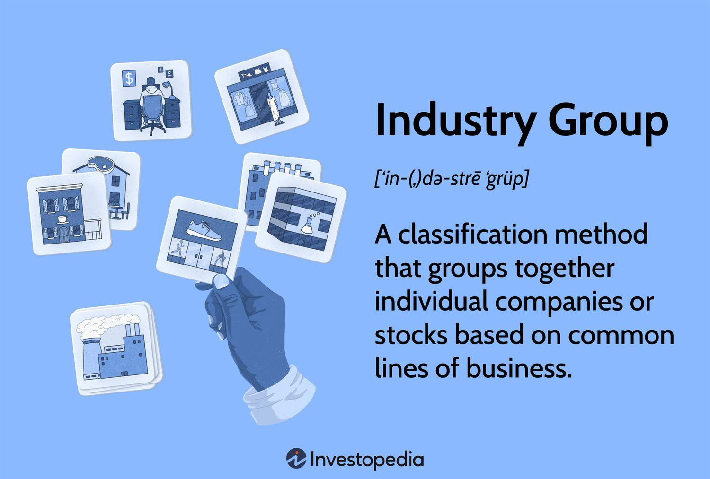

## Table of Contents

## What is an industry group?

An industry group is a collection of companies that work in the same type of business. For example, all car makers can be part of the automotive industry group. These groups help companies share ideas, solve common problems, and work together to make their industry better. They often meet to talk about new rules, technology, and ways to grow their business.

Industry groups can also help their members by talking to the government. They can ask for laws that help their industry or explain why some rules might be bad for them. This can make it easier for companies in the group to do business. By working together, companies in an industry group can be stronger and more successful than if they worked alone.

## What is a market sector?

A market sector is a part of the economy where businesses offer similar products or services. For example, the technology sector includes companies that make computers, software, and other tech products. Sectors help people understand and organize the economy by grouping similar businesses together.

Sectors can be big or small. Some common sectors are healthcare, finance, and energy. Each sector can have many different companies, and they all work in the same general area. By looking at sectors, investors and economists can see how different parts of the economy are doing and make better decisions.

## How are industry groups and market sectors defined?

Industry groups are collections of companies that work in the same type of business. They are defined by the specific products or services that the companies in the group offer. For example, all companies that make cars belong to the automotive industry group. These groups help companies share ideas and solve common problems. They often work together to influence laws and regulations that affect their business.

Market sectors are parts of the economy where businesses offer similar products or services. They are defined by the general area of the economy that the businesses operate in. For example, the technology sector includes all companies that make tech products like computers and software. Sectors help people understand the economy by grouping similar businesses together. They can be used to see how different parts of the economy are doing and to make better investment decisions.

## What are some common industry groups?

Industry groups are collections of companies that do the same kind of work. Some common industry groups are the automotive group, where all the car makers belong. There's also the tech group, with companies that make computers and software. Another big group is the healthcare group, which includes hospitals, drug makers, and medical device companies. These groups help companies share ideas and work together to solve problems.

The finance industry group is also very important. It includes banks, insurance companies, and investment firms. They work together to make rules that help them do business better. The energy group is another key industry group, with companies that make oil, gas, and renewable energy. They talk about new ways to make energy and how to use it more cleanly.

Other common industry groups are the retail group, with stores that sell things to people, and the construction group, with companies that build houses and buildings. These groups help their members by talking to the government and asking for laws that help their business. By working together, companies in these groups can be stronger and more successful.

## What are some common market sectors?

Market sectors are parts of the economy where businesses offer similar products or services. Some common market sectors are the technology sector, where companies make computers, software, and other tech products. The healthcare sector is another big one, with hospitals, drug makers, and medical device companies. The finance sector includes banks, insurance companies, and investment firms. These sectors help people understand how different parts of the economy are doing.

The energy sector is also important, with companies that make oil, gas, and renewable energy. The retail sector includes stores that sell things to people, and the construction sector has companies that build houses and buildings. These sectors help investors and economists see which parts of the economy are growing or shrinking.

By looking at market sectors, people can make better decisions about where to invest their money or how to plan for the future. Sectors show how different parts of the economy are connected and how they affect each other. This helps everyone understand the economy better and make smarter choices.

## How do industry groups differ from market sectors?

Industry groups and market sectors are both ways to group businesses, but they are a bit different. Industry groups are collections of companies that do the same kind of work. For example, all car makers belong to the automotive industry group. These groups help companies share ideas and solve problems together. They also work to influence laws and rules that affect their business. Industry groups are more specific and focus on the exact type of business the companies do.

Market sectors, on the other hand, are bigger parts of the economy where businesses offer similar products or services. For example, the technology sector includes all companies that make tech products like computers and software. Sectors help people understand the economy by grouping similar businesses together. They are used to see how different parts of the economy are doing and to make better investment decisions. Market sectors are broader and cover a wider range of businesses within a general area of the economy.

In simple terms, industry groups are like smaller, more focused teams within a sector. They help companies in the same specific business work together. Market sectors are like big categories that include many different kinds of businesses. They help people see the bigger picture of the economy. Both are important, but they serve different purposes in understanding and organizing businesses.

## Why is it important to understand the differences between industry groups and market sectors?

Understanding the differences between industry groups and market sectors helps people see how businesses are organized and how the economy works. Industry groups are like small teams where companies that do the same kind of work come together. They help these companies share ideas and solve problems. For example, all car makers are part of the automotive industry group. Knowing this helps people understand how specific businesses work together and influence laws that affect them.

Market sectors, on the other hand, are bigger categories that include many different kinds of businesses. They help people see the bigger picture of the economy. For example, the technology sector includes all companies that make tech products like computers and software. By looking at market sectors, people can see which parts of the economy are growing or shrinking. This helps investors and economists make better decisions about where to put their money or how to plan for the future.

Knowing the difference between industry groups and market sectors is important because it helps everyone understand the economy better. Industry groups show how specific businesses work together, while market sectors show how different parts of the economy are connected. This knowledge helps people make smarter choices and understand how businesses and the economy affect each other.

## How do industry groups and market sectors impact investment strategies?

Industry groups and market sectors can really change how people invest their money. When you know about industry groups, you can see how companies in the same business work together. For example, if you know that car makers in the automotive industry group are working on new electric cars, you might want to invest in those companies. Industry groups help you understand the specific things that can make a company do well or not so well. This can help you pick the right companies to invest in.

Market sectors are also important for investment strategies. They show you the bigger picture of the economy. If you see that the technology sector is growing fast, you might want to invest in tech companies. Market sectors help you see which parts of the economy are doing well and which ones are not. This can help you decide where to put your money to get the best return. By looking at both industry groups and market sectors, you can make smarter investment choices and plan for the future.

## Can you provide examples of how companies are classified within different industry groups and market sectors?

Companies are put into industry groups based on the kind of work they do. For example, Ford, Toyota, and General Motors are all in the automotive industry group because they make cars. These companies work together to solve problems and make rules that help them sell more cars. Another example is Apple, Microsoft, and Google, which are all in the tech industry group. They make computers, software, and other tech products. By being in the same industry group, these companies can share ideas and work on new technology together.

Market sectors are bigger categories that include many different kinds of businesses. For example, the healthcare sector includes companies like Johnson & Johnson, which makes medicine, and Mayo Clinic, which runs hospitals. They are all in the healthcare sector because they help people stay healthy. The finance sector is another example, with companies like Bank of America, which is a bank, and Allstate, which sells insurance. They are all in the finance sector because they help people manage their money. By looking at market sectors, people can see how different parts of the economy are doing and make better investment choices.

## How do economic cycles affect different industry groups and market sectors?

Economic cycles, like times when the economy is growing or shrinking, can really change how industry groups and market sectors do. When the economy is growing, people have more money to spend. This is good for industry groups like the automotive group, where companies like Ford and Toyota can sell more cars. It's also good for the retail sector, where stores can sell more things to people. But when the economy is shrinking, people don't have as much money to spend. This can hurt industry groups like construction, where companies that build houses and buildings might not have as much work. The same goes for the luxury goods sector, where people might not buy expensive things when times are tough.

Different market sectors can also be affected differently by economic cycles. The technology sector often does well even when the economy is not growing, because people still need computers and software. The healthcare sector is another one that usually stays strong, because people always need medicine and hospitals. On the other hand, the energy sector can have a hard time when the economy is shrinking. Companies that make oil and gas might not sell as much, because people are driving less and using less energy. By understanding how economic cycles affect different industry groups and market sectors, people can make better choices about where to invest their money and how to plan for the future.

## What are the challenges in accurately categorizing companies into industry groups and market sectors?

Putting companies into the right industry groups and market sectors can be hard because some companies do many different things. For example, a company like Amazon sells things online, but it also makes movies and has a cloud computing business. It can be tough to decide which industry group or market sector Amazon fits best. Sometimes, a company might be in more than one group or sector, which can make things even more confusing.

Another challenge is that companies can change what they do over time. A company that used to make just cars might start making electric cars and batteries too. This means they might fit into a new industry group or market sector. Keeping up with these changes and making sure companies are in the right groups can be a lot of work. But it's important to do it right, because it helps people understand the economy and make good decisions about investing their money.

## How do global economic trends influence the performance of specific industry groups and market sectors?

Global economic trends can really change how well different industry groups and market sectors do. When the world economy is doing well, people have more money to spend. This is good for industry groups like the automotive group, where companies like Ford and Toyota can sell more cars. It's also good for the retail sector, where stores can sell more things to people. But if the world economy is not doing well, people might not have as much money to spend. This can hurt industry groups like construction, where companies that build houses and buildings might not have as much work. The same goes for the luxury goods sector, where people might not buy expensive things when times are tough.

Different market sectors can also be affected differently by global economic trends. The technology sector often does well even when the world economy is not growing, because people still need computers and software. The healthcare sector is another one that usually stays strong, because people always need medicine and hospitals. On the other hand, the energy sector can have a hard time when the world economy is shrinking. Companies that make oil and gas might not sell as much, because people are driving less and using less energy. By understanding how global economic trends affect different industry groups and market sectors, people can make better choices about where to invest their money and how to plan for the future.

## References & Further Reading

Bergstra, J., Bardenet, R., Bengio, Y., & Kégl, B. (2011). "Algorithms for Hyper-Parameter Optimization" discusses techniques for optimizing hyper-parameters in [machine learning](/wiki/machine-learning) models, which are critical for enhancing the performance of [algorithmic trading](/wiki/algorithmic-trading) systems through meticulous tuning processes and achieving optimal operation under given market conditions [1].

"Advances in Financial Machine Learning" by Marcos Lopez de Prado offers comprehensive insights into how modern machine learning techniques can be applied in financial markets for developing more robust and dynamic algorithmic trading strategies. De Prado emphasizes the importance of rigorous testing and validation processes to avoid overfitting and ensure that models are truly capable of operating effectively in live trading environments [2].

"Evidence-Based Technical Analysis" by David Aronson explores the domain of technical analysis in trading, providing a systematic approach to evaluating technical indicators with statistical rigor. Aronson critiques traditional technical analysis while advocating for evidence-based methodologies that enhance the reliability of algorithmic trading models [3].

"Machine Learning for Algorithmic Trading" by Stefan Jansen provides a detailed examination of leveraging machine learning to analyze financial markets and implement cutting-edge algorithmic trading strategies. Jansen’s work breaks down the essential components of developing, testing, and deploying intelligent trading models with Python, facilitating real-world application of machine learning technology in trading systems [4].

"Quantitative Trading" by Ernest P. Chan introduces the principles and practice of quantitative trading. Chan outlines strategies for developing efficient trading algorithms and managing the risks associated with quantitative trading operations. His book is a useful guide for practitioners aiming to harness data-driven approaches in financial markets [5].

**References:**

1. Bergstra, J., Bardenet, R., Bengio, Y., & Kégl, B. (2011). Algorithms for Hyper-Parameter Optimization.
2. Lopez de Prado, Marcos. Advances in Financial Machine Learning.
3. Aronson, David. Evidence-Based Technical Analysis.
4. Jansen, Stefan. Machine Learning for Algorithmic Trading.
5. Chan, Ernest P. Quantitative Trading.

