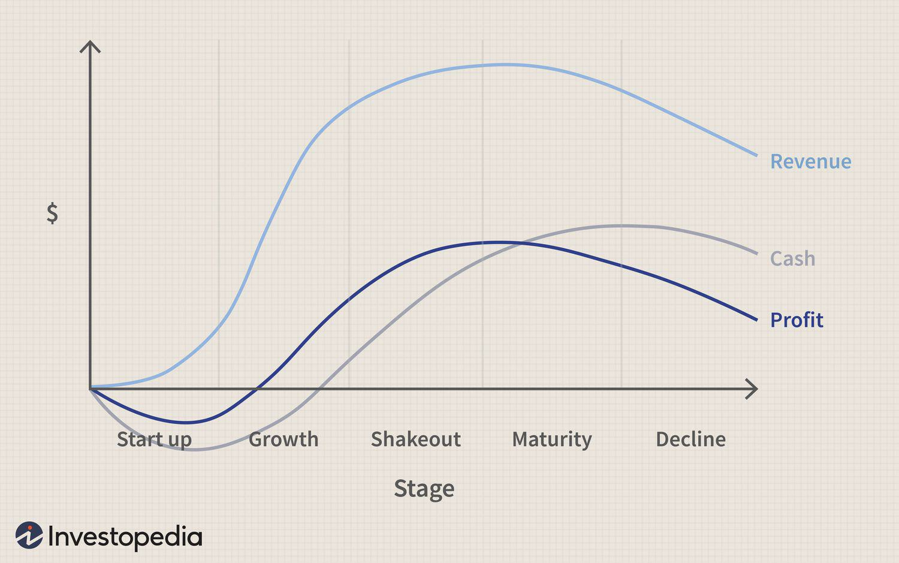

The economic analysis of industry life cycles offers essential insights into the various stages that a business undergoes from inception to decline. These stages are generally characterized by growth, maturation, saturation, and eventual decline, forming a cycle that reflects the dynamic nature of markets and economies. Understanding where a company falls within this cycle can be crucial for anticipating future challenges and recognizing potential opportunities. This knowledge enables businesses to strategically plan their operations, investments, and growth trajectories.

Algorithmic trading, a sophisticated and technology-driven practice, stands to gain considerable advantages from insights derived from industry life cycle analysis. By integrating these insights, algorithmic trading can refine its strategies to better align with the corresponding stages of industry cycles. This can lead to improved decision-making and optimized trading outcomes. Algorithmic trading utilizes computer programs and algorithms to execute trades based on historical data, market trends, and signals. Therefore, a comprehensive understanding of industry life cycles can greatly enhance its strategic effectiveness, allowing for more accurate predictions and adjustments.



This article examines the correlation between economic analysis, industry life cycles, business stages, and algorithmic trading. Our focus is to provide a thorough understanding of how industry life cycle analyses can be leveraged to develop and enhance algorithmic trading strategies. By marrying the concepts of economic cycles with the technical proficiency of algorithmic trading, traders and businesses can potentially achieve more robust and adaptive strategies in the financial markets.

## Table of Contents

## Understanding Industry Life Cycle Analysis

Industry life cycle analysis is a critical aspect of economic study that focuses on the various phases an industry experiences, ranging from its inception to eventual decline. The stages are typically categorized as expansion, peak, contraction, and trough, each offering a distinct set of characteristics and dynamics. Understanding these phases assists investors and businesses in aligning their strategies for optimal economic benefit.

The expansion stage is marked by heightened growth and the entry of new players into the market, driven by innovation, increased consumer demand, and capital investment. During this phase, companies often experience rapid sales growth, and profit margins tend to widen. Strategic focus is usually on scaling operations and increasing market share.

As the industry reaches the peak stage, growth rates stabilize, and market saturation begins to occur. The competitive environment intensifies as more firms vie for a limited pool of customers. Profit margins may come under pressure as businesses compete on price, driving efficiency and productivity improvements.

The contraction phase signifies a decline in demand and is often characterized by market adjustments. Companies may face shrinking revenue streams and are forced to streamline operations or pivot their business models. Strategic decisions during this period often involve cost-cutting, asset liquidation, or mergers to maintain viability.

Finally, during the trough stage, the industry stabilizes, with supply aligning more closely with the reduced levels of demand. Typically, weaker firms are weeded out, and the surviving enterprises adapt to the new market conditions. This stage may offer opportunities for consolidation or acquiring distressed assets at reduced valuations.

While industry life cycle stages are often aligned with broader economic cycles, they can possess unique variances due to factors such as technological advancements, regulatory changes, or shifts in consumer preferences. These influences can cause industries to behave differently than the overall economy, necessitating specific strategic considerations.

Knowledge of these stages is invaluable for investors, particularly in stock valuation. By identifying the current phase of an industry, investors can make more informed decisions about the potential risks and rewards associated with their investments. For businesses, understanding the life cycle stage they are operating in is pivotal for aligning their strategic direction, ensuring resources are optimized for growth, stability, or restructuring as required.

In conclusion, industry life cycle analysis stands as a fundamental tool for economic evaluation, offering vital insights that aid in strategic planning and decision-making. By comprehensively understanding the nuances of each stage, both investors and businesses can effectively navigate the complexities of market dynamics.

## The Four Stages of Industry Life Cycles

### The Four Stages of Industry Life Cycles

Industry life cycles are fundamental frameworks that articulate the progression of an industry through distinct phases: Expansion, Peak, Contraction, and Trough. Each stage presents both specific challenges and opportunities that businesses must navigate to optimize their strategic operations.

1. **Expansion**: This phase is marked by robust growth, characterized by an increase in market demand, technological advancements, and the entry of new competitors. Companies often experience higher revenues and profits during this period, driven by rising customer interest and expanding market segments. Businesses usually allocate substantial capital towards innovation, scale-up processes, and capturing market share. The expansion phase is typically quantified through key performance indicators such as increased sales volume, higher market penetration rates, and improved customer acquisition metrics.

2. **Peak**: During the peak stage, the industry experiences stabilization of growth. Market saturation often occurs, and the influx of new competitors slows down. Companies face heightened competition, necessitating strategic differentiation and efficiency improvements to maintain profit margins. To thrive in this stage, businesses may focus on customer retention, optimizing supply chains, and enhancing product offerings. Financial indicators such as plateauing revenue growth and stable market share become prevalent, highlighting the need for strategic agility and operational excellence.

3. **Contraction**: The contraction phase signifies a downturn in market demand, accompanied by economic and structural adjustments within the industry. Companies may encounter declining revenues, necessitating cost-cutting measures and strategic realignments. This stage often prompts consolidations, mergers, or exits by weaker competitors. Businesses might pivot towards niche markets, diversify product lines, or innovate to adapt to the changing landscape. Indicators such as shrinking market size and increased bankruptcies provide evidence of contraction, urging firms to manage resources prudently and explore new growth avenues.

4. **Trough**: During the trough phase, the market reaches a stabilization point where supply aligns with reduced demand levels. Companies face the challenge of maintaining operations with leaner resources while preparing for potential recovery. Strategic practices may include optimizing operations for cost efficiency, stabilizing existing markets, and investing in new technology or process innovations. Firms often utilize this phase to strengthen their core capabilities and reposition for upcoming cycles of growth. Metrics such as consistent cash flows, improved operational efficiency, and renewed business strategies signal that an industry is poised for reinvigoration.

Each stage of the industry life cycle not only affects company performance but also influences broader economic factors such as employment rates, technological progression, and market innovation. Understanding these stages enables businesses to align their strategies effectively, optimizing both immediate and long-term objectives.

## Algorithmic Trading: An Overview

Algorithmic trading employs computer programs and algorithms to automate the execution of trades, optimizing financial market interactions. This form of trading leverages vast quantities of historical data, trends, and market signals to formulate and execute trading decisions with minimal human intervention. By analyzing patterns and statistical information, algorithms can identify optimal entry and [exit](/wiki/exit-strategy) points within the trading cycle, which encompasses pre-trade analytics, execution, and post-trade analytics. 

Pre-trade analytics involve the assessment of market conditions, analyzing variables such as [liquidity](/wiki/liquidity-risk-premium), [volatility](/wiki/volatility-trading-strategies), and price movements to predict future market behavior. Execution refers to the actual automatic buying or selling of financial instruments per the decided strategy. Post-trade analytics evaluate the effectiveness of the trades, providing insights for refining future strategies. Each of these stages is crucial in ensuring that the algorithm functions efficiently and remains profitable.

Algo trading is celebrated for its notable efficiency and speed, significantly outperforming human traders in processing data and executing trades. It is capable of handling tremendously complex trading strategies that involve numerous factors and rapid decision-making. This computational prowess is particularly advantageous in high-frequency trading environments where microsecond decisions can result in substantial financial gains.

Nevertheless, [algorithmic trading](/wiki/algorithmic-trading) demands an in-depth understanding of market conditions and industry cycles. Traders must continuously adapt these algorithms to reflect changing market realities, incorporating new data streams and adjusting to the evolving regulatory landscape. Fluctuations in market dynamics necessitate regular updates to algorithms to maintain their effectiveness and ensure adherence to compliance and transparency standards. This dynamic nature of markets highlights the importance of robust and adaptable algorithmic solutions in the quest for consistent trading success.

## Integrating Industry Life Cycle Analysis with Algo Trading

Combining industry life cycle analysis with algorithmic trading presents an opportunity to refine and enhance trading strategies across different stages of an industry. This integration leverages the distinct characteristics of each life cycle stage to optimize trading outcomes.

During the expansion phase, industries experience growth and increased market participation. Algorithmic trading strategies can be adjusted to prioritize capitalizing on these growth opportunities. Algorithms might focus on identifying and capturing new market entries, expanding portfolios to include emerging players, and leveraging increasing asset volumes. A potential Python code snippet for an algorithm focusing on expansion might involve screening for stocks with rapidly increasing volumes and significant price [momentum](/wiki/momentum):

```python
import pandas as pd

def expansion_strategy(market_data):
    # Assume market_data is a DataFrame with columns 'Volume', 'Price', 'Moving_Avg'
    growth_stocks = market_data[(market_data['Volume'] > 1.2 * market_data['Volume'].mean()) & 
                                (market_data['Price'] > market_data['Moving_Avg'])]
    return growth_stocks
```

In the peak stage, industries face stabilized growth and intensified competition. Optimizing algorithmic strategies during this phase involves maintaining profit margins while managing the increased competition. Traders might focus on efficiency, such as optimizing execution speeds and minimizing transaction costs, or enhancing algorithmic models for better predictive accuracy.

The contraction phase involves a decline in demand, prompting market adjustments. In this stage, algorithmic trading might shift towards strategic retraction or diversification. Algorithms could be programmed to reduce exposure to declining sectors while identifying alternative markets or safe havens for capital allocation. For instance, implementing a portfolio rebalancing algorithm might be effective:

```python
def contraction_strategy(portfolio, market_data):
    # Identify underperforming sectors
    underperforming = market_data[market_data['Growth_Rate'] < 0]
    # Suggest reduction in exposure
    rebalance = portfolio.drop(underperforming.index)
    # Diversify into top-performing sectors
    top_performers = market_data[market_data['Growth_Rate'] > 0.05]
    rebalance = rebalance.append(top_performers.head(5))
    return rebalance
```

In the trough phase, the market stabilizes at reduced demand levels. During this period, algorithmic trading strategies need to be more cautious, often focusing on value investments or defensive sectors that exhibit stable performance despite the economic downturn. Algorithms may need to adjust to detect undervalued assets or employ risk-averse trading signals.

Finally, integrating market signals with life cycle stages can enhance both predictive and reactive trading capabilities. By aligning algorithmic models with industry-specific shifts, traders can better anticipate market movements and adjust strategies proactively, resulting in more resilient trading frameworks and potentially higher returns.

## Case Study: Algorithmic Trading in Different Business Stages

In this section, we explore how an algorithmic trading firm navigated the various stages of the industry life cycle within the tech sector. The firm, which specializes in high-frequency trading, adapted its strategies by leveraging economic and market insights during different life cycle phases: expansion, peak, contraction, and trough.

During the expansion phase, the industry experienced significant growth characterized by increasing demand for tech products and services, leading to higher volatility. The firm's strategy focused on capturing growth opportunities by implementing algorithms that could detect emerging trends and execute trades rapidly. This involved using [machine learning](/wiki/machine-learning) models trained on extensive historical and real-time data to identify patterns and predict short-term price movements.

```python
import numpy as np
from sklearn.ensemble import RandomForestClassifier

# Simulation parameters
n_samples = 10000
n_features = 20

# Generating synthetic data for algorithm training
X = np.random.rand(n_samples, n_features)
y = np.random.choice([0, 1], size=n_samples)

# Initialize and train the algorithm
model = RandomForestClassifier(n_estimators=100)
model.fit(X, y)

# Predict possible short-term growth opportunities
predictions = model.predict(X)
```

As the tech industry reached its peak, competition intensified, and growth began to stabilize. The firm modified its algorithms to focus on maintaining profit margins and adapting to competitive dynamics. Strategies such as [arbitrage](/wiki/arbitrage) and [market making](/wiki/market-making) became prominent, relying on highly efficient algorithms to exploit small price discrepancies and liquidity opportunities.

In the contraction phase, diminishing demand and market adjustments led to a decrease in trading volumes and liquidity. The firm’s strategy shifted towards risk management and diversification. Algorithms were adjusted to minimize exposure to volatile assets and to explore opportunities in other, more stable industries. The use of data analytics and AI played a critical role in reallocating resources and redefining the trading portfolio.

Finally, in the trough stage, the market stabilized as supply met the new reduced demand levels. The firm focused on preparing for potential future growth by continuing to innovate its algorithmic strategies and maintaining flexibility. Artificial intelligence was significantly used to fine-tune trading algorithms, ensuring that they could adapt to rapid changes in market conditions and economic realities.

Throughout these stages, data analytics and AI were instrumental in transforming the firm’s algorithmic trading strategies. By continuously updating models with the latest market data and ensuring algorithms could react quickly to new information, the firm remained competitive and capable of capitalizing on emerging opportunities across the industry's life cycle.

## Challenges and Considerations

Integrating industry life cycle analysis with algorithmic trading presents several challenges and considerations that must be adequately addressed to ensure successful outcomes. One of the primary challenges is ensuring data accuracy and handling market volatility. Algorithmic trading heavily relies on data-driven insights, and any inaccuracies in data can lead to faulty trading decisions. Market volatility further complicates this as sudden and unpredictable price movements can render data-derived models less effective.

A critical consideration is the risks associated with an over-reliance on historical data, which might result in misaligned strategies. Financial markets are dynamic, and historical data may not always accurately predict future trends, especially in rapidly changing environments. Algorithms must be designed to not only process historical trends but also adapt to new market conditions and unforeseen events.

Regulatory considerations also play a significant role. Algorithmic trading firms must comply with stringent regulations that demand transparency and adherence to compliance standards. Ensuring that algorithms operate within legal frameworks is crucial to avoid penalties and maintain trust with stakeholders.

Moreover, the robustness of trading algorithms is essential to adapt to unexpected economic shifts and market anomalies. Given the complexity of financial markets, algorithms must be resilient and capable of adjusting to various scenarios that do not conform to past patterns. This includes implementing machine learning techniques to enable algorithms to learn from new data and adjust strategies accordingly.

Python, a widely used language in algorithmic trading, offers libraries and tools that can help in addressing some of these challenges. For example, using Python's `pandas` and `numpy` can aid in data cleaning and analysis, while machine learning libraries like `scikit-learn` or `[tensorflow](/wiki/tensorflow)` can enhance a model's ability to predict and adapt to new market conditions. By continuously monitoring and updating algorithms, traders can ensure that their strategies remain effective despite the changing landscape of the industry and economic cycles.

## Conclusion

Economic analysis of industry life cycles is a powerful tool for businesses and traders, offering a framework to understand the progression of industries from growth to maturity and eventual decline. By analyzing these life cycles, stakeholders can gain critical insights into current market conditions and future developments, which can significantly enhance strategic planning and operational effectiveness.

When combined with algorithmic trading, the understanding of industry life cycles allows for more nuanced and effective trading strategies. Algorithmic trading, which relies on computer programs to execute trades based on pre-defined criteria, can benefit from life cycle insights by adjusting trade parameters to match the identified stage of an industry's life cycle. For instance, during the expansion phase, algorithms may be programmed to capitalize on growth potential, while in the contraction phase, they might be adjusted to minimize losses or exploit short-selling opportunities.

The ability to understand where an industry stands within its life cycle is crucial for informed decision-making and risk management. Investors and traders can assess potential risks and returns more accurately, aligning their strategies with the dynamic nature of the market. This adaptability is vital in preparing for economic shifts and mitigating unexpected market fluctuations.

As financial markets and industries continue to evolve, so too must the techniques used to analyze and engage with them. Both industry life cycle analysis and algorithmic trading strategies need regular refinement to maintain their effectiveness amid changing economic conditions. By staying informed and adaptive, businesses and traders can not only mitigate risks but also seize opportunities presented by evolving markets. Such adaptability ensures that they remain competitive and resilient in a rapidly changing financial landscape.

## References & Further Reading

[1]: Anderson, C. (2012). ["The Long Tail: Why the Future of Business is Selling Less of More."](https://archive.org/details/longtailwhyfutur00ande) Hyperion.

[2]: Lopez de Prado, M. (2018). ["Advances in Financial Machine Learning."](https://www.amazon.com/Advances-Financial-Machine-Learning-Marcos/dp/1119482089) Wiley.

[3]: Chan, E. P. (2009). ["Quantitative Trading: How to Build Your Own Algorithmic Trading Business."](https://github.com/ftvision/quant_trading_echan_book) Wiley.

[4]: Aronson, D. R. (2007). ["Evidence-Based Technical Analysis: Applying the Scientific Method and Statistical Inference to Trading Signals."](https://onlinelibrary.wiley.com/doi/book/10.1002/9781118268315) Wiley.

[5]: Jansen, S. (2020). ["Machine Learning for Algorithmic Trading."](https://github.com/stefan-jansen/machine-learning-for-trading) Packt Publishing.