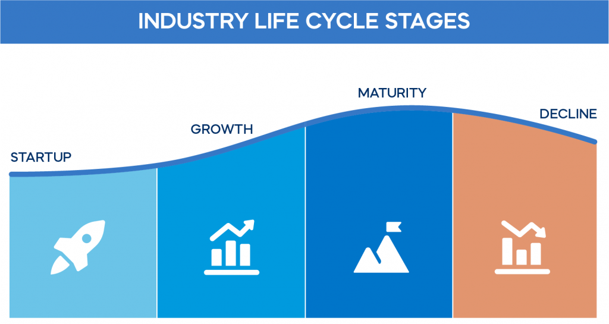

Business development plays a critical role in the growth and sustainability of industries. It involves strategic initiatives aimed at expanding existing markets, exploring new opportunities, and enhancing overall organizational performance. The significance of business development lies in its ability to drive innovation, build strategic partnerships, and facilitate long-term value creation. Successful business development strategies help organizations navigate competitive landscapes and secure a leading position within their respective industries.

The concept of the industry life cycle provides valuable insights into the evolution of industries over time. This model describes the progression of an industry through distinct stages: introduction, growth, maturity, and decline. Each stage presents unique opportunities and challenges for businesses. Understanding the industry life cycle allows companies to anticipate market trends, optimize resource allocation, and develop strategies that align with their current stage. As industries mature, the focus shifts from rapid expansion to sustaining competitive advantage, requiring strategic adaptations to remain relevant.



Economic phases further complicate the dynamics of industry evolution. The economic cycle consists of four phases: expansion, peak, recession, and recovery. Each phase influences industries differently, impacting consumer behavior, investment patterns, and market stability. During periods of economic expansion, consumer spending and business investments typically increase, driving growth across various sectors. Conversely, recessions challenge businesses to adopt resilience strategies and innovate to sustain operations. Understanding these economic phases enables organizations to adjust their strategies and leverage opportunities that arise during each phase.

In recent years, algorithmic trading has gained prominence in financial markets, revolutionizing traditional trading practices. This technology-driven approach employs computer algorithms to execute trades at high speeds and volumes, leveraging data-driven insights to optimize investment decisions. The growing influence of algorithmic trading highlights the role of technology and data in enhancing trading strategies. Its integration into financial markets has significant implications for economic phases and industry cycles. Algorithmic trading not only influences market liquidity and volatility but also offers potential advantages in navigating complex market conditions.

The purpose of this article is to explore the interconnection among business development, industry life cycles, economic phases, and algorithmic trading. By understanding these concepts and their interplay, businesses can position themselves strategically within their industries, adapt to economic changes, and harness the power of technology to achieve sustainable growth.

## Table of Contents

## Understanding Business Development Stages

Business development is a multifaceted concept that plays a crucial role in enabling companies to identify and capitalize on growth opportunities. It involves a myriad of activities including strategic analysis, marketing, sales, and relationship management aimed at fostering growth and profitability. The significance of business development lies in its ability to help businesses adapt to market changes, enter new markets, and improve competitive positioning. It ensures that companies remain dynamic and can sustainably increase their value over time.

The main stages of business development—startup, growth, maturity, and renewal/decline—each present unique challenges and require distinct strategies.

1. **Startup Stage**: At this initial phase, businesses establish their foundational elements, such as product development, market research, and the creation of a viable business model. The primary challenge here is resource scarcity, as startups often operate with limited capital and workforce. Strategies focus on innovation and establishing a strong market presence. For example, tech companies like Uber started by identifying a gap in the market for convenient, on-demand transportation services and rapidly scaling their operations to meet this demand.

2. **Growth Stage**: During this stage, businesses experience an increase in sales and begin to expand their operations. The key challenge is managing this expansion without overwhelming the company's resources and maintaining quality. Strategies often include scaling production, entering new markets, and investing in marketing to increase brand recognition. Amazon is a classic example of a company in the growth stage that expanded from selling books online to offering a wide range of products and services globally.

3. **Maturity Stage**: In this phase, companies typically have a stable, established presence in their industry. Competition is fierce, and the primary challenge is to sustain market share and profitability. Strategies focus on efficiency improvements, customer retention, and differentiation from competitors. Coca-Cola, with its well-known brand and global distribution network, exemplifies a business in the maturity stage that consistently innovates its product offerings and marketing approaches to maintain its market position.

4. **Renewal/Decline Stage**: Companies in this stage face the critical decision of whether to reinvent themselves or enter a period of decline. The challenges include outdated business models, changing consumer preferences, and technological disruptions. Renewal strategies might involve product innovation, strategic pivots, or diversification into new sectors. Nokia's transition from a mobile phone manufacturer to focusing on telecommunications infrastructure is a notable example of a renewal strategy.

Understanding these stages helps businesses formulate strategies that align with their current development phase and set the groundwork for future success. Each stage requires a tailored approach—innovative tactics during the startup phase, expansive growth strategies, efficiency in maturity, and strategic reinvention or diversification in the renewal/decline stage.

## Exploring the Industry Life Cycle

The industry life cycle model serves as a valuable framework for understanding the progression of industries over time. This model is analogous to the biological life cycle of an organism, encompassing stages of introduction, growth, maturity, and decline. Each stage is defined by distinct characteristics and challenges, influencing strategic decision-making for businesses operating within that industry.

**Stages of the Industry Life Cycle**

1. **Introduction**: This initial stage is marked by the development and introduction of new products or services. The market is often small, and the demand is uncertain. Businesses focus on building awareness and educating consumers. Innovation is crucial, as early adopters are targeted. High costs and low or negative profits are characteristic, and substantial investment in research and development (R&D) is common.

2. **Growth**: During the growth stage, the industry experiences rapid market acceptance and increasing sales. Companies benefit from economies of scale, reducing costs per unit. Competition begins to build, but the expanding market creates opportunities for multiple players. Profitability improves, and focus shifts towards differentiating products and expanding market reach. Effective marketing and distribution strategies become vital.

3. **Maturity**: In the maturity stage, industry growth stabilizes as the market becomes saturated. Competition peaks, exerting pressure on prices and profit margins. Companies focus on efficiency and customer retention. Innovation becomes incremental, often aimed at improving processes or enhancing existing products. Strategic alliances and mergers may occur, as businesses seek to maintain market share in the absence of significant growth opportunities.

4. **Decline**: The decline stage is characterized by a reduction in sales and market contraction. The industry faces challenges from new technologies or changing consumer preferences. Profits decline, leading to industry consolidation. Businesses must decide whether to exit, divest, or reinvest in innovations to rejuvenate interest. Cost management and product differentiation become key survival strategies.

**The Role of Innovation and Market Trends**

Innovation plays a critical role in moving an industry through its life cycle stages. Technological advancements or shifts in consumer behavior can swiftly transition an industry from maturity to decline or reinvigorate it back to growth. For instance, the transition from feature phones to smartphones transformed the telecommunications industry, propelling it back into a growth phase.

Businesses must also monitor market trends closely. Shifts in consumer preferences, regulatory changes, and global economic factors can all influence an industry’s trajectory. Companies that anticipate and adapt to these trends can capitalize on new opportunities, prolonging their position in favorable life cycle stages.

**Adapting Strategies Based on Life Cycle Stage**

Different stages necessitate tailored strategic approaches:

- **Introduction**: Emphasize R&D, refine product offerings, and focus on market creation.
- **Growth**: Scale operations, diversify distribution, and ensure brand differentiation.
- **Maturity**: Optimize operational efficiencies, enhance customer loyalty, and explore market expansion or product innovation.
- **Decline**: Assess cost structures, seek niche markets, or innovate to rejuvenate interest and explore exiting options if unviable.

Understanding and leveraging the industry life cycle model enables businesses to craft strategies that are well-aligned with their environment, fostering resilience and competitiveness in a dynamic market landscape.

## Economic Phases and Their Effect on Industries

Economic phases, commonly recognized as expansion, peak, recession, and recovery, play a pivotal role in shaping the dynamics of industries. Each phase embodies distinct economic conditions, influencing the business landscape with unique challenges and opportunities. Understanding these phases is crucial for businesses aiming to thrive through economic fluctuations.

### Overview of Economic Phases

1. **Expansion**: Characterized by increasing economic activity, expansion features rising employment, consumer confidence, and production. During this phase, businesses typically experience growth in sales and profits, motivating investments in capacity, innovation, and workforce. Industries such as construction, manufacturing, and retail often flourish during expansions as consumer spending and infrastructure projects rise.

2. **Peak**: The peak marks the zenith of economic activity in the cycle. Indicators like GDP and employment rates are at their highest, leading to potential inflationary pressures as demand outpaces supply. For businesses, this phase involves maximizing profitability, although strategic caution is necessary to avoid overextension and prepare for an inevitable downturn.

3. **Recession**: A recession denotes a decline in economic activity across the economy, identified by reduced consumer spending, increased unemployment, and lower production levels. Industries such as luxury goods, automotive, and housing tend to suffer considerably, as consumers cut back on discretionary spending. Recessions challenge businesses to streamline operations, reduce costs, and enhance efficiency to survive the downturn.

4. **Recovery**: The recovery phase signals a turnaround, where economic activity begins to increase following a recession. Employment prospects improve, consumer confidence rebounds, and businesses regain momentum. During recovery, industries catering to discretionary spending and investment, like technology and capital goods, typically see renewed growth opportunities.

### Impact of Economic Phases on Industries

The impact of economic cycles varies across different industries, heavily influenced by the nature of the goods or services they provide. For instance, industries producing essential goods, like utilities and food, demonstrate resilience across all phases, whereas cyclical industries, such as automotive and travel, are more sensitive to economic fluctuations.

During expansion, most sectors experience robust growth, with capital-intensive and luxury industries benefiting significantly. Conversely, during recessions, businesses in cyclical industries face the harshest conditions, often requiring layoffs, scaling back production, or even shutting down unprofitable segments.

### Adaptation and Survival Strategies

Businesses devise various strategies to navigate economic fluctuations effectively:

- **Diversification**: Expanding product lines or entering new markets helps businesses reduce dependency on a single revenue stream, thus mitigating risk during downturns.

- **Cost Management**: Implementing cost controls without compromising quality or customer service is crucial in maintaining financial health during recessions.

- **Innovation and Flexibility**: Investing in research and development can provide a competitive edge, enabling businesses to adapt quickly to changing conditions and consumer preferences.

- **Building Reserves**: Maintaining capital reserves helps businesses to manage cash flow during downturns, providing a buffer against unexpected financial pressures.

### Historical Economic Cycles and Industry Trends

Historical analysis of economic cycles reveals patterns that help industries predict and prepare for future changes. The Great Depression of the 1930s prompted significant regulatory changes and financial reforms, influencing how industries manage risk. More recently, the 2008 global financial crisis underscored the importance of financial prudence and adaptability in an interconnected global economy.

By understanding past economic cycles, industries can refine their strategic planning and risk management, leveraging periods of growth to prepare for possible contractions. These insights empower businesses to align their strategic initiatives with anticipated economic conditions, enhancing resilience and sustainable growth.

## The Rise of Algorithmic Trading

Algorithmic trading, often referred to as algo trading, utilizes computer programs to automatically execute trading orders with speed and precision often unattainable by human traders. By employing algorithms, traders can analyze vast datasets, recognize patterns, and enact orders in fractions of a second, providing significant advantages over traditional trading methods.

At its core, [algorithmic trading](/wiki/algorithmic-trading) leverages predefined criteria to determine trade decisions. These criteria can include price, timing, or complex mathematical models. The benefits of algorithmic trading are numerous: it minimizes the risks of human error, enables high-frequency trading, ensures consistent strategy deployment, and allows for the [backtesting](/wiki/backtesting) of trading strategies on historical data.

A significant distinction between algorithmic and traditional trading lies in execution speed and automation. Traditional trading typically involves manual order placement, which can be time-consuming and susceptible to emotional biases. In contrast, algorithmic trading automates order placement, promptly executing trades based on programmed instructions. This shift towards automation facilitates high-frequency trading, characterized by numerous trades executed in milliseconds to capitalize on minute price variations.

Technology and data play pivotal roles in refining trading strategies within algorithmic trading. Modern computational advancements have enabled the processing of vast data volumes, including market prices, economic indicators, and even sentiment analysis from news and social media. Python, a popular programming language for data analysis, offers libraries such as Pandas and NumPy for statistical computation along with specialized libraries like TA-Lib for technical analysis. Here's a simple Python example to illustrate a moving average crossover strategy:

```python
import pandas as pd

# Assuming 'data' is a DataFrame with a DateTime index and a 'Close' column
data['Short_MA'] = data['Close'].rolling(window=40, min_periods=1).mean()
data['Long_MA'] = data['Close'].rolling(window=100, min_periods=1).mean()

# Identifying crossover points
data['Signal'] = 0
data['Signal'][40:] = np.where(data['Short_MA'][40:] > data['Long_MA'][40:], 1, 0)
data['Position'] = data['Signal'].diff()

# Plotting the moving averages and trading signals
import matplotlib.pyplot as plt

plt.figure(figsize=(12,8))
plt.plot(data['Close'], label='Close Price')
plt.plot(data['Short_MA'], label='40-Day MA', color='lightblue')
plt.plot(data['Long_MA'], label='100-Day MA', color='orange')
plt.plot(data.index[data['Position'] == 1], data['Short_MA'][data['Position'] == 1], '^', markersize=10, color='g', label='Buy Signal')
plt.plot(data.index[data['Position'] == -1], data['Short_MA'][data['Position'] == -1], 'v', markersize=10, color='r', label='Sell Signal')
plt.title('Moving Average Crossover Strategy')
plt.legend()
plt.show()
```

Algorithmic trading's influence permeates economic phases and industry cycles. In buoyant economic conditions, increased market activity corresponds with heightened trading opportunities, which algo trading systems can exploit by executing rapid buy and sell orders based on subtle price shifts. During economic downturns, algorithmic trading can be programmed to short-sell or hedge against undesirable market movements swiftly, thereby mitigating potential losses.

Furthermore, the prevalence of algorithmic trading has perceptibly altered market dynamics. As a significant proportion of trades executed in major exchanges are now algorithmically driven, short-term price fluctuations have become more pronounced, impacting [liquidity](/wiki/liquidity-risk-premium) and price discovery. The influx of data-driven strategies introduces [volatility](/wiki/volatility-trading-strategies) elements that traditional trade actors must acknowledge, potentially influencing broader economic cycles.

Overall, the rise of algorithmic trading epitomizes the confluence of finance and technology, providing enhanced market efficiencies and forming an integral component of modern financial systems.

## Interconnection Among Business Development, Industry Life Cycle, Economic Phases, and Algo Trading

Business development, industry life cycle stages, economic phases, and algorithmic trading are interconnected in complex ways that influence each other and drive market dynamics. Understanding these interconnections provides valuable insights into how businesses can strategically position themselves for growth and adaptability.

Business development stages—startup, growth, maturity, and renewal/decline—align closely with the phases of the industry life cycle, which include introduction, growth, maturity, and decline. During the startup phase, businesses are typically in the introduction stage of the industry life cycle, where they experience rapid innovation and market entry challenges. This phase requires significant resources to establish brand presence and achieve market penetration.

Economic phases such as expansion, peak, recession, and recovery exert a substantial influence on both business development and industry positioning. During economic expansions, businesses can leverage increased consumer spending and investment to accelerate growth, while in recessionary periods, they may face reduced demand and tighter financial conditions. Companies that strategically align their development stages with economic phases often gain competitive advantages. For instance, during recessions, some businesses might focus on core activities while discontinuing less profitable ventures, positioning themselves for a stronger recovery.

Algorithmic trading introduces a technological layer that impacts how businesses navigate changes in both the business development and industry life cycle stages. By leveraging data analytics and automation, algorithmic trading enhances decision-making and allows businesses to quickly adapt to market fluctuations. This adaptability is crucial during different economic phases, as the speed and efficiency of algorithmic trading can mitigate risks and capitalize on opportunities more effectively than traditional methods. 

For example, during a recession, businesses using algorithmic trading can quickly adjust their strategies by analyzing market data to avoid potential losses. These technologies also enable businesses to hedge against economic downturns and optimize resource allocation. Algorithmic trading's role in navigating business and industry changes is pivotal for ensuring resilience and adaptability.

Several businesses have successfully integrated these interconnected concepts to achieve sustained success. A notable example is Netflix, which strategically aligned its business development and industry positioning by transitioning from DVD rentals to digital streaming during a period of technological advancement and changing consumer preferences. By recognizing the shift in the industry life cycle and adapting its business model, Netflix positioned itself for growth and gained a competitive edge. The company's use of data analytics and algorithmic recommendations played a critical role in enhancing customer experiences and optimizing content delivery.

Another example is Amazon, which successfully adapted to changing economic phases and industry life cycle stages. By investing heavily in technology and algorithmic logistics, Amazon managed to streamline operations and expand its market reach. This adaptability has shielded the company from economic downturns and allowed it to capitalize on growth opportunities effectively.

In summary, the interconnection among business development, industry life cycle stages, economic phases, and algorithmic trading is evident in how businesses strategize and execute their growth plans. By understanding these dynamics and integrating technological advancements, businesses can position themselves to navigate industry changes and economic fluctuations more effectively, leveraging data-driven insights for sustainable growth.

## Conclusion

In concluding this exploration of business development, industry life cycles, economic phases, and algorithmic trading, it is essential to underscore the significant interplay among these components. Understanding the development stages—from startup to renewal or decline—provides businesses with a framework for navigating industry-specific challenges. Each stage necessitates tailored strategies that align with the broader industry life cycle, which progresses from introduction to eventual decline. By recognizing where an industry stands within this cycle, businesses can adjust their strategies to leverage growth opportunities or mitigate decline risks.

Economic phases—expansion, peak, recession, and recovery—influence industries and businesses differently. Their cyclical nature directly impacts strategic planning and decision-making processes. Adapting to these macroeconomic conditions requires agility and foresight, allowing businesses to maintain resilience and capitalize on favorable periods.

The rise of algorithmic trading introduces a novel, strategic advantage, particularly in its capacity to enhance decision-making processes through data-driven insights and automation. Unlike traditional trading methods, algorithmic trading leverages advanced algorithms to execute trades at speeds and frequencies that human traders cannot achieve, offering a competitive edge in the financial markets. The increasing integration of technology in trading allows businesses not only to navigate economic fluctuations more effectively but also to position themselves advantageously within evolving industry cycles.

Looking ahead, the intersection of these concepts presents vast opportunities. Businesses equipped with a comprehensive understanding of development stages, informed by industry and economic context, can actively leverage algorithmic trading to remain competitive. The future of business development and trading is invariably linked to technological advancements and the continuous evolution of market conditions. Therefore, investing in technology and embracing innovative strategies are critical for achieving sustained growth and operational success. By staying attuned to these dynamics, businesses can anticipate trends and position themselves for long-term success in the ever-changing economic landscape.

## References & Further Reading

[1]: Andrews, T. & Peterson, R. (1998). ["Stages of Industry Life Cycle and Strategic Management."](https://www.researchgate.net/publication/247569842_Theory_and_Research_in_Strategic_Management_Swings_of_a_Pendulum) Wiley Encyclopedia of Management.

[2]: Gort, M. & Klepper, S. (1982). ["Time Paths in the Diffusion of Product Innovations."](https://www.jstor.org/stable/2232554) Management Science, 28(5), 620-636.

[3]: Wilson, R. (1975). ["Introduction to the Economics of Industries."](https://www.gsb.stanford.edu/faculty-research/faculty/robert-wilson) The Economic Journal, 85(338), 264-266.

[4]: Chordia, T., Roll, R., & Subrahmanyam, A. (2005). ["Evidence on the Speed of Convergence to Market Efficiency."](https://www.sciencedirect.com/science/article/abs/pii/S0304405X05000152) Journal of Financial Economics, 76(2), 271-292.

[5]: O'Hara, M. (2015). ["High Frequency Market Microstructure."](https://www.sciencedirect.com/science/article/pii/S0304405X15000045) Journal of Financial Economics, 116(2), 257-270.