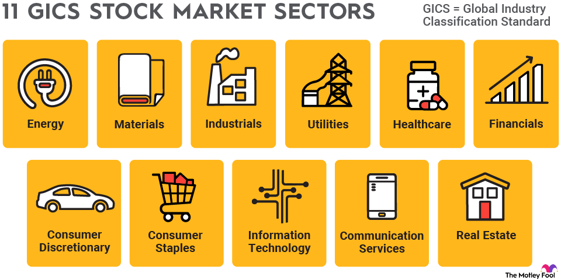

## Table of Contents

## What are industry sectors?

Industry sectors are groups of companies that do similar kinds of work. They help us understand the economy better by organizing businesses into categories. Some common industry sectors include technology, healthcare, finance, and manufacturing. Each sector has its own special features and ways of making money.

Sectors are important because they help people make decisions about where to invest money or what kind of job to look for. For example, if someone is interested in working with computers, they might look for jobs in the technology sector. Investors might choose to put their money into a sector that they think will grow and make them more money in the future.

Different sectors can grow or shrink depending on what is happening in the world. For instance, during a health crisis, the healthcare sector might grow a lot because more people need medical help. On the other hand, if people are not buying as many cars, the automotive sector might shrink. Understanding these changes can help businesses and workers plan for the future.

## How are industry sectors classified?

Industry sectors are classified using different systems, but one of the most common is the Global Industry Classification Standard (GICS). This system groups companies into sectors based on what they do and how they make money. For example, companies that make cars are put into the automotive sector, and companies that provide medical services go into the healthcare sector. GICS divides the economy into 11 main sectors, and each sector is further broken down into industry groups, industries, and sub-industries.

Another way to classify industry sectors is through the North American Industry Classification System (NAICS). This system is used mainly in the United States, Canada, and Mexico. NAICS groups businesses based on the type of economic activity they are involved in. It starts with broad sectors like agriculture, mining, and manufacturing, and then breaks them down into more specific categories. Both GICS and NAICS help people understand the economy and make decisions about investments and careers.

These classification systems are important because they help organize the vast number of businesses into understandable categories. They make it easier for people to see trends, understand market conditions, and plan for the future. Whether it's choosing where to invest money or deciding on a career path, knowing about industry sectors can be very helpful.

## What are the primary industry sectors?

The primary industry sectors are the main groups that businesses are divided into based on what they do. Some of the most common primary sectors are agriculture, mining, manufacturing, energy, construction, technology, healthcare, finance, transportation, consumer goods, and services. Each of these sectors includes many different kinds of businesses that work in similar ways or make similar products.

These sectors help us understand the economy better. For example, the agriculture sector includes farming and fishing, while the manufacturing sector includes making things like cars and electronics. The technology sector is all about computers and software, and the healthcare sector includes hospitals and medical services. By grouping businesses into these sectors, it's easier to see how different parts of the economy are doing and make decisions about where to invest money or what kind of job to look for.

## Can you explain the difference between primary, secondary, and tertiary sectors?

The primary sector is all about getting raw materials from nature. This includes things like farming, fishing, mining, and forestry. These activities are the first step in making things that people need. For example, farmers grow wheat, miners dig for coal, and fishermen catch fish. The primary sector is important because it provides the basic materials that other sectors use to make products.

The secondary sector takes the raw materials from the primary sector and turns them into finished products. This includes manufacturing and construction. For example, factories might use wheat from farmers to make bread, or they might use coal from miners to make electricity. Construction workers use wood from forests to build houses. The secondary sector is all about turning raw materials into things that people can use every day.

The tertiary sector is all about services. This includes things like retail, transportation, education, healthcare, and entertainment. For example, shops sell the bread made by factories, buses and trains move people around, and doctors and nurses take care of people's health. The tertiary sector is important because it helps people use the products made by the secondary sector and enjoy a better quality of life.

## What role do industry sectors play in the economy?

Industry sectors are important parts of the economy. They help us understand how different kinds of businesses work together to make things and provide services. Each sector, like farming, manufacturing, or healthcare, does its own special job. For example, the farming sector grows food that the manufacturing sector turns into things like bread and pasta. The healthcare sector then helps keep people healthy so they can work in all these sectors. By looking at how well each sector is doing, we can see how the whole economy is doing.

Sectors also help people make choices about where to invest money or what kind of job to look for. If someone wants to work with computers, they might look for jobs in the technology sector. Investors might choose to put their money into a sector that they think will grow and make them more money in the future. Different sectors can grow or shrink depending on what is happening in the world. For instance, during a health crisis, the healthcare sector might grow a lot because more people need medical help. Understanding these changes can help businesses and workers plan for the future.

## How do industry sectors impact employment?

Industry sectors play a big role in how many jobs are available and what kinds of jobs people can find. Each sector, like farming, manufacturing, or technology, has its own kinds of jobs. For example, the farming sector needs farmers, the manufacturing sector needs factory workers, and the technology sector needs computer programmers. When a sector grows, it usually means more jobs in that area. If the technology sector is doing well, more companies might hire programmers and engineers. But if a sector is shrinking, like if fewer people are buying cars, the automotive sector might have fewer jobs.

Changes in industry sectors can also affect where jobs are located. For example, if a new factory opens in a town, it can create a lot of jobs in that area. This can help the local economy grow. On the other hand, if a big company in a sector closes down, it can mean fewer jobs and can hurt the local economy. People might need to move to find work in a different sector or a different place. Understanding how sectors impact employment can help workers and job seekers make better choices about their careers.

## What are some emerging industry sectors?

Some new industry sectors that are growing are renewable energy and green technology. These sectors focus on making energy from sources like the sun, wind, and water. They also work on making things that are better for the environment, like electric cars and recycling systems. As more people care about the planet, these sectors are getting bigger and creating more jobs. Governments and companies are investing a lot of money in these areas because they want to help the environment and save money on energy in the long run.

Another emerging sector is [artificial intelligence](/wiki/ai-artificial-intelligence) (AI) and [machine learning](/wiki/machine-learning). This sector is all about making computers smarter so they can do things like understand what people say, drive cars, and even help doctors find diseases. As technology gets better, more businesses are using AI to make their work easier and faster. This means more jobs for people who know how to work with AI and machine learning. It's an exciting time because AI can change many parts of our lives, from how we shop to how we get medical care.

A third growing sector is telehealth and remote work technology. With the rise of the internet and better technology, more people can work from home or get medical help without leaving their house. This sector includes things like video calls, online work tools, and apps that help doctors talk to patients from far away. As more people use these services, the sector is growing and creating new jobs. It's changing how we work and get healthcare, making it easier and more convenient for many people.

## How do technological advancements influence industry sectors?

Technological advancements change industry sectors a lot. When new technology comes out, it can make old ways of doing things better or even replace them. For example, in the farming sector, new machines and tools help farmers grow more food faster and with less work. In the manufacturing sector, robots and computers can make things like cars and electronics more quickly and with fewer mistakes. This means companies can make more products and save money, but it can also mean fewer jobs for people who used to do those tasks by hand.

Technology also creates new industry sectors. For instance, the internet and smartphones have made the technology sector grow a lot. Now, there are jobs in making apps, running websites, and keeping data safe. Another example is the renewable energy sector, which is growing because of new technology that helps us use the sun, wind, and water to make power. These new sectors bring new jobs and new ways of doing things, which can help the economy grow. But they also mean that people need to learn new skills to work in these areas.

## What are the challenges faced by different industry sectors?

Different industry sectors face many challenges. One big challenge is keeping up with new technology. As technology changes fast, companies need to spend a lot of money to stay up to date. If they don't, they might lose customers to other companies that use the latest technology. Another challenge is competition. In many sectors, there are a lot of companies trying to do the same thing. This means they have to work hard to make their products or services better and cheaper than others. Sometimes, this competition can make it hard for smaller companies to stay in business.

Another challenge is dealing with changes in the economy. When the economy is not doing well, people might not buy as many things, which can hurt sectors like manufacturing and retail. On the other hand, when the economy is doing well, some sectors might grow too fast and have trouble finding enough workers or materials. Regulations can also be a challenge. Governments make rules to keep people safe and protect the environment, but these rules can make it harder and more expensive for companies to do business. Each sector has to find ways to deal with these challenges to keep growing and making money.

## How do global trends affect industry sectors?

Global trends can change how well industry sectors do. For example, if more people around the world start caring about the environment, the renewable energy sector might grow a lot. Countries might make new rules to help the environment, and companies might start using more green technology. This can create new jobs and make some old ways of making energy, like using coal or oil, less popular. On the other hand, if there's a big health crisis, the healthcare sector might get busier because more people need help. This can make the sector grow, but it can also make it hard to find enough doctors and nurses.

Another way global trends affect industry sectors is through trade. If countries start trading more with each other, sectors like manufacturing and agriculture can grow because they can sell their products to more people. But if countries put up trade barriers, like taxes on imports, it can make it harder for these sectors to sell their products in other countries. This can slow down their growth. Also, trends like more people using the internet can make the technology sector grow because more companies need to make apps and websites. But it can also make some old jobs, like working in stores, less needed because people can buy things online.

## What strategies can businesses use to adapt to changes in their industry sector?

Businesses can adapt to changes in their industry sector by keeping up with new technology. They should always be looking for new ways to do things better and faster. For example, if a new machine can help them make their products quicker, they should think about buying it. This can help them save money and stay ahead of other companies. Another way to adapt is by learning about what customers want. If people start liking different kinds of products, businesses should try to make those products. This can help them keep their customers happy and attract new ones.

Another strategy is to be ready for changes in the economy. If the economy is not doing well, businesses might need to find ways to save money, like using fewer workers or finding cheaper materials. But if the economy is doing well, they should think about growing their business, maybe by opening new stores or making more products. Businesses also need to follow new rules made by governments. If there are new rules about the environment, for example, businesses should find ways to follow them without spending too much money. By being ready to change and adapt, businesses can do well even when their industry sector is changing.

## How can one analyze the performance and trends of specific industry sectors?

To analyze the performance and trends of specific industry sectors, you can start by looking at data and reports from reliable sources. Websites like government economic reports, industry-specific magazines, and financial news websites often have lots of information about how different sectors are doing. You can also use tools like stock market indices that track the performance of companies in a sector. For example, if you want to know how the technology sector is doing, you can look at the NASDAQ index, which includes many tech companies. By looking at these sources, you can see if a sector is growing or shrinking and what might be causing these changes.

Another way to understand sector trends is by keeping an eye on news and events that could affect the sector. For example, new laws about the environment can change how well the energy sector does. Also, talking to people who work in the sector can give you good insights. They might know about new technologies or changes in what customers want that could affect the sector's future. By combining all this information, you can get a good picture of how a sector is performing and where it might be heading. This can help you make better decisions about investments or career choices.

## References & Further Reading

[1]: Bergstra, J., Bardenet, R., Bengio, Y., & Kégl, B. (2011). ["Algorithms for Hyper-Parameter Optimization."](https://dl.acm.org/doi/10.5555/2986459.2986743) Advances in Neural Information Processing Systems 24.

[2]: ["Advances in Financial Machine Learning"](https://www.amazon.com/Advances-Financial-Machine-Learning-Marcos/dp/1119482089) by Marcos Lopez de Prado

[3]: ["Evidence-Based Technical Analysis: Applying the Scientific Method and Statistical Inference to Trading Signals"](https://www.amazon.com/Evidence-Based-Technical-Analysis-Scientific-Statistical/dp/0470008741) by David Aronson

[4]: ["Machine Learning for Algorithmic Trading"](https://github.com/PacktPublishing/Machine-Learning-for-Algorithmic-Trading-Second-Edition) by Stefan Jansen

[5]: ["Quantitative Trading: How to Build Your Own Algorithmic Trading Business"](https://www.amazon.com/Quantitative-Trading-Build-Algorithmic-Business/dp/1119800064) by Ernest P. Chan