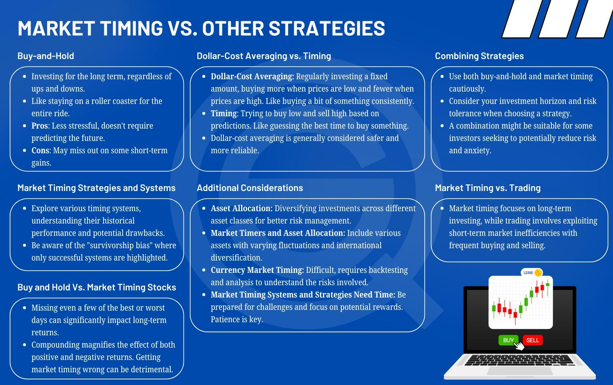

## Table of Contents

## What is market timing in investment strategies?

Market timing is a strategy where investors try to predict the best times to buy and sell investments. They look at things like stock prices, economic reports, and news to guess when the market will go up or down. The idea is to buy low and sell high, making more money than if they just held onto their investments.

However, market timing is very hard to do well. Even experts often get it wrong because the market can be unpredictable. Many people end up buying high and selling low, which loses them money. That's why some experts suggest a simpler approach called "buy and hold," where you keep your investments for a long time without trying to time the market.

## Why do investors attempt to use market timing?

Investors try to use market timing because they want to make more money. They think that by buying investments when prices are low and selling them when prices are high, they can beat the market and earn bigger returns. It's like trying to catch the best waves at the beach; if you time it right, you can have a great ride. Many investors are attracted to this idea because it feels exciting and rewarding to outsmart the market.

However, market timing is really tough to get right. The stock market can be unpredictable, and even experts often guess wrong. It's like trying to predict the weather; you might get it right sometimes, but often you'll be surprised. Because of this, many investors end up losing money instead of making more. That's why some people prefer safer strategies, like buying and holding onto their investments for a long time, without trying to guess the market's ups and downs.

## What are the basic risks associated with market timing?

Market timing can be risky because it's hard to predict when the market will go up or down. If you guess wrong, you might buy investments when they're expensive and sell them when they're cheap. This can lead to losing money instead of making more. It's like trying to jump onto a moving train; if you miss the timing, you could get hurt.

Another risk is that market timing can make you miss out on good opportunities. If you wait too long to buy, you might miss out on the times when the market is growing. It's like waiting for the perfect moment to join a party; if you wait too long, you might miss all the fun. Because of these risks, many people choose to invest in a simpler way, like buying and holding onto their investments for a long time.

## How does market timing differ from a buy-and-hold strategy?

Market timing and buy-and-hold are two different ways to invest. Market timing is when you try to guess when the market will go up or down. You buy investments when you think prices will go up, and you sell them when you think prices will go down. It's like trying to catch the best waves at the beach. You need to time it just right to have a great ride. But it's really hard to do well because the market can be unpredictable, and even experts often get it wrong.

On the other hand, a buy-and-hold strategy is simpler. With this approach, you buy investments and keep them for a long time, no matter what the market does. It's like planting a tree and letting it grow. You don't worry about the daily ups and downs of the market. Instead, you believe that over time, your investments will grow in value. Many people prefer this method because it's less risky and doesn't require trying to predict the future.

## Can you provide examples of market timing failures?

One famous example of market timing failure happened during the dot-com bubble in the late 1990s. Many investors thought they could make a lot of money by buying internet company stocks. They believed the prices would keep going up. But when the bubble burst in 2000, the stock prices crashed. People who tried to time the market by buying high ended up losing a lot of money because they didn't sell before the prices fell.

Another example is from the 2008 financial crisis. Many investors thought they could predict the housing market and make big profits. They bought stocks and other investments related to real estate. But when the housing market collapsed, those investments lost a lot of value. People who tried to time the market by buying into the housing boom ended up with big losses because they didn't sell before the crash.

These examples show how hard it is to time the market correctly. Even when it seems like the market will keep going up, it can suddenly go down. Trying to guess the best times to buy and sell can lead to big losses if you get it wrong.

## What psychological factors contribute to the allure of market timing?

People are drawn to market timing because it feels exciting and rewarding. It's like playing a game where you can win big if you guess right. The idea of outsmarting the market and making more money than others is very appealing. It taps into our natural desire to feel in control and to be better than average. When someone sees the market going up and down, they think, "If I can just figure out the pattern, I can make a lot of money."

However, this allure can also lead to overconfidence. People might think they are smarter than they really are and ignore the risks. They remember the times they got it right and forget the times they got it wrong. This selective memory makes them feel like they are good at market timing, even when they are not. It's a bit like gambling; the thrill of winning can make you keep playing, even if you lose more often than you win.

## How do transaction costs affect the effectiveness of market timing?

Transaction costs can make market timing less effective. Every time you buy or sell an investment, you have to pay fees. These fees can add up quickly if you are trying to time the market and making a lot of trades. If you are buying and selling often, the costs can eat into your profits. It's like trying to fill a bucket with water while there's a hole in it; the more you move the bucket, the more water you lose.

Even if you guess the market right sometimes, the fees can make it hard to come out ahead. For example, if you make a small profit on a trade but have to pay a big fee, you might end up with less money than you started with. This is why many people find that the costs of frequent trading can make market timing a losing strategy in the long run. It's important to think about these costs when deciding whether to try to time the market or stick with a simpler approach like buy-and-hold.

## What does historical data suggest about the success rate of market timing?

Historical data shows that market timing is very hard to do well. Many studies have looked at how investors who try to time the market do compared to those who just buy and hold their investments. The results usually show that market timers don't do as well as people who keep their investments for a long time. This is because the market can be very unpredictable, and even experts often guess wrong. If you miss just a few of the best days in the market, it can hurt your returns a lot.

For example, one study found that if you missed the 10 best days in the market over a 20-year period, your returns could be much lower than if you stayed invested the whole time. This shows how hard it is to time the market right. Even if you get it right sometimes, getting it wrong just a few times can wipe out your gains. That's why many experts suggest sticking with a buy-and-hold strategy, where you keep your investments for the long term, instead of trying to guess when to buy and sell.

## How do professional fund managers perform with market timing strategies?

Professional fund managers often try to use market timing to make more money for their clients. They have a lot of information and tools to help them guess when the market will go up or down. But even with all their knowledge and experience, they don't always do better than the market. Studies show that most fund managers who try to time the market don't beat the market over the long term. They might get it right sometimes, but it's hard to do well all the time.

This is because the market can be very unpredictable. Even the best fund managers can miss the best days in the market, which can hurt their returns a lot. For example, if they are out of the market during a few big up days, it can make a big difference in their performance. That's why many experts suggest that even professional fund managers might do better by focusing on a buy-and-hold strategy instead of trying to time the market.

## What are the advanced statistical models used to debunk market timing?

Advanced statistical models have been used to show that market timing is hard to do well. One common model is called regression analysis. It looks at how different things, like stock prices and economic reports, are related to each other. By studying lots of data over a long time, regression analysis can show that it's very hard to predict the market's ups and downs correctly. Even with all the data and math, the market can still surprise you. This helps explain why most people, even experts, don't do better than the market when they try to time it.

Another model is the Monte Carlo simulation. This model runs lots of different scenarios to see what might happen in the future. It shows that even if you guess right sometimes, it's very hard to do it enough times to make more money than if you just held onto your investments. The Monte Carlo simulation helps show that the market is too unpredictable for most people to time it well. That's why many experts suggest simpler strategies, like buying and holding onto your investments for a long time, instead of trying to guess when to buy and sell.

## How does tax efficiency play a role in the ineffectiveness of market timing?

Tax efficiency can make market timing less effective. When you buy and sell investments a lot, you might have to pay taxes on your profits each time. These taxes can add up and take away from the money you make. If you are trying to time the market and making many trades, the taxes can eat into your profits a lot. It's like trying to save money while someone keeps taking some of it away; the more you move your money around, the less you keep.

This is why many people find that the taxes from frequent trading can make market timing a losing strategy in the long run. If you hold onto your investments for a long time, you might pay less in taxes because you are not selling and buying so often. This is called a buy-and-hold strategy, and it can be more tax-efficient. So, when thinking about market timing, it's important to consider how taxes can affect your returns and make it harder to come out ahead.

## What alternative investment strategies are recommended over market timing?

One good alternative to market timing is a buy-and-hold strategy. This means you buy investments and keep them for a long time, no matter what the market does. It's like planting a tree and letting it grow. You don't worry about the daily ups and downs of the market. Instead, you believe that over time, your investments will grow in value. Many people like this method because it's less risky and doesn't require trying to predict the future.

Another option is dollar-cost averaging. With this strategy, you invest a fixed amount of money at regular times, like every month. This way, you buy more shares when prices are low and fewer when prices are high. It's like putting a little money into a piggy bank every week. Over time, this can help you smooth out the ups and downs of the market and build wealth without trying to guess when to buy and sell.

Both of these strategies are simpler and often more effective than market timing. They help you avoid the stress and costs of trying to predict the market's movements. By focusing on the long term and investing regularly, you can build a strong investment portfolio without the risks that come with market timing.

## How can we assess financial performance?

Assessing financial performance is a critical aspect of investment decision-making, acting as a guide for investors to evaluate the past and predict future market behaviors. Various metrics and indicators provide a comprehensive view of an entity's financial health and operational success, influencing strategic investment choices.

### Key Metrics and Indicators

1. **Earnings Per Share (EPS):** EPS indicates the portion of a company's profit allocated to each outstanding share of common stock, serving as a measure of company profitability. It is calculated as:
$$
   \text{EPS} = \frac{\text{Net Income} - \text{Preferred Dividends}}{\text{Average Outstanding Shares}}

$$

2. **Price-to-Earnings (P/E) Ratio:** This ratio compares a company's current share price to its per-share earnings, offering insights into market expectations and valuation:
$$
   \text{P/E Ratio} = \frac{\text{Market Value Per Share}}{\text{Earnings Per Share (EPS)}}

$$

3. **Return on Equity (ROE):** ROE measures a corporation's profitability relative to shareholders' equity, reflecting how effectively management is using equity financing:
$$
   \text{ROE} = \frac{\text{Net Income}}{\text{Shareholder's Equity}}

$$

4. **Debt-to-Equity Ratio (D/E):** This ratio assesses a company's financial leverage by comparing its total liabilities to shareholder equity:
$$
   \text{D/E Ratio} = \frac{\text{Total Liabilities}}{\text{Shareholder's Equity}}

$$

### Influence on Investment Decisions

Financial performance directly affects investment decisions by allowing investors to discern profitable ventures from underperforming ones. Strong financial metrics often correspond to potential growth and stability, attracting investment. Conversely, weak metrics may deter investors due to perceived risks.

### Economic Indicators

Economic indicators such as GDP growth rates, unemployment rates, and inflation are crucial in assessing market movements and performance evaluation. For instance, a rising GDP often correlates with increased corporate profits, influencing stock market performance positively.

### Reports, Ratios, and Financial Statements

Investors keenly analyze financial reports and statements like balance sheets, income statements, and cash flow statements. These documents are foundational tools for calculating financial ratios and providing a clear picture of a company's operational efficiency and financial position.

### Technology in Performance Assessment

Advancements in technology enhance financial performance assessment through software and analytical tools. Many investment platforms offer real-time financial analytics and predictive models powered by [artificial intelligence](/wiki/ai-artificial-intelligence) to forecast market trends. Python, for instance, has become a valuable tool for financial analysis due to its robust libraries such as Pandas and NumPy, facilitating complex data manipulation and visualization.

Here is a simple Python example for calculating EPS using Pandas:

```python
import pandas as pd

# Sample financial data
data = {'Net Income': [1000000], 'Preferred Dividends': [50000], 'Average Outstanding Shares': [100000]}
df = pd.DataFrame(data)

# Calculate EPS
df['EPS'] = (df['Net Income'] - df['Preferred Dividends']) / df['Average Outstanding Shares']

print(df['EPS'])
```

This combination of financial metrics, economic indicators, comprehensive financial reports, and cutting-edge technology collectively equips investors with the necessary tools to assess financial performance effectively. This in-depth analysis assists investors in making informed decisions, optimizing their investment outcomes.

## How can we integrate strategies for optimal results?

Integrating traditional investment strategies with algorithmic trading enhances the effectiveness and adaptability of investment approaches. Combining these methods allows investors to harness the strengths of both human intuition and computational efficiency, optimizing decision-making in variable market conditions.

Market timing can play a significant role in augmenting algorithmic trading systems. Successful market timing entails predicting market movements and adjusting strategies accordingly, which can reduce drawdowns and enhance returns. Incorporating market timing into algorithmic trading can improve the timing of entry and exit points, allowing algorithms to leverage short-term market inefficiencies while maintaining the overall strategy objective.

Balancing risk and return using a combined approach involves integrating diverse strategies to manage portfolio volatility. Traditional investment strategies offer a foundation with established principles of risk management, while algorithmic trading provides precision in execution. For example, a strategy could utilize a conservative traditional approach to ensure steady growth while employing algorithmic trading for opportunistic trades. This dual strategy can be modeled using a weighted approach such as:

$$
\text{Total Portfolio Return} = w_1 \times R_t + w_2 \times R_a
$$

where $R_t$ is the return from traditional strategies, $R_a$ is the return from algorithmic strategies, and $w_1, w_2$ are their respective weights ensuring $w_1 + w_2 = 1$.

Technological advancements, such as high-speed computing and data analytics, enable seamless integration of these strategies. Increased processing power allows algorithms to analyze vast datasets in real-time, identifying trends and patterns that inform investment decisions. Cloud computing resources enable these systems to scale on-demand, providing flexibility essential for adaptive strategies in dynamic markets.

Predictive analytics and Artificial Intelligence (AI) further enhance the ability to optimize investment outcomes. Machine learning algorithms can process historical data to predict future trends, improving the accuracy of market forecasts. For example, using time-series forecasting models such as ARIMA or employing neural networks, investors can predict stock prices or market movements with greater precision. A simple Python example for ARIMA model forecasting might include:

```python
from statsmodels.tsa.arima.model import ARIMA
import numpy as np

# Sample data
data = np.random.randn(100)

# Fit ARIMA model
model = ARIMA(data, order=(5,1,0))
model_fit = model.fit()

# Forecast
forecast = model_fit.forecast(steps=10)
print(forecast)
```

Incorporating AI-driven predictive analytics into investment strategies tends to enhance decision-making by minimizing reliance on emotional impulses and maximizing data-driven insights. As technological advancements continue, the integration of traditional strategies with algorithmic systems will likely evolve, offering even greater potential for optimizing investment portfolios.

## References & Further Reading

[1]: Malkiel, B. G. (2003). ["A Random Walk Down Wall Street: The Time-Tested Strategy for Successful Investing."](https://www.amazon.com/Random-Walk-Down-Wall-Street/dp/0393330338) W. W. Norton & Company.

[2]: Pardo, R. (2008). ["The Evaluation and Optimization of Trading Strategies,"](https://onlinelibrary.wiley.com/doi/book/10.1002/9781119196969) Wiley Trading.

[3]: Chaboud, A. P., Chiquoine, B., Hjalmarsson, E., & Vega, C. (2014). ["Rise of the Machines: Algorithmic Trading in the Foreign Exchange Market."](https://www.jstor.org/stable/43612951) The Journal of Finance, 69(5), 2045-2084.

[4]: Lo, A. W. (2005). ["Reconciling efficient markets with behavioral finance: The adaptive markets hypothesis."](http://www.empirical.net/wp-content/uploads/2014/12/Andrew-Lo-Reconciling-Efficient-Markets-with-Behavioral-Finance.pdf) Journal of Investment Consulting, 7(2), 21-44.

[5]: Gomber, P., Arndt, B., Lutat, M., & Uhle, T. (2011). ["High-frequency trading."](https://www.researchgate.net/publication/271631628_High-Frequency-Trading) Business & Information Systems Engineering, 3(2), 79-87.