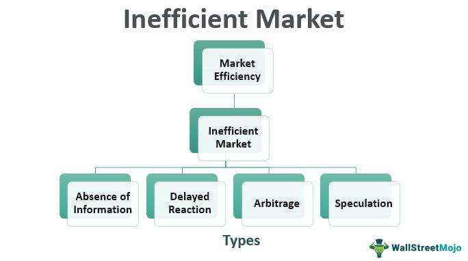

## Table of Contents

## What is an inefficient market?

An inefficient market is a market where prices do not accurately reflect all available information. This means that some people might have more information than others, and they can use this to their advantage. For example, if someone knows that a company is going to do well but the stock price hasn't gone up yet, they can buy the stock at a lower price and make a profit later.

Because of this, inefficient markets can lead to situations where some people make a lot of money while others lose money. It's not fair because not everyone has the same information. This can make the market less stable and harder to predict. Governments and financial regulators often try to make markets more efficient by making sure that information is shared more evenly among all participants.

## How does an inefficient market differ from an efficient market?

An inefficient market is one where the prices of things like stocks don't show all the information that people know. This means some people might know more than others and can use this to make money. For example, if someone knows a company will do well but the stock price hasn't gone up yet, they can buy the stock cheap and sell it later for a profit. This can make the market unfair because not everyone has the same information, and it can be harder to predict what will happen next.

On the other hand, an efficient market is one where the prices of stocks and other things do show all the information that's out there. In an efficient market, if good news comes out about a company, the stock price goes up right away because everyone knows about it. This makes the market fairer because everyone has the same chance to make decisions based on the same information. It also makes the market more stable and easier to predict because prices quickly adjust to new information.

## What are the main characteristics of an inefficient market?

In an inefficient market, the prices of things like stocks don't show all the information that people know. This means that some people might have more information than others. For example, if someone knows that a company is going to do well but the stock price hasn't gone up yet, they can buy the stock at a lower price and sell it later for a profit. This can make the market unfair because not everyone has the same information. It can also make the market harder to predict because prices don't always match what's really going on.

Another characteristic of an inefficient market is that it can lead to big differences in how much money people make. Some people might make a lot of money because they have more information, while others might lose money because they don't know as much. This can make the market less stable because prices can change a lot when new information finally comes out. Governments and financial regulators often try to make markets more efficient by making sure that information is shared more evenly among all participants.

## Can you provide examples of inefficient markets?

One example of an inefficient market is the housing market in some small towns. In these places, not everyone knows about all the houses that are for sale. Some people might know about a good deal before others, and they can buy the house at a lower price. This means that the price of houses doesn't always show all the information that people have. It can be hard for someone new to the town to find a good deal because they don't know as much as the people who have lived there for a long time.

Another example is the stock market in some developing countries. In these markets, not all the information about companies is easy to find. Some people might know about a company's plans before others, and they can buy the stock at a lower price before everyone else knows. This means that the stock prices don't always show all the information that people have. It can be hard for someone who doesn't have a lot of connections to make good investments because they don't have as much information as others.

## How do information asymmetry and transaction costs contribute to market inefficiency?

Information asymmetry happens when some people know more than others. In a market, this can make things unfair. If someone knows that a company is going to do well but the stock price hasn't gone up yet, they can buy the stock at a lower price and make money later. This means the price of the stock doesn't show all the information that people have. It can be hard for someone who doesn't know as much to make good choices because they don't have all the information. This makes the market less fair and harder to predict because prices don't always match what's really going on.

Transaction costs are the costs of buying and selling things in a market. These costs can make the market less efficient too. For example, if it costs a lot of money to buy and sell stocks, people might not want to trade as much. This means that prices might not change as quickly as they should when new information comes out. If it's hard or expensive to trade, the market can't adjust to new information as fast. This can make the market less efficient because prices don't always show all the information that people have.

## What role do behavioral biases play in creating inefficient markets?

Behavioral biases are the ways people think and act that can make markets less efficient. For example, some people might be too confident in their choices and think they know more than they really do. This can lead them to make bad decisions, like buying a stock because they think it will go up, even if there's no good reason to believe that. When a lot of people do this, it can push prices away from what they should be based on all the information out there. This makes the market less fair because prices don't show all the information that people have.

Another way behavioral biases can create inefficient markets is through herd behavior. This is when people follow what others are doing without thinking for themselves. If a lot of people start buying a certain stock because everyone else is, the price can go up even if there's no good reason for it. This can make the market less stable because prices can change a lot based on what people are doing, not on what's really going on with the companies. When people act based on biases instead of facts, it can make the market less efficient and harder to predict.

## How can investors identify an inefficient market?

Investors can identify an inefficient market by looking for signs that prices don't match all the information out there. One way to do this is to see if some people seem to know more than others. For example, if a stock price suddenly jumps after a few people start buying it, it might mean those people had information that others didn't. Another sign is if it's hard to find good information about companies or other things being traded. If the information is not easy to get or understand, it can mean the market is inefficient because not everyone has the same chance to make good choices.

Another way to spot an inefficient market is to look at how prices change. In an inefficient market, prices might not change as quickly as they should when new information comes out. This can happen if it's expensive or hard to buy and sell things in the market. If prices stay the same even when there's new information, it's a sign that the market isn't working as well as it could. By paying attention to these signs, investors can figure out if a market is inefficient and maybe find ways to make money from it.

## What are the potential impacts of market inefficiency on investors?

Market inefficiency can have big effects on investors. When a market is inefficient, some people might know more than others. This means that some investors can make a lot of money because they have information that others don't. For example, if someone knows a company is going to do well but the stock price hasn't gone up yet, they can buy the stock at a lower price and sell it later for a profit. This can be unfair because not everyone has the same chance to make money. Investors who don't have as much information might lose money because they can't make the best choices.

Another impact of market inefficiency is that it can make the market harder to predict. When prices don't show all the information that people have, it can be hard to know what will happen next. This can make investing riskier because prices can change a lot when new information finally comes out. For example, if a lot of people start buying a stock because they heard good news that others didn't know, the price can go up quickly. This can be good for some investors but bad for others who didn't know about the news. Overall, market inefficiency can make investing more challenging and less fair for everyone involved.

## How do inefficient markets affect economic resource allocation?

Inefficient markets can mess up how resources are used in an economy. When prices don't show all the information that people have, it can be hard for businesses and investors to decide where to put their money. For example, if a company's stock price is low because not everyone knows how well it's doing, the company might not get the money it needs to grow. This means that resources, like money and workers, might go to other companies that aren't as good but have higher stock prices because more people know about them. This can make the economy less efficient because the best companies don't always get the resources they need.

Another way inefficient markets affect resource allocation is by making it harder for the market to adjust to changes. When new information comes out, prices should change quickly to show that. But in an inefficient market, this might not happen fast enough. For example, if a new technology comes out that could help a company a lot, the company might not get the money it needs right away because the stock price doesn't go up quickly enough. This can slow down the economy because resources aren't moving to where they're needed most. In the end, inefficient markets can make it harder for the economy to grow and use resources in the best way possible.

## What strategies can investors use to exploit inefficiencies in the market?

Investors can use a few different strategies to take advantage of market inefficiencies. One way is to do a lot of research and find out things that other people don't know. For example, if an investor finds out that a company is going to do well but the stock price hasn't gone up yet, they can buy the stock at a low price and sell it later for a profit. This is called value investing, where investors look for stocks that are undervalued because not everyone knows how good the company really is.

Another strategy is to use insider information, but this is not legal and can get investors in big trouble. A better way is to look for patterns in how prices change and try to predict what will happen next. This is called technical analysis. Investors who are good at this can buy stocks before the price goes up and sell them before it goes down. By using these strategies, investors can make money from market inefficiencies, but they have to be careful because it can be risky and not always fair to others.

## How have regulatory measures attempted to address market inefficiencies?

Regulatory measures have tried to make markets more fair by making sure everyone has the same information. One way they do this is by making rules that say companies have to tell everyone important things about their business. For example, if a company is going to do well or badly, they have to share this news with everyone. This helps make sure that stock prices show all the information that people have, so the market can be more efficient. Another thing regulators do is watch for people who try to use secret information to make money. If someone knows something others don't and uses it to buy or sell stocks, they can get in big trouble. This helps stop people from taking advantage of others and makes the market more fair.

Regulators also try to make it easier and cheaper for people to buy and sell things in the market. They do this by setting rules that make trading costs lower and faster. When it's easier to trade, prices can change more quickly when new information comes out. This helps the market work better because prices can show what's really going on. By doing these things, regulators hope to make markets more efficient so that everyone has a fair chance to make good choices and the economy can grow in the best way possible.

## What are the long-term implications of persistent market inefficiencies on the economy?

If market inefficiencies keep happening for a long time, they can really hurt the economy. When prices don't show all the information that people have, it can be hard for businesses and investors to know where to put their money. This means that good companies might not get the money they need to grow, while other companies that aren't as good might get more money just because more people know about them. This can make the economy less efficient because the best companies don't always get the resources they need. Over time, this can slow down growth and make it harder for the economy to use resources in the best way possible.

Another problem with long-lasting market inefficiencies is that they can make the economy less stable. When prices don't change quickly enough when new information comes out, it can lead to big surprises. For example, if a lot of people suddenly find out good news about a company and start buying its stock, the price can jump up quickly. This can make the market feel like a roller coaster, with prices going up and down a lot. This kind of instability can make people scared to invest, which can slow down the economy even more. In the end, persistent market inefficiencies can make it harder for the economy to grow and be fair to everyone.

## References & Further Reading

[1]: Fama, E. F. (1970). ["Efficient Capital Markets: A Review of Theory and Empirical Work."](https://www.jstor.org/stable/2325486) The Journal of Finance, 25(2), 383-417.

[2]: Barberis, N., & Thaler, R. (2003). ["A Survey of Behavioral Finance."](https://www.nber.org/papers/w9222) Handbook of the Economics of Finance.

[3]: Lo, A. W. (2004). ["The Adaptive Markets Hypothesis: Market Efficiency from an Evolutionary Perspective."](https://papers.ssrn.com/sol3/papers.cfm?abstract_id=602222) The Journal of Portfolio Management, 30(5), 15-29.

[4]: Hull, J. C. (2018). ["Options, Futures, and Other Derivatives."](https://www.semanticscholar.org/paper/Options%2C-Futures%2C-and-Other-Derivatives-Hull/89bdee500c8623864fc9eb7a471546aa713acc44) Pearson.

[5]: Shleifer, A. (2000). ["Inefficient Markets: An Introduction to Behavioral Finance."](https://academic.oup.com/book/27761) Oxford University Press.

[6]: Carhart, M. M. (1997). ["On Persistence in Mutual Fund Performance."](https://www.jstor.org/stable/2329556) The Journal of Finance, 52(1), 57-82.

[7]: Chan, E. P. (2009). ["Quantitative Trading: How to Build Your Own Algorithmic Trading Business."](https://github.com/ftvision/quant_trading_echan_book) Wiley.

[8]: Jansen, S. (2020). ["Machine Learning for Algorithmic Trading: Predictive models to extract signals from market and alternative data for systematic trading strategies with Python."](https://www.amazon.com/Machine-Learning-Algorithmic-Trading-alternative/dp/1839217715) Packt Publishing.

[9]: Ye, M., & Boswijk, H. P. (2018). ["Behavior within Fundamental Disagreement: A Quantile Regression Analysis of the Cryptocurrency Market."](https://journals.sagepub.com/doi/10.1177/1354816617731196?icid=int.sj-full-text.similar-articles.9) SSRN.

[10]: Menkhoff, L. (2010). ["The Use of Technical Analysis by Fund Managers: International Evidence."](https://www.sciencedirect.com/science/article/pii/S0378426610001755) Journal of Banking & Finance, 34(11), 2573-2590.