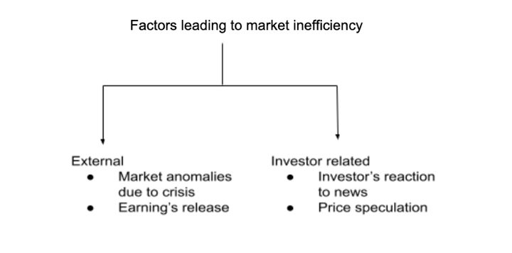

In today's dynamic investment landscape, effective portfolio management is crucial for maximizing returns while minimizing risk. Investors face numerous challenges, from volatile financial markets to unpredictable economic conditions, making it essential to construct portfolios that are both resilient and capable of delivering optimal performance. One significant obstacle investors encounter is the presence of inefficient portfolios, which can underperform due to poor asset allocation strategies and ineffective risk management. An inefficient portfolio fails to achieve the best possible returns for the level of risk undertaken, often due to issues such as inadequate diversification or failure to adapt to changing market environments.

To address these inefficiencies, innovative approaches such as algorithmic trading, or algo trading, have emerged. Algorithmic trading leverages advanced automation and data-driven decision-making to enhance portfolio management. By employing complex algorithms, investors can systematically analyze real-time data and execute trades efficiently, minimizing human error and emotional bias. Algo trading enables the rapid execution of investment strategies that capitalize on market opportunities, maintain optimal asset allocation, and adjust swiftly to evolving market conditions.



This article explores the intricacies of investment strategies, detailing the concept of inefficient portfolios and their potential pitfalls. Furthermore, it examines the transformative role of algorithmic trading in refining portfolio management, highlighting its potential to revolutionize traditional approaches and offer new avenues for achieving superior investment outcomes. As technology continues to advance, the integration of algorithmic trading presents promising prospects for investors looking to enhance portfolio performance and navigate the complexities of today's financial markets.

## Table of Contents

## Understanding Inefficient Portfolios

An inefficient portfolio is one that fails to deliver optimal returns for the level of risk assumed by the investor, thereby not maximizing the financial benefits expected from investments. Inefficiencies in such portfolios typically arise from three main factors: poor diversification, inappropriate asset selection, and failure to rebalance regularly.

**Poor Diversification**: Diversification is a strategy that involves spreading investments across various asset classes to reduce risk. When a portfolio lacks adequate diversification, it becomes vulnerable to systematic risk, which can lead to significant losses if certain sectors or asset types perform poorly. An investor who holds an overly concentrated portfolio may experience heightened volatility and endure unnecessary risks without the potential for corresponding returns.

**Inappropriate Asset Selection**: Choosing the right mix of assets is crucial for portfolio efficiency. Inefficient portfolios often include inappropriate asset selections that do not align with the investor’s risk tolerance or financial goals. This misalignment can lead to suboptimal returns because the selected assets may not perform as expected within a given market environment.

**Failure to Rebalance Regularly**: Regularly rebalancing a portfolio involves adjusting the asset allocation to maintain the desired level of risk exposure. Without this practice, a portfolio can drift away from the investor's original strategy due to market fluctuations, potentially leading to an undesired increase in risk or decrease in expected returns. 

Investors with inefficient portfolios risk engaging in investment activities that expose them to unnecessary risks without adequate compensation in terms of returns. For example, a portfolio that is overly concentrated in high-risk high-yield bonds yet offers risk-free return rates might represent an inefficient approach. These high-yield bonds could underperform, leaving the investor exposed to credit risk without commensurate rewards. By recognizing and mitigating such inefficiencies, investors can aim for more balanced strategies that optimize returns relative to the risks undertaken.

## Principles of Efficient Portfolio Management

Efficient portfolio management is the practice of constructing a portfolio that offers the best possible expected return for a predetermined level of risk. At the heart of this concept lies the risk-to-reward ratio, a key metric that guides investors in balancing their portfolios to optimize outcomes. Portfolios that achieve this balance are situated on the "efficient frontier," a concept originating from Modern Portfolio Theory (MPT) introduced by Harry Markowitz in the 1950s.

### Efficient Frontier and Modern Portfolio Theory (MPT)

The efficient frontier is a graphical representation of potential portfolios that are expected to provide the maximum return for a given level of risk, or equivalently, the minimum risk for a given level of return. It is constructed by plotting the expected returns of portfolios against their associated risk, usually measured by standard deviation. Portfolios on the frontier are optimal, while those below are deemed inefficient.

Modern Portfolio Theory revolutionized investment strategies by introducing the idea of portfolio diversification to reduce risk. According to MPT, the overall risk of a portfolio is not simply the sum of the individual risks of its assets, but depends on the correlation between these assets. By carefully selecting a mix of assets that do not move in perfect synchrony, investors can reduce the overall risk of their portfolios; this is quantified and visualized via the portfolio's placement on the efficient frontier.

### Key Strategies: Diversification and Rebalancing

Diversification is a fundamental strategy in efficient portfolio management. By investing across a variety of asset classes such as stocks, bonds, and real estate, investors can mitigate risks associated with market [volatility](/wiki/volatility-trading-strategies). The objective is to combine these assets in such a way that the portfolio as a whole is less volatile than its individual components.

Systematic rebalancing is another crucial strategy. Over time, differing rates of return will cause the asset allocation of a portfolio to drift from its target allocations. Rebalancing involves realigning the weights of the portfolio's assets to maintain the desired risk profile. This can be achieved by periodically buying or selling assets to return to the original target allocation. Rebalancing not only helps in managing risk but also enforces a disciplined investment process, as it often involves selling high-performing assets and purchasing underperforming ones.

### Mathematical Foundation

MPT utilizes the concept of expected return ($E(R)$) and standard deviation ($\sigma$) of returns to determine the optimal allocation of assets. The formula for the expected return of a two-asset portfolio is:

$$

E(R_p) = w_1E(R_1) + w_2E(R_2)
$$

where $w_1$ and $w_2$ are the weights of the two assets in the portfolio, and $E(R_1)$ and $E(R_2)$ are their expected returns. The portfolio's variance ($\sigma_p^2$), which represents risk, is given by:

$$

\sigma_p^2 = w_1^2\sigma_1^2 + w_2^2\sigma_2^2 + 2w_1w_2\rho_{1,2}\sigma_1\sigma_2 
$$

Here, $\sigma_1$ and $\sigma_2$ are the standard deviations of the individual assets, and $\rho_{1,2}$ represents the correlation coefficient between them. This framework allows investors to visualize and implement asset allocation strategies that align with their risk tolerance.

In conclusion, efficient portfolio management, grounded in MPT and harnessing the principles of diversification and systematic rebalancing, offers a robust framework for investors aiming to optimize their portfolios under varying market conditions.

## Algorithmic Trading in Portfolio Management

Algorithmic trading harnesses the power of automation and sophisticated algorithms to systematically execute trades based on predefined criteria. This method brings precision and speed to portfolio management, allowing traders to capitalize on market opportunities in real-time without the emotional influences that can affect human decision-making. By analyzing vast amounts of data quickly and efficiently, algorithmic systems can implement strategies that align with specific investment goals.

A key advantage of [algorithmic trading](/wiki/algorithmic-trading) is its ability to facilitate diversification, spreading investments across a wide array of assets and markets effectively. Diversification is a critical aspect of reducing risk and enhancing potential returns in portfolio management. Algorithmic trading systems can simultaneously monitor multiple markets and asset classes, executing trades based on optimal diversification strategies that would be challenging to achieve manually.

Furthermore, algorithmic systems are adept at supporting the rebalancing of portfolios. Market conditions can shift rapidly, necessitating adjustments in asset allocation to maintain the desired risk-to-reward ratio. Algorithms can continuously evaluate the current composition of a portfolio against its target allocation, executing trades to realign the portfolio with its strategic objectives whenever discrepancies are identified.

Incorporating algorithmic trading into portfolio management involves setting rules for trade execution and rebalancing, typically based on quantitative models and statistical analysis. For example, a simple moving average crossover strategy might be implemented as follows:

```python
import pandas as pd

def generate_signals(price_data, short_window=40, long_window=100):
    signals = pd.DataFrame(index=price_data.index)
    signals['price'] = price_data
    signals['short_mavg'] = price_data.rolling(window=short_window, min_periods=1).mean()
    signals['long_mavg'] = price_data.rolling(window=long_window, min_periods=1).mean()
    signals['signal'] = 0.0
    signals['signal'][short_window:] = np.where(signals['short_mavg'][short_window:] > signals['long_mavg'][short_window:], 1.0, 0.0) 
    signals['positions'] = signals['signal'].diff()
    return signals

price_data = pd.Series([...])  # Replace with actual price data
signals = generate_signals(price_data)
```

This example depicts a basic strategy where buy and sell signals are generated whenever a short-term moving average crosses above or below a long-term moving average, respectively. Such strategies can be enhanced with additional rules and conditions to tailor risk exposure according to specific investor preferences.

In essence, algorithmic trading transforms the landscape of portfolio management by offering tools that enable more timely, efficient, and informed trading decisions. These automated systems empower investors to not only minimize emotional biases but also to harness large-scale data processing for enhanced portfolio performance.

## Implementing Algo Trading: Strategies and Tools

Algorithmic trading integrates various strategies and tools to optimize portfolio performance by automating trade execution based on predefined criteria. One prominent strategy is mean reversion, predicated on the idea that asset prices will tend to return to their historical averages over time. Traders employing mean reversion algorithms attempt to capitalize on price deviations from this average, aiming for profits as prices revert.

Momentum-based trading represents another approach, where algorithms detect and exploit continuing trends in asset prices. Unlike mean reversion, [momentum](/wiki/momentum) trading bets on the persistence of an upward or downward trajectory, reinforcing positions as trends strengthen.

Arbitrage opportunities are also integral to algorithmic strategies. These involve simultaneously buying and selling an asset across different markets to profit from price discrepancies. Algorithms execute these trades with speed and precision, capturing minute differences that human traders might miss.

Diversification across multiple assets and sectors, such as currencies, commodities, and equity markets, enhances portfolio resilience. Advanced systems enable investors to spread investments, reducing unsystematic risk associated with individual assets or sectors. Algorithms are tailored to identify optimal diversification paths, balancing exposure and capital allocation.

Innovative tools, particularly [machine learning](/wiki/machine-learning) algorithms and predictive analytics, refine trade accuracy. Machine learning models process vast datasets to identify patterns and predict market movements, allowing for data-driven decision-making. For example, neural networks and decision trees can improve predictions regarding asset price directions, enhancing trading efficacy.

Effective risk management is paramount in algorithmic trading. Algorithms enforce stop-loss orders, automatically liquidating positions at pre-set loss thresholds, thus preventing excessive losses during market downturns. Additionally, algorithms adjust leverage in response to market volatility, scaling exposure according to risk appetite and market conditions. This adaptability ensures robust protection of capital while pursuing opportunistic trades.

In summary, algorithmic trading strategies, complemented by advanced technological tools, offer a sophisticated means of managing portfolios. By leveraging these strategies, investors can optimize returns while maintaining a balanced risk profile.

## Challenges and Future Potentials

Algorithmic trading has transformed the landscape of portfolio management, offering numerous advantages such as speed, precision, and the ability to handle complex data. However, it is not without its challenges. Implementing algorithmic trading strategies necessitates sophisticated software and a profound understanding of market dynamics.

One of the primary challenges is ensuring software reliability. Trading platforms must be robust and fault-tolerant, capable of executing trades accurately and avoiding costly errors. Furthermore, connectivity issues can disrupt the flow of data necessary for executing trades in real-time, potentially leading to suboptimal outcomes. Thus, maintaining up-to-date systems that can adapt to rapidly changing market conditions is crucial. 

The evolution of algorithmic trading is steeped in the continuous advancements in [artificial intelligence](/wiki/ai-artificial-intelligence) (AI) and machine learning. These technologies are reshaping investment strategies by enabling more accurate predictions and insights into market behavior. Machine learning algorithms can process vast amounts of historical and real-time data to identify patterns and trends, allowing for more informed decision-making.

In the future, the integration of AI into trading systems will likely enhance the efficiency and accuracy of algorithms significantly. Developments in natural language processing could allow algorithms to better interpret news and social media, while improved computational power will enable more complex data analyses and simulations. Moreover, blockchain technology has the potential to increase transparency and security in trading operations, addressing some of the current system vulnerabilities.

As algorithmic trading systems continue to evolve, they will offer further opportunities for fine-tuning portfolio management and optimizing investment returns. The key to capitalizing on these advancements lies in staying informed about technological developments and continuously adapting strategies to incorporate the latest tools and methodologies.

## Conclusion

Algorithmic trading is transforming portfolio management by introducing innovative methods to achieve optimal investment results. This technology-driven approach allows for precise balancing of risk and reward through diverse asset allocations and the use of automated trading systems. Such advancements make it possible for investors to quickly and efficiently adapt to changing market conditions, thus maximizing their returns.

By addressing portfolio inefficiencies, algorithmic trading leverages data-driven techniques to significantly enhance investment performance. Through careful analysis and the execution of trades based on predefined criteria, this method reduces unnecessary risks and ensures that portfolios remain aligned with their strategic objectives. Algorithmic trading tools enable investors to benefit from complex strategies such as mean reversion, momentum trading, and [arbitrage](/wiki/arbitrage), which can all contribute to creating a more robust investment portfolio.

As technology continues to evolve, staying informed becomes crucial for investors seeking to leverage these modern investment methodologies. Developments in artificial intelligence and machine learning are set to further refine the efficiency and accuracy of trading algorithms. By adapting strategies to incorporate these advancements, investors can maintain a competitive edge and optimize their portfolio management efforts. Keeping abreast of technological innovations will be essential for capitalizing on the potential of algorithmic trading in achieving superior investment outcomes.

## References & Further Reading

[1]: Bergstra, J., Bardenet, R., Bengio, Y., & Kégl, B. (2011). ["Algorithms for Hyper-Parameter Optimization."](https://dl.acm.org/doi/10.5555/2986459.2986743) Advances in Neural Information Processing Systems 24.

[2]: ["Advances in Financial Machine Learning"](https://www.amazon.com/Advances-Financial-Machine-Learning-Marcos/dp/1119482089) by Marcos Lopez de Prado

[3]: ["Evidence-Based Technical Analysis: Applying the Scientific Method and Statistical Inference to Trading Signals"](https://www.amazon.com/Evidence-Based-Technical-Analysis-Scientific-Statistical/dp/0470008741) by David Aronson

[4]: ["Machine Learning for Algorithmic Trading"](https://github.com/stefan-jansen/machine-learning-for-trading) by Stefan Jansen

[5]: ["Quantitative Trading: How to Build Your Own Algorithmic Trading Business"](https://www.amazon.com/Quantitative-Trading-Build-Algorithmic-Business/dp/1119800064) by Ernest P. Chan