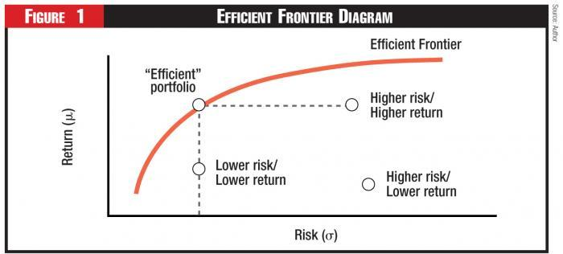

## Table of Contents

## What is an inefficient portfolio?

An inefficient portfolio is one that does not provide the best possible return for the level of risk it carries. Imagine you have a basket of different investments like stocks, bonds, and other assets. If this basket is not set up in the best way, it might not grow as much as it could, or it might be too risky for the amount of growth you get. This is what we call an inefficient portfolio.

To make a portfolio efficient, you need to balance the risk and the return. If you have too much risk for the return you are getting, or if you could get a better return for the same level of risk, then your portfolio is not working as well as it could. A good way to fix this is by diversifying your investments, which means spreading your money across different types of assets to reduce risk while still aiming for good returns.

## How does an inefficient portfolio differ from an efficient portfolio?

An inefficient portfolio is like a car that uses too much gas and doesn't go very fast. It doesn't give you the best results for the risks you're taking. This means you might not be making as much money as you could, or you might be taking on too much risk for the amount of money you're making. If you have a bunch of stocks, bonds, or other investments, and they're not working together well, you might end up with an inefficient portfolio.

On the other hand, an efficient portfolio is like a well-tuned car that gets good mileage and speed. It gives you the best possible return for the level of risk you're willing to take. This is achieved by carefully choosing and balancing different types of investments. By spreading your money across various assets in a smart way, you can reduce risk while still aiming for good returns. This kind of portfolio helps you make the most of your investments.

## What are the common characteristics of an inefficient portfolio?

An inefficient portfolio often has too much risk for the amount of return it provides. Imagine you're playing a game where you can win money, but you also have a chance to lose it. If you're risking a lot but not winning much, that's like having an inefficient portfolio. It might be filled with investments that go up and down a lot, making it hard to predict what will happen next. This can make you feel nervous and unsure about your money.

Another characteristic of an inefficient portfolio is that it might not be spread out enough. Think of it like putting all your eggs in one basket. If all your money is in just a few types of investments, like only tech stocks, and those don't do well, you could lose a lot. A good portfolio should have a mix of different things, like stocks, bonds, and maybe even real estate, to balance out the risk. If your portfolio doesn't have this mix, it's probably not working as well as it could.

Lastly, an inefficient portfolio might not be checked or changed often enough. Just like a garden needs regular care, your investments need attention too. If you're not looking at your portfolio and making adjustments when things change, it can become inefficient over time. Maybe a certain stock isn't doing well anymore, or maybe there's a new investment that could help. Without keeping an eye on things and making smart moves, your portfolio won't perform at its best.

## Why might an investor end up with an inefficient portfolio?

An investor might end up with an inefficient portfolio because they don't know enough about how to balance risk and reward. Imagine you're trying to make a cake but you don't know the right amounts of ingredients to use. If you put in too much sugar, the cake might taste too sweet and not be good. Similarly, if an investor puts too much money into risky stocks without balancing it with safer investments like bonds, their portfolio can become inefficient. They might not realize that they need to spread their money across different types of investments to reduce risk while still aiming for good returns.

Another reason is that the investor might not keep an eye on their investments and make changes when needed. Think of it like a garden that needs regular care. If you don't water the plants or pull out the weeds, the garden won't grow well. In the same way, if an investor doesn't check their portfolio and adjust it when the market changes or when certain investments aren't doing well, their portfolio can become inefficient over time. They might stick with the same investments for too long without realizing that new opportunities could help their portfolio perform better.

## What are the risks associated with maintaining an inefficient portfolio?

Keeping an inefficient portfolio can be risky because it might not grow as much as it could. Imagine you're saving money for something important, like buying a house or going to college. If your investments aren't working well together, you might not have enough money when you need it. This can be frustrating and might make you miss out on important goals. An inefficient portfolio might have too much risk for the amount of money you're making, so you could lose a lot if things go wrong.

Another risk is that an inefficient portfolio can make you feel stressed and worried. If your investments are going up and down a lot, it can be hard to know what will happen next. This uncertainty can make you feel anxious about your money. Also, if you're not checking your portfolio and making changes when needed, you might miss out on better investment opportunities. Over time, this can make your portfolio even less efficient, leading to more risk and less reward.

## How can an investor identify if their portfolio is inefficient?

To find out if your portfolio is inefficient, you need to look at how much risk you're taking and how much money you're making. Think of it like a seesaw. If you're taking a lot of risk but not getting much reward, your portfolio might be inefficient. You can check this by comparing your portfolio's performance to something called a benchmark, like the S&P 500. If your portfolio is not doing as well as the benchmark, it might be time to make some changes.

Another way to spot an inefficient portfolio is to see if your investments are spread out enough. Imagine you have a bunch of different toys, but you only play with a few of them. If most of your money is in just one or two types of investments, like tech stocks, and they're not doing well, your portfolio could be inefficient. A good portfolio should have a mix of different things, like stocks, bonds, and maybe even real estate, to balance out the risk. If you're not sure, you can talk to a financial advisor who can help you figure out if your investments are working together well.

## What are the basic steps to improve an inefficient portfolio?

To make your portfolio better, first, you need to check how it's doing. Look at how much risk you're taking and how much money you're making. If you're taking a lot of risk but not getting much reward, it's time to make some changes. You can compare your portfolio to something like the S&P 500 to see if it's doing well. If it's not, think about spreading your money across different types of investments, like stocks, bonds, and maybe even real estate. This can help balance out the risk and make your portfolio more efficient.

Next, you should keep an eye on your investments and be ready to make changes. Markets change all the time, and what worked well last year might not work this year. If some of your investments aren't doing well, you might want to sell them and buy something else that could help your portfolio grow. Talking to a financial advisor can also help. They can give you advice on how to adjust your investments to make them work better together. By staying active and making smart moves, you can turn an inefficient portfolio into one that helps you reach your financial goals.

## What role does diversification play in addressing portfolio inefficiency?

Diversification is like spreading your money across different types of investments, so if one thing doesn't do well, the others might help balance it out. Think of it like having a bunch of different fruits in your basket. If one fruit goes bad, you still have others to eat. In the same way, if you have stocks, bonds, and maybe even real estate in your portfolio, and one type of investment isn't doing well, the others might still be okay. This can help reduce the risk of losing a lot of money all at once, which is a big problem with an inefficient portfolio.

By diversifying, you can also make sure you're not putting all your eggs in one basket. If you only invest in one company or one type of investment, like tech stocks, and that doesn't do well, you could lose a lot. But if you spread your money out, you give yourself a better chance of getting a good return without taking too much risk. Diversification helps you find the right balance between risk and reward, making your portfolio more efficient and helping you reach your financial goals more easily.

## How do different asset classes impact the efficiency of a portfolio?

Different types of investments, called asset classes, can make your portfolio more efficient by spreading out the risk. Think of asset classes like stocks, bonds, and real estate. If you put all your money into just one type, like stocks, and the stock market goes down, you could lose a lot. But if you have some money in stocks, some in bonds, and maybe some in real estate, they might not all go down at the same time. This can help protect your money and make your portfolio more stable. By balancing different asset classes, you can reduce the risk of losing money while still having a chance to make money.

Each asset class has its own way of growing and its own level of risk. Stocks can grow a lot but can also go down a lot. Bonds are usually safer but don't grow as much. Real estate can be good for steady income and might grow over time. When you mix these different types of investments, you can find a balance that works for you. If you're okay with more risk, you might put more money into stocks. If you want to be safer, you might put more into bonds. By choosing the right mix of asset classes, you can make your portfolio work better and help you reach your financial goals.

## What advanced metrics can be used to measure portfolio inefficiency?

To measure how well your portfolio is doing, you can use something called the Sharpe Ratio. This is a way to see if you're getting enough reward for the risk you're taking. Imagine you're playing a game where you can win money, but you also have a chance to lose it. The Sharpe Ratio helps you figure out if the game is worth playing. A higher Sharpe Ratio means your portfolio is doing a good job of balancing risk and reward, while a lower one might mean it's not working as well as it could.

Another useful metric is the Treynor Ratio, which looks at how much return you're getting for the risk you're taking, but it focuses on the risk that comes from the market as a whole, not just your individual investments. It's like checking if your boat is moving well with the waves or if it's getting thrown around too much. If your Treynor Ratio is high, it means your portfolio is handling market risk well and giving you a good return. If it's low, it might mean your portfolio is not set up in the best way to deal with market ups and downs. By using these metrics, you can get a better idea of how efficient your portfolio really is.

## How can modern portfolio theory be applied to transform an inefficient portfolio?

Modern Portfolio Theory (MPT) can help turn an inefficient portfolio into a more efficient one by focusing on the right balance between risk and reward. MPT says that you don't just look at each investment by itself. Instead, you look at how all your investments work together. The idea is to spread your money across different types of investments, like stocks, bonds, and maybe even real estate, to reduce risk while still aiming for good returns. By doing this, you can find the best mix of investments that helps your portfolio grow without taking too much risk.

To use MPT, you first need to understand the risk and return of each investment in your portfolio. Then, you can use tools like the efficient frontier to see how different combinations of investments might perform. The efficient frontier is like a map that shows you the best possible returns for different levels of risk. By moving your portfolio closer to this frontier, you can make it more efficient. This might mean selling some investments that are too risky or not making enough money and buying others that help balance out your portfolio better. With MPT, you can keep adjusting your investments to make sure they're working together in the best way possible.

## What are the long-term consequences of not addressing portfolio inefficiency?

If you don't fix an inefficient portfolio, you might not have enough money when you need it for important things like buying a house or retiring. Over time, an inefficient portfolio can grow slower than it should because it's not balanced right. It might be too risky for the amount of money you're making, or it might not be spread out enough across different types of investments. This can make it hard to reach your financial goals, and you might end up feeling disappointed or stressed about your money.

Not addressing portfolio inefficiency can also make you miss out on better investment opportunities. If you're not checking your portfolio and making changes when needed, you might stick with the same investments even when they're not doing well anymore. This can lead to more risk and less reward over time. By not keeping an eye on things and adjusting your investments, you could lose out on chances to make your portfolio work better and help you achieve your long-term financial plans.

## What are the Principles of Efficient Portfolio Management?

Efficient portfolio management is the practice of constructing a portfolio that offers the best possible expected return for a predetermined level of risk. At the heart of this concept lies the risk-to-reward ratio, a key metric that guides investors in balancing their portfolios to optimize outcomes. Portfolios that achieve this balance are situated on the "efficient frontier," a concept originating from Modern Portfolio Theory (MPT) introduced by Harry Markowitz in the 1950s.

### Efficient Frontier and Modern Portfolio Theory (MPT)

The efficient frontier is a graphical representation of potential portfolios that are expected to provide the maximum return for a given level of risk, or equivalently, the minimum risk for a given level of return. It is constructed by plotting the expected returns of portfolios against their associated risk, usually measured by standard deviation. Portfolios on the frontier are optimal, while those below are deemed inefficient.

Modern Portfolio Theory revolutionized investment strategies by introducing the idea of portfolio diversification to reduce risk. According to MPT, the overall risk of a portfolio is not simply the sum of the individual risks of its assets, but depends on the correlation between these assets. By carefully selecting a mix of assets that do not move in perfect synchrony, investors can reduce the overall risk of their portfolios; this is quantified and visualized via the portfolio's placement on the efficient frontier.

### Key Strategies: Diversification and Rebalancing

Diversification is a fundamental strategy in efficient portfolio management. By investing across a variety of asset classes such as stocks, bonds, and real estate, investors can mitigate risks associated with market [volatility](/wiki/volatility-trading-strategies). The objective is to combine these assets in such a way that the portfolio as a whole is less volatile than its individual components.

Systematic rebalancing is another crucial strategy. Over time, differing rates of return will cause the asset allocation of a portfolio to drift from its target allocations. Rebalancing involves realigning the weights of the portfolio's assets to maintain the desired risk profile. This can be achieved by periodically buying or selling assets to return to the original target allocation. Rebalancing not only helps in managing risk but also enforces a disciplined investment process, as it often involves selling high-performing assets and purchasing underperforming ones.

### Mathematical Foundation

MPT utilizes the concept of expected return ($E(R)$) and standard deviation ($\sigma$) of returns to determine the optimal allocation of assets. The formula for the expected return of a two-asset portfolio is:

$$

E(R_p) = w_1E(R_1) + w_2E(R_2)
$$

where $w_1$ and $w_2$ are the weights of the two assets in the portfolio, and $E(R_1)$ and $E(R_2)$ are their expected returns. The portfolio's variance ($\sigma_p^2$), which represents risk, is given by:

$$

\sigma_p^2 = w_1^2\sigma_1^2 + w_2^2\sigma_2^2 + 2w_1w_2\rho_{1,2}\sigma_1\sigma_2 
$$

Here, $\sigma_1$ and $\sigma_2$ are the standard deviations of the individual assets, and $\rho_{1,2}$ represents the correlation coefficient between them. This framework allows investors to visualize and implement asset allocation strategies that align with their risk tolerance.

In conclusion, efficient portfolio management, grounded in MPT and harnessing the principles of diversification and systematic rebalancing, offers a robust framework for investors aiming to optimize their portfolios under varying market conditions.

## References & Further Reading

[1]: Bergstra, J., Bardenet, R., Bengio, Y., & Kégl, B. (2011). ["Algorithms for Hyper-Parameter Optimization."](https://dl.acm.org/doi/10.5555/2986459.2986743) Advances in Neural Information Processing Systems 24.

[2]: ["Advances in Financial Machine Learning"](https://www.amazon.com/Advances-Financial-Machine-Learning-Marcos/dp/1119482089) by Marcos Lopez de Prado

[3]: ["Evidence-Based Technical Analysis: Applying the Scientific Method and Statistical Inference to Trading Signals"](https://www.amazon.com/Evidence-Based-Technical-Analysis-Scientific-Statistical/dp/0470008741) by David Aronson

[4]: ["Machine Learning for Algorithmic Trading"](https://github.com/stefan-jansen/machine-learning-for-trading) by Stefan Jansen

[5]: ["Quantitative Trading: How to Build Your Own Algorithmic Trading Business"](https://www.amazon.com/Quantitative-Trading-Build-Algorithmic-Business/dp/1119800064) by Ernest P. Chan