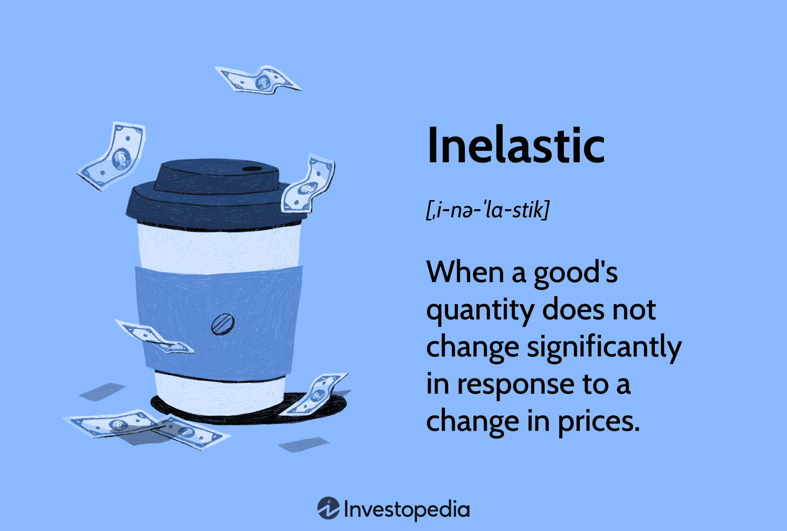

## Table of Contents

## What are inelastic goods?

Inelastic goods are products or services that people will keep buying even if the price goes up. These goods are important to people, so they don't easily change how much they buy when the price changes. For example, things like medicine or gasoline are inelastic goods because people need them no matter what the price is.

The demand for inelastic goods stays pretty much the same, even when prices change. This is because these goods are often necessities, and people can't easily find substitutes for them. If the price of insulin goes up, people with diabetes still need to buy it because it's essential for their health. This makes the demand for insulin inelastic.

## How is the price elasticity of demand measured for inelastic goods?

The price elasticity of demand measures how much the amount people buy changes when the price changes. For inelastic goods, this number is less than 1. That means if the price goes up a lot, the amount people buy doesn't change much. Economists figure this out by looking at the percentage change in the amount people buy and dividing it by the percentage change in the price.

For example, if the price of a medicine goes up by 10%, and the amount people buy only goes down by 2%, the price elasticity of demand would be 0.2 (which is 2% divided by 10%). Since 0.2 is less than 1, this shows the medicine is inelastic. People need the medicine so much that a big price change doesn't make them buy much less of it.

## What are the key characteristics of inelastic goods?

Inelastic goods are things that people will keep buying even if the price goes up. These goods are usually very important to people, like medicine or gas for their cars. They can't easily find other things to use instead, so they keep buying them no matter what the price is. This means the amount people buy doesn't change much, even if the price changes a lot.

The key thing about inelastic goods is that they have a price elasticity of demand that is less than 1. This means if the price goes up by a certain amount, the amount people buy only changes a little bit. For example, if the price of insulin goes up, people with diabetes still need to buy it because it's essential for their health. So, the demand for insulin stays about the same, making it an inelastic good.

## Can you provide examples of inelastic goods?

Inelastic goods are things people need to buy no matter what the price is. A good example is medicine. If someone has diabetes, they need insulin to stay healthy. Even if the price of insulin goes up, they can't stop buying it because they need it to live. Another example is gasoline. People who drive cars need gas to make their cars go. If the price of gas goes up, they still have to buy it because they need to get to work or school.

Another example of an inelastic good is electricity. People use electricity for so many things like cooking, heating their homes, and keeping their food fresh. If the price of electricity goes up, they can't just stop using it because they need it for everyday life. These examples show that inelastic goods are things that are really important and hard to live without, so people keep buying them even when the price changes.

## Why are some goods considered inelastic?

Some goods are considered inelastic because they are really important to people. These are things that people need to live their daily lives, like medicine, gas for their cars, or electricity. When something is a necessity, people can't easily stop buying it even if the price goes up. For example, if someone needs insulin to manage their diabetes, they will keep buying it no matter how much it costs because they need it to stay healthy.

Another reason some goods are inelastic is that there aren't many other options available. If there's no good substitute for a product, people have to keep buying it even if the price changes. For instance, if you need to drive to work and there's no public transportation, you have to buy gas no matter how expensive it gets. This lack of alternatives makes the demand for these goods stay the same, even when prices go up.

## How does the necessity of a good affect its inelasticity?

When a good is a necessity, it means people really need it for their daily lives. This makes the good inelastic because people will keep buying it even if the price goes up. For example, if someone needs medicine to stay healthy, they won't stop buying it just because it gets more expensive. They need it too much to stop, so the demand stays the same no matter what the price does.

Because necessities are so important, there usually aren't many other options people can switch to. If you need gas to drive your car and there's no other way to get to work, you have to keep buying gas even if the price goes up. This lack of substitutes makes the demand for these goods stay steady, which is why they are considered inelastic. People can't easily change what they buy, so the amount they purchase doesn't change much even when prices do.

## What role does the availability of substitutes play in the inelasticity of goods?

The availability of substitutes plays a big role in whether a good is inelastic. If there are no other options to choose from, people have to keep buying the good even if the price goes up. For example, if you need a specific medicine and there's no other medicine that works the same way, you will keep buying it no matter what it costs. This makes the demand for that medicine inelastic because people can't switch to something else.

On the other hand, if there are many substitutes available, people can easily switch to a different product if the price of the original good goes up. For instance, if the price of one brand of cereal goes up, you might buy a different brand instead. This means the demand for that first brand of cereal is more elastic because people have other choices. So, the fewer substitutes there are for a good, the more inelastic it becomes because people are stuck with it no matter the price.

## How do inelastic goods respond to changes in income?

Inelastic goods are things people need to buy no matter what, so changes in income don't change how much they buy very much. If someone's income goes up or down, they still need to buy necessities like medicine or gas. For example, if someone's income goes down, they might cut back on buying new clothes or going out to eat, but they won't stop buying insulin if they need it for their health.

This is because inelastic goods are essential and people can't easily find substitutes for them. Even if someone's income changes a lot, they have to keep buying these goods to live their daily lives. So, the demand for inelastic goods stays pretty steady, no matter if people are making more or less money.

## What are the implications of taxing inelastic goods?

When the government puts a tax on inelastic goods, it can raise a lot of money because people keep buying these goods even if the price goes up. Inelastic goods are things like medicine or gas, which people need no matter what. So, if the government adds a tax, the price goes up, but people still have to buy them. This means the government can get more money from taxes without people buying much less of the good.

But, taxing inelastic goods can also cause problems. When the price of something like medicine goes up because of a tax, it can be hard for people who don't have a lot of money. They still need to buy the medicine, but it costs more now. This can make life harder for them because they have to spend more money on things they can't live without. So, while taxing inelastic goods can help the government, it can also make things tougher for people who need these goods the most.

## How do businesses use the concept of inelastic demand in pricing strategies?

Businesses know that people will keep buying inelastic goods even if the price goes up. So, they can raise the price of these goods without losing many customers. For example, if a company sells medicine that people need, they can increase the price a little bit and still sell about the same amount. This helps the business make more money because they get more for each item they sell.

But, businesses have to be careful when they raise prices on inelastic goods. If they raise the price too much, it might start to hurt people who really need the product. For instance, if the price of insulin goes up a lot, people with diabetes might struggle to afford it. This can make people upset and might even lead to rules or laws that stop the business from raising prices too high. So, while businesses can use inelastic demand to make more money, they need to think about how it affects their customers and the rules they have to follow.

## What are the long-term versus short-term effects on demand for inelastic goods?

In the short term, the demand for inelastic goods doesn't change much when prices go up or down. People need these goods, like medicine or gas, so they keep buying them no matter what. If the price of insulin goes up, people with diabetes still have to buy it because they can't live without it. This means that in the short term, businesses can raise the price a little and still sell about the same amount of the good.

In the long term, things can be a bit different. Even though people need inelastic goods, if the price keeps going up over time, they might start looking for other ways to get by. For example, if gas prices keep getting higher, people might decide to buy a car that uses less gas or start using public transportation. Also, if the price of a medicine goes up a lot over time, people might push for cheaper options or even new laws to make the medicine more affordable. So, while the demand for inelastic goods stays pretty steady in the short term, it can change more in the long term as people find new ways to deal with the higher prices.

## How can the concept of inelastic goods be applied in economic policy making?

When making economic policies, governments can use the idea of inelastic goods to decide where to put taxes and how to help people. Since inelastic goods are things people need to buy no matter what, like medicine or gas, the government can put taxes on these goods to raise money. People will keep buying these goods even if the price goes up a little because of the tax. This can help the government pay for things like schools or roads. But, they have to be careful not to make the tax too high, or it might hurt people who need these goods the most and can't afford to pay more.

Also, knowing about inelastic goods can help the government make rules to keep these goods affordable. For example, if medicine is too expensive, the government might make laws to control the price or help people pay for it. This way, people who need the medicine can still get it without spending too much money. By understanding that the demand for these goods stays the same even when prices change, the government can make better decisions to help everyone, especially those who rely on these necessities.

## What is Inelastic Demand?

Inelastic demand refers to a scenario in economics where the quantity demanded of a good or service is relatively insensitive to changes in its price. This means that a significant change in price leads to a comparatively small change in the quantity demanded. The concept is vital for understanding how certain goods and services behave in the marketplace and how they influence both consumer and supplier decisions.

**Characteristics and Calculation of Inelastic Demand**

Inelastic demand is characterized by the price elasticity of demand being less than one ($|E_d| < 1$). This means that the percentage change in quantity demanded is less than the percentage change in price. Mathematically, the price elasticity of demand (Ed) is calculated using the following formula:

$$
E_d = \frac{\%\ \text{change in quantity demanded}}{\%\ \text{change in price}}
$$

If the computed elasticity is less than one, the demand is considered inelastic.

**Examples of Inelastic Goods**

Inelastic goods often include necessities, where consumers have limited alternatives and must continue purchasing regardless of price changes. Essential medications are a classic example. For instance, insulin for diabetics remains in demand regardless of its cost because it is necessary for life. Similarly, basic utilities like water and electricity are inelastic; despite variations in pricing, consumers need these services for daily living, leading to minimal change in demand regardless of price hikes.

These characteristics of inelastic demand imply that suppliers of these goods and services can often increase prices without a significant drop in sales [volume](/wiki/volume-trading-strategy). However, this can also mean that demand remains stable even during periods of significant price decline, as was seen during some global economic downturns when price reduction in utilities didn’t necessarily reflect in increased consumption, since the usage is more related to necessity than cost savings.

## What are examples of inelastic goods?

Inelastic goods are those that exhibit minimal change in demand when their prices fluctuate. These goods are typically necessities with few or no close substitutes. An inelastic good is characterized by a price elasticity of demand less than 1, mathematically expressed as:

$$

E_d = \frac{\% \text{ change in quantity demanded}}{\% \text{ change in price}} 
$$

Where $E_d$ (elasticity of demand) is less than 1 for inelastic goods. In practical scenarios, this means that a considerable change in price leads to a relatively small change in the quantity demanded.

**Water** is a classic example of an inelastic good. Essential for survival, household consumption of water does not significantly decrease even if water prices increase. People require a consistent amount of water for daily activities such as drinking, cooking, and personal hygiene, ensuring that demand remains stable despite potential price hikes. As a result, water suppliers can often increase prices without drastically affecting overall consumption levels.

**Gasoline** represents another inelastic commodity, as it is integral to transportation and the functioning of modern societies. Despite price increases, whether due to geopolitical instability or changes in crude oil prices, consumers and businesses tend to maintain their purchasing levels. This necessity ensures stable demand, which allows gasoline suppliers to adjust prices as needed, often influenced by external economic conditions rather than demand.

**Medical treatments** and essential medications often exhibit inelastic demand due to their critical nature. For individuals with chronic illnesses, medications are indispensable, and changes in their prices do not significantly impact the required quantity. The inelastic nature of these goods is also a reason why governments and insurance companies frequently step in to regulate pricing and ensure access.

Inelastic goods significantly influence consumer behavior and supplier pricing strategies. Consumers facing price increases for such goods may reduce discretionary spending elsewhere, highlighting the priority of these essential items in household budgets. Suppliers of inelastic goods are generally able to maintain revenue stability, as price changes are less likely to lead to considerable shifts in demand. This stability allows suppliers to manage costs and investments with greater predictability.

Overall, the inelastic nature of these goods plays a critical role in market dynamics, affecting both consumer decision-making and supplier strategies. Understanding their stability is crucial for economists and market analysts when evaluating economic policies and business decisions.

## References & Further Reading

[1]: Perloff, J. M. (2016). ["Microeconomics: Theory and Applications with Calculus"](https://www.amazon.com/Microeconomics-Applications-Calculus-Pearson-Economics/dp/0134167384). Pearson Education.

[2]: Mankiw, N. G. (2014). ["Essentials of Economics."](https://www.amazon.com/Essentials-Economics-MindTap-Course-List/dp/035713351X) Cengage Learning.

[3]: Varian, H. R. (1992). ["Microeconomic Analysis."](https://archive.org/details/microeconomicana00vari_0) W.W. Norton & Company.

[4]: Pindyck, R. S., & Rubinfeld, D. L. (2012). ["Microeconomics."](https://archive.org/details/microeconomics0007pind) Pearson Education.

[5]: ["Advances in Financial Machine Learning"](https://www.amazon.com/Advances-Financial-Machine-Learning-Marcos/dp/1119482089) by Marcos Lopez de Prado

[6]: ["Machine Learning for Algorithmic Trading"](https://github.com/stefan-jansen/machine-learning-for-trading) by Stefan Jansen

[7]: ["Quantitative Trading: How to Build Your Own Algorithmic Trading Business"](https://www.amazon.com/Quantitative-Trading-Build-Algorithmic-Business/dp/1119800064) by Ernest P. Chan