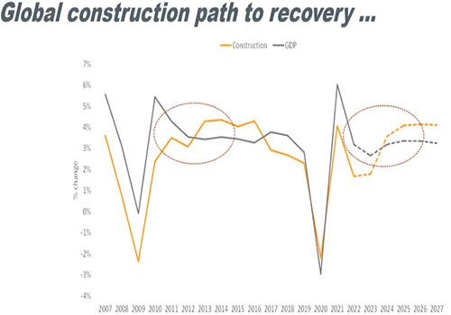

Economic recessions are periods marked by negative economic growth, increasing unemployment rates, and a decline in consumer demand. These downturns significantly impact both individuals and businesses, leading to debates among economists regarding whether recessions are an intrinsic aspect of economic cycles, particularly within capitalist economies. Capitalist economies often follow a cyclical pattern of growth and contraction, suggesting that recessions could be inevitable outcomes of these cycles.

This article aims to explore the concept of economic recessions within the context of these cycles, while also examining the potential influence of algorithmic trading (algo trading) on these economic processes. Algo trading involves the use of computer algorithms to automate trading decisions, which could, in turn, impact economic stability and the dynamics of economic cycles. As modern economies increasingly embrace technological advancements, the role of algo trading in economic cycles warrants examination.

Understanding the intricacies of economic cycles and the emergent role of algo trading is crucial for addressing the challenges posed by economic recessions. By dissecting the underlying mechanisms of these cycles and algorithmic trading's place within them, this article seeks to provide a comprehensive overview of the factors influencing recessions. Through this examination, we aim to shed light on whether recessions are ultimately inescapable or if they can be mitigated through technological advancements and policy measures.

## Table of Contents

## Understanding Economic Cycles

Economic cycles, often referred to as business cycles, describe the fluctuations in economic activity over time, marked by periods of expansion and contraction. These cycles are inherent to market economies and are typically categorized into four phases: expansion, peak, contraction, and trough.

During the expansion phase, the economy experiences growth, as evidenced by increasing Gross Domestic Product (GDP) and employment rates. This phase is characterized by rising consumer and business confidence, leading to higher levels of investment and consumption. Economic indicators such as industrial production, retail sales, and personal incomes typically see a positive trajectory during this period, creating a favorable environment for economic prosperity.

The peak phase signifies the zenith of economic growth. At this stage, the economy has maximized its productive capacity, and economic indicators generally suggest that growth is reaching its limit. Often, inflationary pressures build up due to excessive demand and resource constraints, such as labor shortages. As a result, central banks might intervene by adjusting interest rates to maintain economic stability, marking the transition from peak to contraction.

Contraction, frequently synonymous with a recession, involves a slowdown in economic activity. During this phase, GDP growth stalls or declines, unemployment rates rise, and consumer and business spending decrease. The contraction phase can be triggered by various factors, including decreased consumer demand, restrictive monetary policies, or external shocks like geopolitical events. This phase may last for varying durations, depending on the underlying causes and the measures implemented to address them.

The cycle concludes at the trough, the lowest point of economic activity. At this stage, the economy is likely facing stagnation, with persistent high unemployment, reduced consumer spending, and limited investment. However, the trough also sets the stage for recovery, as economic conditions stabilize and new growth opportunities arise. This phase marks the end of the contraction period and the beginning of another cycle of expansion, as businesses rebuild, consumers regain confidence, and economic activities revive.

Understanding these phases is crucial for policymakers, businesses, and investors to craft strategies that mitigate adverse impacts during downturns and capitalize on growth during upturns. Additionally, technological advances and economic policies play a significant role in influencing the length and impact of each phase within the economic cycle.

## Causes of Economic Recessions

Economic recessions are often the result of complex interactions among various factors, influencing the economic stability and confidence of both consumers and investors. These factors can broadly be categorized into economic shocks, psychological influences, and monetary policy missteps.

Economic shocks are unforeseen events that disrupt the normal functioning of economies. Such disturbances may include geopolitical tensions, which can lead to supply chain disruptions, increases in commodity prices, and shifts in global trade patterns. Natural disasters are another example of economic shocks that can severely affect infrastructure, displace populations, and consequently disrupt economic activities. These shocks cause fluctuations in supply and demand, leading to instability in economic output, often precipitating a recession.

Psychological factors play a significant role in the onset of economic recessions. The collective sentiment of market participants, such as optimism or fear, directly influences economic confidence. During periods of excessive optimism, asset bubbles may form, driven by speculative investment behaviors that inflate market prices beyond their intrinsic values. Conversely, widespread fear can lead to panic selling, causing abrupt market downturns and erosion of wealth. Both scenarios can severely impact consumer and investor confidence, amplifying economic contractions.

Central banks play a crucial role in maintaining economic stability through monetary policy. However, mismanagement or inappropriate adjustments of monetary policy tools, such as interest rates, can have detrimental effects on the economy. For instance, if interest rates are set too low, it may encourage excessive borrowing and lead to asset bubbles. Conversely, high interest rates may stifle investment and consumer spending, leading to reduced economic growth. Furthermore, inaccurate predictions of economic conditions can lead central banks to implement counterproductive measures, contributing to financial instability and potential recessions.

To illustrate how these factors contribute to recessions, consider the 2008 global financial crisis. It was precipitated by a combination of excessive risk-taking in financial markets, psychological factors such as unbridled optimism in housing markets, and inadequate regulatory oversight. The resultant economic shock led to a severe contraction in economic activity worldwide.

Understanding these causes provides valuable insights into the mechanisms that lead to recessions. It highlights the need for effective regulatory frameworks and proactive monetary policies to mitigate the impact of adverse events and prevent the cascading effects of psychological factors on economic stability. By addressing these issues, economies may better withstand potential disruptions and maintain more sustainable growth trajectories.

## The Role of Algorithmic Trading in Economic Cycles

Algorithmic trading employs advanced computer programs to execute trades swiftly, adhering to pre-defined criteria. This automation allows traders to navigate market fluctuations efficiently and with minimal emotional interference, a critical advantage across all phases of economic cycles. By reducing human emotional biases, such as fear or greed, [algorithmic trading](/wiki/algorithmic-trading) helps stabilize market behaviors. The ability to execute trades at high speeds ensures capital flows smoothly, maintaining market [liquidity](/wiki/liquidity-risk-premium) even during volatile periods.

In times of economic downturns, algorithmic trading can play a stabilizing role. By enhancing trading efficiency, it mitigates panic-induced sell-offs, a common phenomenon during recessions. This efficiency comes from the capability of algorithms to process and analyze large data sets at speeds beyond human capacity, enabling them to predict market trends and form informed trading strategies. As a result, traders can respond proactively rather than reactively to market changes, potentially lessening the impact of economic contractions.

However, the use of algorithmic trading is not without risks. The inherent nature of these systems to execute trades at high frequencies can inadvertently lead to market manipulation or exacerbate [volatility](/wiki/volatility-trading-strategies). For instance, algorithms designed without proper oversight can instigate flash crashes, where rapid selling triggers further panic and selling in a feedback loop, thus deepening market volatility. Therefore, it is imperative to implement stringent regulations and advanced monitoring systems to mitigate these risks.

Furthermore, the complex algorithms employed in trading must be continuously refined to adapt to ever-changing market conditions. This adaptability is crucial to avoid systemic risks that can arise from outdated or poorly-designed trading models. As such, the future role of algorithmic trading in economic cycles largely depends on the balance between leveraging technological advantages and maintaining robust regulatory frameworks to ensure market stability.

## Is Recession Inevitable?

The notion that recessions are inevitable is rooted in the cyclical patterns of economic growth and contraction, a well-documented phenomenon within capitalist economies. These cycles are characterized by periods of expansion followed by downturns, where output decreases, unemployment rises, and consumer demand weakens. The repetitive nature of these cycles has led many to view recessions as an unavoidable outcome. This perspective is supported by historical data, showing that economies have repeatedly experienced these fluctuations over time ([source](https://www.nber.org/cycles.html)).

Critics, however, contend that not all recessions are unavoidable. They argue that strategic policy interventions and technological advancements can significantly mitigate the impact and frequency of economic downturns. For instance, the implementation of effective monetary and fiscal policies can smooth fluctuations, while targeted initiatives can stabilize key economic variables. Technological innovations, particularly in financial markets, may offer additional avenues to temper the cyclical nature of economies.

Algorithmic trading, in particular, provides a promising approach to buffering against recessionary forces. By utilizing sophisticated algorithms and high-speed computing power, algorithmic trading has the potential to enhance market stability during periods of economic volatility. Its ability to make rapid and data-driven trading decisions helps maintain liquidity, dampening the extreme market fluctuations that often accompany downturns. Additionally, algorithmic trading can effectively process vast quantities of financial data, potentially predicting market trends and enabling preemptive actions to mitigate potential recessions.

The ongoing debate hinges on whether the cyclical nature of economic recessions can truly be altered or merely cushioned through various interventions, including algorithmic trading. Despite the varying viewpoints, consensus suggests that technological advancements and policy reforms hold the potential to minimize the severity and frequency of recessions, if not eliminating them entirely. By advancing trading technologies and implementing astute economic policies, it is plausible to navigate economic cycles with greater finesse, ultimately reducing the detrimental effects of recessions on societies and economies.

## Conclusion

Economic recessions, integral to the broader economic cycle, may initially seem an unstoppable facet of our financial systems; however, the discussion on their inevitability remains vibrant and nuanced. Algorithmic trading offers novel pathways for providing stability within these cycles, offering benefits like improved liquidity and reduced emotional trading. Yet, it simultaneously calls for vigilant regulation to prevent potential drawbacks such as market manipulation. The sophisticated computational capabilities inherent in algorithmic trading enable a better grasp of market dynamics, allowing stakeholders to devise strategies that potentially cushion the economy against extreme downturns.

By embedding innovations like algo trading within a comprehensive understanding of economic cycles, economists, policymakers, and traders can profoundly influence our responses to future economic downturns. Although it's unlikely that technology and policy interventions will completely eradicate recessions, these tools hold promise in reducing the frequency and severity of such events by anticipating trends and improving market resilience.

The path forward involves harnessing human creativity and technological advancements to traverse the intricacies of economic cycles more adeptly. Utilizing algorithmic trading's full potential, alongside necessary safeguards, represents a significant step toward managing the ebb and flow of economic tides more effectively. Thus, the focus remains on forging an intelligent balance between human intuition and machine precision, thereby reshaping the narratives surrounding economic resilience and sustainability.

## References & Further Reading

[1]: National Bureau of Economic Research: ["Business Cycle Dating"](https://www.nber.org/research/business-cycle-dating)

[2]: Lopez de Prado, M. (2018). ["Advances in Financial Machine Learning"](https://www.amazon.com/Advances-Financial-Machine-Learning-Marcos/dp/1119482089). Wiley.

[3]: Aronson, D. R. (2006). ["Evidence-Based Technical Analysis: Applying the Scientific Method and Statistical Inference to Trading Signals"](https://onlinelibrary.wiley.com/doi/book/10.1002/9781118268315). Wiley.

[4]: Jansen, S. (2020). ["Machine Learning for Algorithmic Trading: Predictive Models to Extract Signals from Market and Alternative Data for Systematic Trading Strategies with Python"](https://www.amazon.com/Machine-Learning-Algorithmic-Trading-alternative/dp/1839217715). Packt Publishing.

[5]: Chan, E. P. (2008). ["Quantitative Trading: How to Build Your Own Algorithmic Trading Business"](https://github.com/ftvision/quant_trading_echan_book). Wiley.

[6]: Bergstra, J., Bardenet, R., Bengio, Y., & Kégl, B. (2011). ["Algorithms for Hyper-Parameter Optimization."](https://dl.acm.org/doi/10.5555/2986459.2986743) Advances in Neural Information Processing Systems 24.