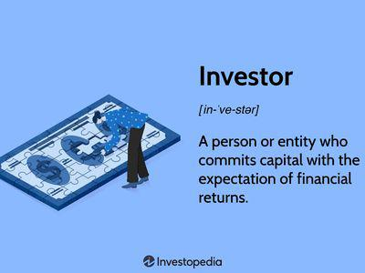

## Table of Contents

## Who was Peter Young?

Peter Young was a famous British artist. He was born in 1915 and died in 1980. He is best known for his paintings of landscapes and seascapes. He loved to paint the beauty of nature.

Young studied at the Royal College of Art in London. After finishing his studies, he traveled a lot. He visited many countries and painted the places he saw. His travels helped him become a better artist. His paintings are now in many museums and galleries around the world.

## What is a rogue trader?

A rogue trader is a person who works in a bank or a financial company and makes risky trades without permission. They do this to try to make a lot of money, but it can also cause big problems for their company. Sometimes, rogue traders hide what they are doing and lie about it.

Rogue traders can cause a lot of damage. For example, if their risky trades fail, the company can lose a lot of money. This can make the company's customers lose trust in it. Some famous cases of rogue traders have even caused banks to fail. That's why companies have strict rules to stop this from happening.

## What were the circumstances that led Peter Young to become infamous?

Peter Young became infamous because he was a rogue trader. He worked for Morgan Grenfell, a big investment company in the UK. In the late 1980s and early 1990s, he made secret trades that were very risky. He did this without telling his bosses. He wanted to make a lot of money for the company and for himself. But his trades were too risky, and he lost a lot of money.

When people found out what Peter Young had done, it caused a big problem for Morgan Grenfell. The company lost about £440 million because of his trades. This made a lot of people lose trust in the company. Peter Young was arrested and went to jail for his actions. His case is one of the most famous examples of a rogue trader and shows how dangerous and damaging their actions can be.

## What specific actions did Peter Young take that led to his infamy?

Peter Young worked at Morgan Grenfell and started making secret trades. He did not tell his bosses about these trades. He thought he could make a lot of money for the company and himself. But the trades he made were very risky. He used the company's money to buy stocks that he thought would go up in value. But the stocks did not go up as he expected, and he lost a lot of money.

When people found out about Peter Young's secret trades, it was a big problem for Morgan Grenfell. The company lost about £440 million because of his actions. This made many people lose trust in the company. Peter Young was arrested and sent to jail for what he did. His case became very famous and showed how dangerous it can be when someone makes risky trades without permission.

## How did Peter Young's actions affect the financial markets?

Peter Young's actions caused a big problem for Morgan Grenfell. He made secret trades that lost the company about £440 million. This made people lose trust in Morgan Grenfell. When people heard about what happened, they started to worry about other companies too. They wondered if other companies might have rogue traders like Peter Young. This made the whole financial market feel less safe.

Because of Peter Young, companies started to make stricter rules. They wanted to stop rogue traders from making secret trades. They checked their traders more closely and made sure they followed the rules. This helped to make the financial markets safer. But it also made people remember that even big companies can have big problems if someone does something wrong.

## What were the immediate consequences for Peter Young after his actions were discovered?

When people found out about Peter Young's secret trades, he was immediately arrested. He had lost Morgan Grenfell a lot of money, about £440 million. Because of this, he was sent to jail. He had to go to court and was found guilty of fraud. He spent time in prison because of what he did.

His actions also caused a big problem for Morgan Grenfell. The company lost a lot of money and people did not trust it anymore. This made it hard for the company to keep doing business. Peter Young's case made people talk about how important it is to watch traders closely and make sure they follow the rules.

## How did the company Peter Young worked for respond to the scandal?

When Morgan Grenfell found out about Peter Young's secret trades, they were very upset. They lost a lot of money, about £440 million, because of what he did. The company had to tell everyone what happened. They told their customers and the people who owned the company. This made a lot of people lose trust in Morgan Grenfell. It was hard for the company to keep doing business after that.

Morgan Grenfell had to make big changes because of the scandal. They made new rules to stop rogue traders from making secret trades. They started to watch their traders more closely. They also made sure that everyone followed the rules. These changes helped to make the company safer. But it took a long time for people to trust Morgan Grenfell again.

## What were the long-term effects on the financial industry due to Peter Young's actions?

Peter Young's actions made the financial industry change a lot. Companies started to make stricter rules to stop rogue traders. They watched their traders more closely and made sure everyone followed the rules. This helped to make the financial markets safer. But it also made people remember that even big companies can have big problems if someone does something wrong.

Because of Peter Young, people started to trust banks and financial companies less. They worried that other companies might have rogue traders too. This made the whole financial market feel less safe. Companies had to work hard to show people that they were safe and trustworthy. It took a long time for people to trust the financial industry again.

## What regulatory changes were implemented as a result of the scandal involving Peter Young?

After the scandal with Peter Young, the financial industry made big changes to their rules. They wanted to stop rogue traders from making secret trades. Companies started to watch their traders more closely. They made sure everyone followed the rules. This helped to make the financial markets safer. They also made new rules to check trades more often and to make sure traders did not hide what they were doing.

These changes helped to make the financial industry more trustworthy. But it took a long time for people to trust banks and financial companies again. They were worried that other companies might have rogue traders too. So, companies had to work hard to show people that they were safe and honest. The scandal with Peter Young made everyone in the financial industry take a closer look at how they do things.

## How did Peter Young's case influence public perception of financial traders?

Peter Young's case made people think differently about financial traders. Before his scandal, many people trusted traders to do their job well. But after finding out about Peter Young's secret trades, people started to worry. They wondered if other traders might also be making risky trades without permission. This made people less trusting of financial traders and the companies they worked for.

Because of Peter Young, people saw that even big companies could have big problems if someone did something wrong. They realized that traders could cause a lot of damage if they were not watched closely. This made the public more careful about trusting financial traders. Companies had to work hard to show that they were safe and honest, but it took a long time for people to trust them again.

## What lessons can be learned from the case of Peter Young?

The case of Peter Young teaches us that it's very important to follow the rules at work. Peter made secret trades without telling his bosses. He thought he could make a lot of money, but he lost a lot instead. This shows that taking big risks without permission can cause big problems. Companies need to watch their traders closely and make sure they are doing things the right way.

Another lesson from Peter Young's case is that trust is very important in the financial world. When people found out what Peter did, they lost trust in his company, Morgan Grenfell. This made it hard for the company to keep doing business. It also made people worried about other companies. They wondered if other traders might be doing the same thing. So, companies need to be honest and open about what they are doing to keep people's trust.

Lastly, Peter Young's case shows that breaking the rules can lead to serious consequences. Peter went to jail because of his actions. This tells us that doing something wrong can hurt not just the company but also the person who does it. It's important to think about the long-term effects of our actions and to always do things the right way.

## How has the case of Peter Young been analyzed in academic and professional literature?

The case of Peter Young has been studied a lot in [books](/wiki/algo-trading-books) and papers about finance and business. People who study these things look at what Peter did and why he did it. They talk about how he made secret trades without telling his bosses. They also look at how his actions hurt his company, Morgan Grenfell, and made people lose trust in it. These studies help people understand how important it is to watch traders closely and make sure they follow the rules.

In professional literature, experts use Peter Young's case to teach others about the dangers of rogue trading. They explain how his risky trades led to big losses and how it affected the whole financial market. They also talk about the changes that companies made after the scandal to stop it from happening again. These lessons help people in the financial world learn how to keep their companies safe and trustworthy.

## References & Further Reading

[1]: Rawnsley, A. (1999). ["The Morgan Grenfell Scandal: The Untold Story."](http://james-newton.com/grenfell-the-untold-story) The Guardian.

[2]: Tett, G. (1998). ["Saving the City: The Great Financial Crisis of 1997-98 and the Transformation of Global Markets."](https://archive.org/details/savingcitygreatf0000robe) Oxford University Press.

[3]: Lewis, M. (2015). ["Flash Boys: A Wall Street Revolt."](https://en.wikipedia.org/wiki/Flash_Boys) W.W. Norton & Company.

[4]: McGee, S. (2011). ["Chasing Goldman Sachs: How the Masters of the Universe Melted Wall Street Down... and Why They'll Take Us to the Brink Again."](https://www.amazon.com/Chasing-Goldman-Sachs-Masters-Universe/dp/0307460118) Crown Business.

[5]: Partnoy, F. (2009). ["Infectious Greed: How Deceit and Risk Corrupted the Financial Markets."](https://www.amazon.com/Infectious-Greed-Corrupted-Financial-Markets/dp/B003R4ZDT4) Times Books.